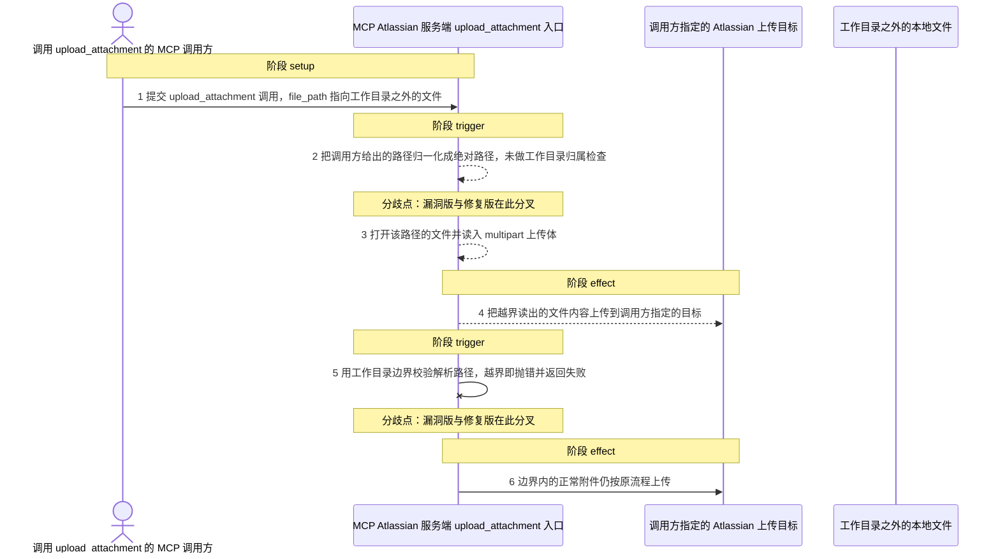
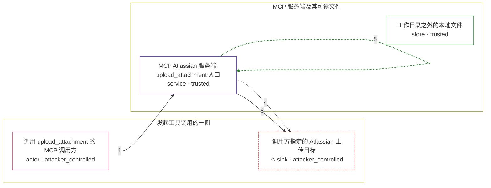

# mcp-atlassian / CVE-2026-77260

状态：草稿，未完成环境和复现。这个目录由模板生成，不构成漏洞确认。

图解的唯一来源是 `diagram.toml`：编辑后运行 `python3 -m runner diagram mcp-atlassian/CVE-2026-77260` 重新生成下方的图解区块。图解必须覆盖漏洞涉及的每个主体，并标出漏洞版/修复版的分歧步骤。

<!-- diagram:begin (generated from diagram.toml by `python3 -m runner diagram`; edit diagram.toml, not this block) -->
## 漏洞图解 — MCP Atlassian upload_attachment 任意本地文件读取

MCP Atlassian 的 upload_attachment 只把调用方给出的 file_path 归一化成绝对路径，没有任何「必须位于允许工作目录之内」的边界检查，随后直接打开该文件并作为 multipart 附件上传到调用方指定的 Atlassian 目标；Confluence 与 Jira 两条入口共用同一缺陷。修复版在同一入口改用工作目录边界校验，越过边界的路径在文件被打开之前即被拒绝。

### 涉及主体

| 主体 | 类型 | 信任级别 | 在漏洞里的作用 | 来源 |
| --- | --- | --- | --- | --- |
| 调用 upload_attachment 的 MCP 调用方 (`caller_agent`) | `actor` | `attacker_controlled` | 控制本次工具调用的 content_id / issue_key 与 file_path 参数；在 prompt-injection 部署下由读取被污染 issue 或 page 内容的调用方代发这个调用。 | fixtures/attack.json |
| MCP Atlassian 服务端 upload_attachment 入口 (`mcp_server`) | `service` | `trusted` | 接收 content_id + file_path，只做非空校验与绝对路径归一化，把路径继续下传给附件读取与上传流程。 | — |
| 工作目录之外的本地文件 (`host_file`) | `store` | `trusted` | 部署主机上位于进程工作目录之外的可读文件（密钥、令牌、凭据文件等）；调用方只能给出它的路径，本身无法读取其内容。 | — |
| ⚠ 调用方指定的 Atlassian 上传目标 (`atlassian_target`) | `sink` | `attacker_controlled` | 接收最终 multipart 上传的 Atlassian 端点，其地址与目标标识由调用方给出，因此越界读出的文件内容会落到调用方可以回读的位置。 | — |

**信任边界**

- **发起工具调用的一侧** (`caller_side`)：成员 `caller_agent`、`atlassian_target`。这一侧只能提供调用参数与自己的接收目标，无法直接读取服务端工作目录之外的文件。
- **MCP 服务端及其可读文件** (`server_side`)：成员 `mcp_server`、`host_file`。工作目录边界本来把 upload_attachment 可读的附件源限制在服务端工作目录之内，任意绝对路径或越界相对路径让它失效。

标 ⚠ 的主体是本仓库合成的替身或无害效果载体，不代表真实外部目标。

### 触发过程

### 主体与信任边界

箭头上的数字是上面的步骤编号；方框只标主体和信任级别，具体动作见「触发过程」。

**分歧点**：第 2 步（`vulnerable_only`）把调用方给出的路径归一化成绝对路径，未做工作目录归属检查。
**分歧点**：第 5 步（`patched_only`）用工作目录边界校验解析路径，越界即抛错并返回失败。
<!-- diagram:end -->

## 公告与机制

TODO：官方公告、漏洞根因、Agent 信任边界、受影响范围和修复来源。

## 前提

TODO：认证要求、用户交互、已有批准、工具权限、攻击者能控制的内容。

## 版本与启动

TODO：补全 metadata、Dockerfile/镜像 digest 和 Compose，再写出精确启动命令。

Compose 中 `vulnerable` 与 `patched` profiles 分开使用；未指定 profile 不启动服务。镜像变量未配置时 Compose 会明确报错。此模板不暴露宿主端口，也不挂载主机数据。

## 机制复现

TODO：实现 `reproduce.py`，固定输入并执行真实漏洞路径，注明运行位置、参数和超时。

完成实现后使用 `python3 -m runner reproduce mcp-atlassian/CVE-2026-77260 --build --rounds 3`。
两脚本统一接受 `--context <context.json> --output <目录>`，详细字段见仓库 `docs/environment-contract.md`。
PoC 输出 `facts.json` 和效果文件；验证器只读证据，输出含 `target_ready` 及对应效果断言的 `verdict.json`。
镜像必须包含 Python 3 和 `/lab/` 下的脚本、fixtures；`runtime.mode` 选择 `oneshot` 或有 healthcheck 的 `service`。

## 端到端复现

TODO：实现 `end_to_end.py`；若不需要模型，明确写出不适用原因。真实模型的结果与机制复现分开统计。

## 验证与修复对照

TODO：实现 `verify.py`。记录漏洞版无害效果、修复版阻断和正常任务成功的证据，不能把服务启动失败当成阻断。

## 清理

默认运行器按每个测试的唯一 Compose project 清理容器、网络和 volume。
`--keep-on-failure` 保留失败项目，项目标识和 Compose 配置在结果目录中；仅清理该项目，不能使用全局 prune。

## 失败诊断

TODO：为本漏洞写出预期效果缺失、修复版仍有越界效果、正常任务失败及前提不满足时的具体排查路径。
启动失败、健康检查失败和超时都不能当作修复阻断。报告中应能定位到阶段、预期、实际和受控证据。

## 构建与输入

TODO：填写两版源码 archive、完整 commit，记录 `build.inputs` 中每个下载的 SHA-256；依赖安装必须支持禁网构建。
固定攻击和正常输入放入 `fixtures/` 并登记到 `fixtures/manifest.toml`。固定 seed、环境变量，说明无害效果与真实影响的关系。

## 隔离例外

默认无例外。确需例外时同时填写 `runtime.exceptions`、理由及最小范围，晋升由两位维护者审阅。

## 来源与许可

TODO：列出引用代码、fixtures 和镜像的来源及许可。
