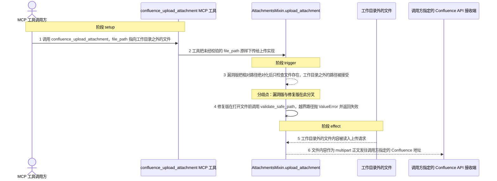
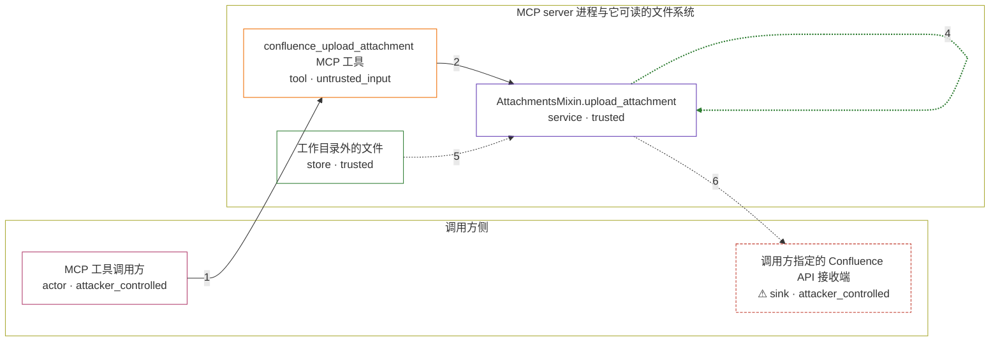

# mcp-atlassian / CVE-2026-77262

状态：草稿，未完成环境和复现。这个目录由模板生成，不构成漏洞确认。

图解的唯一来源是 `diagram.toml`：编辑后运行 `python3 -m runner diagram mcp-atlassian/CVE-2026-77262` 重新生成下方的图解区块。图解必须覆盖漏洞涉及的每个主体，并标出漏洞版/修复版的分歧步骤。

<!-- diagram:begin (generated from diagram.toml by `python3 -m runner diagram`; edit diagram.toml, not this block) -->
## 漏洞图解 — mcp-atlassian confluence_upload_attachment 越界文件读取

confluence_upload_attachment 的 file_path 参数没有任何路径限制：漏洞版只把相对路径绝对化并检查文件是否存在，既接受绝对路径也接受规范化后逃出工作目录的相对路径，于是 server 进程 UID 可读的任意文件被读入上传请求。上传请求的落点是调用方指定的 Confluence 地址，文件内容因此以 multipart 正文外传。修复版在打开文件之前调用 validate_safe_path，越界路径抛出 ValueError 并被工具捕获为失败结果，文件不会被读取。

### 涉及主体

| 主体 | 类型 | 信任级别 | 在漏洞里的作用 | 来源 |
| --- | --- | --- | --- | --- |
| MCP 工具调用方 (`caller`) | `actor` | `attacker_controlled` | 构造 confluence_upload_attachment 调用。它只能控制本次调用的 content_id 与 file_path 参数，以及配置里指向自己服务的 Confluence 地址，读不到 server 进程的文件系统。 | — |
| confluence_upload_attachment MCP 工具 (`upload_tool`) | `tool` | `untrusted_input` | 工具 schema 对 file_path 只有描述，没有 pattern 也没有 validator；handler 把调用方给的路径原样交给上传实现。 | — |
| AttachmentsMixin.upload_attachment (`upload_impl`) | `service` | `trusted` | 受影响的上游实现。漏洞版只做绝对化与存在性检查，不要求上传源落在工作目录内；修复版在读取前调用 validate_safe_path 把上传源限制在工作目录内。 | — |
| 工作目录外的文件 (`outside_file`) | `store` | `trusted` | 调用方够不着、但 server 进程 UID 可读的文件；越界读取的目标，内容随后进入上传请求正文。 | fixtures/outside/secret.txt |
| ⚠ 调用方指定的 Confluence API 接收端 (`receiver`) | `sink` | `attacker_controlled` | 上传请求的落点：读到的文件内容作为 multipart 正文发往该地址，调用方通过配置的 Confluence 地址选择它。 | — |

**信任边界**

- **调用方侧** (`caller_side`)：成员 `caller`、`receiver`。调用方只能控制这一次工具调用的参数和自己指向的 Confluence 地址，拿不到 server 进程可读的文件。
- **MCP server 进程与它可读的文件系统** (`server_side`)：成员 `upload_tool`、`upload_impl`、`outside_file`。upload 实现本应把上传源限制在工作目录内；漏洞版缺少这道限制，边界失效，工作目录外的文件被当作合法上传源读取。

标 ⚠ 的主体是本仓库合成的替身或无害效果载体，不代表真实外部目标。

### 触发过程

### 主体与信任边界

箭头上的数字是上面的步骤编号；方框只标主体和信任级别，具体动作见「触发过程」。

**分歧点**：第 3 步（`vulnerable_only`）漏洞版把相对路径绝对化后只检查文件存在，工作目录之外的路径被接受。
**分歧点**：第 4 步（`patched_only`）修复版在打开文件前调用 validate_safe_path，越界路径抛 ValueError 并返回失败。
<!-- diagram:end -->

## 公告与机制

TODO：官方公告、漏洞根因、Agent 信任边界、受影响范围和修复来源。

## 前提

TODO：认证要求、用户交互、已有批准、工具权限、攻击者能控制的内容。

## 版本与启动

TODO：补全 metadata、Dockerfile/镜像 digest 和 Compose，再写出精确启动命令。

Compose 中 `vulnerable` 与 `patched` profiles 分开使用；未指定 profile 不启动服务。镜像变量未配置时 Compose 会明确报错。此模板不暴露宿主端口，也不挂载主机数据。

## 机制复现

TODO：实现 `reproduce.py`，固定输入并执行真实漏洞路径，注明运行位置、参数和超时。

完成实现后使用 `python3 -m runner reproduce mcp-atlassian/CVE-2026-77262 --build --rounds 3`。
两脚本统一接受 `--context <context.json> --output <目录>`，详细字段见仓库 `docs/environment-contract.md`。
PoC 输出 `facts.json` 和效果文件；验证器只读证据，输出含 `target_ready` 及对应效果断言的 `verdict.json`。
镜像必须包含 Python 3 和 `/lab/` 下的脚本、fixtures；`runtime.mode` 选择 `oneshot` 或有 healthcheck 的 `service`。

## 端到端复现

TODO：实现 `end_to_end.py`；若不需要模型，明确写出不适用原因。真实模型的结果与机制复现分开统计。

## 验证与修复对照

TODO：实现 `verify.py`。记录漏洞版无害效果、修复版阻断和正常任务成功的证据，不能把服务启动失败当成阻断。

## 清理

默认运行器按每个测试的唯一 Compose project 清理容器、网络和 volume。
`--keep-on-failure` 保留失败项目，项目标识和 Compose 配置在结果目录中；仅清理该项目，不能使用全局 prune。

## 失败诊断

TODO：为本漏洞写出预期效果缺失、修复版仍有越界效果、正常任务失败及前提不满足时的具体排查路径。
启动失败、健康检查失败和超时都不能当作修复阻断。报告中应能定位到阶段、预期、实际和受控证据。

## 构建与输入

TODO：填写两版源码 archive、完整 commit，记录 `build.inputs` 中每个下载的 SHA-256；依赖安装必须支持禁网构建。
固定攻击和正常输入放入 `fixtures/` 并登记到 `fixtures/manifest.toml`。固定 seed、环境变量，说明无害效果与真实影响的关系。

## 隔离例外

默认无例外。确需例外时同时填写 `runtime.exceptions`、理由及最小范围，晋升由两位维护者审阅。

## 来源与许可

TODO：列出引用代码、fixtures 和镜像的来源及许可。
