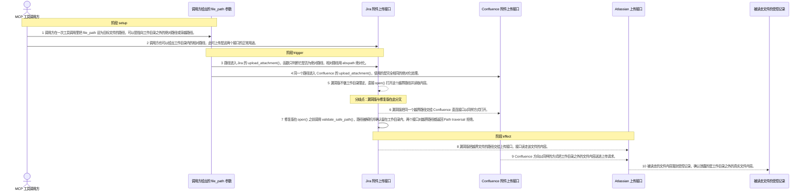

# mcp-atlassian / CVE-2026-77266

状态：草稿，未完成环境和复现。这个目录由模板生成，不构成漏洞确认。

图解的唯一来源是 `diagram.toml`：编辑后运行 `python3 -m runner diagram mcp-atlassian/CVE-2026-77266` 重新生成下方的图解区块。图解必须覆盖漏洞涉及的每个主体，并标出漏洞版/修复版的分歧步骤。

<!-- diagram:begin (generated from diagram.toml by `python3 -m runner diagram`; edit diagram.toml, not this block) -->
## 漏洞图解 — mcp-atlassian / CVE-2026-77266 附件上传路径穿越

Jira 与 Confluence 的附件上传接口只把调用方给出的 file_path 做一次绝对化，既不限定它必须留在服务器工作目录内，也不解析符号链接，随后该路径被直接 open() 读取并交给上传接口。调用方因此可以指向工作目录之外的任意文件，把服务器本地文件的内容当作附件送出。修复版在 open() 之前用 validate_safe_path() 把路径限定在工作目录内，越界路径被拒绝，工作目录内的正常上传不受影响。

### 涉及主体

| 主体 | 类型 | 信任级别 | 在漏洞里的作用 | 来源 |
| --- | --- | --- | --- | --- |
| MCP 工具调用方 (`caller`) | `actor` | `attacker_controlled` | 攻击者。它想读取服务器上自己够不着的本地文件；它能控制的只有一次工具调用的参数，即附件上传的 file_path 与目标 issue key 或 content id。 | — |
| 调用方给出的 file_path 参数 (`file_argument`) | `client` | `untrusted_input` | 未验证的路径输入。既可以是工作目录内的合法文件，也可以是指向工作目录之外的绝对路径或穿越路径。 | fixtures/upload_request.json |
| Jira 附件上传接口 (`jira_uploads`) | `service` | `trusted` | 受影响的上游组件之一。upload_attachment() 对 file_path 只做绝对化，然后把路径交给 Jira 客户端上传，从不限定它必须留在工作目录内。 | fixtures/upstream_sources.toml |
| Confluence 附件上传接口 (`confluence_uploads`) | `service` | `trusted` | 受影响的上游组件之二。同一个 upload_attachment() 把路径转给直连接口，由它打开文件并构造附件上传请求。 | fixtures/upstream_sources.toml |
| ⚠ Atlassian 上传接口 (`upload_sink`) | `sink` | `semi_trusted` | 漏洞效果落点。它接收调用方给出的路径并读走该文件的内容；真实部署里这个接口属于远端 Atlassian 实例，此处由受控接收端扮演，因此内容只落到受控记录，不会离开执行环境。 | — |
| ⚠ 被读走文件的受控记录 (`effect_record`) | `store` | `attacker_controlled` | 漏洞效果的观察点。保存上传接口实际读到的字节，用于确认被读出的是工作目录之外的真实文件内容，而不是任何常量或调用方的自报字段。 | — |

**信任边界**

- **调用方输入侧** (`caller_side`)：成员 `caller`、`file_argument`。攻击者只能决定这次调用的参数取值，既不能决定参数是否被校验，也拿不到服务器上待读取的文件本身。
- **受影响的附件上传组件** (`product_side`)：成员 `jira_uploads`、`confluence_uploads`、`upload_sink`。upload_attachment 本应拒绝工作目录之外的来源；漏洞版本用绝对化代替了限定，这道边界因此失效，越界路径一路抵达上传接口。
- **受控效果记录** (`observed_effect`)：成员 `effect_record`。记录的是被外传的文件内容；它属于受控观测，不是真实外发目的地。

标 ⚠ 的主体是本仓库合成的替身或无害效果载体，不代表真实外部目标。

### 触发过程

### 主体与信任边界

箭头上的数字是上面的步骤编号；方框只标主体和信任级别，具体动作见「触发过程」。

```mermaid
%% mcp-atlassian / CVE-2026-77266 附件上传路径穿越 — generated from diagram.toml
flowchart LR
  subgraph caller_side["调用方输入侧"]
    caller["MCP 工具调用方<br/>actor · attacker_controlled"]
    file_argument["调用方给出的 file_path 参数<br/>client · untrusted_input"]
  end
  subgraph product_side["受影响的附件上传组件"]
    jira_uploads["Jira 附件上传接口<br/>service · trusted"]
    confluence_uploads["Confluence 附件上传接口<br/>service · trusted"]
    upload_sink["Atlassian 上传接口<br/>⚠ sink · semi_trusted"]
  end
  subgraph observed_effect["受控效果记录"]
    effect_record["被读走文件的受控记录<br/>⚠ store · attacker_controlled"]
  end
  caller -->|"1"| file_argument
  caller -->|"2"| jira_uploads
  file_argument -->|"3"| jira_uploads
  file_argument -->|"4"| confluence_uploads
  jira_uploads -.->|"5"| jira_uploads
  jira_uploads -.->|"6"| confluence_uploads
  jira_uploads -.->|"7"| jira_uploads
  jira_uploads -.->|"8"| upload_sink
  confluence_uploads -.->|"9"| upload_sink
  upload_sink -.->|"10"| effect_record
  classDef actor fill:transparent,stroke:#b03a6a
  classDef client fill:transparent,stroke:#1565c0
  classDef service fill:transparent,stroke:#5e35b1
  classDef tool fill:transparent,stroke:#ef6c00
  classDef sink fill:transparent,stroke:#c0392b
  classDef store fill:transparent,stroke:#2e7d32
  classDef synthetic stroke-dasharray: 4 2
  class caller actor
  class file_argument client
  class jira_uploads service
  class confluence_uploads service
  class upload_sink sink
  class upload_sink synthetic
  class effect_record store
  class effect_record synthetic
  style caller_side fill:transparent
  style product_side fill:transparent
  style observed_effect fill:transparent
  linkStyle 4 stroke:#c0392b,stroke-width:2px
  linkStyle 5 stroke:#c0392b,stroke-width:2px
  linkStyle 6 stroke:#2e7d32,stroke-width:2px
```

**分歧点**：第 5 步（`vulnerable_only`）漏洞版不做工作目录限定，直接 open() 打开这个越界路径并读取内容。。
**分歧点**：第 6 步（`vulnerable_only`）漏洞版把同一个越界路径交给 Confluence 直连接口以同样方式打开。。
**分歧点**：第 7 步（`patched_only`）修复版在 open() 之前调用 validate_safe_path()，路径被解析并确认留在工作目录内，两个接口对越界路径都返回 Path traversal 拒绝。。
<!-- diagram:end -->

## 公告与机制

TODO：官方公告、漏洞根因、Agent 信任边界、受影响范围和修复来源。

## 前提

TODO：认证要求、用户交互、已有批准、工具权限、攻击者能控制的内容。

## 版本与启动

TODO：补全 metadata、Dockerfile/镜像 digest 和 Compose，再写出精确启动命令。

Compose 中 `vulnerable` 与 `patched` profiles 分开使用；未指定 profile 不启动服务。镜像变量未配置时 Compose 会明确报错。此模板不暴露宿主端口，也不挂载主机数据。

## 机制复现

TODO：实现 `reproduce.py`，固定输入并执行真实漏洞路径，注明运行位置、参数和超时。

完成实现后使用 `python3 -m runner reproduce mcp-atlassian/CVE-2026-77266 --build --rounds 3`。
两脚本统一接受 `--context <context.json> --output <目录>`，详细字段见仓库 `docs/environment-contract.md`。
PoC 输出 `facts.json` 和效果文件；验证器只读证据，输出含 `target_ready` 及对应效果断言的 `verdict.json`。
镜像必须包含 Python 3 和 `/lab/` 下的脚本、fixtures；`runtime.mode` 选择 `oneshot` 或有 healthcheck 的 `service`。

## 端到端复现

TODO：实现 `end_to_end.py`；若不需要模型，明确写出不适用原因。真实模型的结果与机制复现分开统计。

## 验证与修复对照

TODO：实现 `verify.py`。记录漏洞版无害效果、修复版阻断和正常任务成功的证据，不能把服务启动失败当成阻断。

## 清理

默认运行器按每个测试的唯一 Compose project 清理容器、网络和 volume。
`--keep-on-failure` 保留失败项目，项目标识和 Compose 配置在结果目录中；仅清理该项目，不能使用全局 prune。

## 失败诊断

TODO：为本漏洞写出预期效果缺失、修复版仍有越界效果、正常任务失败及前提不满足时的具体排查路径。
启动失败、健康检查失败和超时都不能当作修复阻断。报告中应能定位到阶段、预期、实际和受控证据。

## 构建与输入

TODO：填写两版源码 archive、完整 commit，记录 `build.inputs` 中每个下载的 SHA-256；依赖安装必须支持禁网构建。
固定攻击和正常输入放入 `fixtures/` 并登记到 `fixtures/manifest.toml`。固定 seed、环境变量，说明无害效果与真实影响的关系。

## 隔离例外

默认无例外。确需例外时同时填写 `runtime.exceptions`、理由及最小范围，晋升由两位维护者审阅。

## 来源与许可

TODO：列出引用代码、fixtures 和镜像的来源及许可。
