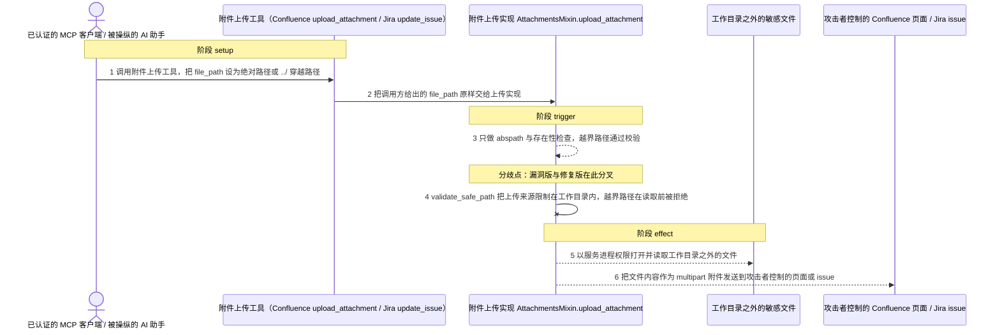
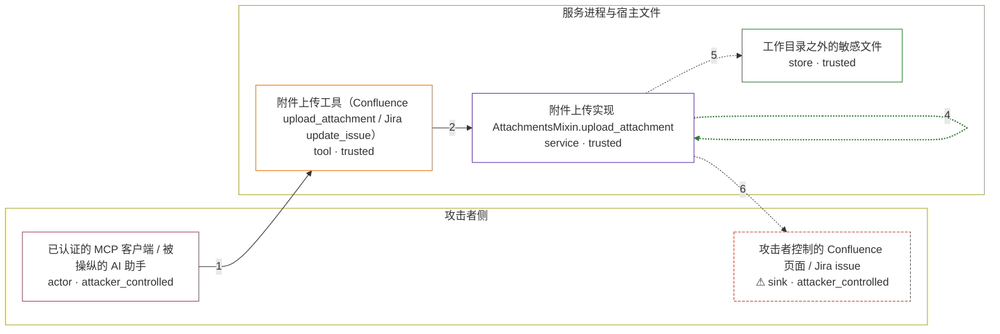

# mcp-atlassian / CVE-2026-77270

状态：草稿，未完成环境和复现。这个目录由模板生成，不构成漏洞确认。

图解的唯一来源是 `diagram.toml`：编辑后运行 `python3 -m runner diagram mcp-atlassian/CVE-2026-77270` 重新生成下方的图解区块。图解必须覆盖漏洞涉及的每个主体，并标出漏洞版/修复版的分歧步骤。

<!-- diagram:begin (generated from diagram.toml by `python3 -m runner diagram`; edit diagram.toml, not this block) -->
## 漏洞图解 — mcp-atlassian / CVE-2026-77270 附件上传未约束来源导致任意文件读取

mcp-atlassian 的 Confluence 与 Jira 附件上传接口接受调用方给出的任意 file_path，上传实现只做 abspath 与存在性检查，没有把上传来源限制在服务工作目录内。已认证的 MCP 客户端或被提示注入操纵的 AI 助手因此可以让服务进程读取工作目录之外的任意可读文件，并把内容作为 multipart 附件发送到自己控制的 Confluence 页面或 Jira issue。修复版在同一处改为 validate_safe_path，越界路径在文件被读取之前就被拒绝。

### 涉及主体

| 主体 | 类型 | 信任级别 | 在漏洞里的作用 | 来源 |
| --- | --- | --- | --- | --- |
| 已认证的 MCP 客户端 / 被操纵的 AI 助手 (`mcp_client`) | `actor` | `attacker_controlled` | 构造附件上传调用，并把 file_path 参数指向工作目录之外的目标文件。它只能控制这次调用的参数，不能直接读取服务所在主机上的文件。 | — |
| 附件上传工具（Confluence upload_attachment / Jira update_issue） (`attachment_tools`) | `tool` | `trusted` | 把调用方给出的 file_path 原样转交给附件上传实现。工具描述本身就允许绝对路径，没有任何工作目录约束；Jira 侧经 update_issue 的 attachments 参数到达同一实现。 | https://github.com/sooperset/mcp-atlassian/blob/b041733473f95119dd539542a43c280737a8e460/src/mcp_atlassian/servers/confluence.py |
| 附件上传实现 AttachmentsMixin.upload_attachment (`upload_impl`) | `service` | `trusted` | 漏洞所在：只做 os.path.abspath 与 os.path.exists，未调用同文件已 import 的 validate_safe_path，因此不限制上传来源的位置。Confluence 与 Jira 两个文件各有一份相同缺陷。 | https://github.com/sooperset/mcp-atlassian/blob/4e2b836a89dca2fc374133acca0d793f6b29f50c/src/mcp_atlassian/confluence/attachments.py |
| 工作目录之外的敏感文件 (`outside_file`) | `store` | `trusted` | 服务进程权限下可读、但攻击者本来拿不到的文件，例如 /etc/passwd、~/.ssh/id_rsa。它是越界读取的目标。 | — |
| ⚠ 攻击者控制的 Confluence 页面 / Jira issue (`atlassian_target`) | `sink` | `attacker_controlled` | 外传信道：被读取的文件内容作为附件发送到这里，攻击者随后即可取回。它是攻击者自己控制的目标，不是边界内侧的受保护数据。 | — |

**信任边界**

- **攻击者侧** (`attacker_side`)：成员 `mcp_client`、`atlassian_target`。攻击者控制发起调用的客户端，也控制接收外传内容的页面或 issue；它够不着的是服务所在主机上的文件。
- **服务进程与宿主文件** (`server_side`)：成员 `attachment_tools`、`upload_impl`、`outside_file`。上传来源本应被限制在服务工作目录内，缺失的校验却让工作目录之外的敏感文件也进入读取与上传流程。

标 ⚠ 的主体是本仓库合成的替身或无害效果载体，不代表真实外部目标。

### 触发过程

### 主体与信任边界

箭头上的数字是上面的步骤编号；方框只标主体和信任级别，具体动作见「触发过程」。

**分歧点**：第 3 步（`vulnerable_only`）只做 abspath 与存在性检查，越界路径通过校验。
**分歧点**：第 4 步（`patched_only`）validate_safe_path 把上传来源限制在工作目录内，越界路径在读取前被拒绝。
<!-- diagram:end -->

## 公告与机制

TODO：官方公告、漏洞根因、Agent 信任边界、受影响范围和修复来源。

## 前提

TODO：认证要求、用户交互、已有批准、工具权限、攻击者能控制的内容。

## 版本与启动

TODO：补全 metadata、Dockerfile/镜像 digest 和 Compose，再写出精确启动命令。

Compose 中 `vulnerable` 与 `patched` profiles 分开使用；未指定 profile 不启动服务。镜像变量未配置时 Compose 会明确报错。此模板不暴露宿主端口，也不挂载主机数据。

## 机制复现

TODO：实现 `reproduce.py`，固定输入并执行真实漏洞路径，注明运行位置、参数和超时。

完成实现后使用 `python3 -m runner reproduce mcp-atlassian/CVE-2026-77270 --build --rounds 3`。
两脚本统一接受 `--context <context.json> --output <目录>`，详细字段见仓库 `docs/environment-contract.md`。
PoC 输出 `facts.json` 和效果文件；验证器只读证据，输出含 `target_ready` 及对应效果断言的 `verdict.json`。
镜像必须包含 Python 3 和 `/lab/` 下的脚本、fixtures；`runtime.mode` 选择 `oneshot` 或有 healthcheck 的 `service`。

## 端到端复现

TODO：实现 `end_to_end.py`；若不需要模型，明确写出不适用原因。真实模型的结果与机制复现分开统计。

## 验证与修复对照

TODO：实现 `verify.py`。记录漏洞版无害效果、修复版阻断和正常任务成功的证据，不能把服务启动失败当成阻断。

## 清理

默认运行器按每个测试的唯一 Compose project 清理容器、网络和 volume。
`--keep-on-failure` 保留失败项目，项目标识和 Compose 配置在结果目录中；仅清理该项目，不能使用全局 prune。

## 失败诊断

TODO：为本漏洞写出预期效果缺失、修复版仍有越界效果、正常任务失败及前提不满足时的具体排查路径。
启动失败、健康检查失败和超时都不能当作修复阻断。报告中应能定位到阶段、预期、实际和受控证据。

## 构建与输入

TODO：填写两版源码 archive、完整 commit，记录 `build.inputs` 中每个下载的 SHA-256；依赖安装必须支持禁网构建。
固定攻击和正常输入放入 `fixtures/` 并登记到 `fixtures/manifest.toml`。固定 seed、环境变量，说明无害效果与真实影响的关系。

## 隔离例外

默认无例外。确需例外时同时填写 `runtime.exceptions`、理由及最小范围，晋升由两位维护者审阅。

## 来源与许可

TODO：列出引用代码、fixtures 和镜像的来源及许可。
