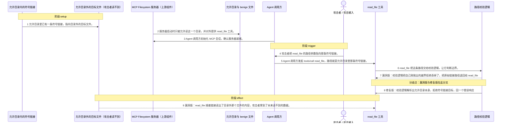
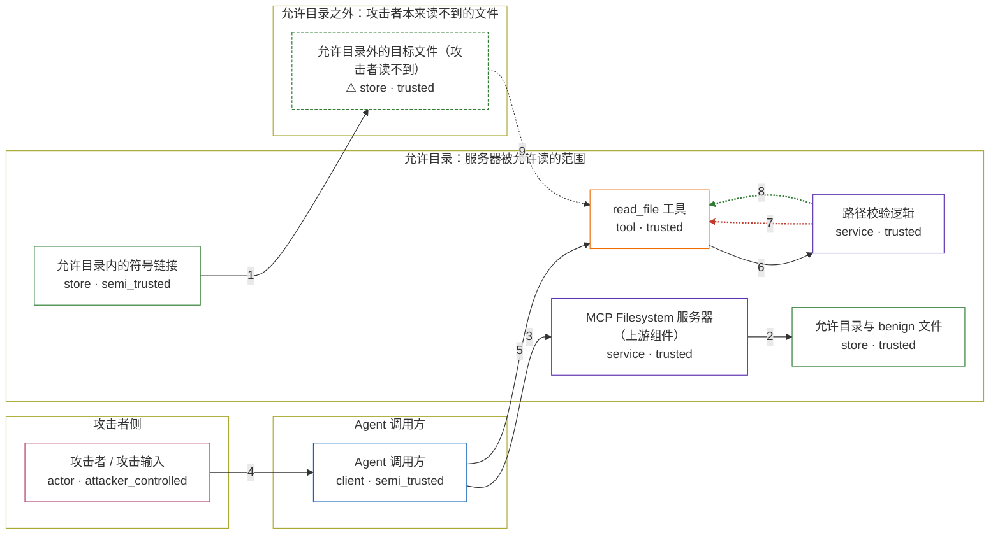

# mcp-filesystem / CVE-2025-53109

状态：机制复现已完成，并通过四场景三轮容器验收；保持 `draft`，等待固定发布镜像和维护者审阅。

<!-- diagram:begin (generated from diagram.toml by `python3 -m runner diagram`; edit diagram.toml, not this block) -->
## 漏洞图解 — MCP Filesystem 符号链接越界读取

2025.3.28 的 Filesystem MCP 服务器用字符串前缀判断路径在不在允许目录里。允许目录内有一条符号链接，名字落在目录里，实际指向的文件却在目录外——那是攻击者自己读不到的文件，所以它要借服务器的手去读。校验代码用 realpath 解析出真正目标后抛出越界错误，但这个错误被紧接着的「新文件父目录」分支接住了，函数最后把原始的链接路径返回，read_file 于是顺着链接把目录外的文件读了出来。2025.7.1 改成先解析出允许目录本身，再用带路径分隔符的方式比较边界，直接以 isError 拒绝该请求，响应里不再出现文件内容。

### 涉及主体

| 主体 | 类型 | 信任级别 | 在漏洞里的作用 | 来源 |
| --- | --- | --- | --- | --- |
| 攻击者 / 攻击输入 (`attacker`) | `actor` | `attacker_controlled` | 攻击者。它能控制的只有这次 read_file 调用的路径参数。允许目录之外的文件它自己读不到，所以要让服务器替它读。 | fixtures/attack.json |
| Agent 调用方 (`agent`) | `client` | `semi_trusted` | Agent 调用方（半可信）。它照攻击输入发起 MCP 的 tools/call read_file，把允许目录里的符号链接路径原样转给上游服务器。这条路径该不该放行，不归它判断。 | — |
| MCP Filesystem 服务器（上游组件） (`mcp_filesystem_server`) | `service` | `trusted` | 出问题的上游组件。它是 stdio MCP 服务器（入口 /lab/app/src/filesystem/dist/index.js），启动时只被允许读一个目录，并对外提供 read_file 工具。它本该守住这个范围，2025.3.28 这一版却在符号链接指向目录外时把链接路径放行了。 | — |
| read_file 工具 (`read_file_tool`) | `tool` | `trusted` | 真正干读取的工具。它拿到校验逻辑放行的路径后调用 fs.readFile，是目录外文件的内容进入 MCP 响应的唯一出口。漏洞版和修复版都要经过它。 | — |
| 路径校验逻辑 (`path_validator`) | `service` | `trusted` | 漏洞就出在这里。2025.3.28 用字符串前缀判断越界，realpath 报出的拒绝又被父目录分支兜底，最后返回了链接路径；2025.7.1 改成先解析允许目录、再用带分隔符的边界比较，把符号链接的目标挡住。 | — |
| 允许目录内的符号链接 (`symlink_attack_material`) | `store` | `semi_trusted` | 允许目录里本来就有的一条符号链接 linked-marker.txt，指向目录外的目标文件。它的路径名在允许目录内，服务器因此把它当成普通可读内容；真正读到的却在目录外。攻击能成立靠的就是这一点，攻击者自己并不需要动手创建它。 | — |
| ⚠ 允许目录外的目标文件（攻击者读不到） (`external_marker`) | `store` | `trusted` | 允许目录之外的文件，攻击者自己无权访问——要么属于别的项目，要么是主机上的敏感文件。这正是它非要绕过边界的原因。本仓库用内容为 MCP_FILESYSTEM_CVE_2025_53109_MARKER 的无害 marker 代替真实敏感文件，只用来确认越界读取成没成功。 | — |
| 允许目录与 benign 文件 (`allowed_directory`) | `store` | `trusted` | 服务器启动时被指定的允许目录，也是它唯一允许读取的范围。里面的 benign.txt 用来对照：修复之后，读这个文件依然正常。 | — |

**信任边界**

- **攻击者侧** (`attacker_side`)：成员 `attacker`。攻击者能控制的只有这次工具调用的参数。它读不到下面那个目标文件——要是读得到，就不必绕这一圈了。
- **Agent 调用方** (`agent_client`)：成员 `agent`。半可信的调用方。它只把攻击者给的 read_file 路径原样转给上游服务器，路径能不能读不归它判断。
- **允许目录：服务器被允许读的范围** (`allowed_root`)：成员 `mcp_filesystem_server`、`read_file_tool`、`path_validator`、`allowed_directory`、`symlink_attack_material`。服务器只被允许读这个目录，所以它默认目录里的东西都能读。符号链接的路径名在目录内，实际指向的文件却在目录外——漏洞就是让这道边界失效了。
- **允许目录之外：攻击者本来读不到的文件** (`outside_allowed_root`)：成员 `external_marker`。攻击者想要但拿不到的数据。漏洞让服务器把它的内容读了出来，越过这道边界送到攻击者手里。

标 ⚠ 的主体是本仓库合成的替身或无害效果载体，不代表真实外部目标。

### 触发过程



### 主体与信任边界

箭头上的数字是上面的步骤编号；方框只标主体和信任级别，具体动作见「触发过程」。



**分歧点**：第 7 步（`vulnerable_only`）漏洞版：校验逻辑把自己刚抛出的越界拒绝吞掉了，把原始链接路径退回给 read_file。
**分歧点**：第 8 步（`patched_only`）修复版：校验逻辑解析出允许目录本身，拒绝符号链接目标，回一个错误响应。
<!-- diagram:end -->

## 漏洞机制

`2025.3.28` 的 Filesystem MCP 服务器在检查路径和符号链接时使用字符串前缀。
当 `realpath` 发现符号链接指向允许目录外时，拒绝异常会被后续的“新文件父目录”分支捕获，函数最终返回原始链接路径，`read_file` 随后跟随链接读取外部文件。`2025.7.1` 解析允许根目录并使用带路径分隔符的边界检查，拒绝该访问。

复现调用真实 `read_file` MCP handler。攻击输入只读取结果卷中预置的外部 marker；不访问宿主目录、不读取真实凭据。

## 运行

```sh
python3 -m runner check
python3 -m runner lint mcp-filesystem/CVE-2025-53109
python3 -m runner reproduce mcp-filesystem/CVE-2025-53109 --build --offline --rounds 3
```

每轮依次执行漏洞版攻击、修复版攻击，以及两版正常读取。Node 源码和依赖已放在 `inputs/`，构建阶段使用 `--network none`；runner 根据 `runtime.harness = "node"` 执行协议脚本。

## 断言与失败说明

攻击场景在漏洞版必须通过允许目录内的链接读到外部 marker，修复版必须返回错误且响应中没有 marker。正常场景在两版都必须读取允许目录内的普通文件。

健康检查、MCP 启动或响应超时表示前提/基础设施失败；漏洞版没有 marker 表示触发链未完成，不能据此认定漏洞不存在；修复版仍返回 marker 表示修复对照失败；正常读取失败表示服务整体不可用；证据哈希错误表示结果不可核查。

## 范围与来源

源码来自 `modelcontextprotocol/servers` 的 `2025.3.28` 和 `2025.7.1` 标签，修复代码位于 Filesystem server 的路径校验逻辑。实验只使用 Linux amd64 容器、内部网络和受控结果 volume，不使用真实模型。固定 Agent 工具参数用于稳定验证机制，不能表述为真实模型诱导或宿主机文件读取。

## 端到端状态

`end_to_end.py` 明确返回 `not_applicable`：该环境评估的是固定工具参数进入真实路径后的边界检查，真实模型测试另行统计。
