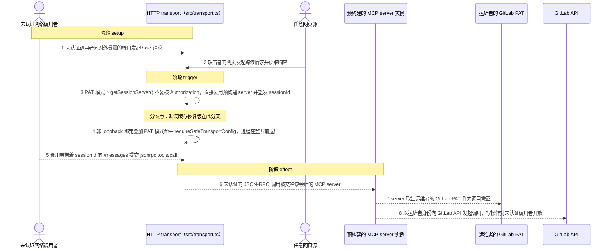
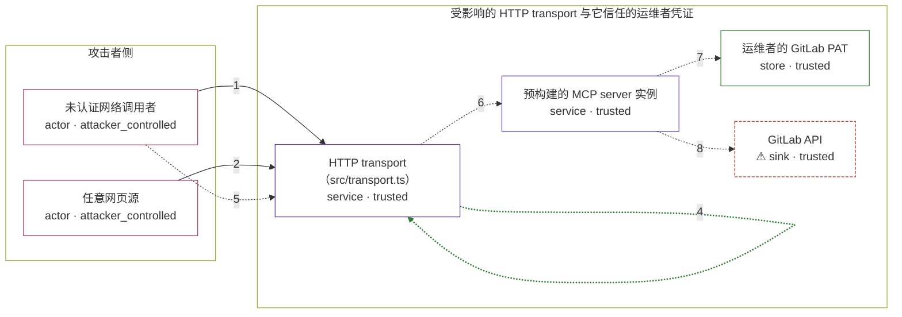

# mcp-gitlab-server / CVE-2026-44895

状态：草稿，未完成环境和复现。这个目录由模板生成，不构成漏洞确认。

图解的唯一来源是 `diagram.toml`：编辑后运行 `python3 -m runner diagram mcp-gitlab-server/CVE-2026-44895` 重新生成下方的图解区块。图解必须覆盖漏洞涉及的每个主体，并标出漏洞版/修复版的分歧步骤。

<!-- diagram:begin (generated from diagram.toml by `python3 -m runner diagram`; edit diagram.toml, not this block) -->
## 漏洞图解 — mcp-gitlab-server / CVE-2026-44895 HTTP transport 未认证暴露

PAT 模式下 src/transport.ts 的 getSessionServer() 不复核 Authorization 就返回唯一预构建的 MCP server， 并为任意请求签发 sessionId；同时 httpServer.listen(port) 未指定 host 而绑定 0.0.0.0，CORS 又依据 AUTH_MODE 无条件回 Access-Control-Allow-Origin: *。于是任何能访问该端口的网络调用者、乃至任意网页， 都能无凭证走通 /sse 与 /messages，由运维者的 GitLab PAT 代发工具调用；修复版在非 loopback 绑定叠加 PAT 模式时直接拒绝启动。

### 涉及主体

| 主体 | 类型 | 信任级别 | 在漏洞里的作用 | 来源 |
| --- | --- | --- | --- | --- |
| 未认证网络调用者 (`remote_caller`) | `actor` | `attacker_controlled` | 只能构造任意 HTTP 请求：向 HTTP transport 的 /sse 与 /messages 端点发起调用，不持有任何入站凭证。 | fixtures/attack.json |
| 任意网页源 (`browser_origin`) | `actor` | `attacker_controlled` | 攻击者控制的网页在浏览器里发起跨域请求；通配 CORS 让它能读到 /sse 的响应并取得 sessionId。 | fixtures/attack.json |
| HTTP transport（src/transport.ts） (`http_transport`) | `service` | `trusted` | 承载 /sse 与 /messages 的受影响组件：PAT 模式不校验入站 Authorization，CORS 条件只看 AUTH_MODE，且 listen(port) 未指定 host。 | — |
| 预构建的 MCP server 实例 (`session_server`) | `service` | `trusted` | 由 GITLAB_PERSONAL_ACCESS_TOKEN 构建、在 PAT 模式下被所有会话复用的 MCP server；它把未认证请求当作合法工具调用处理。 | — |
| 运维者的 GitLab PAT (`operator_pat`) | `store` | `trusted` | 进程启动时从环境读入的运维者凭证，只留在服务端；攻击者本来拿不到它，却能让 server 用它代为调用。 | — |
| ⚠ GitLab API (`gitlab_api`) | `sink` | `trusted` | 工具调用最终以运维者 PAT 向 GitLab API 发出，删除仓库、推送文件等写操作因此对未认证调用者开放；图中该落点由一个本地接收端承接，请求本身携带的是合成标记凭证。 | — |

**信任边界**

- **攻击者侧** (`attacker_side`)：成员 `remote_caller`、`browser_origin`。攻击者只能控制自己发出的请求内容与请求来源页；它够不着运维者的 PAT，也读不到服务端内存。
- **受影响的 HTTP transport 与它信任的运维者凭证** (`server_side`)：成员 `http_transport`、`session_server`、`operator_pat`、`gitlab_api`。这道边界本来应当拦住没有入站凭证的调用者。漏洞版把网络可达误当成可信，边界失效；修复版要求 HTTP transport 只能绑定 loopback，否则必须切换到 OAuth 模式。

标 ⚠ 的主体是本仓库合成的替身或无害效果载体，不代表真实外部目标。

### 触发过程

### 主体与信任边界

箭头上的数字是上面的步骤编号；方框只标主体和信任级别，具体动作见「触发过程」。

**分歧点**：第 3 步（`vulnerable_only`）PAT 模式下 getSessionServer() 不复核 Authorization，直接复用预构建 server 并签发 sessionId。
**分歧点**：第 4 步（`patched_only`）非 loopback 绑定叠加 PAT 模式命中 requireSafeTransportConfig，进程在监听前退出。
<!-- diagram:end -->

## 公告与机制

TODO：官方公告、漏洞根因、Agent 信任边界、受影响范围和修复来源。

## 前提

TODO：认证要求、用户交互、已有批准、工具权限、攻击者能控制的内容。

## 版本与启动

TODO：补全 metadata、Dockerfile/镜像 digest 和 Compose，再写出精确启动命令。

Compose 中 `vulnerable` 与 `patched` profiles 分开使用；未指定 profile 不启动服务。镜像变量未配置时 Compose 会明确报错。此模板不暴露宿主端口，也不挂载主机数据。

## 机制复现

TODO：实现 `reproduce.py`，固定输入并执行真实漏洞路径，注明运行位置、参数和超时。

完成实现后使用 `python3 -m runner reproduce mcp-gitlab-server/CVE-2026-44895 --build --rounds 3`。
两脚本统一接受 `--context <context.json> --output <目录>`，详细字段见仓库 `docs/environment-contract.md`。
PoC 输出 `facts.json` 和效果文件；验证器只读证据，输出含 `target_ready` 及对应效果断言的 `verdict.json`。
镜像必须包含 Python 3 和 `/lab/` 下的脚本、fixtures；`runtime.mode` 选择 `oneshot` 或有 healthcheck 的 `service`。

## 端到端复现

TODO：实现 `end_to_end.py`；若不需要模型，明确写出不适用原因。真实模型的结果与机制复现分开统计。

## 验证与修复对照

TODO：实现 `verify.py`。记录漏洞版无害效果、修复版阻断和正常任务成功的证据，不能把服务启动失败当成阻断。

## 清理

默认运行器按每个测试的唯一 Compose project 清理容器、网络和 volume。
`--keep-on-failure` 保留失败项目，项目标识和 Compose 配置在结果目录中；仅清理该项目，不能使用全局 prune。

## 失败诊断

TODO：为本漏洞写出预期效果缺失、修复版仍有越界效果、正常任务失败及前提不满足时的具体排查路径。
启动失败、健康检查失败和超时都不能当作修复阻断。报告中应能定位到阶段、预期、实际和受控证据。

## 构建与输入

TODO：填写两版源码 archive、完整 commit，记录 `build.inputs` 中每个下载的 SHA-256；依赖安装必须支持禁网构建。
固定攻击和正常输入放入 `fixtures/` 并登记到 `fixtures/manifest.toml`。固定 seed、环境变量，说明无害效果与真实影响的关系。

## 隔离例外

默认无例外。确需例外时同时填写 `runtime.exceptions`、理由及最小范围，晋升由两位维护者审阅。

## 来源与许可

TODO：列出引用代码、fixtures 和镜像的来源及许可。
