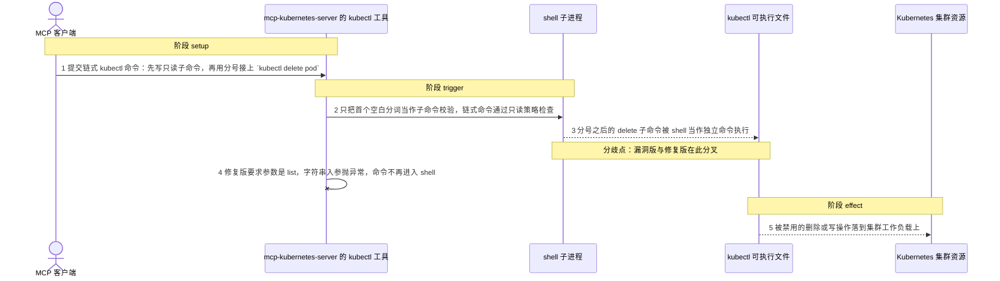
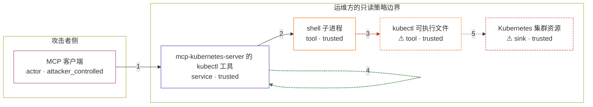

# mcp-kubernetes-server / CVE-2025-59376

状态：草稿，未完成环境和复现。这个目录由模板生成，不构成漏洞确认。

图解的唯一来源是 `diagram.toml`：编辑后运行 `python3 -m runner diagram mcp-kubernetes-server/CVE-2025-59376` 重新生成下方的图解区块。图解必须覆盖漏洞涉及的每个主体，并标出漏洞版/修复版的分歧步骤。

<!-- diagram:begin (generated from diagram.toml by `python3 -m runner diagram`; edit diagram.toml, not this block) -->
## 漏洞图解 — mcp-kubernetes-server kubectl 工具链式命令绕过只读策略

mcp-kubernetes-server 的 kubectl 工具在启用 --disable-write/--disable-delete 后，只把命令的第一个空白分词当作子命令校验，`version; kubectl delete pod x` 这类链式命令因此绕过只读策略。ShellProcess 又把整串命令交给 shell 执行，`;` 之后的写/删子命令被真实运行。信任边界是运维方为 kubectl 工具设定的只读策略：它本应挡住一切状态变更，却只拦住了以写子命令开头的请求。

### 涉及主体

| 主体 | 类型 | 信任级别 | 在漏洞里的作用 | 来源 |
| --- | --- | --- | --- | --- |
| MCP 客户端 (`mcp_client`) | `actor` | `attacker_controlled` | 向 kubectl 工具提交命令字符串，可以用 `;` 在同一字符串里串联第二条 kubectl 命令。 | fixtures/attack.txt |
| mcp-kubernetes-server 的 kubectl 工具 (`kubectl_tool`) | `service` | `trusted` | 在 --disable-write/--disable-delete 下把首个空白分词当作子命令校验，链式命令因此没有被检查就放行。 | src/mcp_kubernetes_server/main.py |
| shell 子进程 (`shell`) | `tool` | `trusted` | ShellProcess 用 shell=True 执行拼接后的命令字符串，`;` 被解释成命令分隔符。 | src/mcp_kubernetes_server/command.py |
| ⚠ kubectl 可执行文件 (`kubectl_cli`) | `tool` | `trusted` | 执行 shell 传出的每个子命令；被策略禁用的 delete 子命令在这里真实运行。机制复现中以固定退出码的替身记录每条实际执行的子命令。 | — |
| ⚠ Kubernetes 集群资源 (`cluster`) | `sink` | `trusted` | 写/删操作的最终落点；漏洞版会把 delete、scale 等变更作用到工作负载上。机制复现中以收到这些调用的替身代表它。 | — |

**信任边界**

- **攻击者侧** (`attacker_side`)：成员 `mcp_client`。攻击者能控制的只有这次工具调用的命令字符串，不能直接操作服务器进程、宿主或集群。
- **运维方的只读策略边界** (`readonly_policy`)：成员 `kubectl_tool`、`shell`、`kubectl_cli`、`cluster`。启用 --disable-write/--disable-delete 后，这道边界本应挡住所有写与删除命令；只校验首个分词的检查放行了链式命令。

标 ⚠ 的主体是本仓库合成的替身或无害效果载体，不代表真实外部目标。

### 触发过程

### 主体与信任边界

箭头上的数字是上面的步骤编号；方框只标主体和信任级别，具体动作见「触发过程」。

**分歧点**：第 3 步（`vulnerable_only`）分号之后的 delete 子命令被 shell 当作独立命令执行。
**分歧点**：第 4 步（`patched_only`）修复版要求参数是 list，字符串入参抛异常，命令不再进入 shell。
<!-- diagram:end -->

## 公告与机制

TODO：官方公告、漏洞根因、Agent 信任边界、受影响范围和修复来源。

## 前提

TODO：认证要求、用户交互、已有批准、工具权限、攻击者能控制的内容。

## 版本与启动

TODO：补全 metadata、Dockerfile/镜像 digest 和 Compose，再写出精确启动命令。

Compose 中 `vulnerable` 与 `patched` profiles 分开使用；未指定 profile 不启动服务。镜像变量未配置时 Compose 会明确报错。此模板不暴露宿主端口，也不挂载主机数据。

## 机制复现

TODO：实现 `reproduce.py`，固定输入并执行真实漏洞路径，注明运行位置、参数和超时。

完成实现后使用 `python3 -m runner reproduce mcp-kubernetes-server/CVE-2025-59376 --build --rounds 3`。
两脚本统一接受 `--context <context.json> --output <目录>`，详细字段见仓库 `docs/environment-contract.md`。
PoC 输出 `facts.json` 和效果文件；验证器只读证据，输出含 `target_ready` 及对应效果断言的 `verdict.json`。
镜像必须包含 Python 3 和 `/lab/` 下的脚本、fixtures；`runtime.mode` 选择 `oneshot` 或有 healthcheck 的 `service`。

## 端到端复现

TODO：实现 `end_to_end.py`；若不需要模型，明确写出不适用原因。真实模型的结果与机制复现分开统计。

## 验证与修复对照

TODO：实现 `verify.py`。记录漏洞版无害效果、修复版阻断和正常任务成功的证据，不能把服务启动失败当成阻断。

## 清理

默认运行器按每个测试的唯一 Compose project 清理容器、网络和 volume。
`--keep-on-failure` 保留失败项目，项目标识和 Compose 配置在结果目录中；仅清理该项目，不能使用全局 prune。

## 失败诊断

TODO：为本漏洞写出预期效果缺失、修复版仍有越界效果、正常任务失败及前提不满足时的具体排查路径。
启动失败、健康检查失败和超时都不能当作修复阻断。报告中应能定位到阶段、预期、实际和受控证据。

## 构建与输入

TODO：填写两版源码 archive、完整 commit，记录 `build.inputs` 中每个下载的 SHA-256；依赖安装必须支持禁网构建。
固定攻击和正常输入放入 `fixtures/` 并登记到 `fixtures/manifest.toml`。固定 seed、环境变量，说明无害效果与真实影响的关系。

## 隔离例外

默认无例外。确需例外时同时填写 `runtime.exceptions`、理由及最小范围，晋升由两位维护者审阅。

## 来源与许可

TODO：列出引用代码、fixtures 和镜像的来源及许可。
