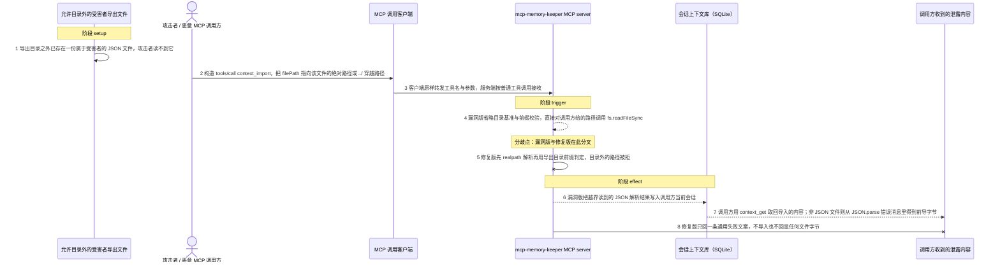
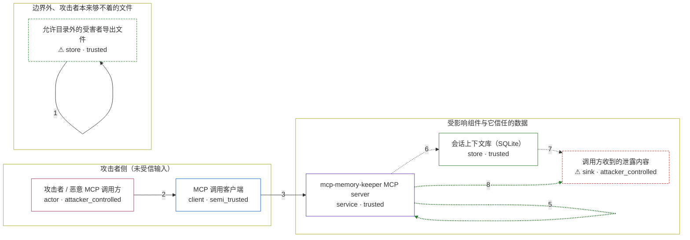

# mcp-memory-keeper / CVE-2026-54561

状态：草稿，未完成环境和复现。这个目录由模板生成，不构成漏洞确认。

图解的唯一来源是 `diagram.toml`：编辑后运行 `python3 -m runner diagram mcp-memory-keeper/CVE-2026-54561` 重新生成下方的图解区块。图解必须覆盖漏洞涉及的每个主体，并标出漏洞版/修复版的分歧步骤。

<!-- diagram:begin (generated from diagram.toml by `python3 -m runner diagram`; edit diagram.toml, not this block) -->
## 漏洞图解 — mcp-memory-keeper / CVE-2026-54561 context_import 任意本地文件读取

mcp-memory-keeper 的 context_import 工具把调用方传入的 filePath 直接交给 fs.readFileSync，既没有基准目录也没有目录前缀校验。因此 MCP 调用方（或受提示注入的 agent）可以用绝对路径或 ../ 穿越读取服务进程能读到的任意文件：合法 JSON 会被解析并导入当前会话，任意非 JSON 文件的前导字节会随 JSON.parse 的错误消息回显给调用方。修复版把导入路径收敛到服务自有的导出目录，并用一条通用文案同时覆盖目录外文件与不存在文件。

### 涉及主体

| 主体 | 类型 | 信任级别 | 在漏洞里的作用 | 来源 |
| --- | --- | --- | --- | --- |
| 攻击者 / 恶意 MCP 调用方 (`attacker`) | `actor` | `attacker_controlled` | 构造 context_import 的 filePath 参数，指向自己本来读不到的文件。它只控制这一次工具调用的参数，不控制目标主机上的文件。 | fixtures/attack_import_request.json |
| MCP 调用客户端 (`mcp_client`) | `client` | `semi_trusted` | 把工具名与参数原样转发给 mcp-memory-keeper 的调用方；它不做路径校验，因此把不可信参数带进了服务的受信流程。 | fixtures/attack_import_request.json |
| mcp-memory-keeper MCP server (`server`) | `service` | `trusted` | context_import 的 tool handler。漏洞版把 filePath 直接交给 fs.readFileSync，没有任何基准目录或 realpath/前缀校验。 | src/index.ts |
| 会话上下文库（SQLite） (`session_store`) | `store` | `trusted` | 导入的数据会被写进调用方当前会话；漏洞版因此把越界读到的 JSON 原样落进会话，随后可被调用方取回。 | src/index.ts |
| ⚠ 允许目录外的受害者导出文件 (`victim_file`) | `store` | `trusted` | 攻击者想要但直接读不到的 JSON 文件，位于服务自有导出目录之外（同一数据目录、其他用户目录或任意绝对路径）。它的存在是环境前提，不是攻击者的动作。 | fixtures/victim_secret_export.json |
| ⚠ 调用方收到的泄露内容 (`leak_receiver`) | `sink` | `attacker_controlled` | 漏洞效果的落点：调用方从 context_get / context_export 拿回被导入的越界内容，或从 JSON.parse 的错误消息里读到非 JSON 文件的前导字节。 | — |

**信任边界**

- **攻击者侧（未受信输入）** (`attacker_side`)：成员 `attacker`、`mcp_client`。攻击者只控制这一次工具调用的 name 与 arguments；客户端是它进入受信流程的通道，本身不校验参数。
- **受影响组件与它信任的数据** (`product`)：成员 `server`、`session_store`、`leak_receiver`。这道边界本应把导入限制在服务自有的会话导出范围内，但 handler 把调用方给的路径当成了可信路径，边界完全失效。
- **边界外、攻击者本来够不着的文件** (`outside_targets`)：成员 `victim_file`。位于服务导出目录之外的目标文件；漏洞版能读到它，修复版把它与不存在的路径一并拒绝。

标 ⚠ 的主体是本仓库合成的替身或无害效果载体，不代表真实外部目标。

### 触发过程

### 主体与信任边界

箭头上的数字是上面的步骤编号；方框只标主体和信任级别，具体动作见「触发过程」。

**分歧点**：第 4 步（`vulnerable_only`）漏洞版省略目录基准与前缀校验，直接对调用方给的路径调用 fs.readFileSync。
**分歧点**：第 5 步（`patched_only`）修复版先 realpath 解析再用导出目录前缀判定，目录外的路径被拒。
<!-- diagram:end -->

## 公告与机制

TODO：官方公告、漏洞根因、Agent 信任边界、受影响范围和修复来源。

## 前提

TODO：认证要求、用户交互、已有批准、工具权限、攻击者能控制的内容。

## 版本与启动

TODO：补全 metadata、Dockerfile/镜像 digest 和 Compose，再写出精确启动命令。

Compose 中 `vulnerable` 与 `patched` profiles 分开使用；未指定 profile 不启动服务。镜像变量未配置时 Compose 会明确报错。此模板不暴露宿主端口，也不挂载主机数据。

## 机制复现

TODO：实现 `reproduce.py`，固定输入并执行真实漏洞路径，注明运行位置、参数和超时。

完成实现后使用 `python3 -m runner reproduce mcp-memory-keeper/CVE-2026-54561 --build --rounds 3`。
两脚本统一接受 `--context <context.json> --output <目录>`，详细字段见仓库 `docs/environment-contract.md`。
PoC 输出 `facts.json` 和效果文件；验证器只读证据，输出含 `target_ready` 及对应效果断言的 `verdict.json`。
镜像必须包含 Python 3 和 `/lab/` 下的脚本、fixtures；`runtime.mode` 选择 `oneshot` 或有 healthcheck 的 `service`。

## 端到端复现

TODO：实现 `end_to_end.py`；若不需要模型，明确写出不适用原因。真实模型的结果与机制复现分开统计。

## 验证与修复对照

TODO：实现 `verify.py`。记录漏洞版无害效果、修复版阻断和正常任务成功的证据，不能把服务启动失败当成阻断。

## 清理

默认运行器按每个测试的唯一 Compose project 清理容器、网络和 volume。
`--keep-on-failure` 保留失败项目，项目标识和 Compose 配置在结果目录中；仅清理该项目，不能使用全局 prune。

## 失败诊断

TODO：为本漏洞写出预期效果缺失、修复版仍有越界效果、正常任务失败及前提不满足时的具体排查路径。
启动失败、健康检查失败和超时都不能当作修复阻断。报告中应能定位到阶段、预期、实际和受控证据。

## 构建与输入

TODO：填写两版源码 archive、完整 commit，记录 `build.inputs` 中每个下载的 SHA-256；依赖安装必须支持禁网构建。
固定攻击和正常输入放入 `fixtures/` 并登记到 `fixtures/manifest.toml`。固定 seed、环境变量，说明无害效果与真实影响的关系。

## 隔离例外

默认无例外。确需例外时同时填写 `runtime.exceptions`、理由及最小范围，晋升由两位维护者审阅。

## 来源与许可

TODO：列出引用代码、fixtures 和镜像的来源及许可。
