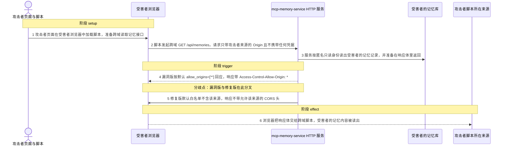
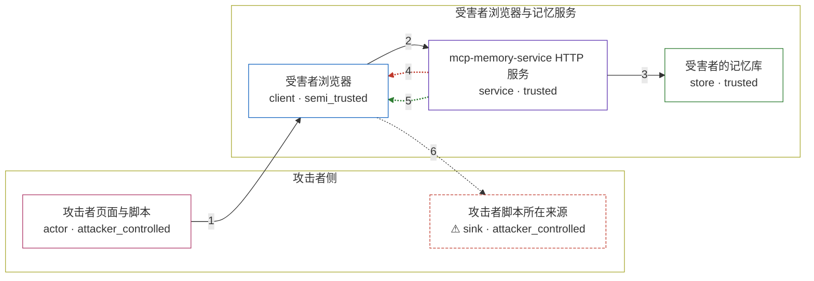

# mcp-memory-service / CVE-2026-33010

状态：草稿，未完成环境和复现。这个目录由模板生成，不构成漏洞确认。

图解的唯一来源是 `diagram.toml`：编辑后运行 `python3 -m runner diagram mcp-memory-service/CVE-2026-33010` 重新生成下方的图解区块。图解必须覆盖漏洞涉及的每个主体，并标出漏洞版/修复版的分歧步骤。

<!-- diagram:begin (generated from diagram.toml by `python3 -m runner diagram`; edit diagram.toml, not this block) -->
## 漏洞图解 — mcp-memory-service / CVE-2026-33010 漏洞图解

mcp-memory-service 在 config.py 里把 CORS_ORIGINS 的默认值设为 '*'，web/app.py 又无条件以 allow_credentials=True 注册 CORSMiddleware，于是默认配置下任意来源的跨域请求都会拿到 Access-Control-Allow-Origin: *。浏览器同源策略本来不允许跨域脚本读取 /api/memories 的响应体，这道边界被通配符来源放开。匿名访问又对未携带凭据的请求授予只读 scope，因此攻击者页面能直接读出受害者的全部记忆；修复版改成 localhost 白名单，并在来源仍含通配符时关闭凭据。

### 涉及主体

| 主体 | 类型 | 信任级别 | 在漏洞里的作用 | 来源 |
| --- | --- | --- | --- | --- |
| 攻击者页面与脚本 (`attacker_page`) | `actor` | `attacker_controlled` | 构造带攻击者来源 Origin 的跨域读取请求，并在响应被浏览器放行后读出记忆内容。 | fixtures/attack-request.json |
| 受害者浏览器 (`victim_browser`) | `client` | `semi_trusted` | 执行攻击者页面带来的脚本并执行同源策略；只有响应带有允许该来源的 CORS 头时，才把响应体交给跨域脚本。 | — |
| mcp-memory-service HTTP 服务 (`http_service`) | `service` | `trusted` | create_app() 按 config.CORS_ORIGINS 注册 CORSMiddleware；默认来源为通配符且 allow_credentials=True，导致对任意来源回应跨域许可。 | src/mcp_memory_service/web/app.py |
| 受害者的记忆库 (`memory_store`) | `store` | `trusted` | 保存受害者全部记忆的 SQLite-vec 数据库；匿名身份以只读 scope 读取其中的记录。 | fixtures/seed-memory.json |
| ⚠ 攻击者脚本所在来源 (`attacker_collector`) | `sink` | `attacker_controlled` | 攻击者脚本读到响应体后记忆内容的落点；它不是真实的外部接收端。 | — |

**信任边界**

- **攻击者侧** (`attacker_side`)：成员 `attacker_page`、`attacker_collector`。攻击者只控制自己的页面、脚本和来源，无法直接访问受害者的记忆库，只能借受害者的浏览器发起请求。
- **受害者浏览器与记忆服务** (`victim_side`)：成员 `victim_browser`、`http_service`、`memory_store`。同源策略与 CORS 白名单本来只允许受信来源读取 /api/memories；通配符默认值让这道边界对任意来源失效。

标 ⚠ 的主体是本仓库合成的替身或无害效果载体，不代表真实外部目标。

### 触发过程

### 主体与信任边界

箭头上的数字是上面的步骤编号；方框只标主体和信任级别，具体动作见「触发过程」。

**分歧点**：第 4 步（`vulnerable_only`）漏洞版按默认 allow_origins=['*'] 回应，响应带 Access-Control-Allow-Origin: *。
**分歧点**：第 5 步（`patched_only`）修复版默认白名单不含该来源，响应不带允许该来源的 CORS 头。
<!-- diagram:end -->

## 公告与机制

TODO：官方公告、漏洞根因、Agent 信任边界、受影响范围和修复来源。

## 前提

TODO：认证要求、用户交互、已有批准、工具权限、攻击者能控制的内容。

## 版本与启动

TODO：补全 metadata、Dockerfile/镜像 digest 和 Compose，再写出精确启动命令。

Compose 中 `vulnerable` 与 `patched` profiles 分开使用；未指定 profile 不启动服务。镜像变量未配置时 Compose 会明确报错。此模板不暴露宿主端口，也不挂载主机数据。

## 机制复现

TODO：实现 `reproduce.py`，固定输入并执行真实漏洞路径，注明运行位置、参数和超时。

完成实现后使用 `python3 -m runner reproduce mcp-memory-service/CVE-2026-33010 --build --rounds 3`。
两脚本统一接受 `--context <context.json> --output <目录>`，详细字段见仓库 `docs/environment-contract.md`。
PoC 输出 `facts.json` 和效果文件；验证器只读证据，输出含 `target_ready` 及对应效果断言的 `verdict.json`。
镜像必须包含 Python 3 和 `/lab/` 下的脚本、fixtures；`runtime.mode` 选择 `oneshot` 或有 healthcheck 的 `service`。

## 端到端复现

TODO：实现 `end_to_end.py`；若不需要模型，明确写出不适用原因。真实模型的结果与机制复现分开统计。

## 验证与修复对照

TODO：实现 `verify.py`。记录漏洞版无害效果、修复版阻断和正常任务成功的证据，不能把服务启动失败当成阻断。

## 清理

默认运行器按每个测试的唯一 Compose project 清理容器、网络和 volume。
`--keep-on-failure` 保留失败项目，项目标识和 Compose 配置在结果目录中；仅清理该项目，不能使用全局 prune。

## 失败诊断

TODO：为本漏洞写出预期效果缺失、修复版仍有越界效果、正常任务失败及前提不满足时的具体排查路径。
启动失败、健康检查失败和超时都不能当作修复阻断。报告中应能定位到阶段、预期、实际和受控证据。

## 构建与输入

TODO：填写两版源码 archive、完整 commit，记录 `build.inputs` 中每个下载的 SHA-256；依赖安装必须支持禁网构建。
固定攻击和正常输入放入 `fixtures/` 并登记到 `fixtures/manifest.toml`。固定 seed、环境变量，说明无害效果与真实影响的关系。

## 隔离例外

默认无例外。确需例外时同时填写 `runtime.exceptions`、理由及最小范围，晋升由两位维护者审阅。

## 来源与许可

TODO：列出引用代码、fixtures 和镜像的来源及许可。
