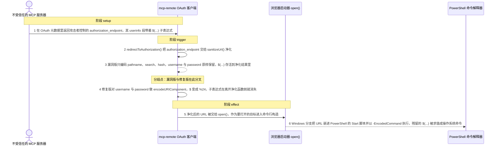
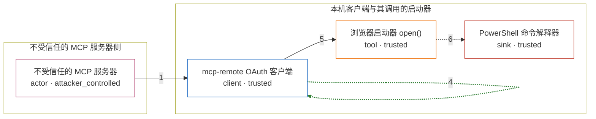

# mcp-remote / CVE-2025-6514

状态：草稿，未完成环境和复现。这个目录由模板生成，不构成漏洞确认。

图解的唯一来源是 `diagram.toml`：编辑后运行 `python3 -m runner diagram mcp-remote/CVE-2025-6514` 重新生成下方的图解区块。图解必须覆盖漏洞涉及的每个主体，并标出漏洞版/修复版的分歧步骤。

<!-- diagram:begin (generated from diagram.toml by `python3 -m runner diagram`; edit diagram.toml, not this block) -->
## 漏洞图解 — mcp-remote 授权 URL 命令注入（CVE-2025-6514）

不受信任的 MCP 服务器可以在 OAuth 元数据里返回任意 authorization_endpoint。mcp-remote 在打开浏览器前用 sanitizeUrl() 净化该 URL，但它只编码 pathname、search 和 hash，漏掉了 basic-auth 的 username 与 password，$(...) 于是原样保留。净化后的 URL 被交给浏览器启动器 open()，在 Windows 上被嵌进 PowerShell 的 Start 脚本并以 -EncodedCommand 执行，未被编码的 $(...) 就变成被求值的操作系统命令。

### 涉及主体

| 主体 | 类型 | 信任级别 | 在漏洞里的作用 | 来源 |
| --- | --- | --- | --- | --- |
| 不受信任的 MCP 服务器 (`untrusted_mcp_server`) | `actor` | `attacker_controlled` | 返回 OAuth 授权服务器元数据；authorization_endpoint 完全由攻击者决定，可以把任意的 shell 子表达式塞进该 URL 的 userinfo 段。 | fixtures/authorization-endpoint-attack.json |
| mcp-remote OAuth 客户端 (`mcp_remote_client`) | `client` | `trusted` | 连接远程 MCP 服务器。NodeOAuthClientProvider.redirectToAuthorization() 先用 sanitizeUrl() 净化 authorization_endpoint，再把它交给浏览器启动器；sanitizeUrl() 是这段数据进入命令行之前唯一的净化点。 | mcp-remote src/lib/utils.ts |
| 浏览器启动器 open() (`browser_launcher`) | `tool` | `trusted` | 把净化后的 URL 拼进要执行的外部命令；Windows 分支把它写进 PowerShell 的 Start 脚本，再以 base64 编码成 -EncodedCommand 参数。 | open@10.1.0 index.js |
| PowerShell 命令解释器 (`powershell`) | `sink` | `trusted` | 执行解码后的 Start 脚本。URL 里残留的 $(...) 会被当成子表达式求值，攻击者的命令就在这里执行。 | Windows PowerShell -EncodedCommand |

**信任边界**

- **不受信任的 MCP 服务器侧** (`untrusted_side`)：成员 `untrusted_mcp_server`。攻击者只能控制它自己返回的 OAuth 元数据与其中的 authorization_endpoint，够不着本机客户端、浏览器启动器和命令解释器。
- **本机客户端与其调用的启动器** (`local_client_side`)：成员 `mcp_remote_client`、`browser_launcher`、`powershell`。攻击者数据要跨越这道边界才会变成操作系统命令；sanitizeUrl() 本来负责在边界上把 URL 净化，但它没有编码 userinfo，$(...) 得以穿过去。

### 触发过程

### 主体与信任边界

箭头上的数字是上面的步骤编号；方框只标主体和信任级别，具体动作见「触发过程」。

**分歧点**：第 3 步（`vulnerable_only`）漏洞版只编码 pathname、search、hash，username 与 password 原样保留，$(...) 存活到净化结果里。
**分歧点**：第 4 步（`patched_only`）修复版对 username 与 password 做 encodeURIComponent，$ 变成 %24，子表达式在离开净化函数前就消失。
<!-- diagram:end -->

## 公告与机制

TODO：官方公告、漏洞根因、Agent 信任边界、受影响范围和修复来源。

## 前提

TODO：认证要求、用户交互、已有批准、工具权限、攻击者能控制的内容。

## 版本与启动

TODO：补全 metadata、Dockerfile/镜像 digest 和 Compose，再写出精确启动命令。

Compose 中 `vulnerable` 与 `patched` profiles 分开使用；未指定 profile 不启动服务。镜像变量未配置时 Compose 会明确报错。此模板不暴露宿主端口，也不挂载主机数据。

## 机制复现

TODO：实现 `reproduce.py`，固定输入并执行真实漏洞路径，注明运行位置、参数和超时。

完成实现后使用 `python3 -m runner reproduce mcp-remote/CVE-2025-6514 --build --rounds 3`。
两脚本统一接受 `--context <context.json> --output <目录>`，详细字段见仓库 `docs/environment-contract.md`。
PoC 输出 `facts.json` 和效果文件；验证器只读证据，输出含 `target_ready` 及对应效果断言的 `verdict.json`。
镜像必须包含 Python 3 和 `/lab/` 下的脚本、fixtures；`runtime.mode` 选择 `oneshot` 或有 healthcheck 的 `service`。

## 端到端复现

TODO：实现 `end_to_end.py`；若不需要模型，明确写出不适用原因。真实模型的结果与机制复现分开统计。

## 验证与修复对照

TODO：实现 `verify.py`。记录漏洞版无害效果、修复版阻断和正常任务成功的证据，不能把服务启动失败当成阻断。

## 清理

默认运行器按每个测试的唯一 Compose project 清理容器、网络和 volume。
`--keep-on-failure` 保留失败项目，项目标识和 Compose 配置在结果目录中；仅清理该项目，不能使用全局 prune。

## 失败诊断

TODO：为本漏洞写出预期效果缺失、修复版仍有越界效果、正常任务失败及前提不满足时的具体排查路径。
启动失败、健康检查失败和超时都不能当作修复阻断。报告中应能定位到阶段、预期、实际和受控证据。

## 构建与输入

TODO：填写两版源码 archive、完整 commit，记录 `build.inputs` 中每个下载的 SHA-256；依赖安装必须支持禁网构建。
固定攻击和正常输入放入 `fixtures/` 并登记到 `fixtures/manifest.toml`。固定 seed、环境变量，说明无害效果与真实影响的关系。

## 隔离例外

默认无例外。确需例外时同时填写 `runtime.exceptions`、理由及最小范围，晋升由两位维护者审阅。

## 来源与许可

TODO：列出引用代码、fixtures 和镜像的来源及许可。
