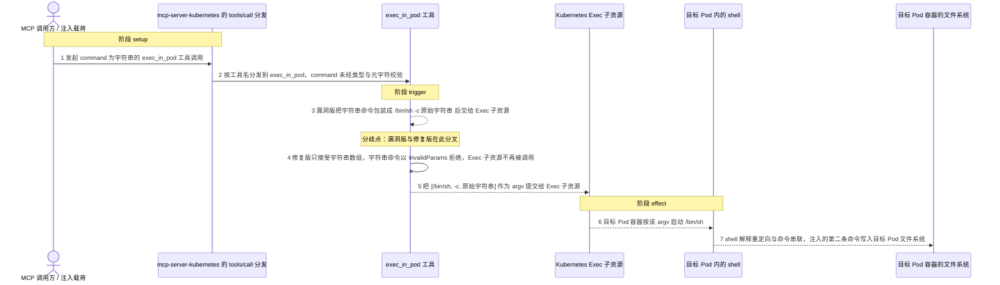
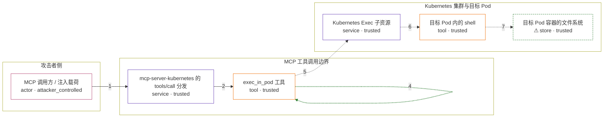

# mcp-server-kubernetes / CVE-2025-66404

状态：草稿，未完成环境和复现。这个目录由模板生成，不构成漏洞确认。

图解的唯一来源是 `diagram.toml`：编辑后运行 `python3 -m runner diagram mcp-server-kubernetes/CVE-2025-66404` 重新生成下方的图解区块。图解必须覆盖漏洞涉及的每个主体，并标出漏洞版/修复版的分歧步骤。

<!-- diagram:begin (generated from diagram.toml by `python3 -m runner diagram`; edit diagram.toml, not this block) -->
## 漏洞图解 — mcp-server-kubernetes exec_in_pod 字符串命令注入

mcp-server-kubernetes 2.9.8 之前的 exec_in_pod 工具在 command 参数是字符串时，把它无条件包装成 /bin/sh -c <字符串> 交给 Kubernetes Exec 子资源，既不校验 shell 元字符也不限制命令类型。调用方只要控制这次工具调用的 command 字符串（直接构造，或用提示注入让 AI agent 代为发起），重定向、管道与命令串联就会在目标 Pod 内被 shell 解释执行。修复版把 schema 收窄为字符串数组，并在运行时以 InvalidParams 拒绝字符串命令，同一条命令再也到不了 shell。信任边界是工具调用参数：调用方本应只提交一条可执行命令，工具却把整串字符串当成 shell 脚本执行。

### 涉及主体

| 主体 | 类型 | 信任级别 | 在漏洞里的作用 | 来源 |
| --- | --- | --- | --- | --- |
| MCP 调用方 / 注入载荷 (`caller`) | `actor` | `attacker_controlled` | 决定这次 exec_in_pod 调用的 command 字符串。advisory 给出两条路径：直接构造带元字符的字符串，或把指令嵌进被读取的数据里，让有权限的 AI agent 在未获用户明确意图时代为发起调用。 | fixtures/attack.json |
| mcp-server-kubernetes 的 tools/call 分发 (`mcp_server`) | `service` | `trusted` | 按工具名把 tools/call 分发到 exec_in_pod，只做类型断言，不检查 command 里是否含有 shell 元字符。 | src/index.ts |
| exec_in_pod 工具 (`exec_tool`) | `tool` | `trusted` | 缺陷所在：字符串 command 被无条件包装成 [shell, '-c', command]（shell 默认 /bin/sh），不做任何校验就交给 Exec 子资源；修复版只接受字符串数组并在运行时抛 InvalidParams。 | src/tools/exec_in_pod.ts |
| Kubernetes Exec 子资源 (`exec_api`) | `service` | `trusted` | 接收 namespace、pod 与 argv，在目标 Pod 容器内启动进程；它自己不做 shell 解释，字符串里的元字符能生效完全取决于前面包装出的 /bin/sh -c。 | node_modules/@kubernetes/client-node/dist/exec.js |
| 目标 Pod 内的 shell (`pod_shell`) | `tool` | `trusted` | 以 /bin/sh -c 启动后解释命令字符串里的重定向、管道与命令串联，把攻击者写的第二条命令当作 shell 脚本执行。 | — |
| ⚠ 目标 Pod 容器的文件系统 (`pod_filesystem`) | `store` | `trusted` | 注入命令的写入落点：漏洞版在这里留下攻击者指定的文件，修复版不会产生该文件。机制复现中以一次性的受控 marker 文件代表目标 Pod 文件系统，它不是真实集群里的外部目标。 | — |

**信任边界**

- **攻击者侧** (`attacker_side`)：成员 `caller`。攻击者能控制的只有这次工具调用的 command 字符串，不能直接读写目标 Pod、不能改工具代码，也不能绕过调用方本身的权限。
- **MCP 工具调用边界** (`tool_boundary`)：成员 `mcp_server`、`exec_tool`。参数进入这条边界后本应按「一条可执行命令」对待；工具却把字符串原样当成 shell 脚本拼进 argv，边界没有在类型和元字符上收口。
- **Kubernetes 集群与目标 Pod** (`cluster_boundary`)：成员 `exec_api`、`pod_shell`、`pod_filesystem`。Exec 子资源与目标 Pod 文件系统属于集群侧，理应只执行调用方显式提交的那条命令；漏洞让攻击者的整串字符串在这里被 shell 解释，效果落在 Pod 容器内而不是 MCP server 宿主。

标 ⚠ 的主体是本仓库合成的替身或无害效果载体，不代表真实外部目标。

### 触发过程

### 主体与信任边界

箭头上的数字是上面的步骤编号；方框只标主体和信任级别，具体动作见「触发过程」。

**分歧点**：第 3 步（`vulnerable_only`）漏洞版把字符串命令包装成 /bin/sh -c <原始字符串> 后交给 Exec 子资源。
**分歧点**：第 4 步（`patched_only`）修复版只接受字符串数组，字符串命令以 InvalidParams 拒绝，Exec 子资源不再被调用。
<!-- diagram:end -->

## 公告与机制

TODO：官方公告、漏洞根因、Agent 信任边界、受影响范围和修复来源。

## 前提

TODO：认证要求、用户交互、已有批准、工具权限、攻击者能控制的内容。

## 版本与启动

TODO：补全 metadata、Dockerfile/镜像 digest 和 Compose，再写出精确启动命令。

Compose 中 `vulnerable` 与 `patched` profiles 分开使用；未指定 profile 不启动服务。镜像变量未配置时 Compose 会明确报错。此模板不暴露宿主端口，也不挂载主机数据。

## 机制复现

TODO：实现 `reproduce.py`，固定输入并执行真实漏洞路径，注明运行位置、参数和超时。

完成实现后使用 `python3 -m runner reproduce mcp-server-kubernetes/CVE-2025-66404 --build --rounds 3`。
两脚本统一接受 `--context <context.json> --output <目录>`，详细字段见仓库 `docs/environment-contract.md`。
PoC 输出 `facts.json` 和效果文件；验证器只读证据，输出含 `target_ready` 及对应效果断言的 `verdict.json`。
镜像必须包含 Python 3 和 `/lab/` 下的脚本、fixtures；`runtime.mode` 选择 `oneshot` 或有 healthcheck 的 `service`。

## 端到端复现

TODO：实现 `end_to_end.py`；若不需要模型，明确写出不适用原因。真实模型的结果与机制复现分开统计。

## 验证与修复对照

TODO：实现 `verify.py`。记录漏洞版无害效果、修复版阻断和正常任务成功的证据，不能把服务启动失败当成阻断。

## 清理

默认运行器按每个测试的唯一 Compose project 清理容器、网络和 volume。
`--keep-on-failure` 保留失败项目，项目标识和 Compose 配置在结果目录中；仅清理该项目，不能使用全局 prune。

## 失败诊断

TODO：为本漏洞写出预期效果缺失、修复版仍有越界效果、正常任务失败及前提不满足时的具体排查路径。
启动失败、健康检查失败和超时都不能当作修复阻断。报告中应能定位到阶段、预期、实际和受控证据。

## 构建与输入

TODO：填写两版源码 archive、完整 commit，记录 `build.inputs` 中每个下载的 SHA-256；依赖安装必须支持禁网构建。
固定攻击和正常输入放入 `fixtures/` 并登记到 `fixtures/manifest.toml`。固定 seed、环境变量，说明无害效果与真实影响的关系。

## 隔离例外

默认无例外。确需例外时同时填写 `runtime.exceptions`、理由及最小范围，晋升由两位维护者审阅。

## 来源与许可

TODO：列出引用代码、fixtures 和镜像的来源及许可。
