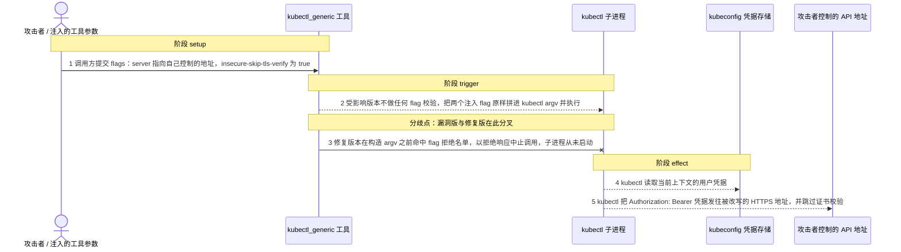
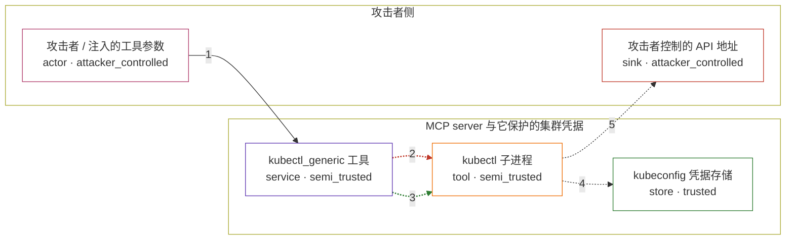

# mcp-server-kubernetes / CVE-2026-47250

状态：草稿，未完成环境和复现。这个目录由模板生成，不构成漏洞确认。

图解的唯一来源是 `diagram.toml`：编辑后运行 `python3 -m runner diagram mcp-server-kubernetes/CVE-2026-47250` 重新生成下方的图解区块。图解必须覆盖漏洞涉及的每个主体，并标出漏洞版/修复版的分歧步骤。

<!-- diagram:begin (generated from diagram.toml by `python3 -m runner diagram`; edit diagram.toml, not this block) -->
## 漏洞图解 — mcp-server-kubernetes / CVE-2026-47250 kubectl 参数注入导致 bearer token 外带

kubectl_generic 工具把调用方给出的 flags 与 args 原样拼进 kubectl 命令行，不校验会改写连接目标的 flag。凡是能影响这次工具调用的输入（例如被日志内容左右的 agent 调用）都能注入 --server 与 --insecure-skip-tls-verify，让 kubectl 改去连接攻击者控制的 HTTPS 地址并跳过证书校验。kubectl 会把 kubeconfig 里的 bearer token 附在发往该地址的请求上，于是操作者的集群凭据落到攻击者手里。3.7.0 在构造命令行之前先检查这些 flag，直接以拒绝响应中止调用。

### 涉及主体

| 主体 | 类型 | 信任级别 | 在漏洞里的作用 | 来源 |
| --- | --- | --- | --- | --- |
| 攻击者 / 注入的工具参数 (`attacker`) | `actor` | `attacker_controlled` | 控制 kubectl_generic 调用参数的一方：它提交的 flags 与 args 会被原样拼接，因此可以塞入重定向目标与跳过证书校验两个 flag。 | fixtures/attack.json |
| kubectl_generic 工具 (`kubectl_generic`) | `service` | `semi_trusted` | 受影响的 MCP 工具。它按顺序把 command、资源参数、调用方 flags 与 args 拼进 kubectl argv，只做非空判断，不做 flag 白名单，随后用 execFileSync 执行。 | — |
| kubectl 子进程 (`kubectl_cli`) | `tool` | `semi_trusted` | argv 构造完成后实际执行的子进程。它按命令行上最后出现的 --server 选择目标地址，并在传输为 TLS 时把 kubeconfig 凭据附加到请求上。 | — |
| kubeconfig 凭据存储 (`kubeconfig`) | `store` | `trusted` | 存放操作者特权 kubeconfig 的 bearer token；kubectl 会把它作为 Authorization 头附加到 HTTPS 请求上，这正是攻击者想要的东西。 | — |
| 攻击者控制的 API 地址 (`attacker_endpoint`) | `sink` | `attacker_controlled` | 接收被重定向的 kubectl 请求并从 Authorization 头取出 bearer token 的 HTTPS 端点；请求带着有效凭据到达，说明凭据已经外带。 | — |

**信任边界**

- **攻击者侧** (`attacker_side`)：成员 `attacker`、`attacker_endpoint`。攻击者只控制这次工具调用的参数，以及它自己的接收地址；集群凭据与 kubeconfig 都不在这里。
- **MCP server 与它保护的集群凭据** (`server_zone`)：成员 `kubectl_generic`、`kubectl_cli`、`kubeconfig`。kubectl_generic 与 kubectl 子进程本应只在操作者的集群上执行操作，并把 kubeconfig 凭据限制在这条边界内；漏洞让调用方参数把子进程的连接目标改成了边界外的地址。

### 触发过程

### 主体与信任边界

箭头上的数字是上面的步骤编号；方框只标主体和信任级别，具体动作见「触发过程」。

**分歧点**：第 2 步（`vulnerable_only`）受影响版本不做任何 flag 校验，把两个注入 flag 原样拼进 kubectl argv 并执行。
**分歧点**：第 3 步（`patched_only`）修复版本在构造 argv 之前命中 flag 拒绝名单，以拒绝响应中止调用，子进程从未启动。
<!-- diagram:end -->

## 公告与机制

TODO：官方公告、漏洞根因、Agent 信任边界、受影响范围和修复来源。

## 前提

TODO：认证要求、用户交互、已有批准、工具权限、攻击者能控制的内容。

## 版本与启动

TODO：补全 metadata、Dockerfile/镜像 digest 和 Compose，再写出精确启动命令。

Compose 中 `vulnerable` 与 `patched` profiles 分开使用；未指定 profile 不启动服务。镜像变量未配置时 Compose 会明确报错。此模板不暴露宿主端口，也不挂载主机数据。

## 机制复现

`reproduce.py` 用 stdio JSON-RPC 启动被固定的上游入口（`dist/index.js`：漏洞版 npm `3.6.2` /
gitHead `2c1f8b6888ae1dedeb01968c1b123ae53be013a8`，修复版 npm `3.7.0` /
gitHead `b7f8da38ff53c5b15808198c5f710eae1807eb0c`），完成 `initialize` 握手后以
`tools/call` 调用 `kubectl_generic`，参数取自 `fixtures/attack.json` 或 `fixtures/benign.json`。
凭据来自 `fixtures/kubeconfig.yaml`（经 `KUBECONFIG_YAML` 注入，server 指向不可解析的假集群，
token 为哨兵值）；攻击输入把 `server` 改写到进程内起的自签名 HTTPS 接收端并跳过证书校验。
两版都执行到 `kubectl` 子进程或守卫为止，没有真实集群参与，接收端在容器内。

- 漏洞版：接收端收到 `Authorization: Bearer <哨兵>`，`kubectl` 因假集群返回 401 而报错，
  `tools/call` 返回 `InternalError`。
- 修复版：`tools/call` 返回 `InvalidParams`（`Refusing to run kubectl with flag "--server"`），
  接收端零请求。
- 正常输入：两版都把 `kubectl get pods --output=json -l app=probe` 执行到子进程。
- 效果文件：`listener.json`（接收端看到的请求行与头，凭据已脱敏）、
  `server-stderr.txt`（含 `Executing: kubectl ...` 的 argv）、`call.json`（本次发送的工具参数）。

构建需要把两版 `dist` 树、共用的生产依赖 `node_modules` 与 `kubectl` 二进制放进镜像，
并保持 `runtime.mode = "oneshot"`、禁网即可（接收端在容器内）。

完成实现后使用 `python3 -m runner reproduce mcp-server-kubernetes/CVE-2026-47250 --build --rounds 3`。
两脚本统一接受 `--context <context.json> --output <目录>`，详细字段见仓库 `docs/environment-contract.md`。
PoC 输出 `facts.json` 和效果文件；验证器只读证据，输出含 `target_ready` 及对应效果断言的 `verdict.json`。
镜像必须包含 Python 3 和 `/lab/` 下的脚本、fixtures；`runtime.mode` 选择 `oneshot` 或有 healthcheck 的 `service`。

## 端到端复现

TODO：实现 `end_to_end.py`；若不需要模型，明确写出不适用原因。真实模型的结果与机制复现分开统计。

## 验证与修复对照

TODO：实现 `verify.py`。记录漏洞版无害效果、修复版阻断和正常任务成功的证据，不能把服务启动失败当成阻断。

## 清理

默认运行器按每个测试的唯一 Compose project 清理容器、网络和 volume。
`--keep-on-failure` 保留失败项目，项目标识和 Compose 配置在结果目录中；仅清理该项目，不能使用全局 prune。

## 失败诊断

TODO：为本漏洞写出预期效果缺失、修复版仍有越界效果、正常任务失败及前提不满足时的具体排查路径。
启动失败、健康检查失败和超时都不能当作修复阻断。报告中应能定位到阶段、预期、实际和受控证据。

## 构建与输入

TODO：填写两版源码 archive、完整 commit，记录 `build.inputs` 中每个下载的 SHA-256；依赖安装必须支持禁网构建。
固定攻击和正常输入放入 `fixtures/` 并登记到 `fixtures/manifest.toml`。固定 seed、环境变量，说明无害效果与真实影响的关系。

## 隔离例外

默认无例外。确需例外时同时填写 `runtime.exceptions`、理由及最小范围，晋升由两位维护者审阅。

## 来源与许可

TODO：列出引用代码、fixtures 和镜像的来源及许可。
