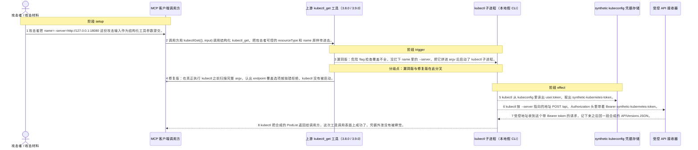
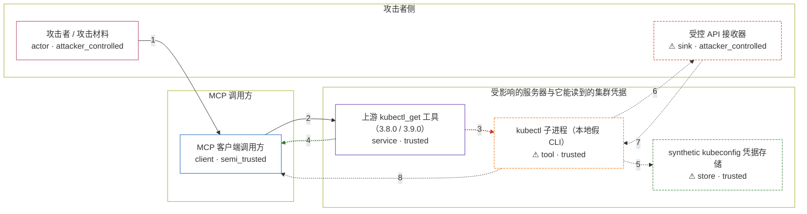

# mcp-server-kubernetes / CVE-2026-61459

状态：机制复现已完成，并通过四场景三轮容器验收；保持 `draft`，等待固定发布镜像和维护者审阅。

<!-- diagram:begin (generated from diagram.toml by `python3 -m runner diagram`; edit diagram.toml, not this block) -->
## 漏洞图解 — mcp-server-kubernetes kubectl 参数注入外泄集群凭据

mcp-server-kubernetes 3.8.0 的结构化 kubectl 工具把 resourceType 和 name 拼进 kubectl 的参数数组，而危险 flag 检查只在拼接之前做，覆盖不全。攻击者把 name 设成 --server=http://127.0.0.1:18080，这个值被 kubectl 当成了命令行选项，kubectl 于是转而连接受控地址，从 kubeconfig 里读出 bearer token 放进 Authorization 头，集群凭据就这样出了信任边界。3.9.0 改成在真正执行 kubectl 之前扫描完整的 argv，一旦发现 endpoint、credential 或 impersonation 这类覆盖选项就抛错拒绝，kubectl 根本不会启动。

### 涉及主体

| 主体 | 类型 | 信任级别 | 在漏洞里的作用 | 来源 |
| --- | --- | --- | --- | --- |
| 攻击者 / 攻击材料 (`attacker`) | `actor` | `attacker_controlled` | 准备攻击输入。它只声明 resourceType=pods 和 name=--server=http://127.0.0.1:18080，把一个以 - 开头、会被 kubectl 当成选项的资源名塞进结构化参数里。它自己不需要访问集群。 | fixtures/attack.json |
| MCP 客户端调用方 (`mcp_client`) | `client` | `semi_trusted` | 调用结构化 kubectl_get 的 MCP 客户端。它把攻击者可控的 resourceType 和 name 原样交给上游工具，既不检查危险参数，也不看拼出来的命令行长什么样。 | — |
| 上游 kubectl_get 工具（3.8.0 / 3.9.0） (`kubectl_get_tool`) | `service` | `trusted` | 出问题的上游组件。3.8.0 的危险 flag 检查覆盖不全，检查完就把 resourceType 和 name 拼进 argv 并启动 kubectl——漏洞就出在这里；3.9.0 改成启动前扫描完整 argv，发现 endpoint 被覆盖就抛错拒绝。 | src/tools/kubectl-get.ts |
| ⚠ kubectl 子进程（本地假 CLI） (`kubectl_cli`) | `tool` | `trusted` | 被拼出来的命令行启动的 kubectl。它解析 argv 里的 --server，从 kubeconfig 读出 token，然后向那个地址发起携带 Bearer token 的 API 请求。本仓库用 fixtures/bin/kubectl 这个替身代替真实 kubectl，它的选项解析行为与真实 CLI 一致。 | fixtures/bin/kubectl |
| ⚠ synthetic kubeconfig 凭据存储 (`kubeconfig`) | `store` | `trusted` | 被读取的 kubeconfig。里面写着 user.token=synthetic-kubernetes-token，kubectl 从中取出 bearer token 并随重定向请求发出去，凭据因此离开了集群边界。本仓库用合成的 kubeconfig 代替真实凭据文件。 | fixtures/synthetic-kubeconfig |
| ⚠ 受控 API 接收器 (`api_receiver`) | `sink` | `attacker_controlled` | 注入的 --server 所指向的攻击者受控地址。它收到 kubectl 发出的 POST /api 和其中的 Authorization 头，从而拿到 bearer token，再回一段合成的 APIVersions JSON，让这次调用看起来一切正常。本仓库用 loopback 上的受控接收器代替真实外部服务器。 | — |

**信任边界**

- **攻击者侧** (`attacker_side`)：成员 `attacker`、`api_receiver`。攻击材料，以及接收外泄凭据的地址，都在攻击者手里。接收端是本仓库合成的 loopback 替身，token 也是合成标记。
- **MCP 调用方** (`mcp_caller`)：成员 `mcp_client`。半可信的调用方。攻击者可控的 resourceType 和 name 从这里进入上游工具，调用方自己不做任何检查。
- **受影响的服务器与它能读到的集群凭据** (`trusted_side`)：成员 `kubectl_get_tool`、`kubectl_cli`、`kubeconfig`。上游 kubectl_get 工具、它启动的 kubectl，以及 kubectl 能读到的 kubeconfig 都在信任边界内侧。参数注入改写了 kubectl 要连的地址，把凭据送出了这道边界。

标 ⚠ 的主体是本仓库合成的替身或无害效果载体，不代表真实外部目标。

### 触发过程

### 主体与信任边界

箭头上的数字是上面的步骤编号；方框只标主体和信任级别，具体动作见「触发过程」。

**分歧点**：第 3 步（`vulnerable_only`）漏洞版：危险 flag 检查覆盖不全，没拦下 name 里的 --server，把它拼进 argv 后启动了 kubectl 子进程。。
**分歧点**：第 4 步（`patched_only`）修复版：在真正执行 kubectl 之前扫描完整 argv，认出 endpoint 覆盖选项就抛错拒绝，kubectl 没有被启动。。
<!-- diagram:end -->

## 公告与机制

公告：GHSA-wmg3-h8mf-wgvr，CVE-2026-61459。旧版结构化 kubectl 工具把
resourceType 和 name 拼入参数数组，只做了不完整的危险 flag 检查。以 -
开头的资源名会被 kubectl 当作选项，因此可注入 --server=...，把 kubeconfig
中的 bearer token 发往攻击者 API。修复版在真正执行 kubectl 前扫描完整 argv，
拒绝 endpoint、credential 和 impersonation 选项。

PoC 直接导入完整上游 src/tools/kubectl-get.ts，用固定 TypeScript 编译器和
依赖 bundle 生成对应 JS 模块；没有从源码字符串切片或重写漏洞函数。假
kubectl 只是外部 Kubernetes CLI 协作者：它记录真实 argv，从 synthetic
kubeconfig 取 token，并向本容器 loopback receiver 发一次 API 请求。

## 前提

需要能调用 kubectl_get 的 MCP 客户端、一个 kubeconfig 和 kubectl CLI。攻击
fixture 的 resource name 注入 loopback --server，benign fixture 使用普通
pod 名称。API receiver、CLI 和 kubeconfig 全是本地 synthetic fixture，不访问
真实集群；不需要模型。

## 版本与启动

漏洞版为 mcp-server-kubernetes 3.8.0，修复版为 3.9.0。源码 archive、完整
commit、Node 依赖 bundle 及 SHA-256 均在 metadata.toml 中固定。Dockerfile
在禁网 build 中编译真实 kubectl-get.ts，依赖 bundle 只包含上游所需的固定
Node 包。

    python3 -m runner reproduce mcp-server-kubernetes/CVE-2026-61459 --build --rounds 3

## 机制复现

漏洞版必须生成包含 --server=http://127.0.0.1:18080 的 argv，并让 receiver
收到 Bearer synthetic-kubernetes-token。修复版必须在调用 CLI 前拒绝该参数，
不产生 argv 记录或 receiver 请求。benign 场景要求普通 kubectl get 完成且
receiver 没有请求。verify.py 只读取 kubectl_effect.json。

## 端到端复现

不适用。机制测试已经覆盖 MCP 工具到 kubectl 的危险参数边界；真实 Kubernetes
集群会引入凭据和外部网络，不应成为本地验收前提。

## 失败诊断

若没有 argv，先检查 Node 编译产物和 PATH；若漏洞版没有 receiver 请求，检查
fake CLI 是否读取了 synthetic kubeconfig。修复版若仍有 CLI 或 API 请求，说明
完整 argv guard 未生效。编译、容器启动、API 健康或超时失败都不能解释为修复
阻断。

## 输入与隔离

所有 token 和 API 响应均为 synthetic。Compose 使用 internal network、无宿主端口
和主机挂载；源码与 Node bundle 禁网构建时按 SHA-256 校验。GHSA 元数据将生态
标为 PyPI，但实际被测产品是 npm 包；引用代码、来源和许可证见 metadata 及
上游仓库。
