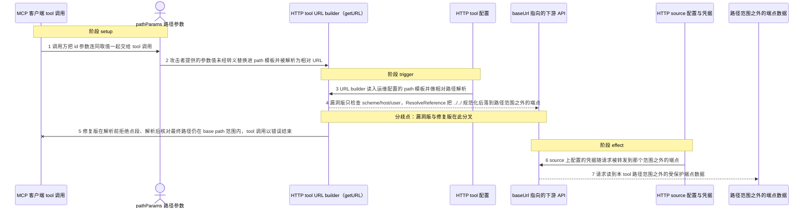
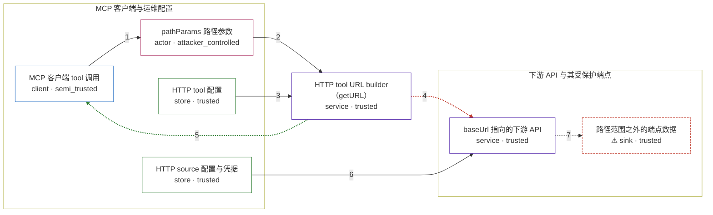

# mcp-toolbox / CVE-2026-11720

状态：草稿，未完成环境和复现。这个目录由模板生成，不构成漏洞确认。

图解的唯一来源是 `diagram.toml`：编辑后运行 `python3 -m runner diagram mcp-toolbox/CVE-2026-11720` 重新生成下方的图解区块。图解必须覆盖漏洞涉及的每个主体，并标出漏洞版/修复版的分歧步骤。

<!-- diagram:begin (generated from diagram.toml by `python3 -m runner diagram`; edit diagram.toml, not this block) -->
## 漏洞图解 — mcp-toolbox / CVE-2026-11720 漏洞图解

MCP 客户端可控的 HTTP tool 路径参数被未转义地代入配置里的 path 模板，再由 Go text/template 拼成相对 URL。旧版 URL builder 只拒绝改写 scheme/host/user 的输入，既不拒绝点段也不在解析后核对最终路径是否仍在 base path 范围内，于是 ResolveReference 把 ../../ 就地规范化，请求带着 source 配置的凭据落到同一主机上不该被这个 tool 触及的端点；修复版在解析前拒绝点段、解析后校验 base path 前缀。

### 涉及主体

| 主体 | 类型 | 信任级别 | 在漏洞里的作用 | 来源 |
| --- | --- | --- | --- | --- |
| MCP 客户端 tool 调用 (`mcp_client`) | `client` | `semi_trusted` | 把一次 tool 调用和其中的参数转发给 URL builder；它本身的部分参数来自攻击者，其余来自正常调用方。 | — |
| HTTP tool 配置 (`tool_config`) | `store` | `trusted` | 运维配置的 path 模板，例如 /api/v1/users/{{.id}}，是 URL builder 的输入而非攻击者可控内容。 | — |
| pathParams 路径参数 (`path_param`) | `actor` | `attacker_controlled` | 攻击者完全可控的 tool 参数值（如 ../../admin/secrets），未转义地替换进 path 模板。 | fixtures/path_params_attack.json |
| HTTP source 配置与凭据 (`http_source`) | `store` | `trusted` | 运维配置的 baseUrl 与默认请求头，其中带有下游 API 的凭据；漏洞让 toolbox 发出的请求把这些凭据转发到 base 范围之外的路径。 | — |
| HTTP tool URL builder（getURL） (`url_resolver`) | `service` | `trusted` | 上游 internal/tools/http 里的 getURL：渲染 path 模板、url.Parse 相对路径、再按 baseUrl 做 ResolveReference。它缺少点段拒绝与最终路径范围校验，是漏洞根因所在。 | — |
| baseUrl 指向的下游 API (`target_server`) | `service` | `trusted` | 同一个主机上的目标服务：既有 tool 本来要访问的业务端点，也有这个 tool 不该触达的管理端点。 | — |
| ⚠ 路径范围之外的端点数据 (`out_of_scope_data`) | `sink` | `trusted` | 漏洞触发后被带凭据的请求读到的受保护端点数据，是 effect 的落点。 | — |

**信任边界**

- **MCP 客户端与运维配置** (`mcp_client_side`)：成员 `mcp_client`、`tool_config`、`path_param`、`http_source`。这一侧混有运维配置和调用方可控输入；漏洞要越过的边界不是这里，而是配置好的 base path 范围。
- **下游 API 与其受保护端点** (`downstream`)：成员 `target_server`、`out_of_scope_data`。下游 API 只应被 baseUrl 加 tool path 组合出的范围内路径访问，管理端点与它的数据在攻击者本来够不着的一侧。
- 未列入上述边界：`url_resolver`。

标 ⚠ 的主体是本仓库合成的替身或无害效果载体，不代表真实外部目标。

### 触发过程

### 主体与信任边界

箭头上的数字是上面的步骤编号；方框只标主体和信任级别，具体动作见「触发过程」。

**分歧点**：第 4 步（`vulnerable_only`）漏洞版只检查 scheme/host/user，ResolveReference 把 ../../ 规范化后落到路径范围之外的端点。
**分歧点**：第 5 步（`patched_only`）修复版在解析前拒绝点段、解析后核对最终路径仍在 base path 范围内，tool 调用以错误结束。
<!-- diagram:end -->

## 公告与机制

TODO：官方公告、漏洞根因、Agent 信任边界、受影响范围和修复来源。

## 前提

TODO：认证要求、用户交互、已有批准、工具权限、攻击者能控制的内容。

## 版本与启动

TODO：补全 metadata、Dockerfile/镜像 digest 和 Compose，再写出精确启动命令。

Compose 中 `vulnerable` 与 `patched` profiles 分开使用；未指定 profile 不启动服务。镜像变量未配置时 Compose 会明确报错。此模板不暴露宿主端口，也不挂载主机数据。

## 机制复现

TODO：实现 `reproduce.py`，固定输入并执行真实漏洞路径，注明运行位置、参数和超时。

完成实现后使用 `python3 -m runner reproduce mcp-toolbox/CVE-2026-11720 --build --rounds 3`。
两脚本统一接受 `--context <context.json> --output <目录>`，详细字段见仓库 `docs/environment-contract.md`。
PoC 输出 `facts.json` 和效果文件；验证器只读证据，输出含 `target_ready` 及对应效果断言的 `verdict.json`。
镜像必须包含 Python 3 和 `/lab/` 下的脚本、fixtures；`runtime.mode` 选择 `oneshot` 或有 healthcheck 的 `service`。

## 端到端复现

TODO：实现 `end_to_end.py`；若不需要模型，明确写出不适用原因。真实模型的结果与机制复现分开统计。

## 验证与修复对照

TODO：实现 `verify.py`。记录漏洞版无害效果、修复版阻断和正常任务成功的证据，不能把服务启动失败当成阻断。

## 清理

默认运行器按每个测试的唯一 Compose project 清理容器、网络和 volume。
`--keep-on-failure` 保留失败项目，项目标识和 Compose 配置在结果目录中；仅清理该项目，不能使用全局 prune。

## 失败诊断

TODO：为本漏洞写出预期效果缺失、修复版仍有越界效果、正常任务失败及前提不满足时的具体排查路径。
启动失败、健康检查失败和超时都不能当作修复阻断。报告中应能定位到阶段、预期、实际和受控证据。

## 构建与输入

TODO：填写两版源码 archive、完整 commit，记录 `build.inputs` 中每个下载的 SHA-256；依赖安装必须支持禁网构建。
固定攻击和正常输入放入 `fixtures/` 并登记到 `fixtures/manifest.toml`。固定 seed、环境变量，说明无害效果与真实影响的关系。

## 隔离例外

默认无例外。确需例外时同时填写 `runtime.exceptions`、理由及最小范围，晋升由两位维护者审阅。

## 来源与许可

TODO：列出引用代码、fixtures 和镜像的来源及许可。
