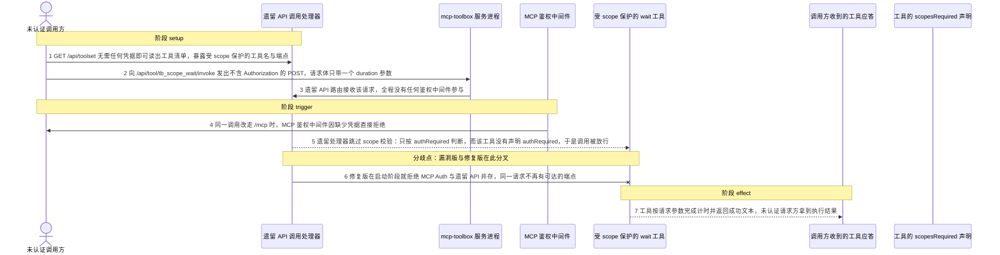
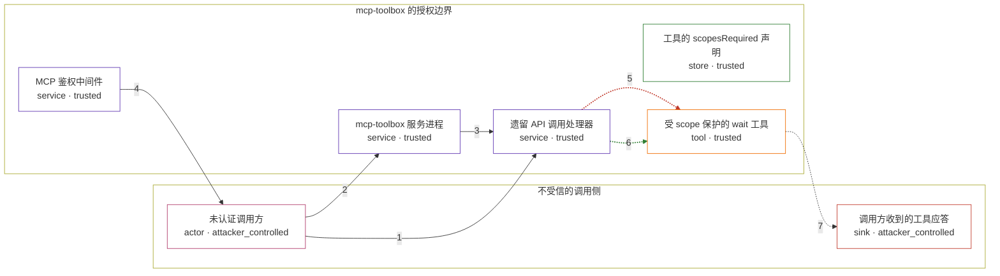

# mcp-toolbox / CVE-2026-14537

状态：草稿，未完成环境和复现。这个目录由模板生成，不构成漏洞确认。

图解的唯一来源是 `diagram.toml`：编辑后运行 `python3 -m runner diagram mcp-toolbox/CVE-2026-14537` 重新生成下方的图解区块。图解必须覆盖漏洞涉及的每个主体，并标出漏洞版/修复版的分歧步骤。

<!-- diagram:begin (generated from diagram.toml by `python3 -m runner diagram`; edit diagram.toml, not this block) -->
## 漏洞图解 — mcp-toolbox 遗留 HTTP API 绕过 MCP scope 授权

mcp-toolbox 同时提供 MCP 传输与遗留 HTTP API 两条调用通道，但工具级 scopesRequired 校验只挂在 MCP 一侧：/mcp 路由装有 mcpAuthMiddleware，/api 路由完全没有鉴权中间件，遗留 toolInvokeHandler 也从不调用 ValidateScopes。于是当 --enable-api 打开、配置里又存在 mcpEnabled 的 auth service 时，同一次工具调用走 MCP 会被拒，走遗留端点却直接执行。攻击者因此可以用一个不含任何凭据的 POST 调用本应受 scope 保护的工具。

### 涉及主体

| 主体 | 类型 | 信任级别 | 在漏洞里的作用 | 来源 |
| --- | --- | --- | --- | --- |
| 未认证调用方 (`attacker`) | `actor` | `attacker_controlled` | 决定请求路径、方法、请求体与请求头；在整条链路上不携带 Authorization，也不持有任何凭据。 | — |
| mcp-toolbox 服务进程 (`toolbox`) | `service` | `trusted` | 按配置同时挂载 MCP 路由与遗留 API 路由；两条路由共用同一份工具与 auth service 配置，却各自决定要不要校验。 | — |
| MCP 鉴权中间件 (`mcp_auth_middleware`) | `service` | `trusted` | 挂在 /mcp 上：校验 Authorization 头并解析 claims，再把 claims 注入请求上下文；工具级 scope 校验随后依赖这些 claims。 | — |
| 遗留 API 调用处理器 (`api_handler`) | `service` | `trusted` | 挂在 /api 上：只按 authRequired 判断授权，并且只对 generic 类型且 mcpEnabled 的 auth service 读取上下文 claims；/api 上不存在中间件，claims 恒为空。 | — |
| 工具的 scopesRequired 声明 (`scope_policy`) | `store` | `trusted` | 工具配置里的 scopesRequired 字段，是漏洞要保护的对象：上游只在 MCP 方法处理器里读取它做校验。 | — |
| 受 scope 保护的 wait 工具 (`wait_tool`) | `tool` | `trusted` | 只接收一个 duration 参数、不依赖任何 source；命中授权缺陷后按参数执行本地计时并返回成功文本。 | — |
| 调用方收到的工具应答 (`caller_response`) | `sink` | `attacker_controlled` | 工具执行结果经遗留端点回给未携带凭据的请求方，使对方在没有授权的情况下拿到执行证据。 | — |

**信任边界**

- **不受信的调用侧** (`caller_side`)：成员 `attacker`、`caller_response`。这里只有调用方能自己决定的东西：请求内容与它自己的接收端。它拿不到 claims，也拿不到该工具要求的 scope。
- **mcp-toolbox 的授权边界** (`server_side`)：成员 `toolbox`、`mcp_auth_middleware`、`api_handler`、`scope_policy`、`wait_tool`。MCP 路由在这道边界上校验凭据与 scope；遗留 API 路由与它共用同一份工具配置，却把这道校验落在了边界之外。

### 触发过程

### 主体与信任边界

箭头上的数字是上面的步骤编号；方框只标主体和信任级别，具体动作见「触发过程」。

**分歧点**：第 5 步（`vulnerable_only`）遗留处理器跳过 scope 校验：只按 authRequired 判断，而该工具没有声明 authRequired，于是调用被放行。
**分歧点**：第 6 步（`patched_only`）修复版在启动阶段就拒绝 MCP Auth 与遗留 API 并存，同一请求不再有可达的端点。
<!-- diagram:end -->

## 公告与机制

TODO：官方公告、漏洞根因、Agent 信任边界、受影响范围和修复来源。

## 前提

TODO：认证要求、用户交互、已有批准、工具权限、攻击者能控制的内容。

## 版本与启动

TODO：补全 metadata、Dockerfile/镜像 digest 和 Compose，再写出精确启动命令。

Compose 中 `vulnerable` 与 `patched` profiles 分开使用；未指定 profile 不启动服务。镜像变量未配置时 Compose 会明确报错。此模板不暴露宿主端口，也不挂载主机数据。

## 机制复现

TODO：实现 `reproduce.py`，固定输入并执行真实漏洞路径，注明运行位置、参数和超时。

完成实现后使用 `python3 -m runner reproduce mcp-toolbox/CVE-2026-14537 --build --rounds 3`。
两脚本统一接受 `--context <context.json> --output <目录>`，详细字段见仓库 `docs/environment-contract.md`。
PoC 输出 `facts.json` 和效果文件；验证器只读证据，输出含 `target_ready` 及对应效果断言的 `verdict.json`。
镜像必须包含 Python 3 和 `/lab/` 下的脚本、fixtures；`runtime.mode` 选择 `oneshot` 或有 healthcheck 的 `service`。

## 端到端复现

TODO：实现 `end_to_end.py`；若不需要模型，明确写出不适用原因。真实模型的结果与机制复现分开统计。

## 验证与修复对照

TODO：实现 `verify.py`。记录漏洞版无害效果、修复版阻断和正常任务成功的证据，不能把服务启动失败当成阻断。

## 清理

默认运行器按每个测试的唯一 Compose project 清理容器、网络和 volume。
`--keep-on-failure` 保留失败项目，项目标识和 Compose 配置在结果目录中；仅清理该项目，不能使用全局 prune。

## 失败诊断

TODO：为本漏洞写出预期效果缺失、修复版仍有越界效果、正常任务失败及前提不满足时的具体排查路径。
启动失败、健康检查失败和超时都不能当作修复阻断。报告中应能定位到阶段、预期、实际和受控证据。

## 构建与输入

TODO：填写两版源码 archive、完整 commit，记录 `build.inputs` 中每个下载的 SHA-256；依赖安装必须支持禁网构建。
固定攻击和正常输入放入 `fixtures/` 并登记到 `fixtures/manifest.toml`。固定 seed、环境变量，说明无害效果与真实影响的关系。

## 隔离例外

默认无例外。确需例外时同时填写 `runtime.exceptions`、理由及最小范围，晋升由两位维护者审阅。

## 来源与许可

TODO：列出引用代码、fixtures 和镜像的来源及许可。
