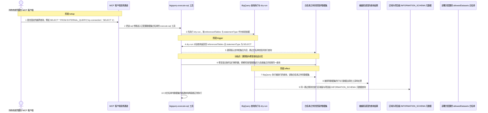
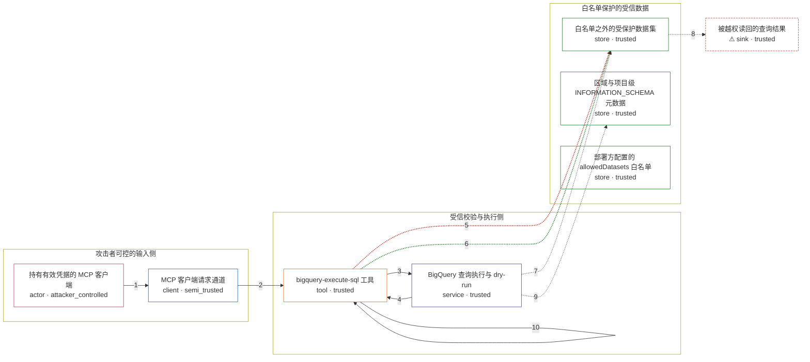

# mcp-toolbox / CVE-2026-14538

状态：草稿，未完成环境和复现。这个目录由模板生成，不构成漏洞确认。

图解的唯一来源是 `diagram.toml`：编辑后运行 `python3 -m runner diagram mcp-toolbox/CVE-2026-14538` 重新生成下方的图解区块。图解必须覆盖漏洞涉及的每个主体，并标出漏洞版/修复版的分歧步骤。

<!-- diagram:begin (generated from diagram.toml by `python3 -m runner diagram`; edit diagram.toml, not this block) -->
## 漏洞图解 — mcp-toolbox / CVE-2026-14538 数据集白名单绕过

MCP Toolbox 的 bigquery-execute-sql 工具用 BigQuery dry-run 报告的 referencedTables 判定查询触及哪些数据集。当 dry-run 对 EXTERNAL_QUERY 或 INFORMATION_SCHEMA 查询返回空表集合时，待检集合为空，allowedDatasets 白名单校验一次都不执行，查询照常下发。修复后工具无条件运行本地 SQL 解析器并把结果并入检查集合，同一输入在执行前被拒绝。

### 涉及主体

| 主体 | 类型 | 信任级别 | 在漏洞里的作用 | 来源 |
| --- | --- | --- | --- | --- |
| 持有有效凭据的 MCP 客户端 (`attacker`) | `actor` | `attacker_controlled` | 完全控制工具参数 sql，可提交任意 BigQuery Standard SQL，唯一的攻击动作就是这一次工具调用。 | fixtures/attack.json |
| MCP 客户端请求通道 (`mcp_client`) | `client` | `semi_trusted` | 把攻击者的 sql 参数原样送进服务端工具；除参数内容外不构造任何其他输入。 | — |
| bigquery-execute-sql 工具 (`tool`) | `tool` | `trusted` | 执行数据集白名单校验的受信组件；它的短路分支在 dry-run 未列出表时整段跳过校验。 | — |
| BigQuery 查询执行与 dry-run (`bigquery`) | `service` | `trusted` | 接受 dry-run 与正式查询，对 EXTERNAL_QUERY 与 INFORMATION_SCHEMA 查询返回空的 referencedTables。 | — |
| 白名单之外的受保护数据集 (`forbidden_dataset`) | `store` | `trusted` | 被显式排除在 allowedDatasets 之外的数据，漏洞触发时其中的行与结构被读出。 | — |
| 区域与项目级 INFORMATION_SCHEMA 元数据 (`region_metadata`) | `store` | `trusted` | 区域级或项目级元数据视图，不属于任何数据集白名单项，同样被校验跳过而泄露。 | — |
| 部署方配置的 allowedDatasets 白名单 (`allowed_datasets_config`) | `store` | `trusted` | 漏洞前提：只有部署方设置了非空白名单，这次绕过才构成越权；未配置时按设计允许所有数据集。 | fixtures/benign.json |
| ⚠ 被越权读回的查询结果 (`queried_rows`) | `sink` | `trusted` | 漏洞效果的落点：被排除数据集的行与元数据随工具响应回到调用方。 | — |

**信任边界**

- **攻击者可控的输入侧** (`untrusted_input`)：成员 `attacker`、`mcp_client`。攻击者只能控制这次调用里的 sql（以及 dry_run）参数，不能改部署配置，也不能直接读数据集。
- **受信校验与执行侧** (`enforcement`)：成员 `tool`、`bigquery`。这道边界本来保证任何触及白名单之外数据集的查询都在执行前被拒绝；dry-run 空表集合时校验被整体跳过，边界失效。
- **白名单保护的受信数据** (`protected_data`)：成员 `forbidden_dataset`、`region_metadata`、`allowed_datasets_config`。攻击者本来够不着的数据与配置。每次调用都按 allowed_datasets_config 判定，而漏洞让判定失效。
- 未列入上述边界：`queried_rows`。

标 ⚠ 的主体是本仓库合成的替身或无害效果载体，不代表真实外部目标。

### 触发过程

### 主体与信任边界

箭头上的数字是上面的步骤编号；方框只标主体和信任级别，具体动作见「触发过程」。

**分歧点**：第 5 步（`vulnerable_only`）漏洞版认定待检集合为空，跳过白名单校验并放行查询。
**分歧点**：第 6 步（`patched_only`）修复版无条件运行解析器，把解析到的数据集并入检查集合并拒绝同一查询。
<!-- diagram:end -->

## 公告与机制

- 公告：[GHSA-24pp-m59v-92j8](https://github.com/advisories/GHSA-24pp-m59v-92j8)（`CVE-2026-14538`，CWE-863 类越权）。
- 受影响组件：`googleapis/mcp-toolbox` 的 `bigquery-execute-sql` 工具
  （`internal/tools/bigquery/bigqueryexecutesql/`），受影响版本区间 `0.16.1`–`1.4.0`。
- 根因：`Tool.Invoke()` 只用 dry-run 的 `statistics.query.referencedTables` /
  `ddlTargetTable` / `ddlDestinationTable` 组装待检数据集集合。该集合为空且
  `statementType == "SELECT"` 时，`allowedDatasets` 的 `IsDatasetAllowed` 循环一次都不执行，
  查询直接进入 `RunSQL`——fail-open。
- 修复：提交 `ca6d5e35160f3a51ab4fc6683e0a19a77851aebd`（PR #3452）改为**无条件**运行
  `bqutil.TableParser` 并把结果并入检查集合，解析失败即拒绝；解析器同时新增
  `EXTERNAL_QUERY` 与 `INFORMATION_SCHEMA` 拒绝规则。
- Agent 信任边界：MCP 客户端完全控制 `sql` 参数，但只能控制这一次调用；白名单由部署方配置，
  数据集的读取权限由 `bigquery-execute-sql` 工具代为行使，因此工具的校验就是 security boundary。
- 来源细节与逐行对照见 `research/public.md`。

## 前提

- MCP 客户端已认证，且能提交任意 BigQuery Standard SQL。
- 部署方在 BigQuery source 上配置了非空 `allowedDatasets`（本环境固定为 `test-project.allowed_dataset`）；
  未配置白名单时按设计允许所有数据集，不存在"绕过"。
- dry-run 对构造的查询返回空 `referencedTables` 且 `statementType = SELECT`；机制复现用一个
  容器内 loopback BigQuery REST 端点复现这一响应，因此不需要真实 BigQuery 凭据。
- 攻击者不能修改部署配置，也不能直接读数据集。

## 版本与启动

- 漏洞版：`v1.4.0 = d67cfbe8ddca5a50c9577ea11feaf5c94d0acace`。
- 修复版：`v1.5.0 = 45c0f86ce0199a8aed9c980370dd2c03f2684f5a`（修复提交
  `ca6d5e35160f3a51ab4fc6683e0a19a77851aebd` 的父提交为 `a6ff910a602adece11f0a6581d6211e5927f7182`）。
- 两版都是 `github.com/googleapis/mcp-toolbox` 的独立 git tag，`metadata.toml` 已给出 commit 与
  archive URL；`build.inputs`、基础镜像 digest 与 Dockerfile 配方由 build 阶段固定。
- 启动方式由 `compose.yaml` 的 `vulnerable` / `patched` profiles 决定，具体镜像 digest 在 build
  阶段写入后给出。当前 `verification.*` 仍为未验证状态。

Compose 中 `vulnerable` 与 `patched` profiles 分开使用；未指定 profile 不启动服务。镜像变量未配置时 Compose 会明确报错。此模板不暴露宿主端口，也不挂载主机数据。

## 机制复现

`reproduce.py` 不重写漏洞逻辑：镜像内的 `/lab/bin/avhrepro` 由 `driver/` 与固定版本的
上游源码一起编译，`driver/main.go` 用真实上游 `bigqueryexecutesql.Config` 与
`bigquerycommon.MockSource` 构造工具，用一个 loopback BigQuery REST 端点回答 dry-run，
再把 `/lab/fixtures/<scenario>.json` 里的固定 SQL 通过 `tool.Invoke` 送进去。
`driver/adapter_vulnerable.go` 与 `driver/adapter_patched.go` 只补齐两版之间
`MockSource` 方法与 `Config.Initialize` 签名的差异，不含任何数据集校验逻辑。

- 攻击场景（`fixtures/attack.json`）：`EXTERNAL_QUERY` 联邦读取、白名单外
  `INFORMATION_SCHEMA.TABLES`、区域级 `INFORMATION_SCHEMA.SCHEMATA`。漏洞版三条都进入执行路径，
  修复版三条都在 `Invoke` 内被拒绝。
- 正常场景（`fixtures/benign.json`）：白名单内数据集查询、常量表达式、白名单内
  `INFORMATION_SCHEMA` 查询；两版都必须完成普通任务。
- 输出：`facts.json`、`observation.json` 和效果文件 `driver.json`（记录每个探针的 SQL、
  是否进入执行路径、拒绝文本与行数）。运行位置为容器内 `/lab`，超时 300 秒。

完成实现后使用 `python3 -m runner reproduce mcp-toolbox/CVE-2026-14538 --build --rounds 3`。
两脚本统一接受 `--context <context.json> --output <目录>`，详细字段见仓库 `docs/environment-contract.md`。
PoC 输出 `facts.json` 和效果文件；验证器只读证据，输出含 `target_ready` 及对应效果断言的 `verdict.json`。
镜像必须包含 Python 3 和 `/lab/` 下的脚本、fixtures；`runtime.mode` 选择 `oneshot` 或有 healthcheck 的 `service`。

## 端到端复现

TODO：实现 `end_to_end.py`；若不需要模型，明确写出不适用原因。真实模型的结果与机制复现分开统计。

## 验证与修复对照

`verify.py` 只读 `facts.json`、`observation.json` 与哈希校验过的 `driver.json`，不重跑 PoC，
按场景给出唯一断言：

- 漏洞版攻击 → `vulnerable_effect_observed`：三条越界 SQL 都必须进入执行路径，且执行次数与探针数一致。
- 修复版攻击 → `patched_effect_blocked`：三条都不得进入执行路径，且拒绝文本必须命中对应边界
  （`EXTERNAL_QUERY is not allowed` / `which is not in the allowed list` /
  `non-dataset-level INFORMATION_SCHEMA view`）。
- 正常任务 → `benign_task_passed`：常量表达式探针必须执行成功。

启动失败、探针缺失、证据哈希不符或上下文不匹配都判失败，不能当作修复阻断。

## 清理

默认运行器按每个测试的唯一 Compose project 清理容器、网络和 volume。
`--keep-on-failure` 保留失败项目，项目标识和 Compose 配置在结果目录中；仅清理该项目，不能使用全局 prune。

## 失败诊断

- 漏洞版没有产生越界效果：先看 `driver.json` 的 `sql_calls`。为空说明没有到达 `RunSQL`，
  通常是 fixture 的 `deployment.allowed_datasets` 没配成非空（漏洞前提不成立），或者
  dry-run 响应没有被替换成空 `referencedTables`。
- 修复版仍有越界效果：对比 `driver.json` 里三条攻击探针的 `invoked` 与 `error`，确认镜像确实
  由 `v1.5.0` 构建（`driver.json.variant` 与 `driver.json.go_version` 可辅助定位）。
- 正常任务失败：`constant_expression` 探针的 `error` 会给出上游返回的错误文本。
- 证据判定失败：`verdict.json` 的 `checks[].actual` 会指出是哪个探针、哪段拒绝文本不匹配。
- 任何"容器没起来/超时"都不算修复阻断；这类情况应落成执行失败，而不是通过。
启动失败、健康检查失败和超时都不能当作修复阻断。报告中应能定位到阶段、预期、实际和受控证据。

## 构建与输入

- 两版源码 archive 与完整 commit 记录在 `metadata.toml` 的 `[vulnerable]` / `[patched]`：
  `v1.4.0 = d67cfbe8ddca5a50c9577ea11feaf5c94d0acace`、
  `v1.5.0 = 45c0f86ce0199a8aed9c980370dd2c03f2684f5a`。
- `build.inputs`、基础镜像 digest 与逐文件 SHA-256 由 build 阶段补齐；禁网构建需要固定 Go
  工具链（上游 `go.mod` 要求 Go ≥ 1.25.7）与模块依赖缓存。
- `build.driver_sources` / `build.driver_binary` 声明了机制驱动的编译输入与产物路径。
- 攻击与正常输入固定在 `fixtures/attack.json`、`fixtures/benign.json`，SHA-256 登记在
  `fixtures/manifest.toml`。两版镜像使用同一份 fixture，仅源码版本不同。
- fixture 中的 `canary-row-*@example.invalid`、`cost-center-*` 是合成标记，不是真实凭据或用户数据。

## 隔离例外

默认无例外。确需例外时同时填写 `runtime.exceptions`、理由及最小范围，晋升由两位维护者审阅。

## 来源与许可

- 上游代码：`github.com/googleapis/mcp-toolbox`，Apache-2.0。
- 公告与修复：`https://github.com/advisories/GHSA-24pp-m59v-92j8`、PR #3452、
  `https://github.com/googleapis/mcp-toolbox/commit/ca6d5e35160f3a51ab4fc6683e0a19a77851aebd`。
- NVD：`https://nvd.nist.gov/vuln/detail/CVE-2026-14538`。
- fixtures 为本仓库合成的固定输入，无外部数据；`driver/` 为本仓库为驱动固定上游代码而写，
  不复制上游的授权判定逻辑。
