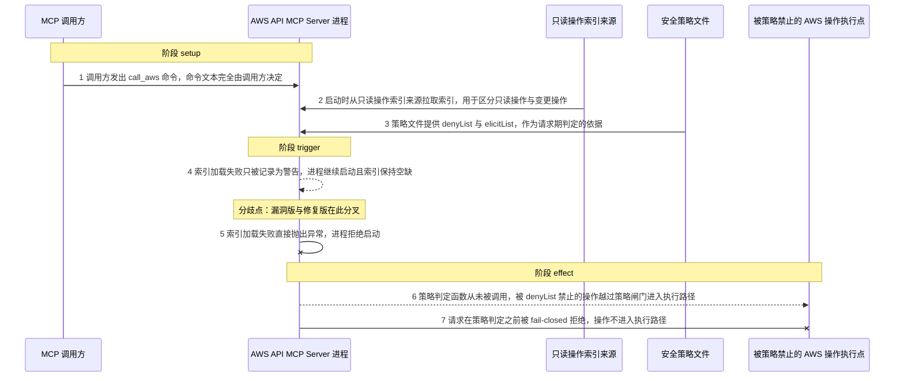
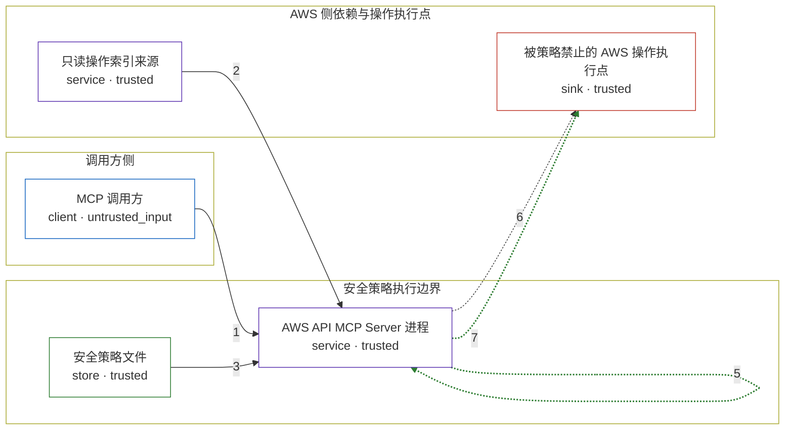

# mcp / CVE-2026-16584

状态：草稿，未完成环境和复现。这个目录由模板生成，不构成漏洞确认。

图解的唯一来源是 `diagram.toml`：编辑后运行 `python3 -m runner diagram mcp/CVE-2026-16584` 重新生成下方的图解区块。图解必须覆盖漏洞涉及的每个主体，并标出漏洞版/修复版的分歧步骤。

<!-- diagram:begin (generated from diagram.toml by `python3 -m runner diagram`; edit diagram.toml, not this block) -->
## 漏洞图解 — AWS API MCP Server 启动初始化失败导致安全策略绕过

AWS API MCP Server 启动时无条件加载只读操作索引，它是安全策略判定的必需输入；当该索引因服务引用端点不可达而加载失败时，漏洞版只记录一条警告便继续启动，并让此后每个请求的策略判定整体跳过，修复版则改为拒绝启动、并在请求路径上 fail-closed。被绕过的是策略文件里用户配置的 denyList 与 elicitList，也就是公告所述的 deny 与 gate 规则。结果是本该被拒绝的变更操作越过策略闸门进入执行路径。

### 涉及主体

| 主体 | 类型 | 信任级别 | 在漏洞里的作用 | 来源 |
| --- | --- | --- | --- | --- |
| MCP 调用方 (`mcp_client`) | `client` | `untrusted_input` | 以自然语言驱动 MCP 客户端发出 call_aws 调用；它控制命令文本，但没有权限改写服务端的安全策略。 | fixtures/cases.json |
| AWS API MCP Server 进程 (`mcp_server`) | `service` | `trusted` | 启动时加载只读操作索引，并在每次 call_aws 请求上执行安全策略判定；索引缺失时是继续运行还是拒绝启动，直接决定策略是否仍被执行。 | — |
| 安全策略文件 (`policy_store`) | `store` | `trusted` | 保存用户配置的 denyList / elicitList，是每次请求策略判定的唯一依据。只有当请求期策略判定被调用时，这份规则才会生效。 | fixtures/policy/attack-mcp-security-policy.json |
| 只读操作索引来源 (`index_service`) | `service` | `trusted` | 提供区分只读操作与变更操作的索引数据；它在启动时不可达只是可用性前提，不是攻击动作。 | — |
| 被策略禁止的 AWS 操作执行点 (`aws_operation`) | `sink` | `trusted` | denyList 本应拦下的操作最终落到这里；漏洞版让它未经策略判定就进入执行路径。 | — |

**信任边界**

- **调用方侧** (`caller_side`)：成员 `mcp_client`。调用方只能提供命令文本，既读不到也改不了服务端的安全策略文件。
- **安全策略执行边界** (`policy_boundary`)：成员 `mcp_server`、`policy_store`。这道边界保证每个请求都按策略文件判定 deny、elicit 或放行；判定依赖启动时加载的只读操作索引，索引缺失时漏洞版把整道判定跳过。
- **AWS 侧依赖与操作执行点** (`aws_side`)：成员 `index_service`、`aws_operation`。索引来源只是可用性依赖，操作执行点才是受保护目标；两者都不受调用方控制。

### 触发过程

### 主体与信任边界

箭头上的数字是上面的步骤编号；方框只标主体和信任级别，具体动作见「触发过程」。

**分歧点**：第 4 步（`vulnerable_only`）索引加载失败只被记录为警告，进程继续启动且索引保持空缺。
**分歧点**：第 5 步（`patched_only`）索引加载失败直接抛出异常，进程拒绝启动。
<!-- diagram:end -->

## 公告与机制

TODO：官方公告、漏洞根因、Agent 信任边界、受影响范围和修复来源。

## 前提

TODO：认证要求、用户交互、已有批准、工具权限、攻击者能控制的内容。

## 版本与启动

TODO：补全 metadata、Dockerfile/镜像 digest 和 Compose，再写出精确启动命令。

Compose 中 `vulnerable` 与 `patched` profiles 分开使用；未指定 profile 不启动服务。镜像变量未配置时 Compose 会明确报错。此模板不暴露宿主端口，也不挂载主机数据。

## 机制复现

TODO：实现 `reproduce.py`，固定输入并执行真实漏洞路径，注明运行位置、参数和超时。

完成实现后使用 `python3 -m runner reproduce mcp/CVE-2026-16584 --build --rounds 3`。
两脚本统一接受 `--context <context.json> --output <目录>`，详细字段见仓库 `docs/environment-contract.md`。
PoC 输出 `facts.json` 和效果文件；验证器只读证据，输出含 `target_ready` 及对应效果断言的 `verdict.json`。
镜像必须包含 Python 3 和 `/lab/` 下的脚本、fixtures；`runtime.mode` 选择 `oneshot` 或有 healthcheck 的 `service`。

## 端到端复现

TODO：实现 `end_to_end.py`；若不需要模型，明确写出不适用原因。真实模型的结果与机制复现分开统计。

## 验证与修复对照

TODO：实现 `verify.py`。记录漏洞版无害效果、修复版阻断和正常任务成功的证据，不能把服务启动失败当成阻断。

## 清理

默认运行器按每个测试的唯一 Compose project 清理容器、网络和 volume。
`--keep-on-failure` 保留失败项目，项目标识和 Compose 配置在结果目录中；仅清理该项目，不能使用全局 prune。

## 失败诊断

TODO：为本漏洞写出预期效果缺失、修复版仍有越界效果、正常任务失败及前提不满足时的具体排查路径。
启动失败、健康检查失败和超时都不能当作修复阻断。报告中应能定位到阶段、预期、实际和受控证据。

## 构建与输入

TODO：填写两版源码 archive、完整 commit，记录 `build.inputs` 中每个下载的 SHA-256；依赖安装必须支持禁网构建。
固定攻击和正常输入放入 `fixtures/` 并登记到 `fixtures/manifest.toml`。固定 seed、环境变量，说明无害效果与真实影响的关系。

## 隔离例外

默认无例外。确需例外时同时填写 `runtime.exceptions`、理由及最小范围，晋升由两位维护者审阅。

## 来源与许可

TODO：列出引用代码、fixtures 和镜像的来源及许可。
