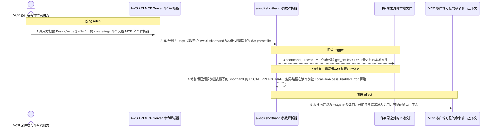
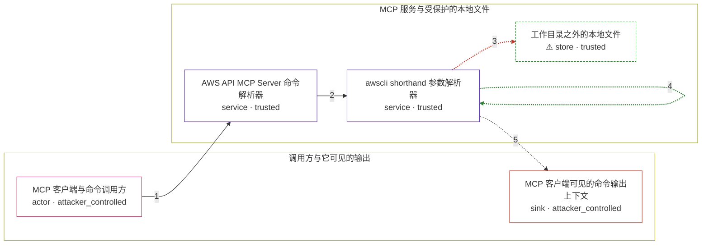

# mcp / CVE-2026-4270

状态：草稿，未完成环境和复现。这个目录由模板生成，不构成漏洞确认。

图解的唯一来源是 `diagram.toml`：编辑后运行 `python3 -m runner diagram mcp/CVE-2026-4270` 重新生成下方的图解区块。图解必须覆盖漏洞涉及的每个主体，并标出漏洞版/修复版的分歧步骤。

<!-- diagram:begin (generated from diagram.toml by `python3 -m runner diagram`; edit diagram.toml, not this block) -->
## 漏洞图解 — AWS API MCP Server shorthand paramfile 越界读取

AWS API MCP Server 只用自定义的受限 URI handler 接管了普通 CLI 参数上的 file:// / fileb:// 取值，没有接管 AWS CLI shorthand 语法里 Key@=value 的 paramfile 解析；shorthand 使用 awscli 自带的 LOCAL_PREFIX_MAP，直接调用未做任何校验的 get_file。于是工作目录限制与 no-access 禁令在 @= 这条取值路径上完全失效，工作目录之外的本地文件内容被读进 --tags 参数，并随命令结果进入 MCP 客户端可见的输出上下文。

### 涉及主体

| 主体 | 类型 | 信任级别 | 在漏洞里的作用 | 来源 |
| --- | --- | --- | --- | --- |
| MCP 客户端与命令调用方 (`caller`) | `actor` | `attacker_controlled` | 把模型生成的 call_aws 命令字符串交给 MCP 服务解析。攻击者通过提示注入控制该字符串里的参数值，但自己不能越过工作目录限制读取本地文件。 | — |
| AWS API MCP Server 命令解析器 (`mcp_parser`) | `service` | `trusted` | 用 core/parser/parser.py 解析 aws 命令，并把受校验的 get_file_validated 注册到 AWS CLI 的 load-cli-arg 事件。该注册只覆盖普通 CLI 参数，不覆盖 shorthand 的 @= 取值路径。 | src/aws-api-mcp-server/awslabs/aws_api_mcp_server/core/aws/services.py |
| awscli shorthand 参数解析器 (`shorthand_parser`) | `service` | `trusted` | 解析 --tags 这类 shorthand 参数。_resolve_paramfiles 通过 awscli 自带的 LOCAL_PREFIX_MAP 把 file:// 与 fileb:// 直接映射到未校验的 get_file，因此不经过 validate_file_path。 | awscli/shorthand.py |
| ⚠ 工作目录之外的本地文件 (`outside_file`) | `store` | `trusted` | 攻击者想读、但按文件访问策略拿不到的本地文件：workdir 模式下它位于 AWS_API_MCP_WORKING_DIR 之外，no-access 模式下本地路径被整体禁止。 | fixtures/outside/outside_secret.txt |
| MCP 客户端可见的命令输出上下文 (`client_context`) | `sink` | `attacker_controlled` | 解析出的参数与命令结果返回给调用方，越界读到的文件内容在这里对攻击者可见；即使后续 AWS API 调用失败，参数也可能随错误信息回显。 | — |

**信任边界**

- **调用方与它可见的输出** (`caller_side`)：成员 `caller`、`client_context`。调用方控制送进服务的命令文本，也能读到服务返回的命令与错误信息；它自己无法越过工作目录限制去读本地文件。
- **MCP 服务与受保护的本地文件** (`server_side`)：成员 `mcp_parser`、`shorthand_parser`、`outside_file`。本该由 validate_file_path 统一执行的工作目录与 no-access 限制覆盖每一条本地取值路径；漏洞让 shorthand 的 @= 解析落在这道检查之外。

标 ⚠ 的主体是本仓库合成的替身或无害效果载体，不代表真实外部目标。

### 触发过程

### 主体与信任边界

箭头上的数字是上面的步骤编号；方框只标主体和信任级别，具体动作见「触发过程」。

**分歧点**：第 3 步（`vulnerable_only`）shorthand 用 awscli 自带的未校验 get_file 读取工作目录之外的本地文件。
**分歧点**：第 4 步（`patched_only`）修复版把受限前缀表覆写到 shorthand 的 LOCAL_PREFIX_MAP，越界路径在读取前被 LocalFileAccessDisabledError 拒绝。
<!-- diagram:end -->

## 公告与机制

TODO：官方公告、漏洞根因、Agent 信任边界、受影响范围和修复来源。

## 前提

TODO：认证要求、用户交互、已有批准、工具权限、攻击者能控制的内容。

## 版本与启动

TODO：补全 metadata、Dockerfile/镜像 digest 和 Compose，再写出精确启动命令。

Compose 中 `vulnerable` 与 `patched` profiles 分开使用；未指定 profile 不启动服务。镜像变量未配置时 Compose 会明确报错。此模板不暴露宿主端口，也不挂载主机数据。

## 机制复现

TODO：实现 `reproduce.py`，固定输入并执行真实漏洞路径，注明运行位置、参数和超时。

完成实现后使用 `python3 -m runner reproduce mcp/CVE-2026-4270 --build --rounds 3`。
两脚本统一接受 `--context <context.json> --output <目录>`，详细字段见仓库 `docs/environment-contract.md`。
PoC 输出 `facts.json` 和效果文件；验证器只读证据，输出含 `target_ready` 及对应效果断言的 `verdict.json`。
镜像必须包含 Python 3 和 `/lab/` 下的脚本、fixtures；`runtime.mode` 选择 `oneshot` 或有 healthcheck 的 `service`。

## 端到端复现

TODO：实现 `end_to_end.py`；若不需要模型，明确写出不适用原因。真实模型的结果与机制复现分开统计。

## 验证与修复对照

TODO：实现 `verify.py`。记录漏洞版无害效果、修复版阻断和正常任务成功的证据，不能把服务启动失败当成阻断。

## 清理

默认运行器按每个测试的唯一 Compose project 清理容器、网络和 volume。
`--keep-on-failure` 保留失败项目，项目标识和 Compose 配置在结果目录中；仅清理该项目，不能使用全局 prune。

## 失败诊断

TODO：为本漏洞写出预期效果缺失、修复版仍有越界效果、正常任务失败及前提不满足时的具体排查路径。
启动失败、健康检查失败和超时都不能当作修复阻断。报告中应能定位到阶段、预期、实际和受控证据。

## 构建与输入

TODO：填写两版源码 archive、完整 commit，记录 `build.inputs` 中每个下载的 SHA-256；依赖安装必须支持禁网构建。
固定攻击和正常输入放入 `fixtures/` 并登记到 `fixtures/manifest.toml`。固定 seed、环境变量，说明无害效果与真实影响的关系。

## 隔离例外

默认无例外。确需例外时同时填写 `runtime.exceptions`、理由及最小范围，晋升由两位维护者审阅。

## 来源与许可

TODO：列出引用代码、fixtures 和镜像的来源及许可。
