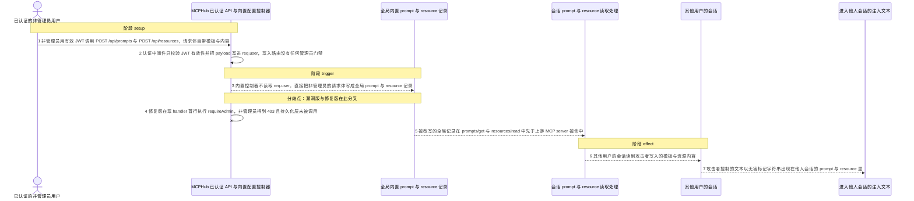

# mcphub / CVE-2026-79745

状态：草稿，未完成环境和复现。这个目录由模板生成，不构成漏洞确认。

图解的唯一来源是 `diagram.toml`：编辑后运行 `python3 -m runner diagram mcphub/CVE-2026-79745` 重新生成下方的图解区块。图解必须覆盖漏洞涉及的每个主体，并标出漏洞版/修复版的分歧步骤。

<!-- diagram:begin (generated from diagram.toml by `python3 -m runner diagram`; edit diagram.toml, not this block) -->
## 漏洞图解 — mcphub / CVE-2026-79745 漏洞图解

MCPHub 把内置 prompt 与 resource 的创建、更新、删除路由挂在只校验 JWT 的已认证 router 上，而对应控制器既不读取 req.user 也没有管理员门禁，任何已认证的非管理员因此都能改写全局模板与资源记录。修复版在三个写 handler 首行调用 requireAdmin，非管理员收到 403 且持久化层不被触碰。被改写的全局记录会在所有会话的 prompts/get 与 resources/read 中被优先命中，把攻击者控制的文本送进其他用户的 LLM 会话，形成存储型 prompt 注入。

### 涉及主体

| 主体 | 类型 | 信任级别 | 在漏洞里的作用 | 来源 |
| --- | --- | --- | --- | --- |
| 已认证的非管理员用户 (`attacker`) | `actor` | `attacker_controlled` | 持有效 JWT，控制发给 POST /api/prompts 与 POST /api/resources 的请求体：模板文本、资源 URI 与内容。它想要改写的全局配置本来不属于它的管理权限。 | fixtures/attack.json |
| MCPHub 已认证 API 与内置配置控制器 (`hub_api`) | `service` | `trusted` | 认证中间件只校验 JWT 是否有效并把 payload 写进 req.user；内置 prompt/resource 的写入路由没有任何管理员中间件，控制器也不读取 req.user，因此管理员身份不影响写入是否发生。 | — |
| 全局内置 prompt 与 resource 记录 (`builtin_store`) | `store` | `trusted` | mcp_settings.json 中由所有会话共享的全局 prompts 与 resources 记录；漏洞版会把非管理员的请求体直接写进这里，覆盖或新增全局条目。 | fixtures/initial_settings.json |
| 会话 prompt 与 resource 读取处理 (`session_reader`) | `service` | `trusted` | 处理 prompts/get 与 resources/read 时先查内置 DAO，命中且 enabled 的记录就直接返回其模板或内容，不再查询已连接的上游 MCP server。 | — |
| 其他用户的会话 (`victim_session`) | `client` | `trusted` | 另一个已认证用户通过 MCPHub 读取 prompt 与 resource 的会话；它拿到的是被改写后的全局记录内容，而不是管理员维护的版本。 | — |
| ⚠ 进入他人会话的注入文本 (`injected_text`) | `sink` | `trusted` | 被改写的全局模板与资源内容以无害标记字符串的形式出现在其他用户会话里，是全局完整性被未授权破坏的落点。 | — |

**信任边界**

- **非管理员用户侧** (`attacker_side`)：成员 `attacker`。攻击者只能控制自己的 JWT 与这一次请求的请求体；改写全局 prompt/resource 的权限本应属于管理员，不在它这一侧。
- **MCPHub 全局配置边界** (`hub_trust`)：成员 `hub_api`、`builtin_store`、`session_reader`。这道边界要求只有管理员能改全局 prompt 与 resource；漏洞版缺少这一步检查，任何已认证用户都能穿过它写入全局记录。
- **其他用户会话边界** (`victim_side`)：成员 `victim_session`、`injected_text`。其他用户的会话本应只读到管理员维护的全局模板与资源；被污染的全局记录会在这里生效，把攻击者文本当成可信内容使用。

标 ⚠ 的主体是本仓库合成的替身或无害效果载体，不代表真实外部目标。

### 触发过程

### 主体与信任边界

箭头上的数字是上面的步骤编号；方框只标主体和信任级别，具体动作见「触发过程」。

```mermaid
%% mcphub / CVE-2026-79745 漏洞图解 — generated from diagram.toml
flowchart LR
  subgraph attacker_side["非管理员用户侧"]
    attacker["已认证的非管理员用户<br/>actor · attacker_controlled"]
  end
  subgraph hub_trust["MCPHub 全局配置边界"]
    hub_api["MCPHub 已认证 API 与内置配置控制器<br/>service · trusted"]
    builtin_store["全局内置 prompt 与 resource 记录<br/>store · trusted"]
    session_reader["会话 prompt 与 resource 读取处理<br/>service · trusted"]
  end
  subgraph victim_side["其他用户会话边界"]
    victim_session["其他用户的会话<br/>client · trusted"]
    injected_text["进入他人会话的注入文本<br/>⚠ sink · trusted"]
  end
  attacker -->|"1"| hub_api
  hub_api -->|"2"| hub_api
  hub_api -.->|"3"| builtin_store
  hub_api -.->|"4"| hub_api
  builtin_store -.->|"5"| session_reader
  session_reader -.->|"6"| victim_session
  victim_session -.->|"7"| injected_text
  classDef actor fill:transparent,stroke:#b03a6a
  classDef client fill:transparent,stroke:#1565c0
  classDef service fill:transparent,stroke:#5e35b1
  classDef tool fill:transparent,stroke:#ef6c00
  classDef sink fill:transparent,stroke:#c0392b
  classDef store fill:transparent,stroke:#2e7d32
  classDef synthetic stroke-dasharray: 4 2
  class attacker actor
  class hub_api service
  class builtin_store store
  class session_reader service
  class victim_session client
  class injected_text sink
  class injected_text synthetic
  style attacker_side fill:transparent
  style hub_trust fill:transparent
  style victim_side fill:transparent
  linkStyle 2 stroke:#c0392b,stroke-width:2px
  linkStyle 3 stroke:#2e7d32,stroke-width:2px
```

**分歧点**：第 3 步（`vulnerable_only`）内置控制器不读取 req.user，直接把非管理员的请求体写成全局 prompt 与 resource 记录。
**分歧点**：第 4 步（`patched_only`）修复版在写 handler 首行执行 requireAdmin，非管理员得到 403 且持久化层未被调用。
<!-- diagram:end -->

## 公告与机制

TODO：官方公告、漏洞根因、Agent 信任边界、受影响范围和修复来源。

## 前提

TODO：认证要求、用户交互、已有批准、工具权限、攻击者能控制的内容。

## 版本与启动

TODO：补全 metadata、Dockerfile/镜像 digest 和 Compose，再写出精确启动命令。

Compose 中 `vulnerable` 与 `patched` profiles 分开使用；未指定 profile 不启动服务。镜像变量未配置时 Compose 会明确报错。此模板不暴露宿主端口，也不挂载主机数据。

## 机制复现

TODO：实现 `reproduce.py`，固定输入并执行真实漏洞路径，注明运行位置、参数和超时。

完成实现后使用 `python3 -m runner reproduce mcphub/CVE-2026-79745 --build --rounds 3`。
两脚本统一接受 `--context <context.json> --output <目录>`，详细字段见仓库 `docs/environment-contract.md`。
PoC 输出 `facts.json` 和效果文件；验证器只读证据，输出含 `target_ready` 及对应效果断言的 `verdict.json`。
镜像必须包含 Python 3 和 `/lab/` 下的脚本、fixtures；`runtime.mode` 选择 `oneshot` 或有 healthcheck 的 `service`。

## 端到端复现

TODO：实现 `end_to_end.py`；若不需要模型，明确写出不适用原因。真实模型的结果与机制复现分开统计。

## 验证与修复对照

TODO：实现 `verify.py`。记录漏洞版无害效果、修复版阻断和正常任务成功的证据，不能把服务启动失败当成阻断。

## 清理

默认运行器按每个测试的唯一 Compose project 清理容器、网络和 volume。
`--keep-on-failure` 保留失败项目，项目标识和 Compose 配置在结果目录中；仅清理该项目，不能使用全局 prune。

## 失败诊断

TODO：为本漏洞写出预期效果缺失、修复版仍有越界效果、正常任务失败及前提不满足时的具体排查路径。
启动失败、健康检查失败和超时都不能当作修复阻断。报告中应能定位到阶段、预期、实际和受控证据。

## 构建与输入

TODO：填写两版源码 archive、完整 commit，记录 `build.inputs` 中每个下载的 SHA-256；依赖安装必须支持禁网构建。
固定攻击和正常输入放入 `fixtures/` 并登记到 `fixtures/manifest.toml`。固定 seed、环境变量，说明无害效果与真实影响的关系。

## 隔离例外

默认无例外。确需例外时同时填写 `runtime.exceptions`、理由及最小范围，晋升由两位维护者审阅。

## 来源与许可

TODO：列出引用代码、fixtures 和镜像的来源及许可。
