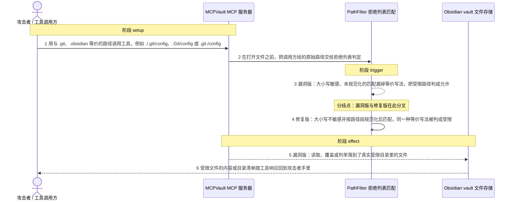
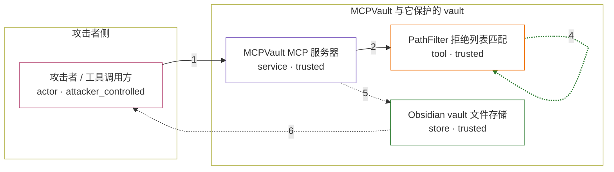

# mcpvault / CVE-2026-57441

状态：草稿，未完成环境和复现。这个目录由模板生成，不构成漏洞确认。

图解的唯一来源是 `diagram.toml`：编辑后运行 `python3 -m runner diagram mcpvault/CVE-2026-57441` 重新生成下方的图解区块。图解必须覆盖漏洞涉及的每个主体，并标出漏洞版/修复版的分歧步骤。

<!-- diagram:begin (generated from diagram.toml by `python3 -m runner diagram`; edit diagram.toml, not this block) -->
## 漏洞图解 — MCPVault PathFilter 受限目录拒绝列表绕过

PathFilter 用大小写敏感、且未做路径规范化的正则去匹配受限目录拒绝列表（.git、.obsidian、node_modules 等），而 MCPVault 的读取、写入、移动、搜索和列目录都必须先过这道判定。攻击者只要在工具调用的路径参数里改用与受限目录等价的名字——大小写变体（.Git/config）、Windows 尾随点或空格（.git./config、.git /config），或 POSIX 下完全等价的 ./ 前缀（./.git/config）——拒绝列表就匹配不到，判定返回允许。服务器随后把这个路径解析到真实受限文件，受限内容被读出、覆盖或列举，并随工具响应回到攻击者。0.11.4 给正则加上 i 标志，并在匹配前按路径段剥离尾随点/空格、丢弃空段与 . 段，等价写法一律被拒。

### 涉及主体

| 主体 | 类型 | 信任级别 | 在漏洞里的作用 | 来源 |
| --- | --- | --- | --- | --- |
| 攻击者 / 工具调用方 (`attacker`) | `actor` | `attacker_controlled` | 构造 MCP 工具调用的路径参数，只用与受限目录等价的写法；它看不到也改不了 vault 内的目录结构，能控制的只有这一次调用的 path 参数。 | fixtures/attack.json |
| MCPVault MCP 服务器 (`mcp_server`) | `service` | `trusted` | 把 read_note / write_note / move_file / search / list_directory 请求转成文件操作，并在打开文件前调用 PathFilter 判定路径是否受限；它信任这次判定，不重复做规范化。 | — |
| PathFilter 拒绝列表匹配 (`path_filter`) | `tool` | `trusted` | 用硬编码的受限目录拒绝列表逐条匹配路径。漏洞版的 simpleGlobMatch 编译出大小写敏感的正则、且直接用未规范化的原始路径匹配；修复版加 i 标志，并新增 canonicalizeForMatch 按路径段剥离尾随点/空格、丢弃空段与 . 段后再次匹配。 | — |
| Obsidian vault 文件存储 (`vault`) | `store` | `trusted` | 被服务的 vault 存储；.git、.obsidian 等受限目录位于其中，其中含有本不该被工具调用方读到的内容，本应由拒绝列表在打开文件前挡住。 | — |

**信任边界**

- **攻击者侧** (`attacker_side`)：成员 `attacker`。攻击者能控制的只有工具调用的 path 参数；vault 里的目录结构、受限文件是否存在，都是环境既有前提而不是攻击动作。
- **MCPVault 与它保护的 vault** (`product`)：成员 `mcp_server`、`path_filter`、`vault`。这道边界本应由受限目录拒绝列表守住：任何指向 .git、.obsidian 的访问都应在打开文件前被拒绝。漏洞让它失效——判定把等价写法当成合法路径放行，服务器随后就打开真实受限文件。

### 触发过程

### 主体与信任边界

箭头上的数字是上面的步骤编号；方框只标主体和信任级别，具体动作见「触发过程」。

**分歧点**：第 3 步（`vulnerable_only`）漏洞版：大小写敏感、未规范化的匹配漏掉等价写法，把受限路径判成允许。
**分歧点**：第 4 步（`patched_only`）修复版：大小写不敏感并按路径段规范化后匹配，同一种等价写法被判成受限。
<!-- diagram:end -->

## 公告与机制

TODO：官方公告、漏洞根因、Agent 信任边界、受影响范围和修复来源。

## 前提

TODO：认证要求、用户交互、已有批准、工具权限、攻击者能控制的内容。

## 版本与启动

TODO：补全 metadata、Dockerfile/镜像 digest 和 Compose，再写出精确启动命令。

Compose 中 `vulnerable` 与 `patched` profiles 分开使用；未指定 profile 不启动服务。镜像变量未配置时 Compose 会明确报错。此模板不暴露宿主端口，也不挂载主机数据。

## 机制复现

TODO：实现 `reproduce.py`，固定输入并执行真实漏洞路径，注明运行位置、参数和超时。

完成实现后使用 `python3 -m runner reproduce mcpvault/CVE-2026-57441 --build --rounds 3`。
两脚本统一接受 `--context <context.json> --output <目录>`，详细字段见仓库 `docs/environment-contract.md`。
PoC 输出 `facts.json` 和效果文件；验证器只读证据，输出含 `target_ready` 及对应效果断言的 `verdict.json`。
镜像必须包含 Python 3 和 `/lab/` 下的脚本、fixtures；`runtime.mode` 选择 `oneshot` 或有 healthcheck 的 `service`。

## 端到端复现

TODO：实现 `end_to_end.py`；若不需要模型，明确写出不适用原因。真实模型的结果与机制复现分开统计。

## 验证与修复对照

TODO：实现 `verify.py`。记录漏洞版无害效果、修复版阻断和正常任务成功的证据，不能把服务启动失败当成阻断。

## 清理

默认运行器按每个测试的唯一 Compose project 清理容器、网络和 volume。
`--keep-on-failure` 保留失败项目，项目标识和 Compose 配置在结果目录中；仅清理该项目，不能使用全局 prune。

## 失败诊断

TODO：为本漏洞写出预期效果缺失、修复版仍有越界效果、正常任务失败及前提不满足时的具体排查路径。
启动失败、健康检查失败和超时都不能当作修复阻断。报告中应能定位到阶段、预期、实际和受控证据。

## 构建与输入

TODO：填写两版源码 archive、完整 commit，记录 `build.inputs` 中每个下载的 SHA-256；依赖安装必须支持禁网构建。
固定攻击和正常输入放入 `fixtures/` 并登记到 `fixtures/manifest.toml`。固定 seed、环境变量，说明无害效果与真实影响的关系。

## 隔离例外

默认无例外。确需例外时同时填写 `runtime.exceptions`、理由及最小范围，晋升由两位维护者审阅。

## 来源与许可

TODO：列出引用代码、fixtures 和镜像的来源及许可。
