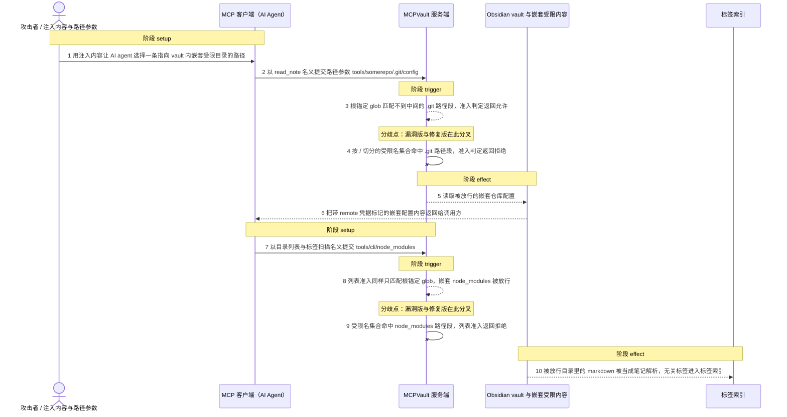
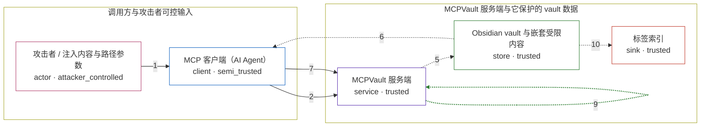

# mcpvault / CVE-2026-57442

状态：草稿，未完成环境和复现。这个目录由模板生成，不构成漏洞确认。

图解的唯一来源是 `diagram.toml`：编辑后运行 `python3 -m runner diagram mcpvault/CVE-2026-57442` 重新生成下方的图解区块。图解必须覆盖漏洞涉及的每个主体，并标出漏洞版/修复版的分歧步骤。

<!-- diagram:begin (generated from diagram.toml by `python3 -m runner diagram`; edit diagram.toml, not this block) -->
## 漏洞图解 — mcpvault / CVE-2026-57442 漏洞图解

MCPVault 的 PathFilter 只用根锚定的 glob 匹配整条路径（node_modules/**、.git、.obsidian），因此 tools/somerepo/.git/config、vaults/nested/.obsidian/secrets.md 这类嵌套受限路径不会被拒绝。准入边界因此在任意深度上失效：漏洞版把嵌套仓库元数据与插件配置读给调用方，并让列表与标签扫描遍历嵌套 node_modules。修复版改为按 / 切分路径段、小写归一后比对受限名集合，同一输入被拒绝。

### 涉及主体

| 主体 | 类型 | 信任级别 | 在漏洞里的作用 | 来源 |
| --- | --- | --- | --- | --- |
| 攻击者 / 注入内容与路径参数 (`attacker`) | `actor` | `attacker_controlled` | 构造间接注入内容，让 AI agent 以 read_note 或目录列表调用提交一条指向 vault 内嵌套受限目录的路径。攻击者只能控制这次调用的路径参数，拿不到 vault 文件本身。 | — |
| MCP 客户端（AI Agent） (`agent`) | `client` | `semi_trusted` | 把注入内容翻译成 MCPVault 工具调用，把攻击者选定的路径原样转交给服务端，并接收服务端返回的内容。 | — |
| MCPVault 服务端 (`mcpvault`) | `service` | `trusted` | 受影响的上游组件。它在读写笔记、列目录和扫描标签之前先问 PathFilter 是否放行，本漏洞就在这段准入判定里。 | — |
| Obsidian vault 与嵌套受限内容 (`vault`) | `store` | `trusted` | 攻击者够不着的目标数据：笔记之外还嵌套着 somerepo/.git/config（含 remote 凭据）以及 node_modules 里被当成文档解析的 markdown。 | fixtures/vault_tree.json |
| 标签索引 (`tag_index`) | `sink` | `trusted` | listAllTags 递归扫描后得到的标签集合；嵌套 node_modules 未被剪枝时，其中的 markdown 会把无关标签写进这里。 | — |

**信任边界**

- **调用方与攻击者可控输入** (`client_side`)：成员 `attacker`、`agent`。攻击者只能影响这次工具调用的路径参数与注入文本，不能直接读取或改写 vault 内容。
- **MCPVault 服务端与它保护的 vault 数据** (`product`)：成员 `mcpvault`、`vault`、`tag_index`。边界内侧的仓库元数据、插件配置和依赖目录本应被 PathFilter 拒绝；漏洞让拒绝只在 vault 根级生效，嵌套深度不受保护。

### 触发过程

### 主体与信任边界

箭头上的数字是上面的步骤编号；方框只标主体和信任级别，具体动作见「触发过程」。

**分歧点**：第 3 步（`vulnerable_only`）根锚定 glob 匹配不到中间的 .git 路径段，准入判定返回允许。
**分歧点**：第 4 步（`patched_only`）按 / 切分的受限名集合命中 .git 路径段，准入判定返回拒绝。
**分歧点**：第 8 步（`vulnerable_only`）列表准入同样只匹配根锚定 glob，嵌套 node_modules 被放行。
**分歧点**：第 9 步（`patched_only`）受限名集合命中 node_modules 路径段，列表准入返回拒绝。
<!-- diagram:end -->

## 公告与机制

TODO：官方公告、漏洞根因、Agent 信任边界、受影响范围和修复来源。

## 前提

TODO：认证要求、用户交互、已有批准、工具权限、攻击者能控制的内容。

## 版本与启动

TODO：补全 metadata、Dockerfile/镜像 digest 和 Compose，再写出精确启动命令。

Compose 中 `vulnerable` 与 `patched` profiles 分开使用；未指定 profile 不启动服务。镜像变量未配置时 Compose 会明确报错。此模板不暴露宿主端口，也不挂载主机数据。

## 机制复现

TODO：实现 `reproduce.py`，固定输入并执行真实漏洞路径，注明运行位置、参数和超时。

完成实现后使用 `python3 -m runner reproduce mcpvault/CVE-2026-57442 --build --rounds 3`。
两脚本统一接受 `--context <context.json> --output <目录>`，详细字段见仓库 `docs/environment-contract.md`。
PoC 输出 `facts.json` 和效果文件；验证器只读证据，输出含 `target_ready` 及对应效果断言的 `verdict.json`。
镜像必须包含 Python 3 和 `/lab/` 下的脚本、fixtures；`runtime.mode` 选择 `oneshot` 或有 healthcheck 的 `service`。

## 端到端复现

TODO：实现 `end_to_end.py`；若不需要模型，明确写出不适用原因。真实模型的结果与机制复现分开统计。

## 验证与修复对照

TODO：实现 `verify.py`。记录漏洞版无害效果、修复版阻断和正常任务成功的证据，不能把服务启动失败当成阻断。

## 清理

默认运行器按每个测试的唯一 Compose project 清理容器、网络和 volume。
`--keep-on-failure` 保留失败项目，项目标识和 Compose 配置在结果目录中；仅清理该项目，不能使用全局 prune。

## 失败诊断

TODO：为本漏洞写出预期效果缺失、修复版仍有越界效果、正常任务失败及前提不满足时的具体排查路径。
启动失败、健康检查失败和超时都不能当作修复阻断。报告中应能定位到阶段、预期、实际和受控证据。

## 构建与输入

TODO：填写两版源码 archive、完整 commit，记录 `build.inputs` 中每个下载的 SHA-256；依赖安装必须支持禁网构建。
固定攻击和正常输入放入 `fixtures/` 并登记到 `fixtures/manifest.toml`。固定 seed、环境变量，说明无害效果与真实影响的关系。

## 隔离例外

默认无例外。确需例外时同时填写 `runtime.exceptions`、理由及最小范围，晋升由两位维护者审阅。

## 来源与许可

TODO：列出引用代码、fixtures 和镜像的来源及许可。
