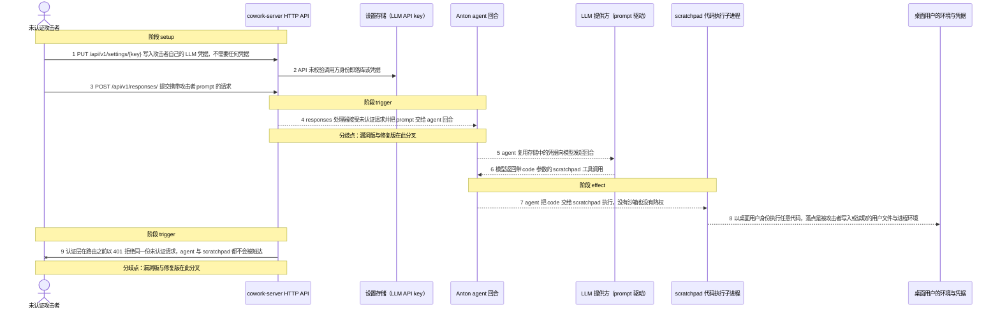
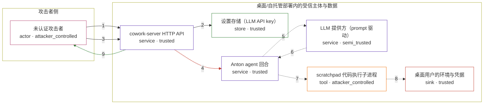

# minds-platform / CVE-2026-73678

状态：草稿，未完成环境和复现。这个目录由模板生成，不构成漏洞确认。

图解的唯一来源是 `diagram.toml`：编辑后运行 `python3 -m runner diagram minds-platform/CVE-2026-73678` 重新生成下方的图解区块。图解必须覆盖漏洞涉及的每个主体，并标出漏洞版/修复版的分歧步骤。

<!-- diagram:begin (generated from diagram.toml by `python3 -m runner diagram`; edit diagram.toml, not this block) -->
## 漏洞图解 — minds-platform / CVE-2026-73678 未认证 RCE（scratchpad exec）

Minds Platform 默认以本地桌面模式运行，require_auth 默认关闭，/api/v1/responses/ 与 /api/v1/settings/{key} 都不校验任何凭据。攻击者无需登录即可写入自己的 LLM 凭据，并把一个 prompt 送进 agent；模型按 prompt 返回 scratchpad 工具调用，agent 的 scratchpad 子进程对模型给出的 Python 源码直接 compile()+exec()，既无沙箱也不降权。于是任意未认证请求等价于以桌面用户身份执行任意代码；修复把同一份请求挡在 bearer token 认证层之外。

### 涉及主体

| 主体 | 类型 | 信任级别 | 在漏洞里的作用 | 来源 |
| --- | --- | --- | --- | --- |
| 未认证攻击者 (`attacker`) | `actor` | `attacker_controlled` | 只需要能访问 127.0.0.1（或自托管时的 0.0.0.0 监听端口）的 HTTP 客户端；控制请求体里的 prompt，以及 PUT /api/v1/settings/{key} 写入的 LLM 凭据。它拿不到桌面用户的文件与凭据，这正是它要绕过边界去取的东西。 | fixtures/request_attack.json |
| cowork-server HTTP API (`api`) | `service` | `trusted` | FastAPI 应用。/api/v1/responses/ 与 /api/v1/settings/{key} 在漏洞修订上没有任何权限依赖，BearerTokenMiddleware 也只在 require_auth 为真时才被 create_app() 装配，因此默认本地模式下这两个入口对任何人开放。 | — |
| 设置存储（LLM API key） (`key_store`) | `store` | `trusted` | 持有 agent 运行所需的模型凭据。未认证的 PUT /api/v1/settings/{key} 允许攻击者覆盖它，从而让 agent 按攻击者指定的模型与端点工作。 | fixtures/request_attack.json |
| Anton agent 回合 (`agent`) | `service` | `trusted` | 把 prompt、历史与工具列表交给模型，收到 scratchpad 工具调用后走自己的工具分发路径，把 code 参数交给 scratchpad 执行。它本身不校验调用方身份，身份边界完全由 HTTP 层负责。 | fixtures/model_attack.json |
| LLM 提供方（prompt 驱动） (`model`) | `service` | `semi_trusted` | 按 prompt 决定是否发起 scratchpad 工具调用；它是把攻击者的自然语言指令变成 code 参数的一环，因此不构成一道安全边界。 | — |
| scratchpad 代码执行子进程 (`sandbox`) | `tool` | `attacker_controlled` | 按设计执行模型给出的任意 Python：compile(code, 'scratchpad', 'exec') 后 exec(compiled, namespace)，没有沙箱、没有降权、没有能力限制。 | fixtures/model_attack.json |
| 桌面用户的环境与凭据 (`environment`) | `sink` | `trusted` | 代码以启动桌面应用的用户身份运行，能读写该用户的文件（SSH key、配置、项目数据）并取用进程环境变量。这里是漏洞效果落点，也是攻击者本来够不着的资源。 | — |

**信任边界**

- **攻击者侧** (`attacker_side`)：成员 `attacker`。攻击者只有网络可达性与请求体控制权；它既没有桌面用户的文件权限，也拿不到进程内的凭据。
- **桌面/自托管部署内的受信主体与数据** (`product`)：成员 `api`、`key_store`、`agent`、`model`、`sandbox`、`environment`。这道边界原本由 HTTP 认证层把守：只有持 bearer token 的调用方才能进入 agent。漏洞修订默认不装配认证层，未认证请求直接落到 responses 处理器，边界因此形同虚设。

### 触发过程

### 主体与信任边界

箭头上的数字是上面的步骤编号；方框只标主体和信任级别，具体动作见「触发过程」。

**分歧点**：第 4 步（`vulnerable_only`）responses 处理器接受未认证请求并把 prompt 交给 agent 回合。
**分歧点**：第 9 步（`patched_only`）认证层在路由之前以 401 拒绝同一份未认证请求，agent 与 scratchpad 都不会被触达。
<!-- diagram:end -->

## 公告与机制

TODO：官方公告、漏洞根因、Agent 信任边界、受影响范围和修复来源。

## 前提

TODO：认证要求、用户交互、已有批准、工具权限、攻击者能控制的内容。

## 版本与启动

TODO：补全 metadata、Dockerfile/镜像 digest 和 Compose，再写出精确启动命令。

Compose 中 `vulnerable` 与 `patched` profiles 分开使用；未指定 profile 不启动服务。镜像变量未配置时 Compose 会明确报错。此模板不暴露宿主端口，也不挂载主机数据。

## 机制复现

TODO：实现 `reproduce.py`，固定输入并执行真实漏洞路径，注明运行位置、参数和超时。

完成实现后使用 `python3 -m runner reproduce minds-platform/CVE-2026-73678 --build --rounds 3`。
两脚本统一接受 `--context <context.json> --output <目录>`，详细字段见仓库 `docs/environment-contract.md`。
PoC 输出 `facts.json` 和效果文件；验证器只读证据，输出含 `target_ready` 及对应效果断言的 `verdict.json`。
镜像必须包含 Python 3 和 `/lab/` 下的脚本、fixtures；`runtime.mode` 选择 `oneshot` 或有 healthcheck 的 `service`。

## 端到端复现

TODO：实现 `end_to_end.py`；若不需要模型，明确写出不适用原因。真实模型的结果与机制复现分开统计。

## 验证与修复对照

TODO：实现 `verify.py`。记录漏洞版无害效果、修复版阻断和正常任务成功的证据，不能把服务启动失败当成阻断。

## 清理

默认运行器按每个测试的唯一 Compose project 清理容器、网络和 volume。
`--keep-on-failure` 保留失败项目，项目标识和 Compose 配置在结果目录中；仅清理该项目，不能使用全局 prune。

## 失败诊断

TODO：为本漏洞写出预期效果缺失、修复版仍有越界效果、正常任务失败及前提不满足时的具体排查路径。
启动失败、健康检查失败和超时都不能当作修复阻断。报告中应能定位到阶段、预期、实际和受控证据。

## 构建与输入

TODO：填写两版源码 archive、完整 commit，记录 `build.inputs` 中每个下载的 SHA-256；依赖安装必须支持禁网构建。
固定攻击和正常输入放入 `fixtures/` 并登记到 `fixtures/manifest.toml`。固定 seed、环境变量，说明无害效果与真实影响的关系。

## 隔离例外

默认无例外。确需例外时同时填写 `runtime.exceptions`、理由及最小范围，晋升由两位维护者审阅。

## 来源与许可

TODO：列出引用代码、fixtures 和镜像的来源及许可。
