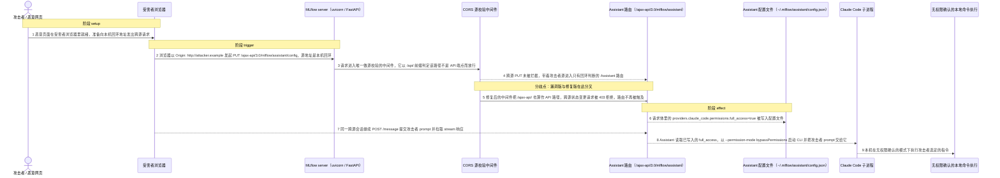

# mlflow / CVE-2026-2611

状态：草稿，环境与复现尚未完成验收。图解、攻击输入与机制 PoC 已写出，构建内容仍待 `build` 阶段补全，不构成漏洞确认。

图解的唯一来源是 `diagram.toml`：编辑后运行 `python3 -m runner diagram mlflow/CVE-2026-2611` 重新生成下方的图解区块。图解必须覆盖漏洞涉及的每个主体，并标出漏洞版/修复版的分歧步骤。

<!-- diagram:begin (generated from diagram.toml by `python3 -m runner diagram`; edit diagram.toml, not this block) -->
## 漏洞图解 — MLflow Assistant /ajax-api 源验证缺失

浏览器里的任意网页可以跨源驱动受害者本机 MLflow server 的 Assistant /ajax-api 接口：这些接口只按 TCP 源地址判断“本机”，而服务端唯一的 Origin 校验中间件只覆盖 /api/ 前缀，于是 /ajax-api/ 状态变更请求既不比对 Origin，又拿到回显攻击者源的 CORS 允许头。攻击者的 PUT 因此写入 providers.claude_code.permissions.full_access=true，随后同一跨源会话提交的 prompt 让 mlflow 以 --permission-mode bypassPermissions 启动本机 Claude Code 子进程，命令在无权限确认的情况下执行。

### 涉及主体

| 主体 | 类型 | 信任级别 | 在漏洞里的作用 | 来源 |
| --- | --- | --- | --- | --- |
| 攻击者 / 恶意网页 (`attacker`) | `actor` | `attacker_controlled` | 编写托管在任意源上的页面，控制其中的脚本、请求方法、路径与请求体；它读不到受害者本机配置，也无法直接连上只监听回环地址的服务。 | fixtures/attack_config_body.json |
| 受害者浏览器 (`victim_browser`) | `client` | `semi_trusted` | 用户访问 MLflow UI 的浏览器，被恶意页面借来发出请求：请求的真实 TCP 源地址是受害者本机回环地址，脚本本身却来自攻击者的源。 | fixtures/attack_message_body.json |
| MLflow server（uvicorn / FastAPI） (`mlflow_server`) | `service` | `trusted` | 受害者本机运行的 mlflow server，Assistant 路由无条件挂载在 /ajax-api/3.0/mlflow/assistant 前缀下，其 HTTP 中间件栈负责 Origin 与 Host 校验。 | mlflow/server/fastapi_app.py |
| CORS 源校验中间件 (`cors_middleware`) | `service` | `trusted` | CORSBlockingMiddleware 是服务端唯一的跨源拦截点：它以 is_api_endpoint(path) 作为门禁，只把 /api/ 前缀算作 API 路径，/ajax-api/ 请求直接从它旁边通过。 | mlflow/server/fastapi_security.py |
| Assistant 路由（/ajax-api/3.0/mlflow/assistant） (`assistant_api`) | `service` | `trusted` | 提供 PUT /config、POST /message 与 GET /sessions/{id}/stream；访问控制只有 _require_localhost 的 ipaddress.is_loopback 判断，无法区分本机 UI 与经受害者浏览器转发的跨源请求。 | mlflow/server/assistant/api.py |
| Assistant 配置文件（~/.mlflow/assistant/config.json） (`assistant_config`) | `store` | `trusted` | 保存 providers.name.permissions 的持久化文件；PUT /config 把请求体里的 full_access 写进去，后续 Assistant 会话读取它决定子进程的权限模式。 | mlflow/assistant/config.py |
| Claude Code 子进程 (`claude_cli`) | `tool` | `trusted` | Assistant 会话真正执行工具的本地 CLI；当配置里 full_access 为真时，mlflow 以 --permission-mode bypassPermissions 启动它，攻击者可控的 prompt 在无权限确认的情况下被当作指令执行。 | mlflow/assistant/providers/claude_code.py |
| ⚠ 无权限确认的本地命令执行 (`full_access`) | `sink` | `attacker_controlled` | 攻击者想要但自己够不到的落点：本机子进程在 bypassPermissions 模式下执行攻击者选定的 prompt。复现用记录 argv 的本地 CLI 载体承接这个无害效果，不产生真实外部影响。 | — |

**信任边界**

- **攻击者页面与受害者浏览器** (`browser_side`)：成员 `attacker`、`victim_browser`。攻击者控制页面内容与请求参数，却控制不了浏览器发出的 TCP 源地址；正是这个由浏览器补齐的回环源地址让服务端把请求当成本机请求。
- **受害者本机（服务信任回环来源）** (`local_host`)：成员 `mlflow_server`、`cors_middleware`、`assistant_api`、`assistant_config`、`claude_cli`、`full_access`。本机边界原本靠 Origin 校验挡住跨源页面：中间件只认 /api/ 前缀，于是 /ajax-api/ 请求既不被拦截，又被回显允许头，边界在 Assistant 这一侧整体失效。

标 ⚠ 的主体是本仓库合成的替身或无害效果载体，不代表真实外部目标。

### 触发过程

### 主体与信任边界

箭头上的数字是上面的步骤编号；方框只标主体和信任级别，具体动作见「触发过程」。

```mermaid
%% MLflow Assistant /ajax-api 源验证缺失 — generated from diagram.toml
flowchart LR
  subgraph browser_side["攻击者页面与受害者浏览器"]
    attacker["攻击者 / 恶意网页<br/>actor · attacker_controlled"]
    victim_browser["受害者浏览器<br/>client · semi_trusted"]
  end
  subgraph local_host["受害者本机（服务信任回环来源）"]
    mlflow_server["MLflow server（uvicorn / FastAPI）<br/>service · trusted"]
    cors_middleware["CORS 源校验中间件<br/>service · trusted"]
    assistant_api["Assistant 路由（/ajax-api/3.0/mlflow/assistant）<br/>service · trusted"]
    assistant_config["Assistant 配置文件（~/.mlflow/assistant/config.json）<br/>store · trusted"]
    claude_cli["Claude Code 子进程<br/>tool · trusted"]
    full_access["无权限确认的本地命令执行<br/>⚠ sink · attacker_controlled"]
  end
  attacker -->|"1"| victim_browser
  victim_browser -->|"2"| mlflow_server
  mlflow_server -->|"3"| cors_middleware
  cors_middleware -.->|"4"| assistant_api
  cors_middleware -.->|"5"| assistant_api
  assistant_api -.->|"6"| assistant_config
  victim_browser -.->|"7"| assistant_api
  assistant_api -.->|"8"| claude_cli
  claude_cli -.->|"9"| full_access
  classDef actor fill:transparent,stroke:#b03a6a
  classDef client fill:transparent,stroke:#1565c0
  classDef service fill:transparent,stroke:#5e35b1
  classDef tool fill:transparent,stroke:#ef6c00
  classDef sink fill:transparent,stroke:#c0392b
  classDef store fill:transparent,stroke:#2e7d32
  classDef synthetic stroke-dasharray: 4 2
  class attacker actor
  class victim_browser client
  class mlflow_server service
  class cors_middleware service
  class assistant_api service
  class assistant_config store
  class claude_cli tool
  class full_access sink
  class full_access synthetic
  style browser_side fill:transparent
  style local_host fill:transparent
  linkStyle 3 stroke:#c0392b,stroke-width:2px
  linkStyle 4 stroke:#2e7d32,stroke-width:2px
```

**分歧点**：第 4 步（`vulnerable_only`）跨源 PUT 未被拦截，带着攻击者源进入只有回环判断的 Assistant 路由。
**分歧点**：第 5 步（`patched_only`）修复后的中间件把 /ajax-api/ 也算作 API 路径，跨源状态变更请求被 403 拒绝，路由不再被触及。
<!-- diagram:end -->

## 公告与机制

- 公告：<https://github.com/advisories/GHSA-67c5-x5mf-rppq>（`CVE-2026-2611`，CRITICAL，CWE-346 Origin Validation Error）。
- 受影响：PyPI `mlflow`，`3.9.0` 引入（Assistant 首次出现）至 `3.10.0` 修复；`3.10.0rc0` 仍含缺陷代码。
- 修复提交：`8f9c8a53af90842944101eb8b7d60706822c81bc`（*Block CORS for ajax paths*），首个修复版本 `v3.10.0`。
- 根因：`mlflow/server/security_utils.py` 的 `is_api_endpoint()` 只匹配 `/api/`，所以 `CORSBlockingMiddleware` 放过了所有 `/ajax-api/` 请求；`mlflow/server/fastapi_security.py` 又把 `CORSMiddleware` 配成 `allow_origins=["*"]` 并回显请求源。Assistant 路由唯一的访问控制是 `_require_localhost` 对 `request.client.host` 的回环判断，浏览器代发的请求源地址就是 `127.0.0.1`，因此该判断无法区分本机 UI 与恶意页面。
- 修复：`is_api_endpoint()` 增加 `/ajax-api/` 前缀（`AJAX_API_PATH_PREFIX`），并把 `CORSMiddleware` 改为只允许 `MLFLOW_SERVER_CORS_ALLOWED_ORIGINS` 与本机源正则。
- Agent 信任边界：本漏洞不需要模型参与；危害链的最后一跳是把攻击者 prompt 交给 `claude` CLI，而 `full_access=true` 会让它以 `--permission-mode bypassPermissions` 启动。

## 前提

- 受害者本机运行 `mlflow server`（FastAPI 入口，Assistant 路由无条件挂载），且 Assistant 功能可用。
- 受害者在同一浏览器里访问任意攻击者页面；攻击者不需要本机写权限、不需要凭据，也不直接连接受害者服务。
- 攻击者只控制自己页面里的请求方法、路径、`Origin` 与请求体。请求到达服务端时的 TCP 源地址是回环地址，这不是攻击者能伪造的，而是浏览器代发的自然结果。
- 完整命令执行需要本机存在已认证的 `claude` CLI；机制复现只验证到「本机子进程被以 bypassPermissions 启动、参数里带攻击者 prompt」，不依赖真实模型。

## 机制复现

`reproduce.py` 不重写任何漏洞函数：它在镜像里加载固定的 mlflow 本体，用 `init_fastapi_security()` 与真实的 `assistant_router` 组装应用，再通过回环地址的 HTTP 客户端发出跨源请求，因此走的是与线上完全相同的中间件栈与路由。

- 攻击场景（`fixtures/attack_config_body.json`、`attack_message_body.json`）：`Origin: http://attacker.example` 的 `PUT /ajax-api/3.0/mlflow/assistant/config` → `POST /message` → `GET /sessions/{id}/stream`。
- 正常场景（`fixtures/benign_config_body.json`、`benign_message_body.json`）：`Origin: http://localhost:3000` 的同一组请求，`full_access` 保持 `false`。
- 观察点：产品返回的状态码与 `Access-Control-Allow-Origin`、`~/.mlflow/assistant/config.json` 的内容，以及 `claude` 载体记录的 argv；`fixtures/claude_cli_stub.py` 在构建时安装为 `/usr/local/bin/claude`。
- 运行位置与参数：容器内 `python3 /lab/reproduce.py --context /lab/results/context.json --output /lab/results`，`runtime.mode = "oneshot"`。
- 固定 seed 与随机性无关：会话 ID 由产品生成，不参与任何判定。

## 端到端复现

`end_to_end.py` 不适用：本漏洞的机制判定不需要真实模型或已认证 CLI，`runtime.requires_model = false`。真实 `claude` CLI 的调用结果属于外部实验工具链，与机制结果分开统计。

## 验证与修复对照

`verify.py` 只读 `facts.json`、`observation.json` 与效果文件，不重跑攻击：

- `vulnerable_effect_observed`：跨源 PUT 为 `200`、回显攻击者源、`config.json` 出现 `full_access=true`、CLI 参数含 `--permission-mode bypassPermissions`。
- `patched_effect_blocked`：跨源 PUT 为 `403` 且 body 为 `Cross-origin request blocked`、无回显、配置未被写入、CLI 子进程未启动；跨源 `POST /message` 同样被拒。
- `benign_task_passed`：本机源请求在两版都返回 `200`，配置按请求写入且 `full_access=false`，CLI 以受限工具白名单启动而不是 bypassPermissions。
- 服务启动失败、超时或缺少证据都不能算作修复阻断；verdict 必须与 `facts.json`/`observation.json` 的哈希证据一致。

## 清理

默认运行器按每个测试的唯一 Compose project 清理容器、网络和 volume。
`--keep-on-failure` 保留失败项目，项目标识和 Compose 配置在结果目录中；仅清理该项目，不能使用全局 prune。

## 失败诊断

- 漏洞版攻击缺少效果：确认镜像里的 mlflow 版本是 `3.9.0` 且 `is_api_endpoint` 不含 `/ajax-api/`；再确认请求确实带 `Origin` 且 `PUT` 是状态变更方法。
- 修复版仍有跨源效果：确认镜像里是 `3.10.0`，且 `init_fastapi_security()` 真的被调用（未设置 `MLFLOW_SERVER_DISABLE_SECURITY_MIDDLEWARE=true`）。
- 正常任务失败：检查本机源是否与 `LOCALHOST_ORIGIN_PATTERNS` 匹配；不匹配时整个复现都应判失败，不能把服务不可用当成阻断。
- CLI 未启动：检查 `/usr/local/bin/claude` 是否可执行、`LAB_CLAUDE_ARGV_LOG` 是否指向可写的输出目录。
- 报告中应能定位阶段、预期、实际与受控证据；启动失败、健康检查失败和超时都不算修复阻断。

## 构建与输入

`build` 阶段待补：`build.inputs` 的完整清单（源码归档 + 全部依赖 wheel + 基础镜像 digest）与 `Dockerfile` 尚未落地，本节只记录已核对的事实与约定。

- 源码归档（vulnerable `3.9.0` / patched `3.10.0`）与对应 40 位 commit 见「版本与启动」；sdist 与 wheel 的 SHA-256 见 `research/public.md`。
- 固定攻击与正常输入已放入 `fixtures/` 并登记到 `fixtures/manifest.toml`；攻击源 `http://attacker.example`、本机源 `http://localhost:3000` 均为固定常量。
- 无害效果说明：最后一跳用记录 argv 的本地 CLI 载体承接，只产生「参数里出现 `--permission-mode bypassPermissions` 与攻击者 prompt」这一可核查事实，不执行真实外部命令、不产生真实模型调用。
- 依赖安装必须支持禁网构建；镜像需提供 Python 3 与 `/lab/` 下的脚本、fixtures，以及 `/usr/local/bin/claude`。

## 隔离例外

默认无例外。确需例外时同时填写 `runtime.exceptions`、理由及最小范围，晋升由两位维护者审阅。

## 来源与许可

- 上游：`https://github.com/mlflow/mlflow`（Apache-2.0），版本归档来自 PyPI 发行包（sdist/wheel 的 SHA-256 见 `research/public.md`）。
- 引用源码：`mlflow/server/security_utils.py`、`mlflow/server/fastapi_security.py`、`mlflow/server/fastapi_app.py`、`mlflow/server/assistant/api.py`、`mlflow/assistant/config.py`、`mlflow/assistant/providers/claude_code.py`。
- 公告与报告：GHSA-67c5-x5mf-rppq、NVD CVE-2026-2611、Huntr bounty `8462addd-b464-4a84-b6a2-5529604e6e5a`。
- fixtures 全部为本环境合成的固定输入与本地 CLI 载体，不含真实凭据、真实用户数据或宿主路径。
