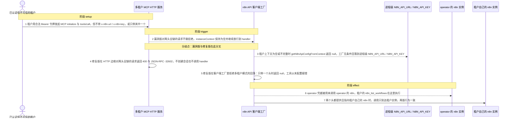
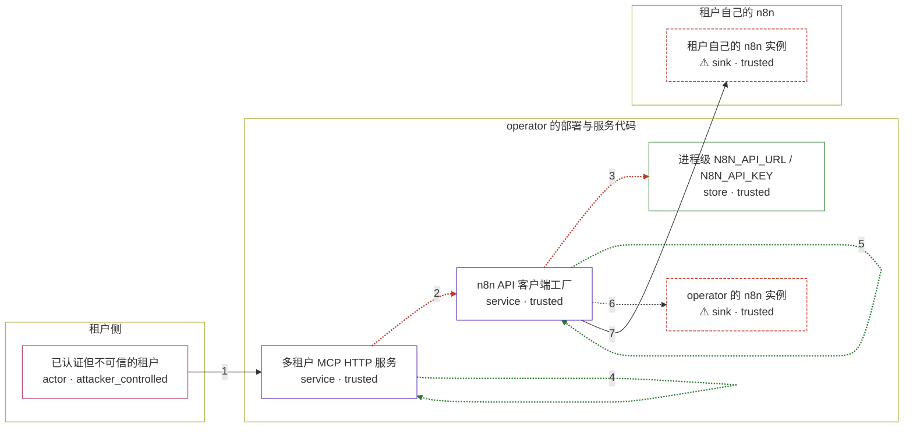

# n8n-mcp / CVE-2026-45707

状态：草稿，未完成环境和复现。这个目录由模板生成，不构成漏洞确认。

图解的唯一来源是 `diagram.toml`：编辑后运行 `python3 -m runner diagram n8n-mcp/CVE-2026-45707` 重新生成下方的图解区块。图解必须覆盖漏洞涉及的每个主体，并标出漏洞版/修复版的分歧步骤。

<!-- diagram:begin (generated from diagram.toml by `python3 -m runner diagram`; edit diagram.toml, not this block) -->
## 漏洞图解 — n8n-mcp 多租户请求回落到进程级 n8n 凭据

n8n-mcp 的多租户 HTTP 服务本应按请求头 x-n8n-url / x-n8n-key 为每个租户选择目标 n8n，进程级 N8N_API_URL / N8N_API_KEY 只属于部署者自己的 operator 实例。漏洞版对缺少租户头、或只带其中一个头的已认证请求不做拒绝，空或不完整的 instanceContext 被放行到 n8n API 客户端工厂，工厂随即回落到进程级凭据，用 operator 的 n8n 执行租户的工具调用。修复版在 HTTP 边缘拒绝两头全缺的请求，并在工厂函数里拒绝多租户模式下的任何进程级回落。

### 涉及主体

| 主体 | 类型 | 信任级别 | 在漏洞里的作用 | 来源 |
| --- | --- | --- | --- | --- |
| 已认证但不可信的租户 (`attacker`) | `actor` | `attacker_controlled` | 持有合法 Bearer 令牌的租户；它只能控制自己发出的 MCP 请求里带哪些 x-n8n-* 头，不能读取部署者的凭据。 | — |
| 多租户 MCP HTTP 服务 (`mcp_gateway`) | `service` | `trusted` | POST /mcp 的入口：认证请求、提取 x-n8n-url 与 x-n8n-key、构造 instanceContext，然后把请求交给 handler。 | src/http-server-single-session.ts |
| n8n API 客户端工厂 (`client_factory`) | `service` | `trusted` | getN8nApiClient 依据 instanceContext 构造 n8n API 客户端；上下文不完整时它必须拒绝，而不是改用进程级配置。 | src/mcp/handlers-n8n-manager.ts |
| 进程级 N8N_API_URL / N8N_API_KEY (`operator_config`) | `store` | `trusted` | 部署者自己 n8n 的地址与 API key，属于 operator 而非任何租户；多租户模式下它本不该被租户请求选中。 | src/config/n8n-api.ts |
| ⚠ operator 的 n8n 实例 (`operator_n8n`) | `sink` | `trusted` | 漏洞效果的落点：租户的工具调用用 operator 凭据在这里执行，从而读写 operator 的 workflow、execution 与 credential 元数据。 | — |
| ⚠ 租户自己的 n8n 实例 (`tenant_n8n`) | `sink` | `trusted` | 租户头完整时应到达的目标；两版都必须只用租户自己的凭据访问这里。 | — |

**信任边界**

- **租户侧** (`tenant_side`)：成员 `attacker`。租户只能控制自己的 MCP 请求内容与自己的 n8n 地址和 key，够不到进程级 N8N_API_KEY 和 operator 的 n8n。
- **operator 的部署与服务代码** (`operator_side`)：成员 `mcp_gateway`、`client_factory`、`operator_config`、`operator_n8n`。这道边界本应保证租户请求只会用租户上下文选出的凭据；漏洞让缺失或不完整的租户上下文回落到边界内的进程级凭据。
- **租户自己的 n8n** (`tenant_instance`)：成员 `tenant_n8n`。租户头完整时请求应当只到达这里，漏洞版与修复版在这一点上行为一致。

标 ⚠ 的主体是本仓库合成的替身或无害效果载体，不代表真实外部目标。

### 触发过程

### 主体与信任边界

箭头上的数字是上面的步骤编号；方框只标主体和信任级别，具体动作见「触发过程」。

**分歧点**：第 2 步（`vulnerable_only`）漏洞版对两头全缺的请求不做拒绝，instanceContext 保持为空并继续放行到 handler。
**分歧点**：第 3 步（`vulnerable_only`）租户上下文为空或不完整时 getN8nApiConfigFromContext 返回 null，工厂无条件回落到进程级 N8N_API_URL / N8N_API_KEY。
**分歧点**：第 4 步（`patched_only`）修复版在 HTTP 边缘对两头全缺的请求返回 400 与 JSON-RPC -32602，不创建会话也不调用 handler。
**分歧点**：第 5 步（`patched_only`）修复版在客户端工厂里拒绝多租户模式的回落：只带一个头时返回 null，工具以未配置报错。
<!-- diagram:end -->

## 公告与机制

TODO：官方公告、漏洞根因、Agent 信任边界、受影响范围和修复来源。

## 前提

TODO：认证要求、用户交互、已有批准、工具权限、攻击者能控制的内容。

## 版本与启动

TODO：补全 metadata、Dockerfile/镜像 digest 和 Compose，再写出精确启动命令。

Compose 中 `vulnerable` 与 `patched` profiles 分开使用；未指定 profile 不启动服务。镜像变量未配置时 Compose 会明确报错。此模板不暴露宿主端口，也不挂载主机数据。

## 机制复现

TODO：实现 `reproduce.py`，固定输入并执行真实漏洞路径，注明运行位置、参数和超时。

完成实现后使用 `python3 -m runner reproduce n8n-mcp/CVE-2026-45707 --build --rounds 3`。
两脚本统一接受 `--context <context.json> --output <目录>`，详细字段见仓库 `docs/environment-contract.md`。
PoC 输出 `facts.json` 和效果文件；验证器只读证据，输出含 `target_ready` 及对应效果断言的 `verdict.json`。
镜像必须包含 Python 3 和 `/lab/` 下的脚本、fixtures；`runtime.mode` 选择 `oneshot` 或有 healthcheck 的 `service`。

## 端到端复现

TODO：实现 `end_to_end.py`；若不需要模型，明确写出不适用原因。真实模型的结果与机制复现分开统计。

## 验证与修复对照

TODO：实现 `verify.py`。记录漏洞版无害效果、修复版阻断和正常任务成功的证据，不能把服务启动失败当成阻断。

## 清理

默认运行器按每个测试的唯一 Compose project 清理容器、网络和 volume。
`--keep-on-failure` 保留失败项目，项目标识和 Compose 配置在结果目录中；仅清理该项目，不能使用全局 prune。

## 失败诊断

TODO：为本漏洞写出预期效果缺失、修复版仍有越界效果、正常任务失败及前提不满足时的具体排查路径。
启动失败、健康检查失败和超时都不能当作修复阻断。报告中应能定位到阶段、预期、实际和受控证据。

## 构建与输入

TODO：填写两版源码 archive、完整 commit，记录 `build.inputs` 中每个下载的 SHA-256；依赖安装必须支持禁网构建。
固定攻击和正常输入放入 `fixtures/` 并登记到 `fixtures/manifest.toml`。固定 seed、环境变量，说明无害效果与真实影响的关系。

## 隔离例外

默认无例外。确需例外时同时填写 `runtime.exceptions`、理由及最小范围，晋升由两位维护者审阅。

## 来源与许可

TODO：列出引用代码、fixtures 和镜像的来源及许可。
