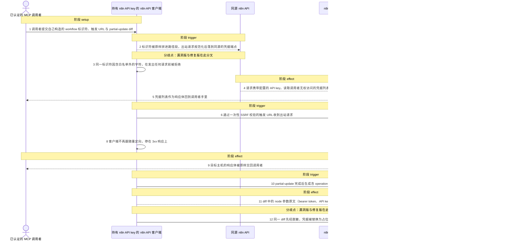
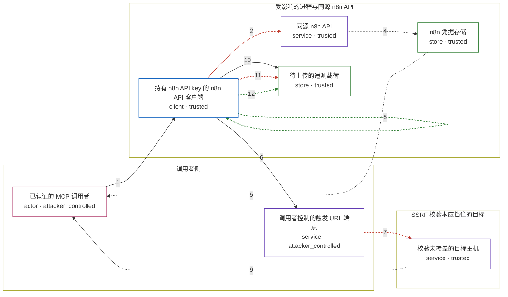

# n8n-mcp / GHSA-8G7G-HMWM-6RV2

状态：草稿，未完成环境和复现。这个目录由模板生成，不构成漏洞确认。

图解的唯一来源是 `diagram.toml`：编辑后运行 `python3 -m runner diagram n8n-mcp/GHSA-8G7G-HMWM-6RV2` 重新生成下方的图解区块。图解必须覆盖漏洞涉及的每个主体，并标出漏洞版/修复版的分歧步骤。

<!-- diagram:begin (generated from diagram.toml by `python3 -m runner diagram`; edit diagram.toml, not this block) -->
## 漏洞图解 — n8n-mcp 路径段穿越、跟随重定向 SSRF 与遥测载荷暴露

n8n-mcp 的三处输入处理缺陷都缺少必要的边界检查：调用者给出的 workflow 标识符被原样拼进 n8n API 请求的路径段，使携带配置 API key 的同源请求规范化后落到 /credentials，返回调用者本无权读取的凭据列表；通过一次性 SSRF 校验的触发 URL 仍按 axios 默认设置跟随 302，把出站请求转交到校验从未覆盖的主机，并把该主机的响应体交回调用者；partial-update 的 operation diff 未经脱敏就进入默认开启的遥测载荷，node 参数里的 bearer token、API key 会随之离开进程。

### 涉及主体

| 主体 | 类型 | 信任级别 | 在漏洞里的作用 | 来源 |
| --- | --- | --- | --- | --- |
| 已认证的 MCP 调用者 (`caller`) | `actor` | `attacker_controlled` | 构造本次调用提交的 workflow 标识符、触发 URL 与 partial-update diff；它只能控制调用参数，拿不到同源凭据列表、校验外主机的响应和遥测载荷。 | fixtures/inputs.json |
| 调用者控制的触发 URL 端点 (`caller_endpoint`) | `service` | `attacker_controlled` | 调用者自己提供的 webhook 接收端；初始 URL 能通过一次性的 SSRF 校验，再用 302 把后续请求指向别处。 | — |
| 持有 n8n API key 的 n8n API 客户端 (`api_client`) | `client` | `trusted` | 把调用者参数拼进出站请求，并在触发请求时只对初始 URL 做一次 SSRF 校验；路径段编码、重定向上限与遥测脱敏三处检查都缺失在这里。 | — |
| 同源 n8n API (`n8n_api`) | `service` | `trusted` | 只依据请求携带的 API key 授权；路径经 URL 规范化后，穿越标识符指向的端点会被当作正常请求处理。 | — |
| n8n 凭据存储 (`credential_store`) | `store` | `trusted` | 调用者本无权读取的同源凭据列表；请求一旦落到 /credentials，它就会随响应体离开。 | fixtures/inputs.json |
| 校验未覆盖的目标主机 (`redirect_host`) | `service` | `trusted` | SSRF 校验只判定初始 URL，重定向后的这个主机不会被再次检查，因此能收到本应被拒绝的请求。 | fixtures/inputs.json |
| 待上传的遥测载荷 (`telemetry_payload`) | `store` | `trusted` | partial-update 之后生成的遥测记录；默认开启遥测时它会被上传，operation diff 里的 node 参数值也随之离开进程。 | fixtures/inputs.json |

**信任边界**

- **调用者侧** (`caller_side`)：成员 `caller`、`caller_endpoint`。调用者只控制本次调用的参数和自己提供的接收端，不能直接读写受影响的进程或它的数据。
- **受影响的进程与同源 n8n API** (`product_side`)：成员 `api_client`、`n8n_api`、`credential_store`、`telemetry_payload`。边界内的 API key、凭据列表与遥测记录都按可信数据处理，三处缺失的检查本应在这里拦住调用者输入。
- **SSRF 校验本应挡住的目标** (`protected_side`)：成员 `redirect_host`。对初始 URL 的一次性校验是这道边界的全部守卫，302 让请求绕过了它。

### 触发过程

### 主体与信任边界

箭头上的数字是上面的步骤编号；方框只标主体和信任级别，具体动作见「触发过程」。

**分歧点**：第 2 步（`vulnerable_only`）标识符被原样拼进路径段，出站请求规范化后落到同源的凭据端点。
**分歧点**：第 3 步（`patched_only`）同一标识符因含白名单外的字符，在发出任何请求前被拒绝。
**分歧点**：第 7 步（`vulnerable_only`）302 让请求跟随到校验从未覆盖的主机。
**分歧点**：第 8 步（`patched_only`）客户端不再跟随重定向，停在 3xx 响应上。
**分歧点**：第 11 步（`vulnerable_only`）diff 中的 node 参数原文（bearer token、API key）直接进入待上传载荷。
**分歧点**：第 12 步（`patched_only`）同一 diff 先经脱敏，凭据被替换为占位符后才进入载荷。
<!-- diagram:end -->

## 公告与机制

TODO：官方公告、漏洞根因、Agent 信任边界、受影响范围和修复来源。

## 前提

TODO：认证要求、用户交互、已有批准、工具权限、攻击者能控制的内容。

## 版本与启动

TODO：补全 metadata、Dockerfile/镜像 digest 和 Compose，再写出精确启动命令。

Compose 中 `vulnerable` 与 `patched` profiles 分开使用；未指定 profile 不启动服务。镜像变量未配置时 Compose 会明确报错。此模板不暴露宿主端口，也不挂载主机数据。

## 机制复现

TODO：实现 `reproduce.py`，固定输入并执行真实漏洞路径，注明运行位置、参数和超时。

完成实现后使用 `python3 -m runner reproduce n8n-mcp/GHSA-8G7G-HMWM-6RV2 --build --rounds 3`。
两脚本统一接受 `--context <context.json> --output <目录>`，详细字段见仓库 `docs/environment-contract.md`。
PoC 输出 `facts.json` 和效果文件；验证器只读证据，输出含 `target_ready` 及对应效果断言的 `verdict.json`。
镜像必须包含 Python 3 和 `/lab/` 下的脚本、fixtures；`runtime.mode` 选择 `oneshot` 或有 healthcheck 的 `service`。

## 端到端复现

TODO：实现 `end_to_end.py`；若不需要模型，明确写出不适用原因。真实模型的结果与机制复现分开统计。

## 验证与修复对照

TODO：实现 `verify.py`。记录漏洞版无害效果、修复版阻断和正常任务成功的证据，不能把服务启动失败当成阻断。

## 清理

默认运行器按每个测试的唯一 Compose project 清理容器、网络和 volume。
`--keep-on-failure` 保留失败项目，项目标识和 Compose 配置在结果目录中；仅清理该项目，不能使用全局 prune。

## 失败诊断

TODO：为本漏洞写出预期效果缺失、修复版仍有越界效果、正常任务失败及前提不满足时的具体排查路径。
启动失败、健康检查失败和超时都不能当作修复阻断。报告中应能定位到阶段、预期、实际和受控证据。

## 构建与输入

TODO：填写两版源码 archive、完整 commit，记录 `build.inputs` 中每个下载的 SHA-256；依赖安装必须支持禁网构建。
固定攻击和正常输入放入 `fixtures/` 并登记到 `fixtures/manifest.toml`。固定 seed、环境变量，说明无害效果与真实影响的关系。

## 隔离例外

默认无例外。确需例外时同时填写 `runtime.exceptions`、理由及最小范围，晋升由两位维护者审阅。

## 来源与许可

TODO：列出引用代码、fixtures 和镜像的来源及许可。
