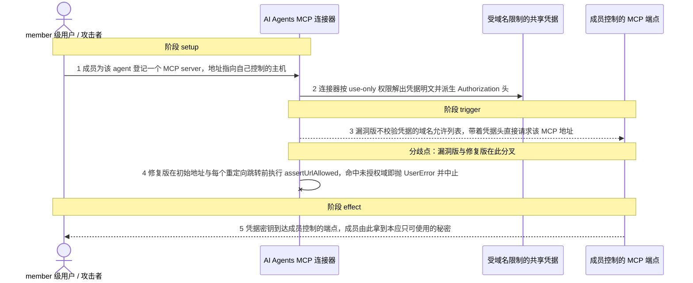
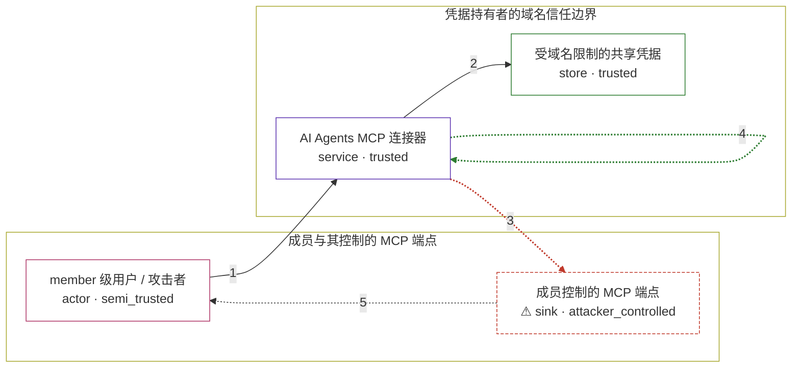

# n8n / CVE-2026-59207

状态：草稿，未完成环境和复现。这个目录由模板生成，不构成漏洞确认。

图解的唯一来源是 `diagram.toml`：编辑后运行 `python3 -m runner diagram n8n/CVE-2026-59207` 重新生成下方的图解区块。图解必须覆盖漏洞涉及的每个主体，并标出漏洞版/修复版的分歧步骤。

<!-- diagram:begin (generated from diagram.toml by `python3 -m runner diagram`; edit diagram.toml, not this block) -->
## 漏洞图解 — n8n / CVE-2026-59207 漏洞图解

AI Agents 的 MCP 连接器在建立连接时，用凭据明文派生出的 Authorization 头去请求成员指定的 MCP 地址，却从不读取该凭据的 Allowed HTTP Request Domains 策略，而这道策略正是用来约束这个出口面的。凭据只以 use-only 权限共享给 member 级用户，成员看不到明文，却能让 agent 把 MCP 地址指向自己控制的主机。修复版在初始地址和每一次重定向跳转之前都执行凭据域名校验，命中未授权域就抛错中止，密钥因此不会离开授权主机。

### 涉及主体

| 主体 | 类型 | 信任级别 | 在漏洞里的作用 | 来源 |
| --- | --- | --- | --- | --- |
| member 级用户 / 攻击者 (`member`) | `actor` | `semi_trusted` | 只拿到该凭据 use-only 权限的成员：可以为自己运行的 agent 指定 MCP server 地址，却读不到凭据明文。它要的正是这个明文。 | fixtures/attack.json |
| AI Agents MCP 连接器 (`mcp_connector`) | `service` | `trusted` | n8n 的 MCP 出口面：解出共享凭据明文、派生 Authorization 头、把请求发往 MCP 地址。漏洞版这条路径里没有任何 allowedHttpRequestDomains 校验。 | packages/cli/src/utils/auth-fetch.ts@n8n@2.27.3 |
| 受域名限制的共享凭据 (`restricted_credential`) | `store` | `trusted` | allowedHttpRequestDomains 设为 domains 的凭据，允许列表之外的主机都不得收到它的密钥；成员只能使用它，看不到明文。 | — |
| ⚠ 成员控制的 MCP 端点 (`attacker_endpoint`) | `sink` | `attacker_controlled` | 由成员指定的 MCP server 地址，用来承载外泄效果；凭据头一旦到达这里，密钥就落到本来够不着它的人手里。 | fixtures/attack.json |

**信任边界**

- **成员与其控制的 MCP 端点** (`attacker_side`)：成员 `member`、`attacker_endpoint`。成员能指定 MCP 地址并收到发往该地址的请求，但读不到共享凭据的明文，也改不了凭据上的域名策略。
- **凭据持有者的域名信任边界** (`credential_boundary`)：成员 `mcp_connector`、`restricted_credential`。凭据的域名允许列表保证密钥只发往授权主机；MCP 出口面不读取该策略，这道校验就被整体绕过。

标 ⚠ 的主体是本仓库合成的替身或无害效果载体，不代表真实外部目标。

### 触发过程

### 主体与信任边界

箭头上的数字是上面的步骤编号；方框只标主体和信任级别，具体动作见「触发过程」。

**分歧点**：第 3 步（`vulnerable_only`）漏洞版不校验凭据的域名允许列表，带着凭据头直接请求该 MCP 地址。
**分歧点**：第 4 步（`patched_only`）修复版在初始地址与每个重定向跳转前执行 assertUrlAllowed，命中未授权域即抛 UserError 并中止。
<!-- diagram:end -->

## 公告与机制

TODO：官方公告、漏洞根因、Agent 信任边界、受影响范围和修复来源。

## 前提

TODO：认证要求、用户交互、已有批准、工具权限、攻击者能控制的内容。

## 版本与启动

TODO：补全 metadata、Dockerfile/镜像 digest 和 Compose，再写出精确启动命令。

Compose 中 `vulnerable` 与 `patched` profiles 分开使用；未指定 profile 不启动服务。镜像变量未配置时 Compose 会明确报错。此模板不暴露宿主端口，也不挂载主机数据。

## 机制复现

TODO：实现 `reproduce.py`，固定输入并执行真实漏洞路径，注明运行位置、参数和超时。

完成实现后使用 `python3 -m runner reproduce n8n/CVE-2026-59207 --build --rounds 3`。
两脚本统一接受 `--context <context.json> --output <目录>`，详细字段见仓库 `docs/environment-contract.md`。
PoC 输出 `facts.json` 和效果文件；验证器只读证据，输出含 `target_ready` 及对应效果断言的 `verdict.json`。
镜像必须包含 Python 3 和 `/lab/` 下的脚本、fixtures；`runtime.mode` 选择 `oneshot` 或有 healthcheck 的 `service`。

## 端到端复现

TODO：实现 `end_to_end.py`；若不需要模型，明确写出不适用原因。真实模型的结果与机制复现分开统计。

## 验证与修复对照

TODO：实现 `verify.py`。记录漏洞版无害效果、修复版阻断和正常任务成功的证据，不能把服务启动失败当成阻断。

## 清理

默认运行器按每个测试的唯一 Compose project 清理容器、网络和 volume。
`--keep-on-failure` 保留失败项目，项目标识和 Compose 配置在结果目录中；仅清理该项目，不能使用全局 prune。

## 失败诊断

TODO：为本漏洞写出预期效果缺失、修复版仍有越界效果、正常任务失败及前提不满足时的具体排查路径。
启动失败、健康检查失败和超时都不能当作修复阻断。报告中应能定位到阶段、预期、实际和受控证据。

## 构建与输入

TODO：填写两版源码 archive、完整 commit，记录 `build.inputs` 中每个下载的 SHA-256；依赖安装必须支持禁网构建。
固定攻击和正常输入放入 `fixtures/` 并登记到 `fixtures/manifest.toml`。固定 seed、环境变量，说明无害效果与真实影响的关系。

## 隔离例外

默认无例外。确需例外时同时填写 `runtime.exceptions`、理由及最小范围，晋升由两位维护者审阅。

## 来源与许可

TODO：列出引用代码、fixtures 和镜像的来源及许可。
