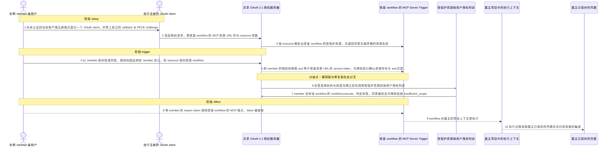

# n8n / GHSA-5VFW-JC4P-FJ39

状态：草稿，未完成环境和复现。这个目录由模板生成，不构成漏洞确认。

图解的唯一来源是 `diagram.toml`：编辑后运行 `python3 -m runner diagram n8n/GHSA-5VFW-JC4P-FJ39` 重新生成下方的图解区块。图解必须覆盖漏洞涉及的每个主体，并标出漏洞版/修复版的分歧步骤。

<!-- diagram:begin (generated from diagram.toml by `python3 -m runner diagram`; edit diagram.toml, not this block) -->
## 漏洞图解 — n8n OAuth 2.1 受保护资源缺少按用户授权判定

n8n 的共享 OAuth 2.1 授权服务器把 MCP Server Trigger 暴露成受保护资源，但受保护资源只有 id、URL、audience、scopes 这些描述性字段，没有该用户能否执行这个 workflow 的判定。member 级用户因此能对自己无权执行的 workflow 走完同意流程，把授权码绑到自己名下，换取 aud 恰好等于受害 MCP 资源 URL 的 access token，而运行时校验只比对 aud 与用户是否存在。结果是 workflow 在属主的项目上下文里、用属主已保存的凭据执行。

### 涉及主体

| 主体 | 类型 | 信任级别 | 在漏洞里的作用 | 来源 |
| --- | --- | --- | --- | --- |
| 实例 member 级用户 (`member_account`) | `actor` | `attacker_controlled` | 已认证、但对受害 workflow 没有 workflow:execute 的普通用户；自行注册 OAuth client 并批准同意。 | — |
| 自行注册的 OAuth client (`oauth_client`) | `actor` | `attacker_controlled` | member 通过未认证的动态客户端注册端点登记，携带自己的 callback 与 PKCE challenge。 | — |
| 共享 OAuth 2.1 授权服务器 (`oauth_server`) | `service` | `trusted` | 签发授权码与 access token；同意流程与令牌校验两处都只确认资源存在、aud 匹配，缺少资源级授权判定。 | — |
| 受保护资源按用户授权判定 (`resource_authorization`) | `service` | `trusted` | 修复版为受保护资源引入的必需方法：按 workflow:execute 判断发起者能否使用该资源；漏洞版没有这个成员。 | — |
| 受害 workflow 的 MCP Server Trigger (`mcp_trigger`) | `service` | `trusted` | authentication 为 n8nOAuth2 的 MCP 端点；只校验 bearer token 的 aud，随后执行 workflow。 | — |
| 属主项目中的执行上下文 (`workflow_owner`) | `service` | `trusted` | workflow 实际运行的位置；执行落在属主账户与项目下，并使用属主已保存的凭据。 | — |
| 属主已保存的凭据 (`victim_credentials`) | `store` | `trusted` | 属主连接外部集成时保存的凭据；攻击者本身无权读取，却随这次执行被使用。 | — |

**信任边界**

- **攻击者侧** (`attacker_side`)：成员 `member_account`、`oauth_client`。只有 member 自己的会话、自己注册的 client 与 callback；属主的 workflow 与属主的凭据都不在这里。
- **实例的授权服务器与属主项目** (`product`)：成员 `oauth_server`、`resource_authorization`、`mcp_trigger`、`workflow_owner`、`victim_credentials`。这道边界本来按项目与角色隔离用户；缺少资源级授权判定让 member 的令牌直接越到属主项目里。

### 触发过程

### 主体与信任边界

箭头上的数字是上面的步骤编号；方框只标主体和信任级别，具体动作见「触发过程」。

```mermaid
%% n8n OAuth 2.1 受保护资源缺少按用户授权判定 — generated from diagram.toml
flowchart LR
  subgraph attacker_side["攻击者侧"]
    member_account["实例 member 级用户<br/>actor · attacker_controlled"]
    oauth_client["自行注册的 OAuth client<br/>actor · attacker_controlled"]
  end
  subgraph product["实例的授权服务器与属主项目"]
    oauth_server["共享 OAuth 2.1 授权服务器<br/>service · trusted"]
    resource_authorization["受保护资源按用户授权判定<br/>service · trusted"]
    mcp_trigger["受害 workflow 的 MCP Server Trigger<br/>service · trusted"]
    workflow_owner["属主项目中的执行上下文<br/>service · trusted"]
    victim_credentials["属主已保存的凭据<br/>store · trusted"]
  end
  member_account -->|"1"| oauth_client
  oauth_client -->|"2"| oauth_server
  oauth_server -->|"3"| mcp_trigger
  member_account -->|"4"| oauth_server
  oauth_server -.->|"5"| mcp_trigger
  oauth_server -.->|"6"| resource_authorization
  resource_authorization -.->|"7"| oauth_server
  member_account -.->|"8"| mcp_trigger
  mcp_trigger -.->|"9"| workflow_owner
  workflow_owner -.->|"10"| victim_credentials
  classDef actor fill:transparent,stroke:#b03a6a
  classDef client fill:transparent,stroke:#1565c0
  classDef service fill:transparent,stroke:#5e35b1
  classDef tool fill:transparent,stroke:#ef6c00
  classDef sink fill:transparent,stroke:#c0392b
  classDef store fill:transparent,stroke:#2e7d32
  classDef synthetic stroke-dasharray: 4 2
  class member_account actor
  class oauth_client actor
  class oauth_server service
  class resource_authorization service
  class mcp_trigger service
  class workflow_owner service
  class victim_credentials store
  style attacker_side fill:transparent
  style product fill:transparent
  linkStyle 4 stroke:#c0392b,stroke-width:2px
  linkStyle 5 stroke:#2e7d32,stroke-width:2px
  linkStyle 6 stroke:#2e7d32,stroke-width:2px
  linkStyle 7 stroke:#c0392b,stroke-width:2px
  linkStyle 8 stroke:#c0392b,stroke-width:2px
  linkStyle 9 stroke:#c0392b,stroke-width:2px
```

**分歧点**：第 5 步（`vulnerable_only`）用 member 的授权码换取 aud 等于受害资源 URL 的 access token，令牌校验只确认资源存在与 aud 匹配。
**分歧点**：第 6 步（`patched_only`）在签发授权码与校验令牌之前先调用受保护资源的按用户授权判定。
**分歧点**：第 7 步（`patched_only`）member 没有该 workflow 的 workflow:execute，判定失败，同意被拒且令牌校验报 insufficient_scope。
**分歧点**：第 8 步（`vulnerable_only`）带 member 的 bearer token 调用受害 workflow 的 MCP 端点，token 被接受。
**分歧点**：第 9 步（`vulnerable_only`）workflow 在属主的项目上下文里执行。
**分歧点**：第 10 步（`vulnerable_only`）执行过程读取属主已保存的凭据并访问其连接的集成。
<!-- diagram:end -->

## 公告与机制

TODO：官方公告、漏洞根因、Agent 信任边界、受影响范围和修复来源。

## 前提

TODO：认证要求、用户交互、已有批准、工具权限、攻击者能控制的内容。

## 版本与启动

TODO：补全 metadata、Dockerfile/镜像 digest 和 Compose，再写出精确启动命令。

Compose 中 `vulnerable` 与 `patched` profiles 分开使用；未指定 profile 不启动服务。镜像变量未配置时 Compose 会明确报错。此模板不暴露宿主端口，也不挂载主机数据。

## 机制复现

TODO：实现 `reproduce.py`，固定输入并执行真实漏洞路径，注明运行位置、参数和超时。

完成实现后使用 `python3 -m runner reproduce n8n/GHSA-5VFW-JC4P-FJ39 --build --rounds 3`。
两脚本统一接受 `--context <context.json> --output <目录>`，详细字段见仓库 `docs/environment-contract.md`。
PoC 输出 `facts.json` 和效果文件；验证器只读证据，输出含 `target_ready` 及对应效果断言的 `verdict.json`。
镜像必须包含 Python 3 和 `/lab/` 下的脚本、fixtures；`runtime.mode` 选择 `oneshot` 或有 healthcheck 的 `service`。

## 端到端复现

TODO：实现 `end_to_end.py`；若不需要模型，明确写出不适用原因。真实模型的结果与机制复现分开统计。

## 验证与修复对照

TODO：实现 `verify.py`。记录漏洞版无害效果、修复版阻断和正常任务成功的证据，不能把服务启动失败当成阻断。

## 清理

默认运行器按每个测试的唯一 Compose project 清理容器、网络和 volume。
`--keep-on-failure` 保留失败项目，项目标识和 Compose 配置在结果目录中；仅清理该项目，不能使用全局 prune。

## 失败诊断

TODO：为本漏洞写出预期效果缺失、修复版仍有越界效果、正常任务失败及前提不满足时的具体排查路径。
启动失败、健康检查失败和超时都不能当作修复阻断。报告中应能定位到阶段、预期、实际和受控证据。

## 构建与输入

TODO：填写两版源码 archive、完整 commit，记录 `build.inputs` 中每个下载的 SHA-256；依赖安装必须支持禁网构建。
固定攻击和正常输入放入 `fixtures/` 并登记到 `fixtures/manifest.toml`。固定 seed、环境变量，说明无害效果与真实影响的关系。

## 隔离例外

默认无例外。确需例外时同时填写 `runtime.exceptions`、理由及最小范围，晋升由两位维护者审阅。

## 来源与许可

TODO：列出引用代码、fixtures 和镜像的来源及许可。
