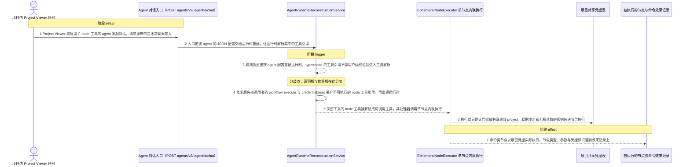
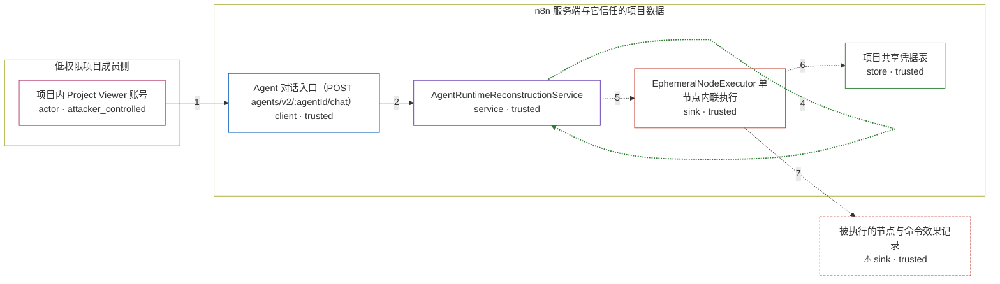

# n8n / GHSA-W46P-W7W2-FR9G

状态：草稿，未完成环境和复现。这个目录由模板生成，不构成漏洞确认。

图解的唯一来源是 `diagram.toml`：编辑后运行 `python3 -m runner diagram n8n/GHSA-W46P-W7W2-FR9G` 重新生成下方的图解区块。图解必须覆盖漏洞涉及的每个主体，并标出漏洞版/修复版的分歧步骤。

<!-- diagram:begin (generated from diagram.toml by `python3 -m runner diagram`; edit diagram.toml, not this block) -->
## 漏洞图解 — n8n AI Agents node 工具越权执行

n8n 2.29.7 的 Agent 运行时重建只按 project 校验 node 工具引用，不校验发起对话的用户：Project Viewer 拥有 agent:execute，能让引用项目凭据的节点工具通过重建并到达 EphemeralNodeExecutor，以项目凭据执行 executeCommand 等节点，从而在 n8n 主机上执行命令。2.29.8 在重建前用 filterToolsForUser 按 workflow:execute 与 credential:read 丢弃这类引用，并在执行器加了命令/文件类节点黑名单。

### 涉及主体

| 主体 | 类型 | 信任级别 | 在漏洞里的作用 | 来源 |
| --- | --- | --- | --- | --- |
| 项目内 Project Viewer 账号 (`attacker`) | `actor` | `attacker_controlled` | 被加入团队项目、只有只读权限但拥有 agent:execute 的成员；它只能控制这次对话的输入，不能自己读凭据或在主机上执行命令。 | — |
| Agent 对话入口（POST agents/v2/:agentId/chat） (`agent_chat`) | `client` | `trusted` | 接受 Project Viewer 的对话请求；漏洞版只把 userId 交给运行时重建，2.29.8 改为把完整 user 传下去，使按用户过滤成为可能。 | — |
| AgentRuntimeReconstructionService (`runtime`) | `service` | `trusted` | 按 agent 的 JSON 配置重建运行时并解析每个工具引用；漏洞版对 type=node 的引用不做任何用户级校验，修复版新增 filterToolsForUser。 | — |
| 项目共享凭据表 (`credential_store`) | `store` | `trusted` | 存放按 project 共享的凭据；漏洞版的执行器只确认凭据属于该 project，因此攻击者无权读取的密钥仍会被装进节点执行。 | — |
| EphemeralNodeExecutor 单节点内联执行 (`executor`) | `sink` | `trusted` | 用节点参数与项目凭据执行 agent 选定的节点；漏洞版没有用户维度与命令类节点黑名单，修复版由黑名单兜底拦截。 | — |
| ⚠ 被执行的节点与命令效果记录 (`host_effect`) | `sink` | `trusted` | 记录漏洞触发后真正到达执行器的节点类型、节点参数与凭据标识，是一处无害落点，不是真实主机上的外部目标。 | — |

**信任边界**

- **低权限项目成员侧** (`attacker_side`)：成员 `attacker`。攻击者在这里只有一个团队项目的只读成员身份和 agent:execute；它不能读项目凭据，也不能直接访问 n8n 主机。
- **n8n 服务端与它信任的项目数据** (`product`)：成员 `agent_chat`、`runtime`、`credential_store`、`executor`。这道边界应当保证只有具备 workflow:execute 与 credential:read 的调用者才能让节点工具落地执行；漏洞版重建时不看用户，边界因此失效。
- 未列入上述边界：`host_effect`。

标 ⚠ 的主体是本仓库合成的替身或无害效果载体，不代表真实外部目标。

### 触发过程

### 主体与信任边界

箭头上的数字是上面的步骤编号；方框只标主体和信任级别，具体动作见「触发过程」。

**分歧点**：第 3 步（`vulnerable_only`）漏洞版直接按 agent 配置重建运行时，type=node 的工具引用不做用户级校验就进入工具解析。
**分歧点**：第 4 步（`patched_only`）修复版先按调用者的 workflow:execute 与 credential:read 丢弃不可执行的 node 工具引用，再重建运行时。
<!-- diagram:end -->

## 公告与机制

TODO：官方公告、漏洞根因、Agent 信任边界、受影响范围和修复来源。

## 前提

TODO：认证要求、用户交互、已有批准、工具权限、攻击者能控制的内容。

## 版本与启动

TODO：补全 metadata、Dockerfile/镜像 digest 和 Compose，再写出精确启动命令。

Compose 中 `vulnerable` 与 `patched` profiles 分开使用；未指定 profile 不启动服务。镜像变量未配置时 Compose 会明确报错。此模板不暴露宿主端口，也不挂载主机数据。

## 机制复现

TODO：实现 `reproduce.py`，固定输入并执行真实漏洞路径，注明运行位置、参数和超时。

完成实现后使用 `python3 -m runner reproduce n8n/GHSA-W46P-W7W2-FR9G --build --rounds 3`。
两脚本统一接受 `--context <context.json> --output <目录>`，详细字段见仓库 `docs/environment-contract.md`。
PoC 输出 `facts.json` 和效果文件；验证器只读证据，输出含 `target_ready` 及对应效果断言的 `verdict.json`。
镜像必须包含 Python 3 和 `/lab/` 下的脚本、fixtures；`runtime.mode` 选择 `oneshot` 或有 healthcheck 的 `service`。

## 端到端复现

TODO：实现 `end_to_end.py`；若不需要模型，明确写出不适用原因。真实模型的结果与机制复现分开统计。

## 验证与修复对照

TODO：实现 `verify.py`。记录漏洞版无害效果、修复版阻断和正常任务成功的证据，不能把服务启动失败当成阻断。

## 清理

默认运行器按每个测试的唯一 Compose project 清理容器、网络和 volume。
`--keep-on-failure` 保留失败项目，项目标识和 Compose 配置在结果目录中；仅清理该项目，不能使用全局 prune。

## 失败诊断

TODO：为本漏洞写出预期效果缺失、修复版仍有越界效果、正常任务失败及前提不满足时的具体排查路径。
启动失败、健康检查失败和超时都不能当作修复阻断。报告中应能定位到阶段、预期、实际和受控证据。

## 构建与输入

TODO：填写两版源码 archive、完整 commit，记录 `build.inputs` 中每个下载的 SHA-256；依赖安装必须支持禁网构建。
固定攻击和正常输入放入 `fixtures/` 并登记到 `fixtures/manifest.toml`。固定 seed、环境变量，说明无害效果与真实影响的关系。

## 隔离例外

默认无例外。确需例外时同时填写 `runtime.exceptions`、理由及最小范围，晋升由两位维护者审阅。

## 来源与许可

TODO：列出引用代码、fixtures 和镜像的来源及许可。
