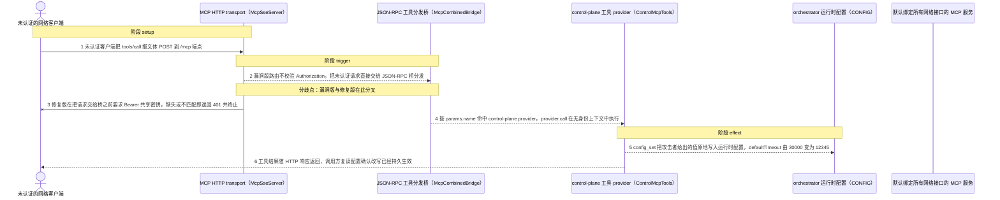
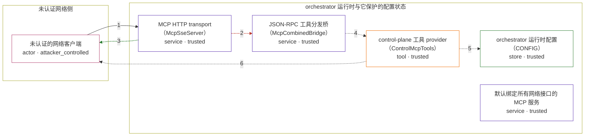

# network-ai / CVE-2026-42856

状态：草稿，未完成环境和复现。这个目录由模板生成，不构成漏洞确认。

图解的唯一来源是 `diagram.toml`：编辑后运行 `python3 -m runner diagram network-ai/CVE-2026-42856` 重新生成下方的图解区块。图解必须覆盖漏洞涉及的每个主体，并标出漏洞版/修复版的分歧步骤。

<!-- diagram:begin (generated from diagram.toml by `python3 -m runner diagram`; edit diagram.toml, not this block) -->
## 漏洞图解 — network-ai / CVE-2026-42856 漏洞图解

Network-AI 5.1.3 之前的 MCP HTTP transport 在把 POST /mcp 交给 JSON-RPC 桥之前不做任何身份校验，而服务默认绑定 0.0.0.0 且不要求共享密钥，网络上的任意客户端因此能直接调用 control-plane 工具。攻击者用一次未认证的 tools/call 就能读取并原地改写 orchestrator 的运行时配置，例如把 defaultTimeout 从 30000 改成任意值，还能枚举或派发 agent、铸造 token。5.1.3 在路由层加入 Bearer 共享密钥门禁：缺少正确 Authorization 的请求收到 401，携带正确密钥的合法客户端不受影响。

### 涉及主体

| 主体 | 类型 | 信任级别 | 在漏洞里的作用 | 来源 |
| --- | --- | --- | --- | --- |
| 未认证的网络客户端 (`unauth_client`) | `actor` | `attacker_controlled` | 构造并发送 JSON-RPC tools/call 请求。它能控制的只有这次调用的方法、路径和报文体，不持有任何共享密钥。 | fixtures/attack.json |
| MCP HTTP transport（McpSseServer） (`mcp_http_server`) | `service` | `trusted` | 路由 GET /sse、POST /mcp、GET /tools 并调用 JSON-RPC 桥。漏洞版在这条路由上没有任何 Authorization 校验，请求被直接放行。 | network-ai@5.1.2 dist/lib/mcp-transport-sse.js |
| JSON-RPC 工具分发桥（McpCombinedBridge） (`rpc_bridge`) | `service` | `trusted` | 按 params.name 在工具索引里找到 provider 并 await provider.call(toolName, toolArgs)，分发时不区分调用方身份。 | network-ai@5.1.2 dist/lib/mcp-transport-sse.js |
| control-plane 工具 provider（ControlMcpTools） (`control_tools`) | `tool` | `trusted` | 提供 config_get、config_set、agent_list、agent_spawn 等管理工具；config_set 对 key 没有白名单，直接改写运行时配置。 | network-ai@5.1.2 dist/lib/mcp-tools-control.js |
| orchestrator 运行时配置（CONFIG） (`runtime_config`) | `store` | `trusted` | 进程内的实时配置状态，例如 defaultTimeout。未认证调用方本来既不该读到它，也不该改写它。 | network-ai@5.1.2 dist/lib/orchestrator-types.js |
| 默认绑定所有网络接口的 MCP 服务 (`default_listener`) | `service` | `trusted` | 漏洞前提：服务默认绑定 0.0.0.0 且未配置共享密钥，使网络上的任意客户端都能到达 POST /mcp。这是部署的原有状态，不是攻击者的动作。 | — |

**信任边界**

- **未认证网络侧** (`network_side`)：成员 `unauth_client`。攻击者在这一侧，只能发起一次 HTTP 请求；它没有任何凭据，也读不到 orchestrator 的内部状态。
- **orchestrator 运行时与它保护的配置状态** (`orchestrator_runtime`)：成员 `mcp_http_server`、`rpc_bridge`、`control_tools`、`runtime_config`、`default_listener`。这道边界本应由共享密钥把守：只有携带正确 Authorization 的客户端才能进入 tools/call。漏洞版在路由层没有任何门禁，未认证请求长驱直入直到改写配置。

### 触发过程

### 主体与信任边界

箭头上的数字是上面的步骤编号；方框只标主体和信任级别，具体动作见「触发过程」。

**分歧点**：第 2 步（`vulnerable_only`）漏洞版路由不校验 Authorization，把未认证请求直接交给 JSON-RPC 桥分发。
**分歧点**：第 3 步（`patched_only`）修复版在把请求交给桥之前要求 Bearer 共享密钥，缺失或不匹配即返回 401 并终止。
<!-- diagram:end -->

## 公告与机制

TODO：官方公告、漏洞根因、Agent 信任边界、受影响范围和修复来源。

## 前提

TODO：认证要求、用户交互、已有批准、工具权限、攻击者能控制的内容。

## 版本与启动

TODO：补全 metadata、Dockerfile/镜像 digest 和 Compose，再写出精确启动命令。

Compose 中 `vulnerable` 与 `patched` profiles 分开使用；未指定 profile 不启动服务。镜像变量未配置时 Compose 会明确报错。此模板不暴露宿主端口，也不挂载主机数据。

## 机制复现

TODO：实现 `reproduce.py`，固定输入并执行真实漏洞路径，注明运行位置、参数和超时。

完成实现后使用 `python3 -m runner reproduce network-ai/CVE-2026-42856 --build --rounds 3`。
两脚本统一接受 `--context <context.json> --output <目录>`，详细字段见仓库 `docs/environment-contract.md`。
PoC 输出 `facts.json` 和效果文件；验证器只读证据，输出含 `target_ready` 及对应效果断言的 `verdict.json`。
镜像必须包含 Python 3 和 `/lab/` 下的脚本、fixtures；`runtime.mode` 选择 `oneshot` 或有 healthcheck 的 `service`。

## 端到端复现

TODO：实现 `end_to_end.py`；若不需要模型，明确写出不适用原因。真实模型的结果与机制复现分开统计。

## 验证与修复对照

TODO：实现 `verify.py`。记录漏洞版无害效果、修复版阻断和正常任务成功的证据，不能把服务启动失败当成阻断。

## 清理

默认运行器按每个测试的唯一 Compose project 清理容器、网络和 volume。
`--keep-on-failure` 保留失败项目，项目标识和 Compose 配置在结果目录中；仅清理该项目，不能使用全局 prune。

## 失败诊断

TODO：为本漏洞写出预期效果缺失、修复版仍有越界效果、正常任务失败及前提不满足时的具体排查路径。
启动失败、健康检查失败和超时都不能当作修复阻断。报告中应能定位到阶段、预期、实际和受控证据。

## 构建与输入

TODO：填写两版源码 archive、完整 commit，记录 `build.inputs` 中每个下载的 SHA-256；依赖安装必须支持禁网构建。
固定攻击和正常输入放入 `fixtures/` 并登记到 `fixtures/manifest.toml`。固定 seed、环境变量，说明无害效果与真实影响的关系。

## 隔离例外

默认无例外。确需例外时同时填写 `runtime.exceptions`、理由及最小范围，晋升由两位维护者审阅。

## 来源与许可

TODO：列出引用代码、fixtures 和镜像的来源及许可。
