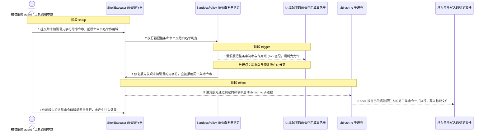
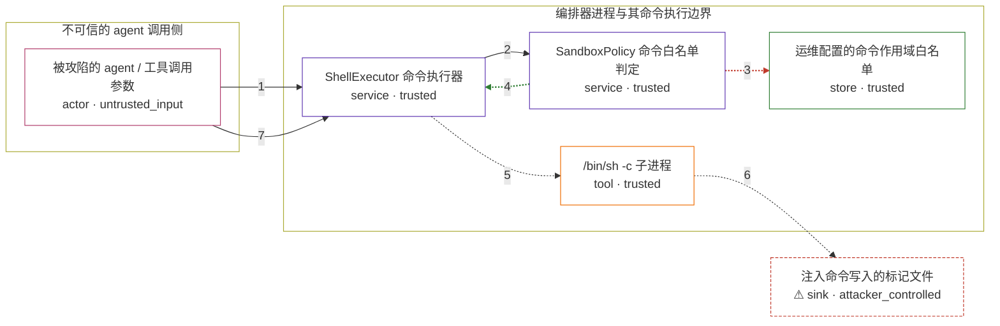

# network-ai / CVE-2026-54051

状态：草稿，未完成环境和复现。这个目录由模板生成，不构成漏洞确认。

图解的唯一来源是 `diagram.toml`：编辑后运行 `python3 -m runner diagram network-ai/CVE-2026-54051` 重新生成下方的图解区块。图解必须覆盖漏洞涉及的每个主体，并标出漏洞版/修复版的分歧步骤。

<!-- diagram:begin (generated from diagram.toml by `python3 -m runner diagram`; edit diagram.toml, not this block) -->
## 漏洞图解 — network-ai / CVE-2026-54051 漏洞图解

network-ai 的 SandboxPolicy 用 glob 对整条命令字符串做白名单匹配，而 ShellExecutor 把同一字符串交给 /bin/sh -c 解释执行，于是 `git *` 这类作用域白名单同时放行了 `git status; <任意命令>`。被攻陷的 agent 只需在可执行命令的参数里加入未加引号的 shell 元字符，就能以编排器进程权限执行任意命令，白名单这道唯一遏制边界随之失效。修复版在 glob 匹配前先做 quote-aware 元字符检查，并把 spawn 改成不经 shell 的 argv 直接执行。

### 涉及主体

| 主体 | 类型 | 信任级别 | 在漏洞里的作用 | 来源 |
| --- | --- | --- | --- | --- |
| 被攻陷的 agent / 工具调用参数 (`agent`) | `actor` | `untrusted_input` | 漏洞的输入侧。它只能控制要执行的命令字符串本身，不能修改编排器的白名单配置，也不能直接读写宿主文件。 | fixtures/attack.json |
| SandboxPolicy 命令白名单判定 (`policy`) | `service` | `trusted` | 受影响组件。isCommandAllowed 只对整条命令做 trim 与 glob 匹配，没有分词、也没有未加引号元字符检查，因此把注入串误判为白名单命令。修复版在此处新增拒绝分支。 | — |
| ShellExecutor 命令执行器 (`executor`) | `service` | `trusted` | 受影响组件。execute 只向 isCommandAllowed 要一次布尔判定，通过后直接调用 spawnCommand，从不检查元字符，也不做二次校验。 | lib/agent-runtime.ts |
| 运维配置的命令作用域白名单 (`scope`) | `store` | `trusted` | 漏洞前提：运维为可用性配置的 `git *` 这类通配条目。它不是攻击者能改的东西，但正是它让注入串落到有缺陷的 globMatch 上。 | fixtures/attack.json |
| /bin/sh -c 子进程 (`shell`) | `tool` | `trusted` | 执行器为通过判定的命令串启动的 shell。它按 shell 语法重新解析同一条字符串，分号、逻辑与管道、命令替换、反引号与重定向因此都成为可执行的第二条命令。 | lib/agent-runtime.ts |
| ⚠ 注入命令写入的标记文件 (`marker`) | `sink` | `attacker_controlled` | 受控效果落点：注入命令把一行标记写到这个文件，证明第二条命令真的以编排器进程权限执行。它是无害的本地标记，不是真实外部目标。 | — |

**信任边界**

- **不可信的 agent 调用侧** (`agent_side`)：成员 `agent`。被攻陷的 agent 能构造任意命令字符串，但拿不到白名单配置，也够不到沙箱外的文件系统。它想要的是越过下面这道边界去执行白名单之外的命令。
- **编排器进程与其命令执行边界** (`orchestrator`)：成员 `policy`、`executor`、`scope`、`shell`。白名单本来把 agent 限制在少数几个命令前缀内。判定与执行对「一条命令」的定义不一致，让同一条字符串先被判为合规、再被 shell 解析成多条命令，边界因此失效。
- 未列入上述边界：`marker`。

标 ⚠ 的主体是本仓库合成的替身或无害效果载体，不代表真实外部目标。

### 触发过程

### 主体与信任边界

箭头上的数字是上面的步骤编号；方框只标主体和信任级别，具体动作见「触发过程」。

**分歧点**：第 3 步（`vulnerable_only`）漏洞版把整条字符串与作用域 glob 匹配，误判为允许。
**分歧点**：第 4 步（`patched_only`）修复版先发现未加引号的元字符，直接拒绝同一条命令串。
<!-- diagram:end -->

## 公告与机制

- 公告：[GHSA-qw6v-5fcf-5666](https://github.com/Jovancoding/Network-AI/security/advisories/GHSA-qw6v-5fcf-5666) /
  [CVE-2026-54051](https://nvd.nist.gov/vuln/detail/CVE-2026-54051)，CWE-78，CVSS 3.1 `9.9`（CRITICAL，
  向量 `CVSS:3.1/AV:N/AC:L/PR:L/UI:N/S:C/C:H/I:H/A:H`，来源 GitHub advisory）。
- 受影响范围：npm `network-ai` `< 5.9.1`；修复版本 `5.9.1`。
- 根因：`SandboxPolicy.isCommandAllowed` 把**整条命令字符串**当作一个整体做 glob 匹配
  （`git *` 编译为 `^git .*$`），而 `ShellExecutor.spawnCommand` 把同一字符串交给
  `/bin/sh -c` 解释执行。判定与执行对「一条命令」的定义不一致，未加引号的 `;`、`&&`、
  管道、命令替换与重定向都被 shell 解释成额外命令。
- 信任边界：agent 只能控制要执行的命令字符串；应用它的白名单是运维配置，也是
  `THREAT_MODEL.md` 中针对「被攻陷的 agent」的主要遏制手段。绕过白名单即等于以编排器进程
  权限执行任意命令。
- 修复提交：`379f77656b578144e03415c5b134d8309a4b5792`（tag `v5.9.1`）。修复在 glob 匹配前
  增加 quote-aware 的 `parseCommandLine`/`SHELL_METACHARACTERS` 拒绝分支，并让
  `spawnCommand` 改用 `spawn(file, argv, { shell: false })`，不再经过 shell。
- 分析依据见 `staging/research/network-ai/CVE-2026-54051/public.md`。

## 前提

- 调用方或 agent 有权执行命令（`ShellExecutor.execute` 或 `AgentRuntime.exec` 路径），
  且命令字符串由它提供。
- 运维配置的白名单含通配作用域，例如 `allowed_commands = ["git *"]`。默认
  `allowedCommands` 为空数组（空即全拒），因此这是可达性前提，不是攻击动作。
- 攻击者不能修改白名单配置，也不能直接写文件；它只能构造命令字符串。
- 无害效果：注入的第二条命令只写一个本地标记文件，用于证明第二条命令确实执行。

## 版本与启动

两版源码与镜像固定留待 build 阶段填写（`metadata.toml` 的 `vulnerable` / `patched` /
`build.inputs`）。预期固定为 vulnerable `5.9.0`
（`7778eed65b5e628183a6091d74ce92de3407507c`）与 patched `5.9.1`
（`379f77656b578144e03415c5b134d8309a4b5792`），机制复现使用 npm tarball 内的编译产物
`dist/lib/agent-runtime.js`，不需要 tsc 构建。

Compose 中 `vulnerable` 与 `patched` profiles 分开使用；未指定 profile 不启动服务。镜像变量未配置时 Compose 会明确报错。此模板不暴露宿主端口，也不挂载主机数据。

## 机制复现

`reproduce.py` 从 `/lab/fixtures/<scenario>.json` 读取固定输入，用 `node` 加载被固定的
`network-ai` 包本体，调用真实的 `SandboxPolicy.isCommandAllowed` 与 `ShellExecutor.execute`，
把判定、执行结果与标记文件写入 `--output` 目录。构造参数形状从上游构造函数与实例属性推断，
不接受任何靠猜的 API；只有确认策略在该输入的作用域下真实生效（作用域内命令放行、作用域外命令
拒绝）才报告判定结果。

`AVH_ROOT=/home/hejunjie/agent-vulhub/staging python3 -m runner reproduce network-ai/CVE-2026-54051 --build --rounds 3`。
两脚本统一接受 `--context <context.json> --output <目录>`，详细字段见仓库 `docs/environment-contract.md`。
PoC 输出 `facts.json` 和效果文件；验证器只读证据，输出含 `target_ready` 及对应效果断言的 `verdict.json`。
镜像必须包含 Python 3、Node ≥ 18 与 git，以及 `/lab/` 下的脚本、fixtures；`runtime.mode` 选择 `oneshot` 或有 healthcheck 的 `service`。

## 端到端复现

不适用：该 CVE 是编排器进程内的策略判定缺陷，不涉及模型或外部服务，机制复现即为可达性上限。
`end_to_end.py` 保留模板状态，`metadata.toml` 的 `verification.end_to_end` 记为 `not_applicable`。

## 验证与修复对照

四场景预期（由 solve 阶段的 `verify.py` 独立核对，只读 `facts.json`、`observation.json`
与效果文件，不重跑攻击）：

| 场景 | 预期 |
| --- | --- |
| 漏洞版 attack | `isCommandAllowed` 返回 true，`execute` 成功，标记文件出现 |
| 漏洞版 benign | `isCommandAllowed` 返回 true，无标记文件 |
| 修复版 attack | `isCommandAllowed` 返回 false，`execute` 抛 `RuntimePolicyError`，无标记文件 |
| 修复版 benign | `isCommandAllowed` 返回 true，无标记文件（排除「修复把白名单打死」的伪差异） |

效果证据是标记文件本身（非空内容即证明 shell 执行了注入命令），不比较固定字符串。

## 清理

默认运行器按每个测试的唯一 Compose project 清理容器、网络和 volume。
`--keep-on-failure` 保留失败项目，项目标识和 Compose 配置在结果目录中；仅清理该项目，不能使用全局 prune。

## 失败诊断

- 标记文件缺失且 `target_ready=true`：检查镜像内是否有 `/bin/sh` 与 git；`execute_result.stderr`
  会记录 shell 的实际报错。
- `target_ready=false`：`observation.json` 的 `setup_attempts` 列出每个被拒绝的构造形状与原因，
  据此判断是包未安装、导出名不符还是作用域没有生效。
- 判定恒为 true（策略未生效）：`probe_allowed` 必须为 false 才接受构造结果；若策略允许一切，
  PoC 直接报 `target_ready=false`，不会把「没配白名单」当成绕过。
- 修复版仍有标记文件：说明加载的不是修复版产物，核对 `metadata.toml` 的 commit 与镜像 label。
- 良性对照在修复版被拒：属伪差异，检查 fixture 命令是否含未被引号包裹的元字符。

启动失败、健康检查失败和超时都不能当作修复阻断。报告中应能定位到阶段、预期、实际和受控证据。

## 构建与输入

待 build 阶段填写两版源码 archive、完整 40 位 commit 与 `build.inputs` 的 SHA-256；依赖安装必须
支持禁网构建。预期可见 `staging/research/network-ai/CVE-2026-54051/public.md` 记录的 npm tarball
integrity 与 gitHead：`network-ai-5.9.0.tgz`（`7778eed6…`）与 `network-ai-5.9.1.tgz`（`379f7765…`）。

固定攻击和正常输入放入 `fixtures/` 并登记到 `fixtures/manifest.toml`。固定 seed、环境变量，说明无害效果与真实影响的关系。

## 隔离例外

默认无例外。确需例外时同时填写 `runtime.exceptions`、理由及最小范围，晋升由两位维护者审阅。

## 来源与许可

- 上游项目 `Jovancoding/Network-AI`（npm 包 `network-ai`），MIT 许可。
- 引用代码：`lib/agent-runtime.ts` 中的 `SandboxPolicy` 与 `ShellExecutor`（vulnerable blob
  `9001f76c49962dc0d52e36338fec7def2881a7d7`，patched blob
  `5e810a093ca9f1cc8c510de6749f4a61c594939b`）。
- 公告与 advisory 文本来自 NVD、OSV 与 GitHub Security Advisory，链接见 `research/public.md`。
- fixtures 与图片段均为本环境自写，不含真实凭据或用户数据。
