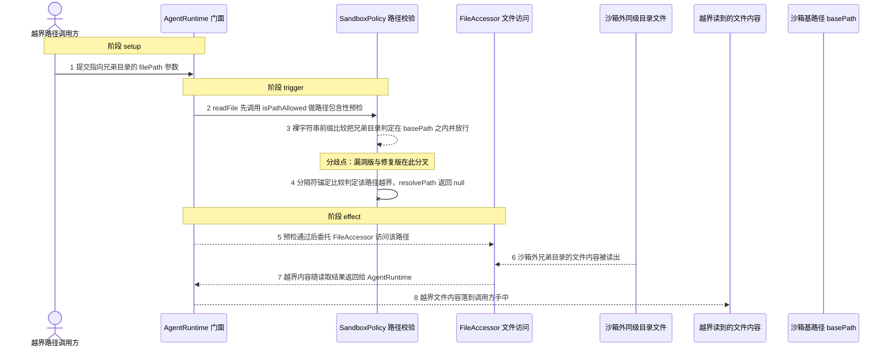
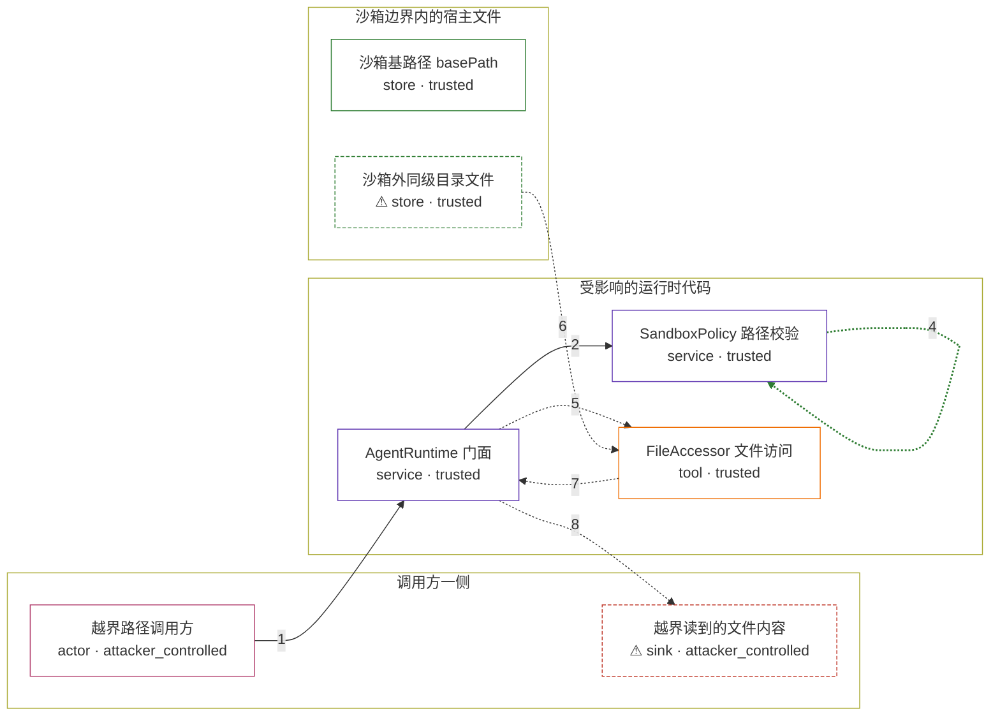

# network-ai / CVE-2026-58481

状态：草稿，未完成环境和复现。这个目录由模板生成，不构成漏洞确认。

图解的唯一来源是 `diagram.toml`：编辑后运行 `python3 -m runner diagram network-ai/CVE-2026-58481` 重新生成下方的图解区块。图解必须覆盖漏洞涉及的每个主体，并标出漏洞版/修复版的分歧步骤。

<!-- diagram:begin (generated from diagram.toml by `python3 -m runner diagram`; edit diagram.toml, not this block) -->
## 漏洞图解 — network-ai / CVE-2026-58481 沙箱路径前缀绕过

Network-AI 的 AgentRuntime 用 SandboxPolicy 把文件访问限制在 basePath 之下，但 resolvePath 与 isPathAllowed 只做裸字符串前缀比较，不要求匹配前缀之后紧跟路径分隔符。与 basePath 共享字符串前缀的兄弟目录（sandbox 与 sandbox_evil）因此被判定在沙箱之内，绝对路径、../ 相对路径和目录列举都能越过边界。结果是沙箱外文件内容随 readFile/listDir 的返回值交给调用方，形成信息泄露。修复版改用路径分隔符锚定的前缀比较，同一输入在策略层被拒绝。

### 涉及主体

| 主体 | 类型 | 信任级别 | 在漏洞里的作用 | 来源 |
| --- | --- | --- | --- | --- |
| 越界路径调用方 (`attacker`) | `actor` | `attacker_controlled` | 以 agent 身份调用 AgentRuntime.readFile/listDir，唯一可控的是本次调用的 filePath 参数；它不写入宿主文件系统，只是选择一个指向沙箱外兄弟目录的路径。 | — |
| AgentRuntime 门面 (`runtime`) | `service` | `trusted` | 对外提供 readFile/listDir，先做 isPathAllowed 预检，再委托 FileAccessor 执行真实文件操作，并把上游返回值交给调用方。 | lib/agent-runtime.ts |
| SandboxPolicy 路径校验 (`policy`) | `service` | `trusted` | resolvePath 与 isPathAllowed 用裸字符串前缀判断目标是否位于 basePath 和 allowedPaths 之下，没有做路径分隔符锚定，所以兄弟目录被当成沙箱内路径。 | lib/agent-runtime.ts |
| FileAccessor 文件访问 (`file_accessor`) | `tool` | `trusted` | 在策略放行后调用 fs.readFile / fs.readdir 对解析出的绝对路径执行真实的读取与目录列举。 | lib/agent-runtime.ts |
| 沙箱基路径 basePath (`base_dir`) | `store` | `trusted` | 策略声明的允许目录，也是前缀比较的基准；它不是攻击动作，而是绕过成立的前提。 | — |
| ⚠ 沙箱外同级目录文件 (`outside_file`) | `store` | `trusted` | 与 basePath 共享字符串前缀的兄弟目录中的文件，调用方本无权访问；读取它的内容就是漏洞效果，其中的 marker 是无害载体而非真实机密。 | — |
| ⚠ 越界读到的文件内容 (`leaked_result`) | `sink` | `attacker_controlled` | 越界读取或列举的结果随调用返回值回到调用方手里，信息泄露在这里落地。 | — |

**信任边界**

- **调用方一侧** (`caller_side`)：成员 `attacker`、`leaked_result`。调用方只能决定本次调用的 filePath 参数，不能直接读写宿主文件；越界读到的内容最终以返回值形式回到这里。
- **受影响的运行时代码** (`runtime_stack`)：成员 `runtime`、`policy`、`file_accessor`。这层本应把文件访问限制在 basePath 之内，裸字符串前缀比较让它对共享前缀的兄弟目录失效。
- **沙箱边界内的宿主文件** (`protected_files`)：成员 `base_dir`、`outside_file`。basePath 及其兄弟目录都在调用方无权访问的宿主文件系统里，边界靠路径包含性检查维持，而该检查不识别路径分隔符。

标 ⚠ 的主体是本仓库合成的替身或无害效果载体，不代表真实外部目标。

### 触发过程

### 主体与信任边界

箭头上的数字是上面的步骤编号；方框只标主体和信任级别，具体动作见「触发过程」。

**分歧点**：第 3 步（`vulnerable_only`）裸字符串前缀比较把兄弟目录判定在 basePath 之内并放行。
**分歧点**：第 4 步（`patched_only`）分隔符锚定比较判定该路径越界，resolvePath 返回 null。
<!-- diagram:end -->

## 公告与机制

TODO：官方公告、漏洞根因、Agent 信任边界、受影响范围和修复来源。

## 前提

TODO：认证要求、用户交互、已有批准、工具权限、攻击者能控制的内容。

## 版本与启动

TODO：补全 metadata、Dockerfile/镜像 digest 和 Compose，再写出精确启动命令。

Compose 中 `vulnerable` 与 `patched` profiles 分开使用；未指定 profile 不启动服务。镜像变量未配置时 Compose 会明确报错。此模板不暴露宿主端口，也不挂载主机数据。

## 机制复现

`reproduce.py` 不重写沙箱检查：它按 `context["scenario"]` 读取固定的 `fixtures/attack.json` 或
`fixtures/benign.json`，在 `mkdtemp` 目录里建出策略 `basePath`（`sandbox/`）与共享字符串前缀的
兄弟目录（`sandbox_evil/`），再用一个不含任何路径逻辑的 node 驱动加载被固定的上游
`AgentRuntime`，对 `readFile` / `listDir` 逐条调用，并把上游原始返回值写成效果文件。

`AgentRuntime` 编译产物在镜像里的位置由构建配方决定，`reproduce.py` 按以下顺序查找并取第一个命中：

1. 环境变量 `AVH_NETWORK_AI_RUNTIME_JS` / `NETWORK_AI_RUNTIME_JS` 指定的文件；
2. `/lab`、`/opt`、`/srv`、`/app`、`/workspace`、`/usr/local/lib` 下 6 层以内的
   `agent-runtime.js`，其中 `dist/lib/` 下的编译产物优先。

镜像只需把该变体的 `dist/lib/agent-runtime.js`（npm tarball 内为
`package/dist/lib/agent-runtime.js`）放在上述任一位置即可。解析到的路径、其 SHA-256 与全部候选都会
写进 `observation.json`，布局歧义因此在证据里可见。运行位置为容器内 `/lab/reproduce.py`，参数为
`--context /lab/results/context.json --output /lab/results`，node 调用超时 120 秒。

完成实现后使用 `python3 -m runner reproduce network-ai/CVE-2026-58481 --build --rounds 3`。
两脚本统一接受 `--context <context.json> --output <目录>`，详细字段见仓库 `docs/environment-contract.md`。
PoC 输出 `facts.json` 和效果文件；验证器只读证据，输出含 `target_ready` 及对应效果断言的 `verdict.json`。
镜像必须包含 Python 3 和 `/lab/` 下的脚本、fixtures；`runtime.mode` 选择 `oneshot` 或有 healthcheck 的 `service`。

## 端到端复现

TODO：实现 `end_to_end.py`；若不需要模型，明确写出不适用原因。真实模型的结果与机制复现分开统计。

## 验证与修复对照

TODO：实现 `verify.py`。记录漏洞版无害效果、修复版阻断和正常任务成功的证据，不能把服务启动失败当成阻断。

## 清理

默认运行器按每个测试的唯一 Compose project 清理容器、网络和 volume。
`--keep-on-failure` 保留失败项目，项目标识和 Compose 配置在结果目录中；仅清理该项目，不能使用全局 prune。

## 失败诊断

TODO：为本漏洞写出预期效果缺失、修复版仍有越界效果、正常任务失败及前提不满足时的具体排查路径。
启动失败、健康检查失败和超时都不能当作修复阻断。报告中应能定位到阶段、预期、实际和受控证据。

## 构建与输入

TODO：填写两版源码 archive、完整 commit，记录 `build.inputs` 中每个下载的 SHA-256；依赖安装必须支持禁网构建。
固定攻击和正常输入放入 `fixtures/` 并登记到 `fixtures/manifest.toml`。固定 seed、环境变量，说明无害效果与真实影响的关系。

## 隔离例外

默认无例外。确需例外时同时填写 `runtime.exceptions`、理由及最小范围，晋升由两位维护者审阅。

## 来源与许可

TODO：列出引用代码、fixtures 和镜像的来源及许可。
