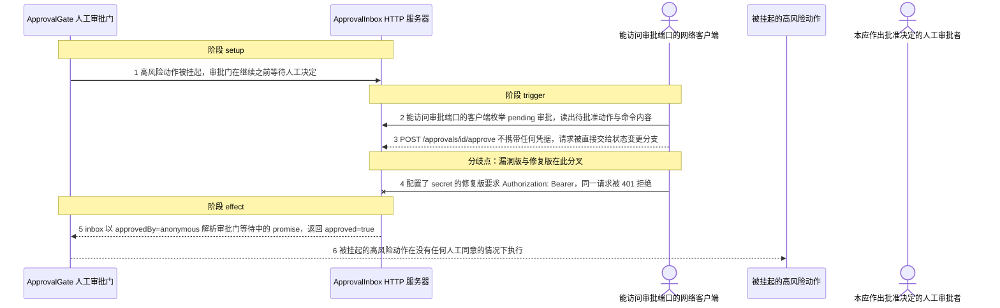
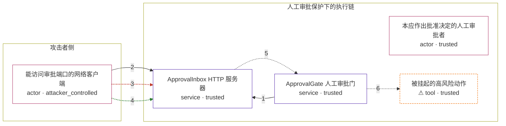

# network-ai / CVE-2026-58482

状态：草稿，未完成环境和复现。这个目录由模板生成，不构成漏洞确认。

图解的唯一来源是 `diagram.toml`：编辑后运行 `python3 -m runner diagram network-ai/CVE-2026-58482` 重新生成下方的图解区块。图解必须覆盖漏洞涉及的每个主体，并标出漏洞版/修复版的分歧步骤。

<!-- diagram:begin (generated from diagram.toml by `python3 -m runner diagram`; edit diagram.toml, not this block) -->
## 漏洞图解 — network-ai ApprovalInbox 缺失认证导致未授权批准

ApprovalInbox 是 Network-AI 把人工审批队列暴露成 REST 接口的组件，但它对 POST /approvals/:id/approve 与 /deny 不校验任何凭据，并给所有响应写死通配 CORS。任何能向该端口发出 HTTP 请求的一方——同机进程、同主机容器、SSRF，或经通配 CORS 的任意被访问网页——都能枚举待批准的高风险动作并代替人工给出批准决定，ApprovalGate 等待中的 promise 随即以 approved=true 解析，被挂起的高风险动作在没有任何人工同意的情况下执行。修复版新增 secret 选项，一旦配置，未携带 Authorization: Bearer 的 approve/deny 请求就返回 401 或 403。

### 涉及主体

| 主体 | 类型 | 信任级别 | 在漏洞里的作用 | 来源 |
| --- | --- | --- | --- | --- |
| 能访问审批端口的网络客户端 (`attacker`) | `actor` | `attacker_controlled` | 它只能控制发往 inbox 端口的普通 HTTP 请求：枚举 pending 审批并提交批准决定。它拿不到审批者凭据，也不控制被挂起动作的内容。 | — |
| ApprovalInbox HTTP 服务器 (`inbox`) | `service` | `trusted` | 上游的 REST 审批接口。漏洞版对状态变更路由不做任何凭据校验，请求被直接交给 routeRequest 的批准分支；修复版才加入 secret 选项与 checkAuth。 | lib/approval-inbox.ts (v5.12.1 / v5.12.2) |
| ApprovalGate 人工审批门 (`gate`) | `service` | `trusted` | 高风险动作执行前必须取得人工决定的关卡。它 await inbox 回调返回的决策，只有 approved 为真才继续。 | — |
| ⚠ 被挂起的高风险动作 (`action`) | `tool` | `trusted` | agent 原本要执行、被审批门拦下的高风险 shell 动作；漏洞触发后它在没有人工同意的情况下执行。这里用无害的执行记录承载该效果，它不是真实的外部目标。 | — |
| 本应作出批准决定的人工审批者 (`approver`) | `actor` | `trusted` | 唯一被授权决定高风险动作是否执行的角色。漏洞让任意能访问端口的客户端替代了它。 | — |

**信任边界**

- **攻击者侧** (`attacker_side`)：成员 `attacker`。这里只有攻击者能控制的东西：发往审批端口的 HTTP 请求。审批者凭据、被挂起动作的内容与动作的执行结果都在边界另一侧。
- **人工审批保护下的执行链** (`protected_chain`)：成员 `approver`、`gate`、`inbox`、`action`。这道边界要求高风险动作在人工批准前不得执行。inbox 的状态变更路由不校验任何凭据，任意能访问端口的客户端都能代替审批者给出 approved 决定，这道边界因此失效。

标 ⚠ 的主体是本仓库合成的替身或无害效果载体，不代表真实外部目标。

### 触发过程

### 主体与信任边界

箭头上的数字是上面的步骤编号；方框只标主体和信任级别，具体动作见「触发过程」。

**分歧点**：第 3 步（`vulnerable_only`）POST /approvals/<id>/approve 不携带任何凭据，请求被直接交给状态变更分支。
**分歧点**：第 4 步（`patched_only`）配置了 secret 的修复版要求 Authorization: Bearer，同一请求被 401 拒绝。
<!-- diagram:end -->

## 公告与机制

TODO：官方公告、漏洞根因、Agent 信任边界、受影响范围和修复来源。

## 前提

TODO：认证要求、用户交互、已有批准、工具权限、攻击者能控制的内容。

## 版本与启动

TODO：补全 metadata、Dockerfile/镜像 digest 和 Compose，再写出精确启动命令。

Compose 中 `vulnerable` 与 `patched` profiles 分开使用；未指定 profile 不启动服务。镜像变量未配置时 Compose 会明确报错。此模板不暴露宿主端口，也不挂载主机数据。

## 机制复现

TODO：实现 `reproduce.py`，固定输入并执行真实漏洞路径，注明运行位置、参数和超时。

完成实现后使用 `python3 -m runner reproduce network-ai/CVE-2026-58482 --build --rounds 3`。
两脚本统一接受 `--context <context.json> --output <目录>`，详细字段见仓库 `docs/environment-contract.md`。
PoC 输出 `facts.json` 和效果文件；验证器只读证据，输出含 `target_ready` 及对应效果断言的 `verdict.json`。
镜像必须包含 Python 3 和 `/lab/` 下的脚本、fixtures；`runtime.mode` 选择 `oneshot` 或有 healthcheck 的 `service`。

## 端到端复现

TODO：实现 `end_to_end.py`；若不需要模型，明确写出不适用原因。真实模型的结果与机制复现分开统计。

## 验证与修复对照

TODO：实现 `verify.py`。记录漏洞版无害效果、修复版阻断和正常任务成功的证据，不能把服务启动失败当成阻断。

## 清理

默认运行器按每个测试的唯一 Compose project 清理容器、网络和 volume。
`--keep-on-failure` 保留失败项目，项目标识和 Compose 配置在结果目录中；仅清理该项目，不能使用全局 prune。

## 失败诊断

TODO：为本漏洞写出预期效果缺失、修复版仍有越界效果、正常任务失败及前提不满足时的具体排查路径。
启动失败、健康检查失败和超时都不能当作修复阻断。报告中应能定位到阶段、预期、实际和受控证据。

## 构建与输入

TODO：填写两版源码 archive、完整 commit，记录 `build.inputs` 中每个下载的 SHA-256；依赖安装必须支持禁网构建。
固定攻击和正常输入放入 `fixtures/` 并登记到 `fixtures/manifest.toml`。固定 seed、环境变量，说明无害效果与真实影响的关系。

## 隔离例外

默认无例外。确需例外时同时填写 `runtime.exceptions`、理由及最小范围，晋升由两位维护者审阅。

## 来源与许可

TODO：列出引用代码、fixtures 和镜像的来源及许可。
