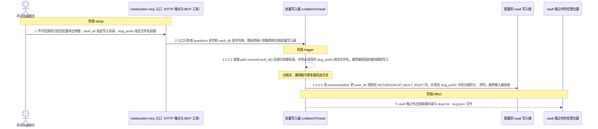
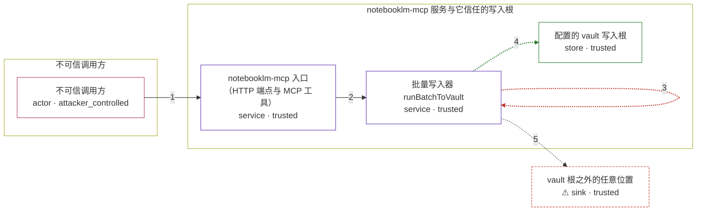

# notebooklm-mcp / CVE-2026-61647

状态：草稿，未完成环境和复现。这个目录由模板生成，不构成漏洞确认。

图解的唯一来源是 `diagram.toml`：编辑后运行 `python3 -m runner diagram notebooklm-mcp/CVE-2026-61647` 重新生成下方的图解区块。图解必须覆盖漏洞涉及的每个主体，并标出漏洞版/修复版的分歧步骤。

<!-- diagram:begin (generated from diagram.toml by `python3 -m runner diagram`; edit diagram.toml, not this block) -->
## 漏洞图解 — notebooklm-mcp / CVE-2026-61647 vault.batch 路径穿越

notebooklm-mcp 2.0.2 的批量导出把调用方提供的 vault_dir 直接交给 path.resolve 后递归创建目录，并把未清洗的 slug_prefix 原样拼进文件名，因此没有任何检查保证写入点落在配置的 vault 写入根之内。HTTP 的 POST /batch-to-vault 端点没有认证中间件，MCP 的 batch_to_vault 工具也把同样的参数原样下传，所以不可信调用方能以服务进程的权限在任意可写位置创建目录并写入 .md 与 .json 文件。2.0.3 增加了 resolveVaultDir containment 检查与 sanitizeSlugPrefix 清洗；其中 containment 检查只有在设置了 NOTEBOOKLM_VAULT_ROOT 时才会拒绝越界路径。

### 涉及主体

| 主体 | 类型 | 信任级别 | 在漏洞里的作用 | 来源 |
| --- | --- | --- | --- | --- |
| 不可信调用方 (`attacker`) | `actor` | `attacker_controlled` | 构造并提交 batch_to_vault 参数：vault_dir 决定写入目录、slug_prefix 决定文件名前缀，两者都完全由调用方控制；提示注入驱动的 MCP 调用走的是同一个参数面。 | fixtures/attack.json |
| notebooklm-mcp 入口（HTTP 端点与 MCP 工具） (`entrypoint`) | `service` | `trusted` | POST /batch-to-vault 路由没有任何认证中间件，CORS 为 Access-Control-Allow-Origin: *；batch_to_vault MCP 工具与它调用同一个处理函数，两者都只检查 questions 非空与 vault_dir 是字符串，随后把参数原样下传。 | src/http-wrapper.ts |
| 批量写入器 runBatchToVault (`vault_writer`) | `service` | `trusted` | 受影响组件：2.0.2 用 path.resolve(vault_dir) 加 fs.mkdir(..., {recursive: true}) 无条件创建目录，并由 makeSlug 把 slug_prefix 原样拼进文件名，两处都不判断写入点是否在 vault 根之内。 | src/utils/vault-writer.ts |
| 配置的 vault 写入根 (`vault_root`) | `store` | `trusted` | NOTEBOOKLM_VAULT_ROOT 指定的允许写入根；2.0.3 的 resolveVaultDir 先用 path.relative 判断候选路径是否越出该根，越界就抛出拒绝错误。未设置该变量时 2.0.3 保留旧的任意路径行为。 | — |
| ⚠ vault 根之外的任意位置 (`outside_dir`) | `sink` | `trusted` | 越界创建的目录，以及写入其中的 slug.md 与 slug.json；内容本身是惰性的 NotebookLM 答案文本，可直接投放到自动启动目录、shell 初始化文件等位置供下游利用。复现时以受控沙箱路径代表这类敏感位置。 | fixtures/attack.json |

**信任边界**

- **不可信调用方** (`attacker_side`)：成员 `attacker`。调用方只能控制这一次 batch_to_vault 调用的参数，不能直接操作服务进程的文件系统权限；越界写入完全由服务自己的写入原语完成。
- **notebooklm-mcp 服务与它信任的写入根** (`vault_scope`)：成员 `entrypoint`、`vault_writer`、`vault_root`。vault 根本应把写入限制在配置目录内。2.0.2 既不校验 vault_dir 是否落在根内，也不清洗 slug_prefix，于是写入点被搬到这道边界之外。
- 未列入上述边界：`outside_dir`。

标 ⚠ 的主体是本仓库合成的替身或无害效果载体，不代表真实外部目标。

### 触发过程

### 主体与信任边界

箭头上的数字是上面的步骤编号；方框只标主体和信任级别，具体动作见「触发过程」。

**分歧点**：第 3 步（`vulnerable_only`）2.0.2 直接 path.resolve(vault_dir) 后递归创建目录，并把未清洗的 slug_prefix 拼进文件名，越界路径因此被创建和写入。
**分歧点**：第 4 步（`patched_only`）2.0.3 用 resolveVaultDir 把 vault_dir 限制在 NOTEBOOKLM_VAULT_ROOT 内，并清洗 slug_prefix 中的分隔符与 .. 序列，越界输入被拒绝。
<!-- diagram:end -->

## 公告与机制

TODO：官方公告、漏洞根因、Agent 信任边界、受影响范围和修复来源。

## 前提

TODO：认证要求、用户交互、已有批准、工具权限、攻击者能控制的内容。

## 版本与启动

TODO：补全 metadata、Dockerfile/镜像 digest 和 Compose，再写出精确启动命令。

Compose 中 `vulnerable` 与 `patched` profiles 分开使用；未指定 profile 不启动服务。镜像变量未配置时 Compose 会明确报错。此模板不暴露宿主端口，也不挂载主机数据。

## 机制复现

TODO：实现 `reproduce.py`，固定输入并执行真实漏洞路径，注明运行位置、参数和超时。

完成实现后使用 `python3 -m runner reproduce notebooklm-mcp/CVE-2026-61647 --build --rounds 3`。
两脚本统一接受 `--context <context.json> --output <目录>`，详细字段见仓库 `docs/environment-contract.md`。
PoC 输出 `facts.json` 和效果文件；验证器只读证据，输出含 `target_ready` 及对应效果断言的 `verdict.json`。
镜像必须包含 Python 3 和 `/lab/` 下的脚本、fixtures；`runtime.mode` 选择 `oneshot` 或有 healthcheck 的 `service`。

## 端到端复现

TODO：实现 `end_to_end.py`；若不需要模型，明确写出不适用原因。真实模型的结果与机制复现分开统计。

## 验证与修复对照

TODO：实现 `verify.py`。记录漏洞版无害效果、修复版阻断和正常任务成功的证据，不能把服务启动失败当成阻断。

## 清理

默认运行器按每个测试的唯一 Compose project 清理容器、网络和 volume。
`--keep-on-failure` 保留失败项目，项目标识和 Compose 配置在结果目录中；仅清理该项目，不能使用全局 prune。

## 失败诊断

TODO：为本漏洞写出预期效果缺失、修复版仍有越界效果、正常任务失败及前提不满足时的具体排查路径。
启动失败、健康检查失败和超时都不能当作修复阻断。报告中应能定位到阶段、预期、实际和受控证据。

## 构建与输入

TODO：填写两版源码 archive、完整 commit，记录 `build.inputs` 中每个下载的 SHA-256；依赖安装必须支持禁网构建。
固定攻击和正常输入放入 `fixtures/` 并登记到 `fixtures/manifest.toml`。固定 seed、环境变量，说明无害效果与真实影响的关系。

## 隔离例外

默认无例外。确需例外时同时填写 `runtime.exceptions`、理由及最小范围，晋升由两位维护者审阅。

## 来源与许可

TODO：列出引用代码、fixtures 和镜像的来源及许可。
