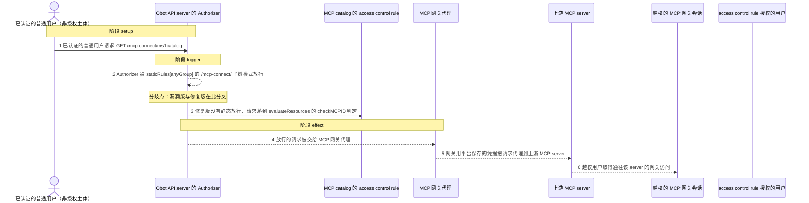
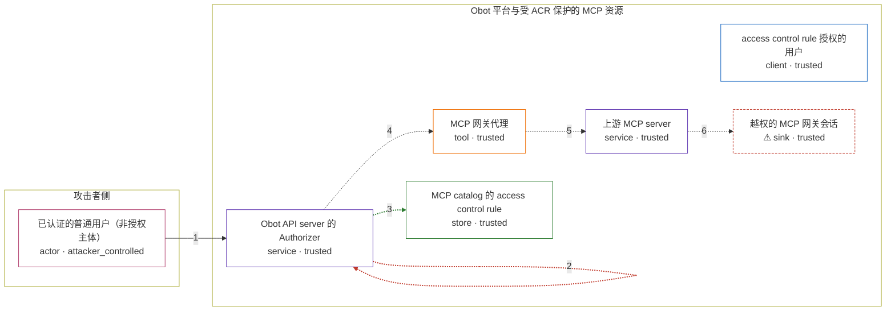

# obot / GHSA-VW82-7FV8-R6GP

状态：草稿，未完成环境和复现。这个目录由模板生成，不构成漏洞确认。

图解的唯一来源是 `diagram.toml`：编辑后运行 `python3 -m runner diagram obot/GHSA-VW82-7FV8-R6GP` 重新生成下方的图解区块。图解必须覆盖漏洞涉及的每个主体，并标出漏洞版/修复版的分歧步骤。

<!-- diagram:begin (generated from diagram.toml by `python3 -m runner diagram`; edit diagram.toml, not this block) -->
## 漏洞图解 — obot / GHSA-VW82-7FV8-R6GP 漏洞图解

Obot 的 /mcp-connect/{mcp_id} 网关端点被静态授权规则整体放行，Authorizer 在抵达 evaluateResources 的 checkMCPID 之前就直接返回 true，UI 兜底对同一路径也返回 true，于是任何已认证的普通用户都能连接任意已注册的 MCP server。修复版删除了该静态规则并把 /mcp-connect/ 从 UI 兜底中排除，请求因此落到 access control rule 判定，越权用户被拒绝。漏洞效果是请求以平台保存的凭据被代理到上游 MCP server。

### 涉及主体

| 主体 | 类型 | 信任级别 | 在漏洞里的作用 | 来源 |
| --- | --- | --- | --- | --- |
| 已认证的普通用户（非授权主体） (`attacker`) | `actor` | `attacker_controlled` | 攻击者只控制一件事：带上自己的 Basic 用户会话凭证，请求 /mcp-connect/ms1catalog。它不在该 server 的 access control rule 主体中，本来无权连接。 | fixtures/attack.json |
| access control rule 授权的用户 (`authenticated_user`) | `client` | `trusted` | 授权用户对应 fixtures/benign.json 里的 owner 与 granted 身份，正常任务中他们连接自己拥有的实例或 ACR 授予的 server，修复版必须继续允许。 | fixtures/benign.json |
| Obot API server 的 Authorizer (`api_server`) | `service` | `trusted` | Authorize 是唯一的判决点：v0.21.0 的 staticRules[anyGroup] 含子树模式 /mcp-connect/，第一段循环命中即返回 true，早于 authorizeAPIResources；即便没有这条规则，只否掉 /debug 与 /api 的 checkUI 也会在末尾对 /mcp-connect/ 返回 true。 | fixtures/harness/zz_ghsa_vw82_harness_test.go |
| MCP 网关代理 (`gateway_proxy`) | `tool` | `trusted` | 网关 handler.Proxy 调用 ensureServerIsDeployed 与 ServerForActionWithConnectID，用平台存储的 OAuth/API 凭据构造上游配置并反向代理，过程中没有用户级权限判断。 | — |
| 上游 MCP server (`upstream_mcp_server`) | `service` | `trusted` | 真正的受保护资源：只有 ACR 主体能连的 MCP server。越权请求以平台凭据的身份打到它，暴露范围等于这些凭据能触达的一切。 | fixtures/attack.json |
| MCP catalog 的 access control rule (`access_control_rules`) | `store` | `trusted` | catalog-a 中的 ACR 只把 ms1catalog 授予 authorized-uid，是 checkMCPID 用来判定越权的持久化数据；漏洞版从不让这段判定执行。 | fixtures/attack.json |
| ⚠ 越权的 MCP 网关会话 (`gateway_session`) | `sink` | `trusted` | 漏洞生效后落在攻击者手里的受控效果标记：被拒绝的请求实际拿到了通往上游 server 的网关访问。这里不接真实外部 server，只记录 Authorize 的放行结论。 | — |

**信任边界**

- **攻击者侧** (`attacker_side`)：成员 `attacker`。攻击者能控制的只有自己的用户会话与目标 mcp_id；它既不能读 ACR，也不能改服务端存储，只能发出一次请求。
- **Obot 平台与受 ACR 保护的 MCP 资源** (`protected_platform`)：成员 `authenticated_user`、`api_server`、`gateway_proxy`、`upstream_mcp_server`、`access_control_rules`、`gateway_session`。这道边界由 Authorizer 与 ACR 共同把守：只有 ACR 主体才能连到 catalog-a 的 server。静态规则先把 /mcp-connect/ 整体放行，UI 兜底再放行一次，边界因此在 handler 之前就失效。

标 ⚠ 的主体是本仓库合成的替身或无害效果载体，不代表真实外部目标。

### 触发过程

### 主体与信任边界

箭头上的数字是上面的步骤编号；方框只标主体和信任级别，具体动作见「触发过程」。

**分歧点**：第 2 步（`vulnerable_only`）Authorizer 被 staticRules[anyGroup] 的 /mcp-connect/ 子树模式放行。
**分歧点**：第 3 步（`patched_only`）修复版没有静态放行，请求落到 evaluateResources 的 checkMCPID 判定。
<!-- diagram:end -->

## 公告与机制

TODO：官方公告、漏洞根因、Agent 信任边界、受影响范围和修复来源。

## 前提

TODO：认证要求、用户交互、已有批准、工具权限、攻击者能控制的内容。

## 版本与启动

TODO：补全 metadata、Dockerfile/镜像 digest 和 Compose，再写出精确启动命令。

Compose 中 `vulnerable` 与 `patched` profiles 分开使用；未指定 profile 不启动服务。镜像变量未配置时 Compose 会明确报错。此模板不暴露宿主端口，也不挂载主机数据。

## 机制复现

TODO：实现 `reproduce.py`，固定输入并执行真实漏洞路径，注明运行位置、参数和超时。

完成实现后使用 `python3 -m runner reproduce obot/GHSA-VW82-7FV8-R6GP --build --rounds 3`。
两脚本统一接受 `--context <context.json> --output <目录>`，详细字段见仓库 `docs/environment-contract.md`。
PoC 输出 `facts.json` 和效果文件；验证器只读证据，输出含 `target_ready` 及对应效果断言的 `verdict.json`。
镜像必须包含 Python 3 和 `/lab/` 下的脚本、fixtures；`runtime.mode` 选择 `oneshot` 或有 healthcheck 的 `service`。

## 端到端复现

TODO：实现 `end_to_end.py`；若不需要模型，明确写出不适用原因。真实模型的结果与机制复现分开统计。

## 验证与修复对照

TODO：实现 `verify.py`。记录漏洞版无害效果、修复版阻断和正常任务成功的证据，不能把服务启动失败当成阻断。

## 清理

默认运行器按每个测试的唯一 Compose project 清理容器、网络和 volume。
`--keep-on-failure` 保留失败项目，项目标识和 Compose 配置在结果目录中；仅清理该项目，不能使用全局 prune。

## 失败诊断

TODO：为本漏洞写出预期效果缺失、修复版仍有越界效果、正常任务失败及前提不满足时的具体排查路径。
启动失败、健康检查失败和超时都不能当作修复阻断。报告中应能定位到阶段、预期、实际和受控证据。

## 构建与输入

TODO：填写两版源码 archive、完整 commit，记录 `build.inputs` 中每个下载的 SHA-256；依赖安装必须支持禁网构建。
固定攻击和正常输入放入 `fixtures/` 并登记到 `fixtures/manifest.toml`。固定 seed、环境变量，说明无害效果与真实影响的关系。

## 隔离例外

默认无例外。确需例外时同时填写 `runtime.exceptions`、理由及最小范围，晋升由两位维护者审阅。

## 来源与许可

TODO：列出引用代码、fixtures 和镜像的来源及许可。
