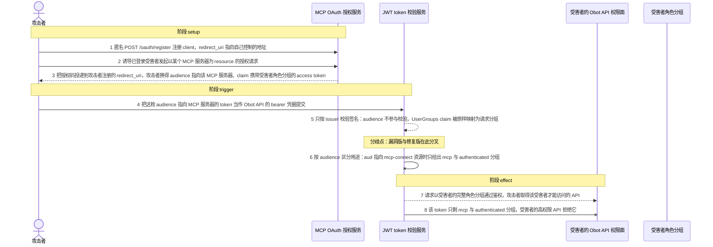
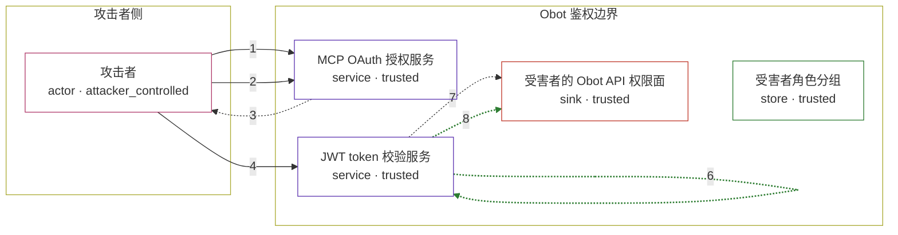

# obot / GHSA-XWMW-PRC4-V3CR

状态：草稿。图解、攻击/正常输入与机制 PoC 已经写出，镜像构建与四场景验收仍待后续阶段。这个目录不构成漏洞确认，也不代表端到端攻击已复现。

图解的唯一来源是 `diagram.toml`：编辑后运行 `python3 -m runner diagram obot/GHSA-XWMW-PRC4-V3CR` 重新生成下方的图解区块。图解必须覆盖漏洞涉及的每个主体，并标出漏洞版/修复版的分歧步骤。

<!-- diagram:begin (generated from diagram.toml by `python3 -m runner diagram`; edit diagram.toml, not this block) -->
## 漏洞图解 — obot / GHSA-XWMW-PRC4-V3CR 漏洞图解

Obot 的 MCP OAuth 授权码流程把受害者的真实角色分组写进 access token，而 JWT 校验只检查 issuer、完全不校验 audience，并把 token 里的 UserGroups claim 原样当作请求分组；动态客户端注册又允许把 redirect_uri 指向任意外部地址，授权流程对已登录用户没有同意步骤。于是一枚 audience 本应只指向某个 MCP 服务器的 bearer token，在 Obot 的 API 鉴权层却以受害者的完整角色分组被接受，攻击者由此得到该受害者才能访问的 API。v0.23.0 在发码前插入同意页，并让校验端按 audience 收紧分组，使同一个 token 只剩 mcp 与 authenticated 分组。

### 涉及主体

| 主体 | 类型 | 信任级别 | 在漏洞里的作用 | 来源 |
| --- | --- | --- | --- | --- |
| 攻击者 (`attacker`) | `actor` | `attacker_controlled` | 匿名注册 OAuth client、把 redirect_uri 指向自己控制的地址，并诱导已登录受害者完成以某个 MCP 服务器为 resource 的授权；它因此持有一枚 audience 指向该 MCP 服务器、claim 里带着受害者角色分组的 access token，再拿它去访问 Obot API。 | — |
| 受害者角色分组 (`victim`) | `store` | `trusted` | 受害者在 Obot 里的真实角色分组（owner、admin、power-user-plus、power-user、basic、authenticated，即其角色掩码展开后的分组集合）。这是攻击者本来够不着的数据：只有鉴权链内部才应该把它映射成请求身份。 | — |
| MCP OAuth 授权服务 (`oauth_server`) | `service` | `trusted` | 处理 /oauth/register、/oauth/authorize、/oauth/callback 与 /oauth/token。它按授权请求里的 resource 决定 token 的 audience，受影响版本还把发起授权的用户角色分组直接写进 UserGroups claim。 | — |
| JWT token 校验服务 (`token_service`) | `service` | `trusted` | 校验请求携带的 bearer token 并推导分组：受影响版本只用 issuer 校验签名，audience 不参与校验，UserGroups claim 被原样映射为请求分组；修复版本按 audience 区分 API 用途与 MCP 用途。 | — |
| 受害者的 Obot API 权限面 (`protected_api`) | `sink` | `trusted` | 以请求分组授予权限的 Obot API；拿到受害者角色分组后，攻击者可以调用该受害者才有权访问的接口。 | — |

**信任边界**

- **攻击者侧** (`attacker_side`)：成员 `attacker`。攻击者能控制 client 元数据、redirect_uri 与诱导链接，并持有换来的 token；它控制不了 token 里被授予的分组，只能诱导受害者让产品把分组写进去。
- **Obot 鉴权边界** (`obot_trust`)：成员 `victim`、`oauth_server`、`token_service`、`protected_api`。登录会话在这里被换成请求身份：OAuth 授权服务签发 token，JWT 校验服务再把 token 映射成分组和权限。漏洞让一枚只为某个 MCP 服务器签发的 token 带着受害者的角色分组越过这道边界。

### 触发过程



### 主体与信任边界

箭头上的数字是上面的步骤编号；方框只标主体和信任级别，具体动作见「触发过程」。



**分歧点**：第 5 步（`vulnerable_only`）只按 issuer 校验签名：audience 不参与校验，UserGroups claim 被原样映射为请求分组。
**分歧点**：第 6 步（`patched_only`）按 audience 区分用途：aud 指向 mcp-connect 资源时只给出 mcp 与 authenticated 分组。
<!-- diagram:end -->

## 公告与机制

- canonical identifier：`GHSA-XWMW-PRC4-V3CR`（无 CVE 别名）；上游仓库内公告：https://github.com/obot-platform/obot/security/advisories/GHSA-xwmw-prc4-v3cr
- 标题：Obot: OAuth Dynamic Client Registration Enables API Token Theft via Audience Confusion
- 严重级别：HIGH（CVSS v3.1 `8.8/10`，向量 `CVSS:3.1/AV:N/AC:L/PR:N/UI:R/S:U/C:H/I:H/A:H`）；报告者 `@EQSTLab`
- 受影响范围：Obot `<= v0.22.1` 且 `OBOT_SERVER_ENABLE_AUTHENTICATION=true`（该配置默认 `false`）；修复版本 `v0.23.0`

根因是三个问题叠加，全部在 `v0.22.1` 的真实源码中核对过：

1. **动态客户端注册无需认证且不限制 redirect URI。** `POST /oauth/register`（以及 `/oauth/register/{mcp_id}`）在 `pkg/api/authz/authz.go` 中属于未认证可访问的 `anyGroup` 规则；`handlers.ValidateClientConfig`（`pkg/api/handlers/oauthclients.go`）对 redirect URI 只检查"非空"，没有 scheme/host 白名单，因此可以注册 `https://attacker.example/oauth/callback`。
2. **授权流程对已登录用户没有同意页。** `h.authorize`（`pkg/api/handlers/mcpgateway/oauth/authorize.go`）确认 `redirect_uri` 属于该 client 已注册列表后直接创建 `v1.OAuthAuthRequest` 并 302 到 `/oauth/callback/<name>`；`h.callback` 只在未登录或 bootstrap 用户时拒绝，已登录用户直接拿到授权码并经 `redirectWithAuthorizeResponse` 投递到已注册的 redirect URI。
3. **MCP OAuth 签发的 token 带上受害者的完整分组，校验端不校验 audience。** `doAuthorizationCode`（`pkg/api/handlers/mcpgateway/oauth/token.go`）用 `Audience: oauthAuthRequest.Spec.Resource`（即 `<baseURL>/mcp-connect/<mcp>`）和 `UserGroups: user.Role.Groups()` 调 `TokenService.NewToken`；而 `DecodeToken`（`pkg/jwt/persistent/persistent.go`）只用 `jwt.WithIssuer(t.serverURL)` 校验签名，`aud` 被读出但不参与任何判断，`UserGroups` claim 被 `strings.Split` 后当作请求分组。`AuthenticateRequest` 在能查到 gateway 用户时还会用 `ResolveUserEffectiveRole` 的结果覆盖分组，等于把受害者的有效角色直接交给 token 持有者。

`v0.23.0` 的实现性修复（三个 commit 均为 `v0.23.0` 的祖先、不是 `v0.22.1` 的祖先）：

| commit | 主题 | 作用 |
| --- | --- | --- |
| `2d0f8c266c26f175c4aad8e779c5b3443982384b` | `fix: validate audience on JWT tokens (#6940)` | `DecodeToken` 读取 `claims.GetAudience()`：`aud` 等于 `serverURL` 才使用 `UserGroups`，指向 `mcp-connect` 资源时只给 `[mcp, authenticated]`，缺失 `aud` 报 `no audience`；`AuthenticateRequest` 的角色覆盖改为只在分组含 `basic` 时发生 |
| `b3010fda6ac9cd24707ec066a338ab6c8e2e5a85` | `feat: add a consent screen for MCP OAuth (#6934)` | 授权流程插入同意页，`approveConsent`/`cancelConsent` 决定是否发码 |
| `475e19795afe3e32f8d4d90f494c681d550d3392` | `refactor: handle OAuth consent differently (#6977)` | 同意页的 Chrome 兼容后续修正 |

如实记录一处差异：advisory 提到"限制 client 可注册的 redirect URI"，但 `pkg/api/handlers/mcpgateway/oauth/client.go` 在 `v0.22.1`→`v0.23.0` 之间没有任何改动（`git diff` 为空），`ValidateClientConfig` 至今仍只检查 redirect URI 非空。上游实际是用"同意页 + token 分组收紧 + audience 校验"消除攻击链的，本文不把未发生的改动写成修复。

## 前提

- 服务端显式开启认证：`OBOT_SERVER_ENABLE_AUTHENTICATION=true`（默认 `false`，未开启时不进入该攻击面）。
- 受害者已登录 Obot，并会被诱导打开攻击者给出的授权链接（CVSS 含 `UI:R`）。
- 攻击者能从外部访问 Obot 的 OAuth 与 API 端点；完整链路还需要一次浏览器跳转（公告的 CVSS 含 `UI:R`）。
- 机制复现（本目录 `reproduce.py`）不启动服务、不模拟浏览器：它把"攻击者取得的那枚 token"作为固定输入，直接调用被固定的上游 `TokenService.NewToken` 与 `TokenService.DecodeToken`。因此它证明的是**第 3 个问题的分叉**（audience 不校验 → 分组映射错误），不是完整端到端攻击，也不能替代端到端结论。
- 签名密钥在运行时用 `ed25519.GenerateKey` 现场生成，token 是合成凭据，不触碰任何真实密钥或账号。
- 不在本环境范围内：`AuthenticateRequest` 里依赖 gateway/PostgreSQL 的分组覆盖路径（需要额外数据库依赖）；它只会强化同一结论，不改变分叉方向。

## 版本与启动

| 角色 | tag | commit | 源码归档（URL 由 build 阶段固定 SHA-256） |
| --- | --- | --- | --- |
| vulnerable | `v0.22.1` | `352570eb2a812e0e54419ba518949acdb3d8b315` | `https://github.com/obot-platform/obot/archive/352570eb2a812e0e54419ba518949acdb3d8b315.tar.gz` |
| patched | `v0.23.0` | `1d4b687e66fce41dd059e1005501623e021ac27f` | `https://github.com/obot-platform/obot/archive/1d4b687e66fce41dd059e1005501623e021ac27f.tar.gz` |

构建与启动细节由后续 build 阶段补齐：`build.inputs` 必须固定两个源码归档与全部离线依赖的 URL + SHA-256，`build.base_image` 必须固定 digest，配方要能在 `--network none` 下构建（`go.mod` 在 `v0.22.1` 声明 `go 1.26.2`；完整产品镜像还需要 Node/pnpm 构建 UI 与 PostgreSQL 17 + pgvector，但机制复现只需要 Go 工具链与源码树）。

Compose 中 `vulnerable` 与 `patched` profiles 分开使用；未指定 profile 不启动服务。镜像变量未配置时 Compose 会明确报错。此模板不暴露宿主端口，也不挂载主机数据。

## 机制复现

`reproduce.py` 的执行路径（镜像内的约定布局见脚本文件头）：

1. 按 `scenario` 从 `/lab/fixtures/` 读取固定输入（`attack.json` 或 `benign.json`）。
2. 在被固定的上游源码树里定位 `pkg/jwt/persistent/`，写入一个包内 Go 测试文件 `zz_avh_audience_confusion_test.go`，用 `go test -run '^TestAVHAudienceConfusionMechanism$' ./pkg/jwt/persistent/` 运行，然后删除该文件。
3. 该测试直接调用上游代码本体：`ed25519.GenerateKey` 生成临时密钥 → `TokenService.replaceKey` 安装密钥 → `TokenService.NewToken` 按 fixture 的 `audience`/`user_groups` 签发 token → `TokenService.DecodeToken` 校验同一枚 token。脚本不复制、不抽取、不重写漏洞函数。
4. 结果写进 `observation.json` 与效果文件 `mechanism.json`；token 的 claim（`aud`、`UserGroups` 等）由脚本解码 JWT payload 写入 `jwt-claims.json`，作为"token 内容"与"校验结果"两份独立证据。

期望观察值：

| scenario / variant | 上游 `DecodeToken` 期望 |
| --- | --- |
| `attack` / `vulnerable` | 无错误，`UserGroups` = `["owner","admin","power-user-plus","power-user","basic","authenticated"]`（受害者的完整分组） |
| `attack` / `patched` | 无错误，`UserGroups` = `["mcp","authenticated"]`（陷阱：只给 MCP 身份分组） |
| `benign` / 两版 | 无错误，`UserGroups` 等于输入里的调用者分组（API audience 不受修复影响） |

命令：

```sh
AVH_ROOT=/home/hejunjie/agent-vulhub/staging python3 -m runner reproduce obot/GHSA-XWMW-PRC4-V3CR --build --rounds 3
```

固定 seed 不需要：本机制没有随机性来源会影响结论（临时密钥只影响签名，不影响分组映射）。`target_ready` 表示"上游包编译成功且 `NewToken`/`DecodeToken` 被真正执行"。

## 端到端复现

不适用真实模型：该漏洞的完整链路是浏览器参与的多跳 OAuth 流程，不需要模型参与。`end_to_end.py` 与 `verification.end_to_end` 由后续阶段处理；没有真实模型参与时不得把本环境标记为端到端通过。

## 验证与修复对照

`verify.py` 由 validate 阶段实现，只读 `facts.json`、`observation.json` 与效果文件，不重跑上游代码。它必须输出三项检查：

- `vulnerable_effect_observed`（attack / vulnerable）：解码得到的分组包含受害者的高权限分组（至少 `admin`、`owner`、`basic`），即 audience 混淆成立。
- `patched_effect_blocked`（attack / patched）：同一份输入下解码得到的分组恰为 `["mcp","authenticated"]`，不含任何受害者角色分组。
- `benign_task_passed`（benign / 两版）：API audience 的 token 仍保留调用者自己的分组。

修复版阻断的判据是"产品按 audience 收紧分组"，不是"启动失败"或"超时"；编译失败、缺依赖、缺证据都不算阻断。

## 清理

默认运行器按每个测试的唯一 Compose project 清理容器、网络和 volume。
`--keep-on-failure` 保留失败项目，项目标识和 Compose 配置在结果目录中；仅清理该项目，不能使用全局 prune。

## 失败诊断

- `observation.json` 里 `target_ready = false`：上游包没有编译或 `go test` 没跑起来。先看 `driver_stderr`，通常是离线依赖缺失（module cache/vendor 不完整）或 Go 工具链不在 PATH 上——这属于环境问题，不是漏洞不存在，也不算修复阻断。
- `decode_error` 非空：上游 `DecodeToken` 拒绝了 token。检查 fixture 的 `audience`/`server_url` 是否会让 `NewTokenWithClaims` 覆盖 `aud`，以及 token 是否真的由同一个 `TokenService` 签发。
- `attack`/`vulnerable` 得到的分组不含 `admin`/`owner`：说明被测源码不是 `v0.22.1`，检查镜像里源码树的 commit 与 `observation.json` 中 `persistent_source_sha256`。
- `attack`/`patched` 仍返回受害者分组：修复对照失败，检查被测源码是否为 `v0.23.0`（`2d0f8c26` 已在其中）。
- `benign` 失败：API audience 的 token 被错误收紧，说明修复方向被破坏或输入构造有误，整轮不通过。

启动失败、健康检查失败和超时都不能当作修复阻断。报告中应能定位到阶段、预期、实际和受控证据。

## 构建与输入

- 两个源码归档见"版本与启动"表格；SHA-256 必须在 build 阶段实际下载后固定，不能沿用本文的占位说明。
- 离线构建需要 Go 工具链、源码树与全部 module 依赖（module cache 或 `vendor/`），机制复现只依赖 `pkg/jwt/persistent` 及其传递依赖。
- 工具链版本下限按各自的 `go.mod`：`v0.22.1` 声明 `go 1.26.2`，`v0.23.0` 声明 `go 1.26.4`。因此 patched 镜像内的 Go 必须 ≥ 1.26.4（`GOTOOLCHAIN=local` 时低于此值会直接拒绝构建），vulnerable 镜像 ≥ 1.26.2。
- 固定攻击与正常输入在 `fixtures/attack.json`、`fixtures/benign.json`，已登记到 `fixtures/manifest.toml`。
- 所有输入都是合成值（`obot.example.com`、`attacker.example`、`example.invalid`），不含真实凭据、真实用户数据或宿主路径。

## 隔离例外

默认无例外。本漏洞的机制复现不需要外网：PoC 只调用本地上游代码，`runtime.network_requirements` 应为无网络。fail-safe 方向的活动（例如给 MCP audience 的 token 收紧分组）是修复的一部分，不是需要例外的功能。

## 来源与许可

- 上游仓库：https://github.com/obot-platform/obot（Apache-2.0），按 tag `v0.22.1` / `v0.23.0` 与完整 commit 固定。
- 公告：https://github.com/advisories/GHSA-xwmw-prc4-v3cr 与 https://github.com/obot-platform/obot/security/advisories/GHSA-xwmw-prc4-v3cr
- 修复提交：`2d0f8c266c26f175c4aad8e779c5b3443982384b`、`b3010fda6ac9cd24707ec066a338ab6c8e2e5a85`、`475e19795afe3e32f8d4d90f494c681d550d3392`
- 上游可借鉴的断言口径：`2d0f8c26` 新增的 `pkg/jwt/persistent/persistent_test.go`（`TestDecodeTokenUsesUserGroupsForAPIAudience`、`TestDecodeTokenUsesMCPGroupsForMCPConnectAudience`、`TestDecodeTokenRejectsMissingAudience`）。
- fixtures 与图解中的域名、账号、分组均为合成值。
