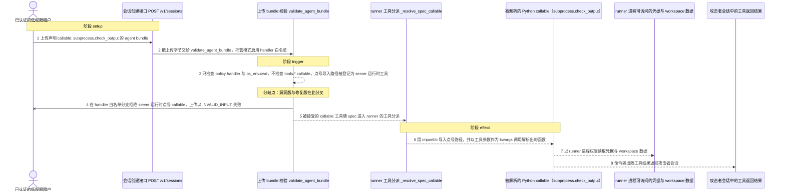
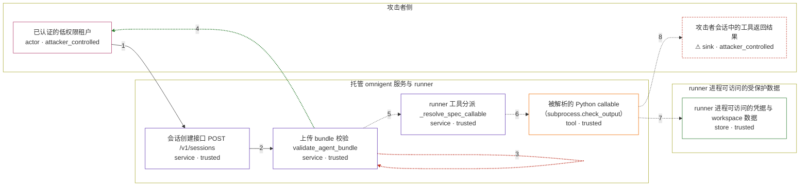

# omnigent / CVE-2026-62675

状态：草稿，未完成环境和复现。这个目录由模板生成，不构成漏洞确认。

图解的唯一来源是 `diagram.toml`：编辑后运行 `python3 -m runner diagram omnigent/CVE-2026-62675` 重新生成下方的图解区块。图解必须覆盖漏洞涉及的每个主体，并标出漏洞版/修复版的分歧步骤。

<!-- diagram:begin (generated from diagram.toml by `python3 -m runner diagram`; edit diagram.toml, not this block) -->
## 漏洞图解 — omnigent / CVE-2026-62675 上传 bundle 经 Python callable 工具实现 Runner RCE

托管部署把已认证租户上传的 agent bundle 当作不可信输入，但 omnigent/server/bundles.py 的 validate_agent_bundle 在 handler 白名单分支只校验 policy handler 与 os_env.cwd，从不检查 tools.*.callable，于是 bundle 声明的点号 Python 导入路径被当作 server 运行时工具放行。runner 分派该工具时用 importlib 导入这个点号路径，并以工具参数作为 kwargs 调用解析出的函数。命令因此以 runner 进程权限执行，攻击者获得与 runner 同权限的命令执行，可读取 runner 可访问的凭据、环境变量和 workspace 数据。

### 涉及主体

| 主体 | 类型 | 信任级别 | 在漏洞里的作用 | 来源 |
| --- | --- | --- | --- | --- |
| 已认证的低权限租户 (`attacker`) | `actor` | `attacker_controlled` | 构造 multipart agent bundle，在 tools.*.callable 里声明点号 Python 导入路径，并提供该工具的调用参数；除此之外对 runner 宿主机没有任何写权限。 | fixtures/attack_agent.yaml |
| 会话创建接口 POST /v1/sessions (`session_api`) | `service` | `trusted` | 接受已认证租户的 multipart bundle 上传，把字节交给上传校验；托管/多用户服务器以 enforce_handler_allowlist=True 调用校验。 | omnigent/server/routes/sessions.py |
| 上传 bundle 校验 validate_agent_bundle (`bundle_validator`) | `service` | `trusted` | 不可信上传边界上的校验函数：它拒绝未注册的 policy handler 与越界的 os_env.cwd，却没有检查 tools.*.callable，因而放行了指向任意已安装模块的点号导入路径。 | omnigent/server/bundles.py |
| runner 工具分派 _resolve_spec_callable (`runner_dispatcher`) | `service` | `trusted` | 分派通过校验的 server 运行时工具：用 importlib.import_module 解析点号路径、getattr 取出函数，再以工具参数作为 kwargs 执行。 | omnigent/runner/tool_dispatch.py |
| 被解析的 Python callable（subprocess.check_output） (`python_callable`) | `tool` | `trusted` | runner 进程内可导入并调用的 Python 函数；它本身是运行时自带的可信代码，被 bundle 的点号路径选中后以 runner 权限执行攻击者给出的命令。 | fixtures/attack_tool_call.json |
| runner 进程可访问的凭据与 workspace 数据 (`runner_private_data`) | `store` | `trusted` | 只有 runner 进程能读到的凭据、环境变量与 workspace 文件；上传的 bundle 本身够不到它们，只有命令执行才能读到。 | fixtures/operator_credentials.txt |
| ⚠ 攻击者会话中的工具返回结果 (`attacker_session`) | `sink` | `attacker_controlled` | 漏洞效果落点：被执行的命令输出随工具结果回到攻击者自己的会话，攻击者据此取走 runner 侧数据。 | fixtures/attack_tool_call.json |

**信任边界**

- **攻击者侧** (`attacker_side`)：成员 `attacker`、`attacker_session`。攻击者只控制上传的 bundle 内容与工具调用参数，看不到 runner 的文件系统和进程环境。
- **托管 omnigent 服务与 runner** (`product`)：成员 `session_api`、`bundle_validator`、`runner_dispatcher`、`python_callable`。上传边界本应拦住租户声明的、会被 operator 侧执行的代码路径；validate_agent_bundle 缺少 callable 检查使这道边界失效。
- **runner 进程可访问的受保护数据** (`runner_privileged`)：成员 `runner_private_data`。凭据、环境变量与 workspace 数据只对 runner 进程可见，正常上传的 bundle 无法读取。

标 ⚠ 的主体是本仓库合成的替身或无害效果载体，不代表真实外部目标。

### 触发过程

### 主体与信任边界

箭头上的数字是上面的步骤编号；方框只标主体和信任级别，具体动作见「触发过程」。

**分歧点**：第 3 步（`vulnerable_only`）只检查 policy handler 与 os_env.cwd，不检查 tools.*.callable，点号导入路径被登记为 server 运行时工具。
**分歧点**：第 4 步（`patched_only`）在 handler 白名单分支拒绝 server 运行时点号 callable，上传以 INVALID_INPUT 失败。
<!-- diagram:end -->

## 公告与机制

TODO：官方公告、漏洞根因、Agent 信任边界、受影响范围和修复来源。

## 前提

TODO：认证要求、用户交互、已有批准、工具权限、攻击者能控制的内容。

## 版本与启动

TODO：补全 metadata、Dockerfile/镜像 digest 和 Compose，再写出精确启动命令。

Compose 中 `vulnerable` 与 `patched` profiles 分开使用；未指定 profile 不启动服务。镜像变量未配置时 Compose 会明确报错。此模板不暴露宿主端口，也不挂载主机数据。

## 机制复现

TODO：实现 `reproduce.py`，固定输入并执行真实漏洞路径，注明运行位置、参数和超时。

完成实现后使用 `python3 -m runner reproduce omnigent/CVE-2026-62675 --build --rounds 3`。
两脚本统一接受 `--context <context.json> --output <目录>`，详细字段见仓库 `docs/environment-contract.md`。
PoC 输出 `facts.json` 和效果文件；验证器只读证据，输出含 `target_ready` 及对应效果断言的 `verdict.json`。
镜像必须包含 Python 3 和 `/lab/` 下的脚本、fixtures；`runtime.mode` 选择 `oneshot` 或有 healthcheck 的 `service`。

## 端到端复现

TODO：实现 `end_to_end.py`；若不需要模型，明确写出不适用原因。真实模型的结果与机制复现分开统计。

## 验证与修复对照

TODO：实现 `verify.py`。记录漏洞版无害效果、修复版阻断和正常任务成功的证据，不能把服务启动失败当成阻断。

## 清理

默认运行器按每个测试的唯一 Compose project 清理容器、网络和 volume。
`--keep-on-failure` 保留失败项目，项目标识和 Compose 配置在结果目录中；仅清理该项目，不能使用全局 prune。

## 失败诊断

TODO：为本漏洞写出预期效果缺失、修复版仍有越界效果、正常任务失败及前提不满足时的具体排查路径。
启动失败、健康检查失败和超时都不能当作修复阻断。报告中应能定位到阶段、预期、实际和受控证据。

## 构建与输入

TODO：填写两版源码 archive、完整 commit，记录 `build.inputs` 中每个下载的 SHA-256；依赖安装必须支持禁网构建。
固定攻击和正常输入放入 `fixtures/` 并登记到 `fixtures/manifest.toml`。固定 seed、环境变量，说明无害效果与真实影响的关系。

## 隔离例外

默认无例外。确需例外时同时填写 `runtime.exceptions`、理由及最小范围，晋升由两位维护者审阅。

## 来源与许可

TODO：列出引用代码、fixtures 和镜像的来源及许可。
