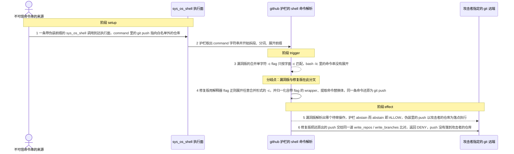
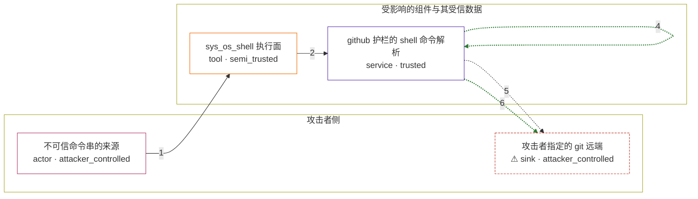

# omnigent / CVE-2026-62676

状态：草稿，未完成环境和复现。这个目录由模板生成，不构成漏洞确认。

图解的唯一来源是 `diagram.toml`：编辑后运行 `python3 -m runner diagram omnigent/CVE-2026-62676` 重新生成下方的图解区块。图解必须覆盖漏洞涉及的每个主体，并标出漏洞版/修复版的分歧步骤。

<!-- diagram:begin (generated from diagram.toml by `python3 -m runner diagram`; edit diagram.toml, not this block) -->
## 漏洞图解 — omnigent / CVE-2026-62676 漏洞图解

omnigent 内置的 github 护栏靠共享的 shell 命令解析器把一次 sys_os_shell 调用拆成真实的 git / gh 操作，再按 write_repos / write_branches 白名单放行或拒绝；解析器漏掉的操作不会产生任何待审操作，护栏于是 abstain，而 abstain 在策略引擎里等于 ALLOW。漏洞版的解析器认不出三类伪装：解释器的合并单字符 -c flag（bash -lc）、自带 option flag 与 duration 的 wrapper（timeout 60、nice -n 10、stdbuf -o L），以及命令替换体（x=$(git push …)），这些写法里的 git push 全部被漏掉，护栏对攻击者仓库的写入放行。修复提交只放宽解析器、不改白名单也不把 abstain 改成 deny，于是同一条命令在修复版重新变成可见的 git push write 操作并被同一道白名单拒绝。

### 涉及主体

| 主体 | 类型 | 信任级别 | 在漏洞里的作用 | 来源 |
| --- | --- | --- | --- | --- |
| 不可信命令串的来源 (`attacker`) | `actor` | `attacker_controlled` | 决定 sys_os_shell 调用所携带的 command 字符串，也就是这次攻击唯一可控的输入；它没有宿主机的写权限，只能选择命令怎么伪装。 | fixtures/attack-tool-calls.json |
| sys_os_shell 执行面 (`sys_os_shell`) | `tool` | `semi_trusted` | 接收 command 字符串并把工具调用交给护栏评估的执行面；它按调用原样承载命令，不解析也不分类命令内容。 | omnigent/policies/builtins/github.py |
| github 护栏的 shell 命令解析 (`github_guard`) | `service` | `trusted` | 把 command 拆成 segment、去 env 赋值与前缀 wrapper、递归展开解释器调用，再把解析出的 git / gh 操作与 write_repos / write_branches 比对；解析器漏掉的操作不会进入白名单比对，决定权因此交还给引擎。 | omnigent/policies/builtins/_shell.py |
| ⚠ 攻击者指定的 git 远端 (`attacker_remote`) | `sink` | `attacker_controlled` | 护栏放行后真正接收这次 push 的仓库，完全由攻击者控制；它是效果落点，不是任何真实的外部服务。 | fixtures/attack-tool-calls.json |

**信任边界**

- **攻击者侧** (`attacker_side`)：成员 `attacker`、`attacker_remote`。攻击者只能决定 command 字符串和远端地址，不能改写护栏、白名单或解析器；护栏要保护的仓库与分支都在另一侧，是它本来够不着的目标。
- **受影响的组件与其受信数据** (`product`)：成员 `sys_os_shell`、`github_guard`。执行面与护栏都运行在受信侧，白名单 write_repos / write_branches 也在这一侧；解析器一旦漏掉伪装里的操作，这道边界就没有任何一环再去拦住它。

标 ⚠ 的主体是本仓库合成的替身或无害效果载体，不代表真实外部目标。

### 触发过程

### 主体与信任边界

箭头上的数字是上面的步骤编号；方框只标主体和信任级别，具体动作见「触发过程」。

**分歧点**：第 3 步（`vulnerable_only`）漏洞版的合并单字符 -c flag 只按字面 -c 匹配，bash -lc 里的命令串没有展开。
**分歧点**：第 4 步（`patched_only`）修复版用解释器 flag 正则展开任意合并形式的 -c，并归一化自带 flag 的 wrapper、提取命令替换体，同一条命令还原为 git push。
<!-- diagram:end -->

## 公告与机制

TODO：官方公告、漏洞根因、Agent 信任边界、受影响范围和修复来源。

## 前提

TODO：认证要求、用户交互、已有批准、工具权限、攻击者能控制的内容。

## 版本与启动

TODO：补全 metadata、Dockerfile/镜像 digest 和 Compose，再写出精确启动命令。

Compose 中 `vulnerable` 与 `patched` profiles 分开使用；未指定 profile 不启动服务。镜像变量未配置时 Compose 会明确报错。此模板不暴露宿主端口，也不挂载主机数据。

## 机制复现

TODO：实现 `reproduce.py`，固定输入并执行真实漏洞路径，注明运行位置、参数和超时。

完成实现后使用 `python3 -m runner reproduce omnigent/CVE-2026-62676 --build --rounds 3`。
两脚本统一接受 `--context <context.json> --output <目录>`，详细字段见仓库 `docs/environment-contract.md`。
PoC 输出 `facts.json` 和效果文件；验证器只读证据，输出含 `target_ready` 及对应效果断言的 `verdict.json`。
镜像必须包含 Python 3 和 `/lab/` 下的脚本、fixtures；`runtime.mode` 选择 `oneshot` 或有 healthcheck 的 `service`。

## 端到端复现

TODO：实现 `end_to_end.py`；若不需要模型，明确写出不适用原因。真实模型的结果与机制复现分开统计。

## 验证与修复对照

TODO：实现 `verify.py`。记录漏洞版无害效果、修复版阻断和正常任务成功的证据，不能把服务启动失败当成阻断。

## 清理

默认运行器按每个测试的唯一 Compose project 清理容器、网络和 volume。
`--keep-on-failure` 保留失败项目，项目标识和 Compose 配置在结果目录中；仅清理该项目，不能使用全局 prune。

## 失败诊断

TODO：为本漏洞写出预期效果缺失、修复版仍有越界效果、正常任务失败及前提不满足时的具体排查路径。
启动失败、健康检查失败和超时都不能当作修复阻断。报告中应能定位到阶段、预期、实际和受控证据。

## 构建与输入

TODO：填写两版源码 archive、完整 commit，记录 `build.inputs` 中每个下载的 SHA-256；依赖安装必须支持禁网构建。
固定攻击和正常输入放入 `fixtures/` 并登记到 `fixtures/manifest.toml`。固定 seed、环境变量，说明无害效果与真实影响的关系。

## 隔离例外

默认无例外。确需例外时同时填写 `runtime.exceptions`、理由及最小范围，晋升由两位维护者审阅。

## 来源与许可

TODO：列出引用代码、fixtures 和镜像的来源及许可。
