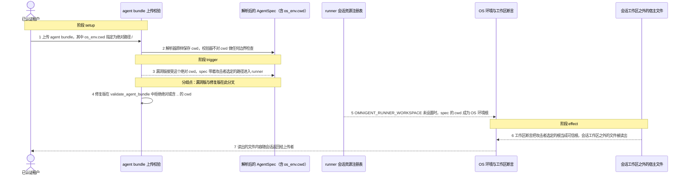
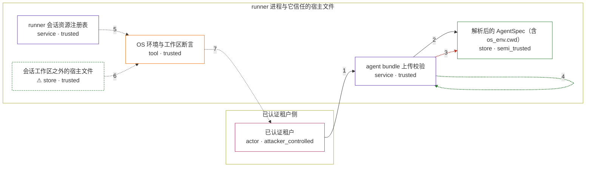

# omnigent / CVE-2026-62677

状态：草稿，未完成环境和复现。这个目录由模板生成，不构成漏洞确认。

图解的唯一来源是 `diagram.toml`：编辑后运行 `python3 -m runner diagram omnigent/CVE-2026-62677` 重新生成下方的图解区块。图解必须覆盖漏洞涉及的每个主体，并标出漏洞版/修复版的分歧步骤。

<!-- diagram:begin (generated from diagram.toml by `python3 -m runner diagram`; edit diagram.toml, not this block) -->
## 漏洞图解 — omnigent / CVE-2026-62677：上传 bundle 的 os_env.cwd 逃逸会话工作区

omnigent 的上传校验不约束 agent bundle 里的 os_env.cwd。多用户 runner 上未设置 OMNIGENT_RUNNER_WORKSPACE 时，攻击者上传的绝对 cwd 会成为 OS 环境根，工作区断言随之把攻击者选定的目录当成可信根；read、write、edit、shell 因此可以越过会话工作区读写宿主文件。

### 涉及主体

| 主体 | 类型 | 信任级别 | 在漏洞里的作用 | 来源 |
| --- | --- | --- | --- | --- |
| 已认证租户 (`attacker`) | `actor` | `attacker_controlled` | 上传 agent bundle 的非管理员用户；它只控制 bundle 内容，os_env.cwd 这个字段由它指定。 | fixtures/attack-bundle.tar.gz |
| agent bundle 上传校验 (`upload_validation`) | `service` | `trusted` | 上游的上传校验入口：解析 bundle 并校验 spec。漏洞版不约束 os_env.cwd，修复版在这里拒绝绝对路径和含 .. 的路径。 | omnigent/server/bundles.py |
| 解析后的 AgentSpec（含 os_env.cwd） (`agent_spec`) | `store` | `semi_trusted` | 上传内容的解析结果，原样携带攻击者选定的 cwd，并成为 runner 侧环境根的来源。 | omnigent/spec/parser.py |
| runner 会话资源注册表 (`resource_registry`) | `service` | `trusted` | runner 侧环境根的决策点：OMNIGENT_RUNNER_WORKSPACE 未设置时，spec 里的 cwd 直接成为环境根。 | omnigent/runner/resource_registry.py |
| OS 环境与工作区断言 (`os_env`) | `tool` | `trusted` | 创建真实 OS 环境并执行 read、write、edit、shell；它只校验目标是否落在环境根之下，而环境根已经来自攻击者。 | omnigent/inner/os_env.py |
| ⚠ 会话工作区之外的宿主文件 (`host_files`) | `store` | `trusted` | 攻击者想读却本不该够到的宿主文件，这里用无害的标记文件代表，不对应真实的外部目标。 | — |

**信任边界**

- **已认证租户侧** (`tenant_side`)：成员 `attacker`。上传者只能控制 bundle 的内容；它够不到 runner 上的宿主文件，这正是它要绕过的边界。
- **runner 进程与它信任的宿主文件** (`runner_side`)：成员 `upload_validation`、`agent_spec`、`resource_registry`、`os_env`、`host_files`。上传校验、环境根解析和工作区断言本应把文件访问限制在会话工作区内。漏洞让环境根变成攻击者选定的目录，断言随之失去意义。

标 ⚠ 的主体是本仓库合成的替身或无害效果载体，不代表真实外部目标。

### 触发过程

### 主体与信任边界

箭头上的数字是上面的步骤编号；方框只标主体和信任级别，具体动作见「触发过程」。

**分歧点**：第 3 步（`vulnerable_only`）漏洞版接受这个绝对 cwd，spec 带着攻击者选定的路径进入 runner。
**分歧点**：第 4 步（`patched_only`）修复版在 validate_agent_bundle 中拒绝绝对或含 .. 的 cwd。
<!-- diagram:end -->

## 公告与机制

TODO：官方公告、漏洞根因、Agent 信任边界、受影响范围和修复来源。

## 前提

TODO：认证要求、用户交互、已有批准、工具权限、攻击者能控制的内容。

## 版本与启动

TODO：补全 metadata、Dockerfile/镜像 digest 和 Compose，再写出精确启动命令。

Compose 中 `vulnerable` 与 `patched` profiles 分开使用；未指定 profile 不启动服务。镜像变量未配置时 Compose 会明确报错。此模板不暴露宿主端口，也不挂载主机数据。

## 机制复现

TODO：实现 `reproduce.py`，固定输入并执行真实漏洞路径，注明运行位置、参数和超时。

完成实现后使用 `python3 -m runner reproduce omnigent/CVE-2026-62677 --build --rounds 3`。
两脚本统一接受 `--context <context.json> --output <目录>`，详细字段见仓库 `docs/environment-contract.md`。
PoC 输出 `facts.json` 和效果文件；验证器只读证据，输出含 `target_ready` 及对应效果断言的 `verdict.json`。
镜像必须包含 Python 3 和 `/lab/` 下的脚本、fixtures；`runtime.mode` 选择 `oneshot` 或有 healthcheck 的 `service`。

## 端到端复现

TODO：实现 `end_to_end.py`；若不需要模型，明确写出不适用原因。真实模型的结果与机制复现分开统计。

## 验证与修复对照

TODO：实现 `verify.py`。记录漏洞版无害效果、修复版阻断和正常任务成功的证据，不能把服务启动失败当成阻断。

## 清理

默认运行器按每个测试的唯一 Compose project 清理容器、网络和 volume。
`--keep-on-failure` 保留失败项目，项目标识和 Compose 配置在结果目录中；仅清理该项目，不能使用全局 prune。

## 失败诊断

TODO：为本漏洞写出预期效果缺失、修复版仍有越界效果、正常任务失败及前提不满足时的具体排查路径。
启动失败、健康检查失败和超时都不能当作修复阻断。报告中应能定位到阶段、预期、实际和受控证据。

## 构建与输入

TODO：填写两版源码 archive、完整 commit，记录 `build.inputs` 中每个下载的 SHA-256；依赖安装必须支持禁网构建。
固定攻击和正常输入放入 `fixtures/` 并登记到 `fixtures/manifest.toml`。固定 seed、环境变量，说明无害效果与真实影响的关系。

## 隔离例外

默认无例外。确需例外时同时填写 `runtime.exceptions`、理由及最小范围，晋升由两位维护者审阅。

## 来源与许可

TODO：列出引用代码、fixtures 和镜像的来源及许可。
