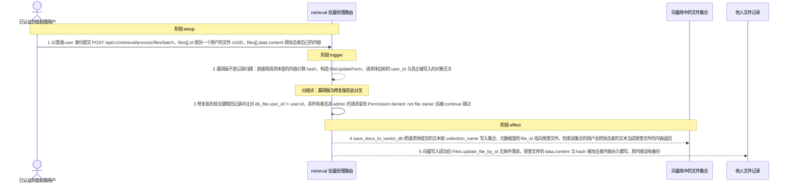
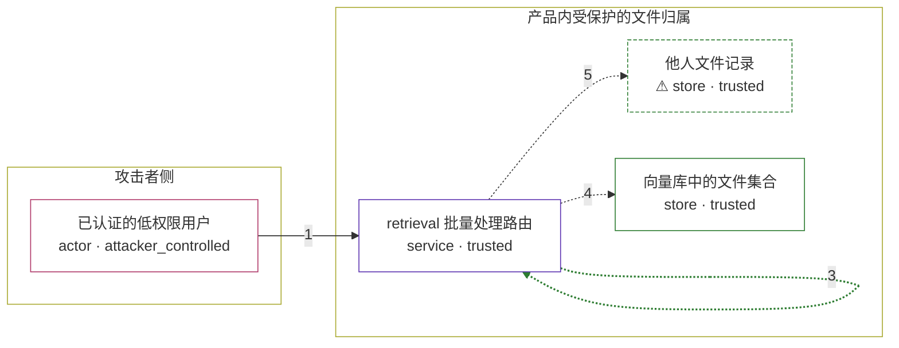

# open-webui / CVE-2026-28788

状态：草稿，未完成环境和复现。这个目录由模板生成，不构成漏洞确认。

图解的唯一来源是 `diagram.toml`：编辑后运行 `python3 -m runner diagram open-webui/CVE-2026-28788` 重新生成下方的图解区块。图解必须覆盖漏洞涉及的每个主体，并标出漏洞版/修复版的分歧步骤。

<!-- diagram:begin (generated from diagram.toml by `python3 -m runner diagram`; edit diagram.toml, not this block) -->
## 漏洞图解 — open-webui / CVE-2026-28788 漏洞图解

Open WebUI 的 POST /api/v1/retrieval/process/files/batch 只校验调用者已认证，从不比较请求体里的文件 UUID 与调用者的归属关系，因此把 Files 表中的任意 file 行当成可写对象。任何 role = user 的账号只要能拿到另一个 用户的文件 UUID，就能用自己的内容覆写该文件的 data.content 与 hash，把对共享知识库的只读权限升级为无授权的 永久写入；被覆写的内容还会带着受害文件的 file_id 进入向量库，检索时返回给该知识库的其他用户。

### 涉及主体

| 主体 | 类型 | 信任级别 | 在漏洞里的作用 | 来源 |
| --- | --- | --- | --- | --- |
| 已认证的低权限用户 (`attacker`) | `actor` | `attacker_controlled` | 持有 role = user 的会话；它唯一能控制的是这一次 HTTP 请求：目标文件 UUID、files[].data.content 写什么、用哪个 collection_name，全部由它决定。 | — |
| retrieval 批量处理路由 (`retrieval_api`) | `service` | `trusted` | process_files_batch() 的依赖只有 get_verified_user，函数签名也不接受任何用户上下文；它遍历请求体中的 files，直接用请求体里的内容构造 FileUpdateForm 并调用 Files.update_file_by_id，全程没有 file.user_id == user.id 的比较。 | — |
| ⚠ 他人文件记录 (`victim_file`) | `store` | `trusted` | Files 表中属于另一个用户的 file 行，由该用户自己的上传流程创建；记录里的 data.content 只承载一段无害标记文本，不是真实用户的文档，但它的归属关系与真实记录完全一致。 | — |
| 向量库中的文件集合 (`vector_store`) | `store` | `trusted` | 按 collection_name 保存文件切片的向量集合；save_docs_to_vector_db() 把请求体提交的文本连同元数据里的 file_id 一起写进去，之后检索该集合的用户会读到这段文本，把它当成受害文件的内容。 | — |

**信任边界**

- **攻击者侧** (`attacker_side`)：成员 `attacker`。攻击者只能控制自己的会话与请求体，既不能直接写数据库，也不能把目标文件改成自己所有。
- **产品内受保护的文件归属** (`product`)：成员 `retrieval_api`、`victim_file`、`vector_store`。这道边界本应由 file.user_id 与调用者身份的比较来维持：文件记录只允许其所有者经知识库包装器处理。同一个函数被直接暴露成独立 HTTP 端点时，却没有带上这层校验。

标 ⚠ 的主体是本仓库合成的替身或无害效果载体，不代表真实外部目标。

### 触发过程

### 主体与信任边界

箭头上的数字是上面的步骤编号；方框只标主体和信任级别，具体动作见「触发过程」。

**分歧点**：第 2 步（`vulnerable_only`）漏洞版不查记录归属：直接用请求体里的内容计算 hash、构造 FileUpdateForm，请求体自称的 user_id 与真正被写入的对象无关。
**分歧点**：第 3 步（`patched_only`）修复版先按主键取回记录并比对 db_file.user_id != user.id，非所有者且非 admin 的请求拿到 Permission denied: not file owner 后被 continue 跳过。
<!-- diagram:end -->

## 公告与机制

TODO：官方公告、漏洞根因、Agent 信任边界、受影响范围和修复来源。

## 前提

TODO：认证要求、用户交互、已有批准、工具权限、攻击者能控制的内容。

## 版本与启动

TODO：补全 metadata、Dockerfile/镜像 digest 和 Compose，再写出精确启动命令。

Compose 中 `vulnerable` 与 `patched` profiles 分开使用；未指定 profile 不启动服务。镜像变量未配置时 Compose 会明确报错。此模板不暴露宿主端口，也不挂载主机数据。

## 机制复现

TODO：实现 `reproduce.py`，固定输入并执行真实漏洞路径，注明运行位置、参数和超时。

完成实现后使用 `python3 -m runner reproduce open-webui/CVE-2026-28788 --build --rounds 3`。
两脚本统一接受 `--context <context.json> --output <目录>`，详细字段见仓库 `docs/environment-contract.md`。
PoC 输出 `facts.json` 和效果文件；验证器只读证据，输出含 `target_ready` 及对应效果断言的 `verdict.json`。
镜像必须包含 Python 3 和 `/lab/` 下的脚本、fixtures；`runtime.mode` 选择 `oneshot` 或有 healthcheck 的 `service`。

## 端到端复现

TODO：实现 `end_to_end.py`；若不需要模型，明确写出不适用原因。真实模型的结果与机制复现分开统计。

## 验证与修复对照

TODO：实现 `verify.py`。记录漏洞版无害效果、修复版阻断和正常任务成功的证据，不能把服务启动失败当成阻断。

## 清理

默认运行器按每个测试的唯一 Compose project 清理容器、网络和 volume。
`--keep-on-failure` 保留失败项目，项目标识和 Compose 配置在结果目录中；仅清理该项目，不能使用全局 prune。

## 失败诊断

TODO：为本漏洞写出预期效果缺失、修复版仍有越界效果、正常任务失败及前提不满足时的具体排查路径。
启动失败、健康检查失败和超时都不能当作修复阻断。报告中应能定位到阶段、预期、实际和受控证据。

## 构建与输入

TODO：填写两版源码 archive、完整 commit，记录 `build.inputs` 中每个下载的 SHA-256；依赖安装必须支持禁网构建。
固定攻击和正常输入放入 `fixtures/` 并登记到 `fixtures/manifest.toml`。固定 seed、环境变量，说明无害效果与真实影响的关系。

## 隔离例外

默认无例外。确需例外时同时填写 `runtime.exceptions`、理由及最小范围，晋升由两位维护者审阅。

## 来源与许可

TODO：列出引用代码、fixtures 和镜像的来源及许可。
