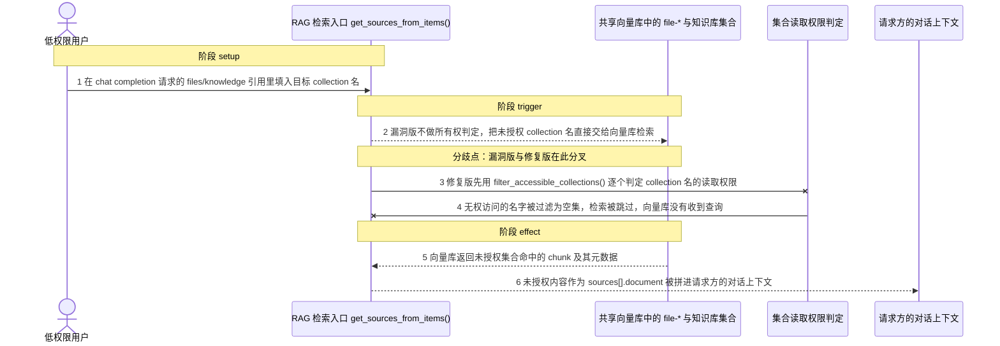
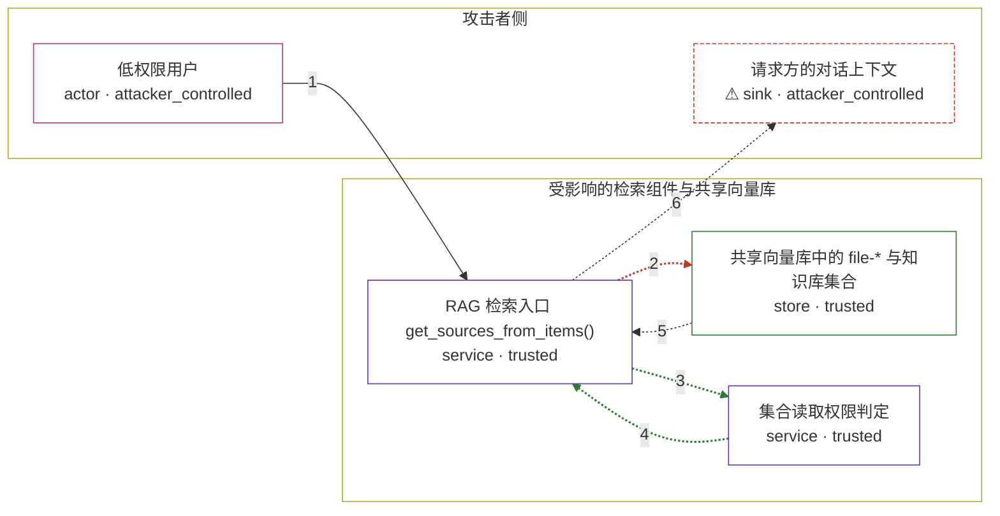

# open-webui / CVE-2026-44560

状态：草稿，未完成环境和复现。这个目录由模板生成，不构成漏洞确认。

图解的唯一来源是 `diagram.toml`：编辑后运行 `python3 -m runner diagram open-webui/CVE-2026-44560` 重新生成下方的图解区块。图解必须覆盖漏洞涉及的每个主体，并标出漏洞版/修复版的分歧步骤。

<!-- diagram:begin (generated from diagram.toml by `python3 -m runner diagram`; edit diagram.toml, not this block) -->
## 漏洞图解 — Open WebUI RAG 检索缺失授权读取文件与知识库内容

低权限用户可以在 chat completion 请求的 files/knowledge 引用里填入任意 collection 名，get_sources_from_items() 在把名字交给向量库之前不校验所有权，于是未授权的文件与知识库 chunk 被检索出来并拼进该用户的对话上下文。修复版在检索前对 collection 名逐个做读取权限判定，无权访问的名字被过滤掉，向量库根本收不到这次查询。

### 涉及主体

| 主体 | 类型 | 信任级别 | 在漏洞里的作用 | 来源 |
| --- | --- | --- | --- | --- |
| 低权限用户 (`attacker`) | `actor` | `attacker_controlled` | 持有效账号的普通用户，只能控制自己这次 chat completion 请求里的参数：files[].id、files[].collection_name、collection_names，以及 {'type':'text','collection_name':...}；它知道目标 file/KB 的 UUID，但不拥有这些资源。 | fixtures/attack.json |
| RAG 检索入口 get_sources_from_items() (`retrieval_service`) | `service` | `trusted` | 上游 backend/open_webui/retrieval/utils.py 中的 get_sources_from_items()：把请求里的 files/knowledge 引用解析成 collection 名并调用向量库检索。漏洞版在检索前没有所有权校验，修复版在该调用点之前插入 filter_accessible_collections()。 | backend/open_webui/retrieval/utils.py |
| 共享向量库中的 file-* 与知识库集合 (`vector_store`) | `store` | `trusted` | 保存所有用户已 embed 的文件与知识库 chunk；只按调用方给出的 collection 名返回命中内容，自身不做授权判定，因此边界必须由检索入口把守。 | fixtures/collections.json |
| 集合读取权限判定 (`access_policy`) | `service` | `trusted` | 修复版新增的 filter_accessible_collections()：对 knowledge-bases 一律拒绝，对 file-* 调 has_access_to_file，对 user-memory-* 要求等于本人的集合，其余名字按知识库归属判定；无权访问的名字不会进入检索。 | fixtures/access.json |
| ⚠ 请求方的对话上下文 (`chat_context`) | `sink` | `attacker_controlled` | 检索结果被拼进请求方的 LLM 上下文；未授权 chunk 一旦进入这里，低权限用户就实际读到了本来无权访问的文件或知识库内容。此处标出的是无害 canary，不代表真实外部目标。 | — |

**信任边界**

- **攻击者侧** (`attacker_side`)：成员 `attacker`、`chat_context`。攻击者只能控制自己请求里的 collection 名和最终拿到内容的对话上下文；它想读的文件与知识库内容在边界内侧，它自己够不着。
- **受影响的检索组件与共享向量库** (`product`)：成员 `retrieval_service`、`vector_store`、`access_policy`。这道边界本应保证只有资源所有者或其被授权者能读到对应 collection；漏洞版在检索前不做判定，collection 名被直接交给向量库。

标 ⚠ 的主体是本仓库合成的替身或无害效果载体，不代表真实外部目标。

### 触发过程

### 主体与信任边界

箭头上的数字是上面的步骤编号；方框只标主体和信任级别，具体动作见「触发过程」。

**分歧点**：第 2 步（`vulnerable_only`）漏洞版不做所有权判定，把未授权 collection 名直接交给向量库检索。
**分歧点**：第 3 步（`patched_only`）修复版先用 filter_accessible_collections() 逐个判定 collection 名的读取权限。
<!-- diagram:end -->

## 公告与机制

TODO：官方公告、漏洞根因、Agent 信任边界、受影响范围和修复来源。

## 前提

TODO：认证要求、用户交互、已有批准、工具权限、攻击者能控制的内容。

## 版本与启动

TODO：补全 metadata、Dockerfile/镜像 digest 和 Compose，再写出精确启动命令。

Compose 中 `vulnerable` 与 `patched` profiles 分开使用；未指定 profile 不启动服务。镜像变量未配置时 Compose 会明确报错。此模板不暴露宿主端口，也不挂载主机数据。

## 机制复现

TODO：实现 `reproduce.py`，固定输入并执行真实漏洞路径，注明运行位置、参数和超时。

完成实现后使用 `python3 -m runner reproduce open-webui/CVE-2026-44560 --build --rounds 3`。
两脚本统一接受 `--context <context.json> --output <目录>`，详细字段见仓库 `docs/environment-contract.md`。
PoC 输出 `facts.json` 和效果文件；验证器只读证据，输出含 `target_ready` 及对应效果断言的 `verdict.json`。
镜像必须包含 Python 3 和 `/lab/` 下的脚本、fixtures；`runtime.mode` 选择 `oneshot` 或有 healthcheck 的 `service`。

## 端到端复现

TODO：实现 `end_to_end.py`；若不需要模型，明确写出不适用原因。真实模型的结果与机制复现分开统计。

## 验证与修复对照

TODO：实现 `verify.py`。记录漏洞版无害效果、修复版阻断和正常任务成功的证据，不能把服务启动失败当成阻断。

## 清理

默认运行器按每个测试的唯一 Compose project 清理容器、网络和 volume。
`--keep-on-failure` 保留失败项目，项目标识和 Compose 配置在结果目录中；仅清理该项目，不能使用全局 prune。

## 失败诊断

TODO：为本漏洞写出预期效果缺失、修复版仍有越界效果、正常任务失败及前提不满足时的具体排查路径。
启动失败、健康检查失败和超时都不能当作修复阻断。报告中应能定位到阶段、预期、实际和受控证据。

## 构建与输入

TODO：填写两版源码 archive、完整 commit，记录 `build.inputs` 中每个下载的 SHA-256；依赖安装必须支持禁网构建。
固定攻击和正常输入放入 `fixtures/` 并登记到 `fixtures/manifest.toml`。固定 seed、环境变量，说明无害效果与真实影响的关系。

## 隔离例外

默认无例外。确需例外时同时填写 `runtime.exceptions`、理由及最小范围，晋升由两位维护者审阅。

## 来源与许可

TODO：列出引用代码、fixtures 和镜像的来源及许可。
