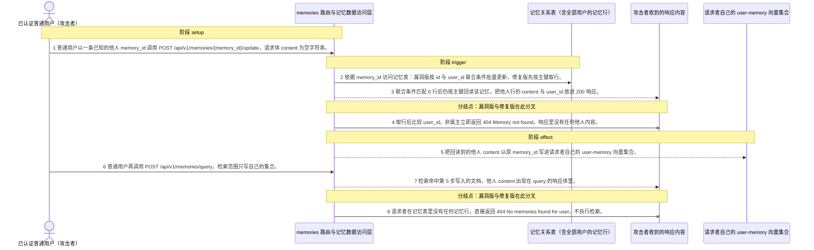
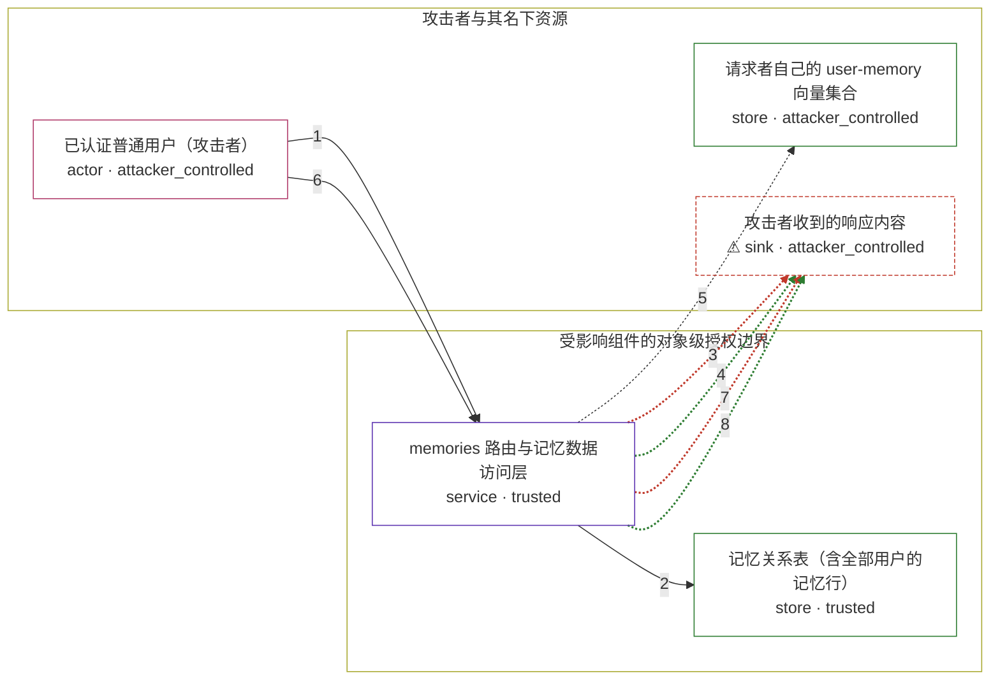

# open-webui / CVE-2026-44570

状态：草稿，未完成环境和复现。这个目录由模板生成，不构成漏洞确认。

图解的唯一来源是 `diagram.toml`：编辑后运行 `python3 -m runner diagram open-webui/CVE-2026-44570` 重新生成下方的图解区块。图解必须覆盖漏洞涉及的每个主体，并标出漏洞版/修复版的分歧步骤。

<!-- diagram:begin (generated from diagram.toml by `python3 -m runner diagram`; edit diagram.toml, not this block) -->
## 漏洞图解 — open-webui / CVE-2026-44570 漏洞图解

memories 路由在 get_verified_user 之后只确认请求者是某个已登录用户，没有把 URL 里的 memory_id 与请求者 user_id 绑定。漏洞版的 update 在按 id 与 user_id 联合条件匹配 0 行后仍按主键回读该行，于是他人记忆的 content 与 user_id 随 200 响应返回，并被写进请求者自己的 user-memory 向量集合；随后 query 只检索自己的集合，就能再次取回这份他人内容。修复版改为取行后比较 user_id，非属主直接返回 404，并要求请求者在关系库里确实拥有记忆才允许检索。

### 涉及主体

| 主体 | 类型 | 信任级别 | 在漏洞里的作用 | 来源 |
| --- | --- | --- | --- | --- |
| 已认证普通用户（攻击者） (`standard_user`) | `actor` | `attacker_controlled` | 持有一个普通账户，能自选 URL 里的 memory_id、自定请求体，并且只拥有自己名下的向量集合。它想要的是别人的记忆内容，而这份数据不在它这一侧。 | — |
| memories 路由与记忆数据访问层 (`memories_api`) | `service` | `trusted` | 只校验请求者是某个已登录用户，不把 URL 里的 memory_id 与请求者 user_id 绑定；update 按 id 回读、query 缺少“请求者确实拥有记忆”的前置校验。修复版在这两处补上归属判断。 | backend/open_webui/routers/memories.py |
| 记忆关系表（含全部用户的记忆行） (`memory_records`) | `store` | `trusted` | 按主键保存每条记忆的 user_id 与 content，是受害者内容的真正归属地，也是本次越权读取的目标。 | backend/open_webui/models/memories.py |
| 请求者自己的 user-memory 向量集合 (`attacker_collection`) | `store` | `attacker_controlled` | 以 user-memory-{user_id} 命名、本该只装请求者自己的记忆；漏洞版把回读到的他人内容写进这个集合，使后续检索能再次命中它。 | backend/open_webui/retrieval/vector/dbs/chroma.py |
| ⚠ 攻击者收到的响应内容 (`leaked_view`) | `sink` | `attacker_controlled` | 漏洞版把他人记忆的 content 与 user_id 放进 update 与 query 的响应体，攻击者由此直接拿到数据；这里承载的是无害标记内容，不是真实用户数据。 | — |

**信任边界**

- **攻击者与其名下资源** (`attacker_side`)：成员 `standard_user`、`attacker_collection`、`leaked_view`。攻击者能控制的只有这次调用的 memory_id、请求体和自己的向量集合；他人的记忆行不在这里，它无法直接查询。
- **受影响组件的对象级授权边界** (`product_side`)：成员 `memories_api`、`memory_records`。memories 层本应把 memory_id 与请求者 user_id 绑定：只有属主才能读写对应的记忆行。漏洞版按主键回读并把结果写进请求者自己的集合，使这道边界失效。

标 ⚠ 的主体是本仓库合成的替身或无害效果载体，不代表真实外部目标。

### 触发过程



### 主体与信任边界

箭头上的数字是上面的步骤编号；方框只标主体和信任级别，具体动作见「触发过程」。



**分歧点**：第 3 步（`vulnerable_only`）联合条件匹配 0 行后仍按主键回读该记忆，把他人行的 content 与 user_id 放进 200 响应。。
**分歧点**：第 4 步（`patched_only`）取行后比较 user_id，非属主立即返回 404 Memory not found，响应里没有任何他人内容。。
**分歧点**：第 7 步（`vulnerable_only`）检索命中第 5 步写入的文档，他人 content 出现在 query 的响应体里。。
**分歧点**：第 8 步（`patched_only`）请求者在记忆表里没有任何记忆行，直接返回 404 No memories found for user，不执行检索。。
<!-- diagram:end -->

## 公告与机制

公告：[GHSA-hmjq-crxp-7rjw](https://github.com/advisories/GHSA-hmjq-crxp-7rjw) /
`CVE-2026-44570`，HIGH，CVSS v3.1 `8.3`，CWE-639（Authorization Bypass Through
User-Controlled Key）。OSV 受影响范围 `introduced 0` → `fixed 0.6.19`，最后受影响版本
`v0.6.18`（`5fbfe2bdcadf5f157926f6551891e4dc0802b9f3`），修复版本 `v0.6.19`
（`2c3655a9694fc3f9a428e5521f42a187901d8dc0`）。

根因：memories API 的三个端点都只依赖 `get_verified_user`，它只证明请求者是某个已登录用户，
不校验 URL 里的 `memory_id` 是否属于该用户；`memory_id` 因此是攻击者可控的 user-controlled key。

- `POST /api/v1/memories/{memory_id}/update`：模型层先按 `id` 与 `user_id` 联合条件批量
  `UPDATE`，在 `memory_id` 属于他人时匹配 0 行（确实没改数据），但紧接着按主键回读
  （`get_memory_by_id` → `db.get(Memory, id)`），把**受害者**的 `content` 与 `user_id` 放进
  `200` 响应。路由随后在 `content is not None` 时把这份内容 upsert 进请求者自己的
  `user-memory-{user.id}` 向量集合。
- `POST /api/v1/memories/query`：直接检索并返回请求者自己的集合，缺少“请求者确实拥有记忆”的
  前置校验，于是能再次取回上一步写进自己集合的他人内容。
- `DELETE /api/v1/memories/{memory_id}`：在 `v0.6.18` 已按 `user_id` 过滤，跨用户删除实际
  不生效，但函数忽略受影响行数、无条件返回 `True`，API 会对未授权删除误报成功。

信任边界：缺失的是对象级授权（object-level authorization）——没有把 `memory_id` 与 `user.id`
绑定，且 update 的返回值绕过了 `user_id` 过滤。修复由单个提交
`40ebf8cd62746cb4b9bd01d9b0b31a9013c21384`（`refac: memory handling`）完成，补上三处归属判断：
update/delete 改为按主键取行后显式比较 `user_id`，非属主返回 `None` → 路由 `404 Memory not
found`；query 要求请求者在记忆表里至少有一条自己的记忆，否则 `404 No memories found for user`。

## 前提

- 攻击者只需一个已认证的普通（非 admin）账户，且不需要拥有任何 memory；公告的 PoC 就是用一个
  新建的、无任何 memory 的非 admin 用户。
- 攻击者需要知道一条属于他人的有效 `memory_id`。这是 CWE-639 里的 user-controlled key，属于
  环境前提而不是攻击动作。
- 受害者至少有两条前提事实：一个普通账户，以及记忆表里一条属于它的记忆行。默认注册配置
  （`ENABLE_SIGNUP`）或直接写入 SQLite 种子都能造出这两个用户。
- 关系库为 SQLite、向量库为默认 Chroma persistent；嵌入函数在离线环境用确定性替身固定，
  授权判断只看 `memory_id` 与 `user_id` 的比较，与向量取值无关。

## 版本与启动

TODO：补全 metadata、Dockerfile/镜像 digest 和 Compose，再写出精确启动命令。

Compose 中 `vulnerable` 与 `patched` profiles 分开使用；未指定 profile 不启动服务。镜像变量未配置时 Compose 会明确报错。此模板不暴露宿主端口，也不挂载主机数据。

## 机制复现

`reproduce.py` 不重写也不抽取漏洞函数：它直接挂载被固定的上游 `open_webui.routers.memories`
路由，使用真实的 SQLAlchemy 记忆表与真实的 persistent Chroma 向量客户端，只把调用者身份
（`get_verified_user` 依赖）与嵌入函数作为环境前提注入——这两者在漏洞里都是前提，不是被验证的
授权逻辑。镜像按 `vulnerable` / `patched` 变体分别装对应 commit 的上游源码，脚本依据
`context["variant"]` 运行，攻击与正常输入取自 `/lab/fixtures/`：

- `attack`：`attacker` 无 memory（前提）。先 `GET /api/v1/memories/` 记录攻击者视角为空，再
  `POST /api/v1/memories/{victim_memory_id}/update`（请求体 `content` 为空字符串）、
  `POST /api/v1/memories/query`，最后 `DELETE /api/v1/memories/{victim_memory_id}` 记录删除探测。
- `benign`：`owner` 通过 `POST /api/v1/memories/add` 新建自己的记忆、用
  `POST /api/v1/memories/{id}/update` 改内容、再 `POST /api/v1/memories/query` 取回；两版都必须成功。

可观察效果写到 `args.output`：`result.json`（每步状态码、响应是否含受害者标记、删除探测后的行是否
仍在）与 `transcript.json`（原始请求/响应）。`observation.json` 显式记录 `target_ready` 与
`execution_status`。运行命令：

```sh
python3 -m runner reproduce open-webui/CVE-2026-44570 --build --rounds 3
```
两脚本统一接受 `--context <context.json> --output <目录>`，详细字段见仓库 `docs/environment-contract.md`。
PoC 输出 `facts.json` 和效果文件；验证器只读证据，输出含 `target_ready` 及对应效果断言的 `verdict.json`。
镜像必须包含 Python 3 和 `/lab/` 下的脚本、fixtures；`runtime.mode` 选择 `oneshot` 或有 healthcheck 的 `service`。

## 端到端复现

TODO：实现 `end_to_end.py`；若不需要模型，明确写出不适用原因。真实模型的结果与机制复现分开统计。

## 验证与修复对照

TODO：实现 `verify.py`。记录漏洞版无害效果、修复版阻断和正常任务成功的证据，不能把服务启动失败当成阻断。

## 清理

默认运行器按每个测试的唯一 Compose project 清理容器、网络和 volume。
`--keep-on-failure` 保留失败项目，项目标识和 Compose 配置在结果目录中；仅清理该项目，不能使用全局 prune。

## 失败诊断

TODO：为本漏洞写出预期效果缺失、修复版仍有越界效果、正常任务失败及前提不满足时的具体排查路径。
启动失败、健康检查失败和超时都不能当作修复阻断。报告中应能定位到阶段、预期、实际和受控证据。

## 构建与输入

TODO：填写两版源码 archive、完整 commit，记录 `build.inputs` 中每个下载的 SHA-256；依赖安装必须支持禁网构建。
固定攻击和正常输入放入 `fixtures/` 并登记到 `fixtures/manifest.toml`。固定 seed、环境变量，说明无害效果与真实影响的关系。

## 隔离例外

默认无例外。确需例外时同时填写 `runtime.exceptions`、理由及最小范围，晋升由两位维护者审阅。

## 来源与许可

TODO：列出引用代码、fixtures 和镜像的来源及许可。
