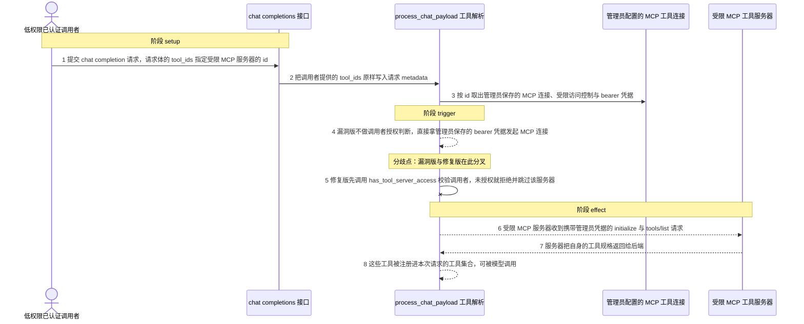
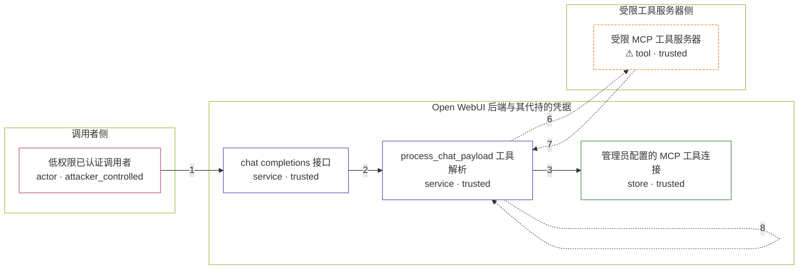

# open-webui / CVE-2026-45350

状态：草稿，未完成环境和复现。这个目录由模板生成，不构成漏洞确认。

图解的唯一来源是 `diagram.toml`：编辑后运行 `python3 -m runner diagram open-webui/CVE-2026-45350` 重新生成下方的图解区块。图解必须覆盖漏洞涉及的每个主体，并标出漏洞版/修复版的分歧步骤。

<!-- diagram:begin (generated from diagram.toml by `python3 -m runner diagram`; edit diagram.toml, not this block) -->
## 漏洞图解 — open-webui / CVE-2026-45350 漏洞图解

Open WebUI 的 chat completion 接口把请求体里的 tool_ids 原样写进 metadata，随后 process_chat_payload 依据其中的 server:mcp:<id> 从管理员配置里取出对应的 MCP 连接，并直接用该连接保存的 bearer 凭据建立连接；v0.6.43 的这条路径没有任何调用者授权判断。低权限调用者只要在请求里带上受限 MCP 服务器的 id，就能让服务端用管理员保存的凭据去连接它，并把该服务器的工具注册进本次请求。修复版在建立连接之前调用 has_tool_server_access 校验调用者，未授权者被拒绝，服务器收不到任何连接。

### 涉及主体

| 主体 | 类型 | 信任级别 | 在漏洞里的作用 | 来源 |
| --- | --- | --- | --- | --- |
| 低权限已认证调用者 (`caller`) | `actor` | `attacker_controlled` | 完全控制自己这一次 chat completion 请求的 body，因此可以任意指定 tool_ids；但它拿不到管理员保存的 MCP bearer 凭据，也无法修改服务端的工具服务器配置。 | fixtures/attack_request.json |
| chat completions 接口 (`chat_completions_api`) | `service` | `trusted` | 接收调用者的请求，把请求体里的 tool_ids 与 tool_servers 原样放进 metadata 后交给后续处理，本身不判断调用者是否有权使用这些工具。 | backend/open_webui/main.py |
| process_chat_payload 工具解析 (`payload_pipeline`) | `service` | `trusted` | 依据 tool_ids 中的 server:mcp:id 从管理员配置中取出 MCP 连接，并决定是否建立连接；v0.6.43 在这里直接使用保存的凭据，缺少调用者授权判断。 | backend/open_webui/utils/middleware.py |
| 管理员配置的 MCP 工具连接 (`tool_server_config`) | `store` | `trusted` | 保存 MCP 服务器地址、只授予管理员的访问控制，以及服务端代持的 bearer 凭据；这些凭据正是攻击者够不着的目标数据。 | fixtures/tool_server_connections.json |
| ⚠ 受限 MCP 工具服务器 (`mcp_server`) | `tool` | `trusted` | 以 bearer 凭据区分调用者，只有持有正确凭据的连接才能让它返回自身的工具规格；它是漏洞链上被越权使用的真实角色。 | fixtures/tool_server_connections.json |

**信任边界**

- **调用者侧** (`caller_side`)：成员 `caller`。调用者能控制的只有这一次请求的参数，包括 tool_ids；它既没有 MCP 凭据，也没有配置权限。
- **Open WebUI 后端与其代持的凭据** (`backend_side`)：成员 `chat_completions_api`、`payload_pipeline`、`tool_server_config`。这道边界本来靠调用者授权判断把普通用户与管理员配置隔开；v0.6.43 的 MCP 分支缺少该判断，保存的凭据因此被代持使用。
- **受限工具服务器侧** (`restricted_tools`)：成员 `mcp_server`。MCP 服务器按凭据放行，本应只接受被授权调用者发起的连接。

标 ⚠ 的主体是本仓库合成的替身或无害效果载体，不代表真实外部目标。

### 触发过程

### 主体与信任边界

箭头上的数字是上面的步骤编号；方框只标主体和信任级别，具体动作见「触发过程」。

**分歧点**：第 4 步（`vulnerable_only`）漏洞版不做调用者授权判断，直接拿管理员保存的 bearer 凭据发起 MCP 连接。
**分歧点**：第 5 步（`patched_only`）修复版先调用 has_tool_server_access 校验调用者，未授权就拒绝并跳过该服务器。
<!-- diagram:end -->

## 公告与机制

TODO：官方公告、漏洞根因、Agent 信任边界、受影响范围和修复来源。

## 前提

TODO：认证要求、用户交互、已有批准、工具权限、攻击者能控制的内容。

## 版本与启动

TODO：补全 metadata、Dockerfile/镜像 digest 和 Compose，再写出精确启动命令。

Compose 中 `vulnerable` 与 `patched` profiles 分开使用；未指定 profile 不启动服务。镜像变量未配置时 Compose 会明确报错。此模板不暴露宿主端口，也不挂载主机数据。

## 机制复现

TODO：实现 `reproduce.py`，固定输入并执行真实漏洞路径，注明运行位置、参数和超时。

完成实现后使用 `python3 -m runner reproduce open-webui/CVE-2026-45350 --build --rounds 3`。
两脚本统一接受 `--context <context.json> --output <目录>`，详细字段见仓库 `docs/environment-contract.md`。
PoC 输出 `facts.json` 和效果文件；验证器只读证据，输出含 `target_ready` 及对应效果断言的 `verdict.json`。
镜像必须包含 Python 3 和 `/lab/` 下的脚本、fixtures；`runtime.mode` 选择 `oneshot` 或有 healthcheck 的 `service`。

## 端到端复现

TODO：实现 `end_to_end.py`；若不需要模型，明确写出不适用原因。真实模型的结果与机制复现分开统计。

## 验证与修复对照

TODO：实现 `verify.py`。记录漏洞版无害效果、修复版阻断和正常任务成功的证据，不能把服务启动失败当成阻断。

## 清理

默认运行器按每个测试的唯一 Compose project 清理容器、网络和 volume。
`--keep-on-failure` 保留失败项目，项目标识和 Compose 配置在结果目录中；仅清理该项目，不能使用全局 prune。

## 失败诊断

TODO：为本漏洞写出预期效果缺失、修复版仍有越界效果、正常任务失败及前提不满足时的具体排查路径。
启动失败、健康检查失败和超时都不能当作修复阻断。报告中应能定位到阶段、预期、实际和受控证据。

## 构建与输入

TODO：填写两版源码 archive、完整 commit，记录 `build.inputs` 中每个下载的 SHA-256；依赖安装必须支持禁网构建。
固定攻击和正常输入放入 `fixtures/` 并登记到 `fixtures/manifest.toml`。固定 seed、环境变量，说明无害效果与真实影响的关系。

## 隔离例外

默认无例外。确需例外时同时填写 `runtime.exceptions`、理由及最小范围，晋升由两位维护者审阅。

## 来源与许可

TODO：列出引用代码、fixtures 和镜像的来源及许可。
