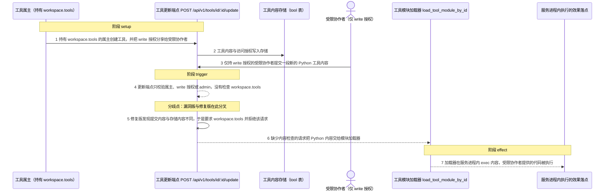
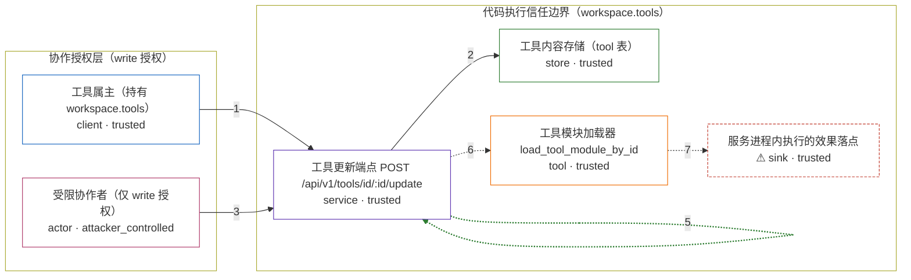

# open-webui / CVE-2026-45395

状态：草稿，未完成环境和复现。这个目录由模板生成，不构成漏洞确认。

图解的唯一来源是 `diagram.toml`：编辑后运行 `python3 -m runner diagram open-webui/CVE-2026-45395` 重新生成下方的图解区块。图解必须覆盖漏洞涉及的每个主体，并标出漏洞版/修复版的分歧步骤。

<!-- diagram:begin (generated from diagram.toml by `python3 -m runner diagram`; edit diagram.toml, not this block) -->
## 漏洞图解 — Open WebUI 工具更新端点缺失 workspace.tools 授权检查

工具创建端点会要求 workspace.tools，工具更新端点却只校验属主、write 授权或 admin。于是一个被管理员明确拒绝 workspace.tools、只拿到某个工具 write 协作授权的用户，可以改写该工具的 Python 内容。更新内容随后被 load_tool_module_by_id 在服务进程内 exec() 执行，write 授权因此越过代码执行信任边界，升级为任意代码执行。

### 涉及主体

| 主体 | 类型 | 信任级别 | 在漏洞里的作用 | 来源 |
| --- | --- | --- | --- | --- |
| 受限协作者（仅 write 授权） (`collaborator`) | `actor` | `attacker_controlled` | 被拒绝 workspace.tools 的用户，只因为工具属主的协作分享而拿到 write 授权；它唯一能控制的输入是提交给更新端点的工具名称、元数据和 Python 内容。 | fixtures/attack_update.json |
| 工具属主（持有 workspace.tools） (`tool_owner`) | `client` | `trusted` | 有权执行工具代码的用户：创建工具并把 write 授权分享给协作者。分享 write 的意图只是让协作者改描述或参数，并不包含执行代码的授权。 | fixtures/accounts.json |
| 工具更新端点 POST /api/v1/tools/id/:id/update (`tools_api`) | `service` | `trusted` | 受影响的上游组件。它在写入内容前只检查属主、write 授权或 admin，缺少创建端点具备的 workspace.tools / workspace.tools_import 检查。 | backend/open_webui/routers/tools.py |
| 工具内容存储（tool 表） (`tool_store`) | `store` | `trusted` | 保存工具当前内容与访问授权的位置。修复版用它和提交内容做比较，只有内容真的变化时才要求 workspace.tools。 | backend/open_webui/models/tools.py |
| 工具模块加载器 load_tool_module_by_id (`module_loader`) | `tool` | `trusted` | 把工具内容写进临时模块并以 exec() 执行的上游代码。它不区分内容来自有权用户还是仅有 write 授权的协作者。 | backend/open_webui/utils/plugin.py |
| ⚠ 服务进程内执行的效果落点 (`exec_effect`) | `sink` | `trusted` | 漏洞利用成功后代码在服务进程内执行并落下的无害标记文件。它是合成的效果载体，不是真实的外部目标；真实的任意代码执行会以服务进程身份读写宿主可达的资源。 | fixtures/tool_attack.py |

**信任边界**

- **协作授权层（write 授权）** (`collaborators`)：成员 `collaborator`、`tool_owner`。write 是跨知识库、提示词、模型和工具通用的内容协作原语。它只表示可以编辑内容，不表示可以执行内容；代码执行权限由 workspace.tools 单独控制。
- **代码执行信任边界（workspace.tools）** (`code_execution`)：成员 `tools_api`、`tool_store`、`module_loader`、`exec_effect`。这道边界要求只有持有 workspace.tools 的用户才能让新的 Python 内容进入 exec()。更新端点用协作层的 write 授权替代了该检查，于是边界内侧的 exec() 对边界外的受限协作者开放。

标 ⚠ 的主体是本仓库合成的替身或无害效果载体，不代表真实外部目标。

### 触发过程

### 主体与信任边界

箭头上的数字是上面的步骤编号；方框只标主体和信任级别，具体动作见「触发过程」。

**分歧点**：第 4 步（`vulnerable_only`）更新端点只校验属主、write 授权或 admin，没有检查 workspace.tools。
**分歧点**：第 5 步（`patched_only`）修复版发现提交内容与存储内容不同，于是要求 workspace.tools 并拒绝该请求。
<!-- diagram:end -->

## 公告与机制

TODO：官方公告、漏洞根因、Agent 信任边界、受影响范围和修复来源。

## 前提

TODO：认证要求、用户交互、已有批准、工具权限、攻击者能控制的内容。

## 版本与启动

TODO：补全 metadata、Dockerfile/镜像 digest 和 Compose，再写出精确启动命令。

Compose 中 `vulnerable` 与 `patched` profiles 分开使用；未指定 profile 不启动服务。镜像变量未配置时 Compose 会明确报错。此模板不暴露宿主端口，也不挂载主机数据。

## 机制复现

TODO：实现 `reproduce.py`，固定输入并执行真实漏洞路径，注明运行位置、参数和超时。

完成实现后使用 `python3 -m runner reproduce open-webui/CVE-2026-45395 --build --rounds 3`。
两脚本统一接受 `--context <context.json> --output <目录>`，详细字段见仓库 `docs/environment-contract.md`。
PoC 输出 `facts.json` 和效果文件；验证器只读证据，输出含 `target_ready` 及对应效果断言的 `verdict.json`。
镜像必须包含 Python 3 和 `/lab/` 下的脚本、fixtures；`runtime.mode` 选择 `oneshot` 或有 healthcheck 的 `service`。

## 端到端复现

TODO：实现 `end_to_end.py`；若不需要模型，明确写出不适用原因。真实模型的结果与机制复现分开统计。

## 验证与修复对照

TODO：实现 `verify.py`。记录漏洞版无害效果、修复版阻断和正常任务成功的证据，不能把服务启动失败当成阻断。

## 清理

默认运行器按每个测试的唯一 Compose project 清理容器、网络和 volume。
`--keep-on-failure` 保留失败项目，项目标识和 Compose 配置在结果目录中；仅清理该项目，不能使用全局 prune。

## 失败诊断

TODO：为本漏洞写出预期效果缺失、修复版仍有越界效果、正常任务失败及前提不满足时的具体排查路径。
启动失败、健康检查失败和超时都不能当作修复阻断。报告中应能定位到阶段、预期、实际和受控证据。

## 构建与输入

TODO：填写两版源码 archive、完整 commit，记录 `build.inputs` 中每个下载的 SHA-256；依赖安装必须支持禁网构建。
固定攻击和正常输入放入 `fixtures/` 并登记到 `fixtures/manifest.toml`。固定 seed、环境变量，说明无害效果与真实影响的关系。

## 隔离例外

默认无例外。确需例外时同时填写 `runtime.exceptions`、理由及最小范围，晋升由两位维护者审阅。

## 来源与许可

TODO：列出引用代码、fixtures 和镜像的来源及许可。
