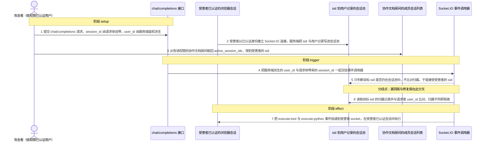
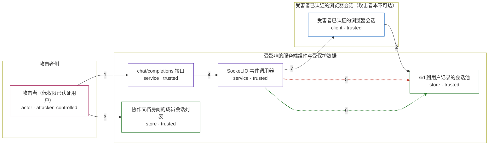

# open-webui / CVE-2026-59216

状态：草稿，未完成环境和复现。这个目录由模板生成，不构成漏洞确认。

图解的唯一来源是 `diagram.toml`：编辑后运行 `python3 -m runner diagram open-webui/CVE-2026-59216` 重新生成下方的图解区块。图解必须覆盖漏洞涉及的每个主体，并标出漏洞版/修复版的分歧步骤。

<!-- diagram:begin (generated from diagram.toml by `python3 -m runner diagram`; edit diagram.toml, not this block) -->
## 漏洞图解 — open-webui / CVE-2026-59216 跨用户 Socket.IO 事件投递

chat/completions 只要求普通用户鉴权，并把请求体自带的 session_id 原样写进 metadata，事件调用器随后只判断目标 sid 是否仍连接，不比对它属于哪个用户。攻击者因此能把投递目标指定为受害者的 sid，越过用户会话边界，把 execute:tool 与 execute:python 事件送进受害者已认证的浏览器会话执行。修复版在投递前用服务端派生的 user_id 校验目标 sid 的归属，归属不符即拒绝。

### 涉及主体

| 主体 | 类型 | 信任级别 | 在漏洞里的作用 | 来源 |
| --- | --- | --- | --- | --- |
| 攻击者（低权限已认证用户） (`attacker`) | `actor` | `attacker_controlled` | 自带合法令牌的普通用户。它只能控制 chat/completions 请求体，包括其中的 session_id、chat_id 与 message_id；user_id 由服务端鉴权派生，它改不了。 | fixtures/attack_request.json |
| chat/completions 接口 (`chat_api`) | `service` | `trusted` | 组装本次对话的 metadata：user_id 取自服务端鉴权结果，session_id 直接 pop 自请求体。它只要求 get_verified_user，因此低权限账号也能让任意 session_id 进入下游。 | backend/open_webui/main.py |
| Socket.IO 事件调用器 (`event_caller`) | `service` | `trusted` | socket/main.py 的 get_event_call 返回的 __event_caller__。它按 request_info['session_id'] 选择投递目标，并调用 sio.call('events', ...) 把工具或代码解释器事件发给该 sid 对应的浏览器。 | backend/open_webui/socket/main.py |
| sid 到用户记录的会话池 (`session_pool`) | `store` | `trusted` | 进程内的 SESSION_POOL，键是 Socket.IO sid，值是连接时写入的用户记录（含服务端派生的 id）。它是判断投递目标归属的唯一依据。 | backend/open_webui/socket/main.py |
| 协作文档房间的成员会话列表 (`ydoc_room`) | `store` | `trusted` | ydoc:document:join 与 ydoc:document:state 会把同房间的 active_session_ids 作为 sessions 字段回给请求者。任何对该共享笔记有读权限的参与者都能拿到房间里其他人的 sid，这是攻击者定位受害者的前提。 | backend/open_webui/socket/main.py |
| 受害者已认证的浏览器会话 (`victim_session`) | `client` | `trusted` | 另一名用户（本场景为管理员）已登录并保持连接的浏览器标签页。它按服务端下发的 events 调用执行 execute:tool 或 execute:python，是攻击者想拿到却够不着的执行上下文。 | fixtures/victim_session.json |

**信任边界**

- **攻击者侧** (`attacker_side`)：成员 `attacker`。攻击者能控制的只有自己这次请求的参数，以及自己账号的会话；它没有受害者账号、也读不到服务端内存，因此必须借产品的投递路径进入受害者会话。
- **受影响的服务端组件与受保护数据** (`server_side`)：成员 `chat_api`、`event_caller`、`session_pool`、`ydoc_room`。这道边界内，session_id 是客户端输入、user_id 是服务端派生，两者必须配对才能投递。漏洞版只用 session_id 做成员判断，配对关系失效。
- **受害者已认证的浏览器会话（攻击者本不可达）** (`victim_side`)：成员 `victim_session`。受害者会话只能由持有其令牌的浏览器使用。漏洞让服务端以受害者的 sid 为目标投递事件，等于借服务端的信任跨进了这道边界。

### 触发过程

### 主体与信任边界

箭头上的数字是上面的步骤编号；方框只标主体和信任级别，具体动作见「触发过程」。

**分歧点**：第 5 步（`vulnerable_only`）只判断目标 sid 是否仍在会话池中，不比对归属，于是接受受害者的 sid。
**分歧点**：第 6 步（`patched_only`）读取目标 sid 的归属记录并与请求者 user_id 比对，归属不符即拒绝。
<!-- diagram:end -->

## 公告与机制

TODO：官方公告、漏洞根因、Agent 信任边界、受影响范围和修复来源。

## 前提

TODO：认证要求、用户交互、已有批准、工具权限、攻击者能控制的内容。

## 版本与启动

TODO：补全 metadata、Dockerfile/镜像 digest 和 Compose，再写出精确启动命令。

Compose 中 `vulnerable` 与 `patched` profiles 分开使用；未指定 profile 不启动服务。镜像变量未配置时 Compose 会明确报错。此模板不暴露宿主端口，也不挂载主机数据。

## 机制复现

TODO：实现 `reproduce.py`，固定输入并执行真实漏洞路径，注明运行位置、参数和超时。

完成实现后使用 `python3 -m runner reproduce open-webui/CVE-2026-59216 --build --rounds 3`。
两脚本统一接受 `--context <context.json> --output <目录>`，详细字段见仓库 `docs/environment-contract.md`。
PoC 输出 `facts.json` 和效果文件；验证器只读证据，输出含 `target_ready` 及对应效果断言的 `verdict.json`。
镜像必须包含 Python 3 和 `/lab/` 下的脚本、fixtures；`runtime.mode` 选择 `oneshot` 或有 healthcheck 的 `service`。

## 端到端复现

TODO：实现 `end_to_end.py`；若不需要模型，明确写出不适用原因。真实模型的结果与机制复现分开统计。

## 验证与修复对照

TODO：实现 `verify.py`。记录漏洞版无害效果、修复版阻断和正常任务成功的证据，不能把服务启动失败当成阻断。

## 清理

默认运行器按每个测试的唯一 Compose project 清理容器、网络和 volume。
`--keep-on-failure` 保留失败项目，项目标识和 Compose 配置在结果目录中；仅清理该项目，不能使用全局 prune。

## 失败诊断

TODO：为本漏洞写出预期效果缺失、修复版仍有越界效果、正常任务失败及前提不满足时的具体排查路径。
启动失败、健康检查失败和超时都不能当作修复阻断。报告中应能定位到阶段、预期、实际和受控证据。

## 构建与输入

TODO：填写两版源码 archive、完整 commit，记录 `build.inputs` 中每个下载的 SHA-256；依赖安装必须支持禁网构建。
固定攻击和正常输入放入 `fixtures/` 并登记到 `fixtures/manifest.toml`。固定 seed、环境变量，说明无害效果与真实影响的关系。

## 隔离例外

默认无例外。确需例外时同时填写 `runtime.exceptions`、理由及最小范围，晋升由两位维护者审阅。

## 来源与许可

TODO：列出引用代码、fixtures 和镜像的来源及许可。
