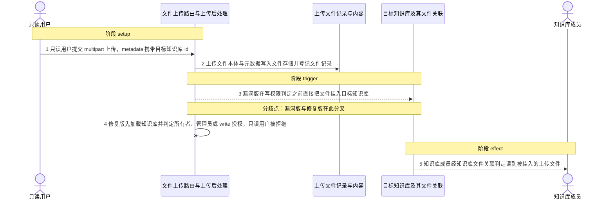
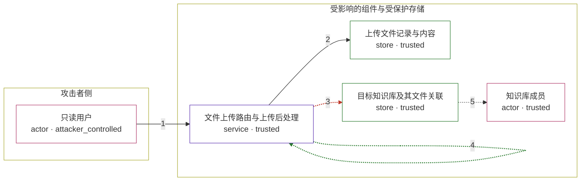

# open-webui / CVE-2026-59217

状态：草稿，未完成环境和复现。这个目录由模板生成，不构成漏洞确认。

图解的唯一来源是 `diagram.toml`：编辑后运行 `python3 -m runner diagram open-webui/CVE-2026-59217` 重新生成下方的图解区块。图解必须覆盖漏洞涉及的每个主体，并标出漏洞版/修复版的分歧步骤。

<!-- diagram:begin (generated from diagram.toml by `python3 -m runner diagram`; edit diagram.toml, not this block) -->
## 漏洞图解 — open-webui / CVE-2026-59217 知识库写权限绕过

已认证的普通用户在上传文件时，把客户端可控的 metadata.knowledge_id 直接交给上传后处理逻辑。该逻辑在写入知识库文件关联之前不做所有者、管理员或 write 授权判定；紧随其后的向量写入校验虽然返回 403，却发生在关联行已经提交之后。于是只有 read 权限的用户也能把任意文件挂进目标知识库，该知识库的成员随后即可读取这个文件。

### 涉及主体

| 主体 | 类型 | 信任级别 | 在漏洞里的作用 | 来源 |
| --- | --- | --- | --- | --- |
| 只读用户 (`reader`) | `actor` | `attacker_controlled` | 对目标知识库只持有 read 授权的已认证账号，构造携带 metadata.knowledge_id 的上传请求。 | fixtures/attack/upload.json |
| 文件上传路由与上传后处理 (`upload_router`) | `service` | `trusted` | POST /api/v1/files/ 的 upload_file_handler 与 process_uploaded_file 的自动关联逻辑，负责把上传文件写入知识库关联。 | — |
| 上传文件记录与内容 (`file_store`) | `store` | `trusted` | 保存上传文件本体、元数据与文件记录；攻击者只能通过上传请求写入，不能直接改目标知识库。 | — |
| 目标知识库及其文件关联 (`knowledge_store`) | `store` | `trusted` | 受害者拥有的知识库，其成员授权与知识库文件关联是受保护的完整性资源。 | — |
| 知识库成员 (`kb_member`) | `actor` | `trusted` | 对目标知识库拥有 read 或更高权限的用户；非法关联建立后即可读到本不该出现的上传文件。 | — |

**信任边界**

- **攻击者侧** (`attacker_side`)：成员 `reader`。只读用户能控制的只有自己发起的上传请求及其 multipart metadata，不能直接写目标知识库。
- **受影响的组件与受保护存储** (`product_side`)：成员 `upload_router`、`file_store`、`knowledge_store`、`kb_member`。这道边界本应由所有者、管理员或 write 授权判定拦住非成员写入，上传路径绕过了这道判定。

### 触发过程

### 主体与信任边界

箭头上的数字是上面的步骤编号；方框只标主体和信任级别，具体动作见「触发过程」。

**分歧点**：第 3 步（`vulnerable_only`）漏洞版在写权限判定之前直接把文件挂入目标知识库。
**分歧点**：第 4 步（`patched_only`）修复版先加载知识库并判定所有者、管理员或 write 授权，只读用户被拒绝。
<!-- diagram:end -->

## 公告与机制

TODO：官方公告、漏洞根因、Agent 信任边界、受影响范围和修复来源。

## 前提

TODO：认证要求、用户交互、已有批准、工具权限、攻击者能控制的内容。

## 版本与启动

TODO：补全 metadata、Dockerfile/镜像 digest 和 Compose，再写出精确启动命令。

Compose 中 `vulnerable` 与 `patched` profiles 分开使用；未指定 profile 不启动服务。镜像变量未配置时 Compose 会明确报错。此模板不暴露宿主端口，也不挂载主机数据。

## 机制复现

TODO：实现 `reproduce.py`，固定输入并执行真实漏洞路径，注明运行位置、参数和超时。

完成实现后使用 `python3 -m runner reproduce open-webui/CVE-2026-59217 --build --rounds 3`。
两脚本统一接受 `--context <context.json> --output <目录>`，详细字段见仓库 `docs/environment-contract.md`。
PoC 输出 `facts.json` 和效果文件；验证器只读证据，输出含 `target_ready` 及对应效果断言的 `verdict.json`。
镜像必须包含 Python 3 和 `/lab/` 下的脚本、fixtures；`runtime.mode` 选择 `oneshot` 或有 healthcheck 的 `service`。

## 端到端复现

TODO：实现 `end_to_end.py`；若不需要模型，明确写出不适用原因。真实模型的结果与机制复现分开统计。

## 验证与修复对照

TODO：实现 `verify.py`。记录漏洞版无害效果、修复版阻断和正常任务成功的证据，不能把服务启动失败当成阻断。

## 清理

默认运行器按每个测试的唯一 Compose project 清理容器、网络和 volume。
`--keep-on-failure` 保留失败项目，项目标识和 Compose 配置在结果目录中；仅清理该项目，不能使用全局 prune。

## 失败诊断

TODO：为本漏洞写出预期效果缺失、修复版仍有越界效果、正常任务失败及前提不满足时的具体排查路径。
启动失败、健康检查失败和超时都不能当作修复阻断。报告中应能定位到阶段、预期、实际和受控证据。

## 构建与输入

TODO：填写两版源码 archive、完整 commit，记录 `build.inputs` 中每个下载的 SHA-256；依赖安装必须支持禁网构建。
固定攻击和正常输入放入 `fixtures/` 并登记到 `fixtures/manifest.toml`。固定 seed、环境变量，说明无害效果与真实影响的关系。

## 隔离例外

默认无例外。确需例外时同时填写 `runtime.exceptions`、理由及最小范围，晋升由两位维护者审阅。

## 来源与许可

TODO：列出引用代码、fixtures 和镜像的来源及许可。
