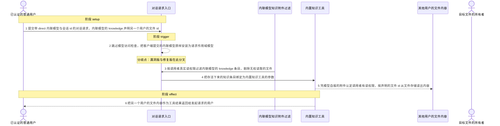
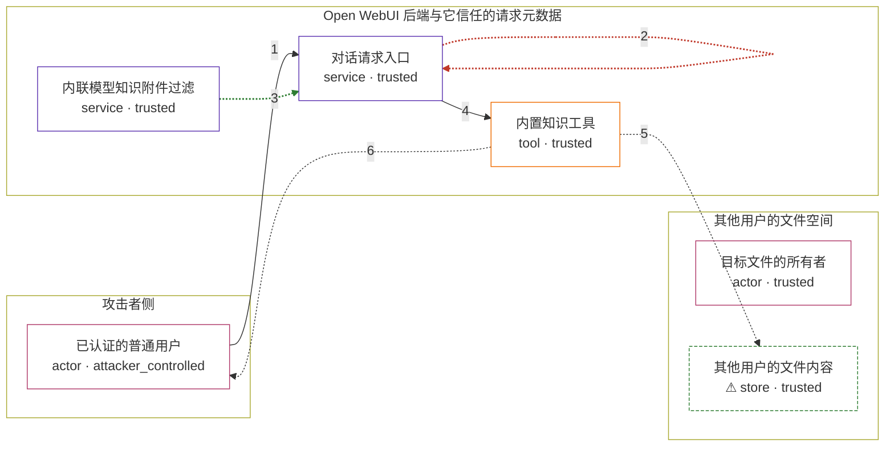

# open-webui / CVE-2026-70487

状态：草稿，未完成环境和复现。这个目录由模板生成，不构成漏洞确认。

图解的唯一来源是 `diagram.toml`：编辑后运行 `python3 -m runner diagram open-webui/CVE-2026-70487` 重新生成下方的图解区块。图解必须覆盖漏洞涉及的每个主体，并标出漏洞版/修复版的分歧步骤。

<!-- diagram:begin (generated from diagram.toml by `python3 -m runner diagram`; edit diagram.toml, not this block) -->
## 漏洞图解 — open-webui / CVE-2026-70487 漏洞图解

Open WebUI 的对话入口把客户端提交的 direct 内联模型当作已保存的工作区模型，跳过模型访问检查后原样安装为请求作用域模型，并信任其中自报的 knowledge 附件。内置知识工具据此认为调用者有权读取被声明的文件，直接把文件存储中的内容作为工具结果返回。于是任何已认证用户只要知道另一个用户文件的 UUID，就能跨用户读回该文件的已索引内容。修复版在安装内联模型之前按调用者真实读权限逐条过滤 knowledge 条目，使这个自报声明不再生效。

### 涉及主体

| 主体 | 类型 | 信任级别 | 在漏洞里的作用 | 来源 |
| --- | --- | --- | --- | --- |
| 已认证的普通用户 (`attacker`) | `actor` | `attacker_controlled` | 构造带 direct 内联模型与会话 id 的对话请求，在模型元数据里声明另一个用户的文件 id，并让模型调用内置知识工具读取它。 | — |
| 目标文件的所有者 (`victim`) | `actor` | `trusted` | 拥有目标文件且从未把它共享给攻击者；这是漏洞的前提条件，不是攻击者的动作。 | — |
| 对话请求入口 (`chat_entry`) | `service` | `trusted` | 接收 form_data 里的内联 direct 模型；漏洞版跳过模型访问检查，把客户端提供的模型对象原样安装为 request.state.model。 | — |
| 内联模型知识附件过滤 (`access_filter`) | `service` | `trusted` | 修复版在安装内联模型之前按调用者的真实读权限逐条过滤 knowledge 条目，剔除无权读取的文件与知识库，使下游拿不到目标文件 id。 | — |
| 内置知识工具 (`knowledge_tool`) | `tool` | `trusted` | 消费模型附带的 __model_knowledge__ 参数；把“模型声称附带该文件”当作读权限放行，并按声明的文件 id 直接从存储读取内容。 | — |
| ⚠ 其他用户的文件内容 (`victim_file`) | `store` | `trusted` | 受害用户上传并已索引的文件记录，其中保存着文件正文；调用者本来无权读取它。 | — |

**信任边界**

- **攻击者侧** (`attacker_side`)：成员 `attacker`。攻击者只能控制自己发出的请求体，包括内联模型 id、direct 标志和 knowledge 声明；它拿不到其他用户的文件内容。
- **Open WebUI 后端与它信任的请求元数据** (`backend`)：成员 `chat_entry`、`access_filter`、`knowledge_tool`。这道边界本应保证请求体里的模型元数据不能自行授予文件读权限，漏洞版让请求体里的自报附件直接变成了读权限凭据。
- **其他用户的文件空间** (`private_files`)：成员 `victim`、`victim_file`。文件只对所有者、管理员或真实获得授权的调用者可见；内置工具按自报 id 直接读取时越过了这道边界。

标 ⚠ 的主体是本仓库合成的替身或无害效果载体，不代表真实外部目标。

### 触发过程

### 主体与信任边界

箭头上的数字是上面的步骤编号；方框只标主体和信任级别，具体动作见「触发过程」。

**分歧点**：第 2 步（`vulnerable_only`）跳过模型访问检查，把客户端提交的内联模型原样安装为请求作用域模型。
**分歧点**：第 3 步（`patched_only`）按调用者真实读权限过滤内联模型的 knowledge 条目，剔除无权读取的文件。
<!-- diagram:end -->

## 公告与机制

TODO：官方公告、漏洞根因、Agent 信任边界、受影响范围和修复来源。

## 前提

TODO：认证要求、用户交互、已有批准、工具权限、攻击者能控制的内容。

## 版本与启动

TODO：补全 metadata、Dockerfile/镜像 digest 和 Compose，再写出精确启动命令。

Compose 中 `vulnerable` 与 `patched` profiles 分开使用；未指定 profile 不启动服务。镜像变量未配置时 Compose 会明确报错。此模板不暴露宿主端口，也不挂载主机数据。

## 机制复现

TODO：实现 `reproduce.py`，固定输入并执行真实漏洞路径，注明运行位置、参数和超时。

完成实现后使用 `python3 -m runner reproduce open-webui/CVE-2026-70487 --build --rounds 3`。
两脚本统一接受 `--context <context.json> --output <目录>`，详细字段见仓库 `docs/environment-contract.md`。
PoC 输出 `facts.json` 和效果文件；验证器只读证据，输出含 `target_ready` 及对应效果断言的 `verdict.json`。
镜像必须包含 Python 3 和 `/lab/` 下的脚本、fixtures；`runtime.mode` 选择 `oneshot` 或有 healthcheck 的 `service`。

## 端到端复现

TODO：实现 `end_to_end.py`；若不需要模型，明确写出不适用原因。真实模型的结果与机制复现分开统计。

## 验证与修复对照

TODO：实现 `verify.py`。记录漏洞版无害效果、修复版阻断和正常任务成功的证据，不能把服务启动失败当成阻断。

## 清理

默认运行器按每个测试的唯一 Compose project 清理容器、网络和 volume。
`--keep-on-failure` 保留失败项目，项目标识和 Compose 配置在结果目录中；仅清理该项目，不能使用全局 prune。

## 失败诊断

TODO：为本漏洞写出预期效果缺失、修复版仍有越界效果、正常任务失败及前提不满足时的具体排查路径。
启动失败、健康检查失败和超时都不能当作修复阻断。报告中应能定位到阶段、预期、实际和受控证据。

## 构建与输入

TODO：填写两版源码 archive、完整 commit，记录 `build.inputs` 中每个下载的 SHA-256；依赖安装必须支持禁网构建。
固定攻击和正常输入放入 `fixtures/` 并登记到 `fixtures/manifest.toml`。固定 seed、环境变量，说明无害效果与真实影响的关系。

## 隔离例外

默认无例外。确需例外时同时填写 `runtime.exceptions`、理由及最小范围，晋升由两位维护者审阅。

## 来源与许可

TODO：列出引用代码、fixtures 和镜像的来源及许可。
