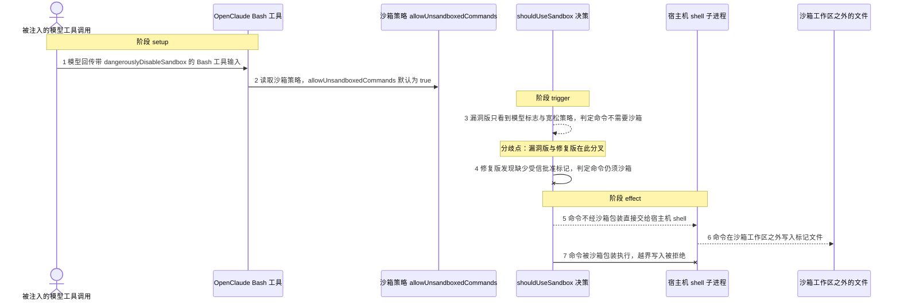
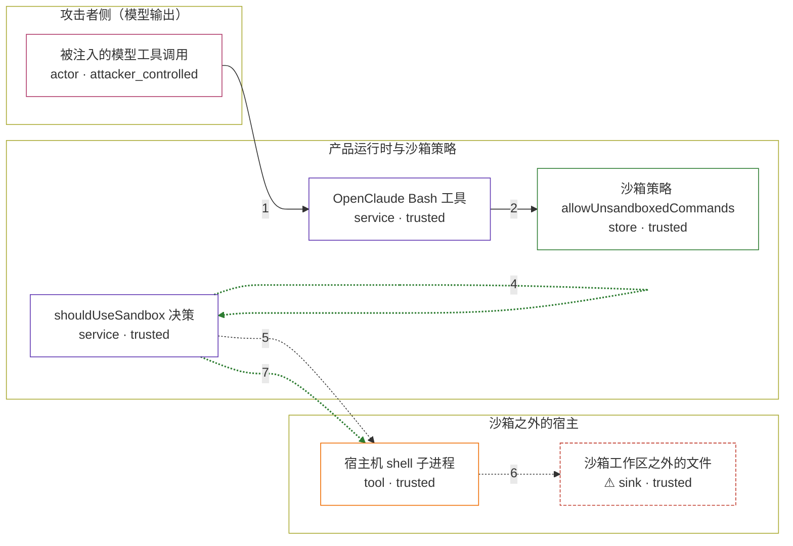

# openclaude / CVE-2026-42074

状态：草稿，未完成环境和复现。这个目录由模板生成，不构成漏洞确认。

图解的唯一来源是 `diagram.toml`：编辑后运行 `python3 -m runner diagram openclaude/CVE-2026-42074` 重新生成下方的图解区块。图解必须覆盖漏洞涉及的每个主体，并标出漏洞版/修复版的分歧步骤。

<!-- diagram:begin (generated from diagram.toml by `python3 -m runner diagram`; edit diagram.toml, not this block) -->
## 漏洞图解 — openclaude / CVE-2026-42074 漏洞图解

OpenClaude 把危险开关 dangerouslyDisableSandbox 直接暴露在模型可见的 Bash 工具输入 schema 里，沙箱决策 shouldUseSandbox() 又只依据该标志与默认宽松的策略就放行。于是模型（项目威胁模型中的不可信主体）可以在一次 tool_use 里关掉宿主机沙箱，让任意命令以宿主机身份直接执行。修复提交要求受信内部批准标记，并把该字段从模型可见 schema 中剔除，模型再传同名字段就无法关闭沙箱。

### 涉及主体

| 主体 | 类型 | 信任级别 | 在漏洞里的作用 | 来源 |
| --- | --- | --- | --- | --- |
| 被注入的模型工具调用 (`model`) | `actor` | `attacker_controlled` | 攻击者通过提示注入让模型在 Bash tool_use 中回传 dangerouslyDisableSandbox: true；它能控制的只有这次调用的输入字段。 | — |
| OpenClaude Bash 工具 (`agent`) | `service` | `trusted` | 解析 model-facing 工具输入并调用沙箱决策；漏洞版没有把 dangerouslyDisableSandbox 从模型可见 schema 中剔除。 | fixtures/attack.json |
| 沙箱策略 allowUnsandboxedCommands (`policy`) | `store` | `trusted` | 策略默认值为 true，允许未沙箱命令；模型改不了它，但漏洞版把它当成模型标志之外的唯一许可条件。 | — |
| shouldUseSandbox 决策 (`gate`) | `service` | `trusted` | 决定命令是否需要沙箱；漏洞版只检查模型标志加策略，修复版还要求受信内部批准标记。 | — |
| 宿主机 shell 子进程 (`shell`) | `tool` | `trusted` | 决策判定不需要沙箱时，命令被直接交给宿主机 shell 执行，不再经过沙箱包装。 | fixtures/attack.json |
| ⚠ 沙箱工作区之外的文件 (`outside`) | `sink` | `trusted` | 受控无害落点：命令在沙箱本应禁止写入的位置留下标记文件，用来证明越界写入成功；它不是真实的外部目标。 | fixtures/attack.json |

**信任边界**

- **攻击者侧（模型输出）** (`attacker_side`)：成员 `model`。攻击者只能影响模型输出，不能直接改沙箱策略，也读不到宿主文件。
- **产品运行时与沙箱策略** (`product_side`)：成员 `agent`、`policy`、`gate`。这一侧信任模型输入已经过 schema 与决策函数过滤；漏洞版的过滤条件不足。
- **沙箱之外的宿主** (`host_side`)：成员 `shell`、`outside`。沙箱本应把命令的写入限制在工作区内；漏洞版让命令以宿主机身份直接执行。

标 ⚠ 的主体是本仓库合成的替身或无害效果载体，不代表真实外部目标。

### 触发过程



### 主体与信任边界

箭头上的数字是上面的步骤编号；方框只标主体和信任级别，具体动作见「触发过程」。



**分歧点**：第 3 步（`vulnerable_only`）漏洞版只看到模型标志与宽松策略，判定命令不需要沙箱。
**分歧点**：第 4 步（`patched_only`）修复版发现缺少受信批准标记，判定命令仍须沙箱。
<!-- diagram:end -->

## 公告与机制

- 公告：[CVE-2026-42074](https://nvd.nist.gov/vuln/detail/CVE-2026-42074) /
  [GHSA-m77w-p5jj-xmhg](https://github.com/Gitlawb/openclaude/security/advisories/GHSA-m77w-p5jj-xmhg)，
  严重级别 CRITICAL，CWE-284 / CWE-306，
  `CVSS:3.1/AV:N/AC:L/PR:N/UI:N/S:U/C:H/I:H/A:H`（OSV 结构化事实）。
- 上游：<https://github.com/Gitlawb/openclaude>，受影响区间 `< 0.5.1`。
- 根因：项目自述威胁模型把模型/agent 当作**不可信主体**，但
  `dangerouslyDisableSandbox` 一直留在 model-facing 的 Bash / PowerShell 工具输入里，
  `shouldUseSandbox()` 又只要求「模型标志为真」且 `areUnsandboxedCommandsAllowed()`
  为真（默认 `?? true`）就返回「不沙箱」。模型因此可以在一次 `tool_use` 中自行关闭宿主沙箱。
- 修复提交：`aab489055c53dd64369414116fe93226d2656273`（PR #778，
  `fix: require trusted approval for sandbox override`），包含在 `0.5.1`，不包含在 `0.5.0`。
  修复把决策改为三条件：模型标志 + **受信内部批准标记** `_dangerouslyDisableSandboxApproved`
  + 策略；并把该字段从模型可见 schema 中 `.omit()`，用户手敲 `!` 命令的受信路径显式带上批准标记。
  **`allowUnsandboxedCommands` 的 `?? true` 默认值本身没有改**，修复点是剥夺模型对该开关的控制。
- 注意：OSV/GHSA 的 `affected.package` 指向 npm 上同名的无关占位包 `openclaude`；
  本项目真实包名是 `@gitlawb/openclaude`，不能 `npm install openclaude`。

## 前提

- 沙箱能力可用：`SandboxManager.isSandboxingEnabled()` 为真。若为假，两版都会在
  `shouldUseSandbox()` 第一个 `if` 返回 `false`，差分消失并造成静默假阴性。
- 沙箱策略为默认值：`allowUnsandboxedCommands` 未显式设置，`?? true` 生效。
  `excludedCommands` 为空，因此 `containsExcludedCommand()` 在两版走同一条提前返回路径。
- 攻击面只是**一次工具调用**：攻击者通过提示注入影响模型输出，能控制的只有
  `tool_use` 的 `command` 与 `dangerouslyDisableSandbox` 字段；它不能改沙箱策略、
  不能直接写宿主文件、也不需要任何认证或用户交互（`PR:N`/`UI:N`）。
- 机制复现不调用真实模型；端到端（mock `/v1/messages` 或真实模型）另计。

## 版本与启动

TODO：补全 metadata、Dockerfile/镜像 digest 和 Compose，再写出精确启动命令。

Compose 中 `vulnerable` 与 `patched` profiles 分开使用；未指定 profile 不启动服务。镜像变量未配置时 Compose 会明确报错。此模板不暴露宿主端口，也不挂载主机数据。

## 机制复现

`reproduce.py` 执行的是**被固定的上游代码本体**，不是重写的等价逻辑：

1. 按 `context["variant"]` 从 `fixtures/upstream-modules.json` 取该版本的期望
   SHA-256，并在镜像内定位被固定的上游源码树
   （`src/tools/BashTool/shouldUseSandbox.ts`，默认搜索 `/lab/upstream` 等根目录）；
   哈希不匹配即 `target_ready = false`，不给出结论。
2. 用 Node 的 `--experimental-strip-types` 直接 `import` 该 `.ts` 文件，只把它的
   环境前提（`SandboxManager.isSandboxingEnabled()`、`allowUnsandboxedCommands`
   的 `?? true` 默认值、空的 `excludedCommands`）通过 loader 桩提供，与修复提交自带的
   `shouldUseSandbox.test.ts` 用 `mock.module` 的做法一致。**漏洞判定完全来自上游文件本身。**
3. 用固定的工具输入调用上游 `shouldUseSandbox()`：攻击输入带
   `dangerouslyDisableSandbox: true`，正常输入不带。返回 `false` 表示产品不会包装沙箱。
4. 按该返回值执行 fixture 里的命令：`false` 时直接交给宿主机 shell；`true` 时套一层
   Landlock 文件系统限制（只允许写工作区）——这是平台沙箱的替身，本环境不依赖
   bwrap/sandbox-exec。效果文件由命令自己写出，PoC 不代造。
5. 输出 `decision.json`、`command_result.json` 和效果文件；`observation.json` 记录
   `target_ready`、`execution_status`、`should_use_sandbox`、`confinement`、
   `effect_observed` 等字段。

预期差分：vulnerable（`0.5.0`）攻击输入 → `should_use_sandbox = false`、直接在宿主机写越界标记
→ 效果出现；patched（`0.5.1`）同一输入 → `should_use_sandbox = true`、越界写入被拒绝
→ 效果缺失。正常输入在两版都 `true` 且工作区内写入成功。

镜像前提：包含被固定 revision 的**上游源码树**（npm 发布物只有 `dist/cli.mjs`，没有
`src/`，不足以支撑本 PoC）与 Node ≥ 22.6。`verify.py` 属于 validate 阶段。

运行：

```sh
python3 -m runner reproduce openclaude/CVE-2026-42074 --build --rounds 3
```

两脚本统一接受 `--context <context.json> --output <目录>`，详细字段见仓库 `docs/environment-contract.md`。
PoC 输出 `facts.json` 和效果文件；验证器只读证据，输出含 `target_ready` 及对应效果断言的 `verdict.json`。
镜像必须包含 Python 3 和 `/lab/` 下的脚本、fixtures。

## 端到端复现

TODO：实现 `end_to_end.py`；若不需要模型，明确写出不适用原因。真实模型的结果与机制复现分开统计。

## 验证与修复对照

TODO：实现 `verify.py`。记录漏洞版无害效果、修复版阻断和正常任务成功的证据，不能把服务启动失败当成阻断。

## 清理

默认运行器按每个测试的唯一 Compose project 清理容器、网络和 volume。
`--keep-on-failure` 保留失败项目，项目标识和 Compose 配置在结果目录中；仅清理该项目，不能使用全局 prune。

## 失败诊断

TODO：为本漏洞写出预期效果缺失、修复版仍有越界效果、正常任务失败及前提不满足时的具体排查路径。
启动失败、健康检查失败和超时都不能当作修复阻断。报告中应能定位到阶段、预期、实际和受控证据。

## 构建与输入

TODO：填写两版源码 archive、完整 commit，记录 `build.inputs` 中每个下载的 SHA-256；依赖安装必须支持禁网构建。
固定攻击和正常输入放入 `fixtures/` 并登记到 `fixtures/manifest.toml`。固定 seed、环境变量，说明无害效果与真实影响的关系。

## 隔离例外

默认无例外。确需例外时同时填写 `runtime.exceptions`、理由及最小范围，晋升由两位维护者审阅。

## 来源与许可

- 上游代码：<https://github.com/Gitlawb/openclaude>（License 见仓库 `LICENSE`）。
  本环境不内联上游源码，构建时按 `metadata.toml` 的完整 commit 与 SHA-256 取归档。
- 引用的上游文件：`src/tools/BashTool/shouldUseSandbox.ts`（vulnerable blob
  `486e3678309cd0b04f95f825ac1d3e9c3f0997db`，patched blob
  `eedb6071e5afdba850ca3113c1120a9b57e1e790`）、`src/utils/sandbox/sandbox-adapter.ts`、
  `src/tools/BashTool/shouldUseSandbox.test.ts`；哈希与差分见 `research/public.md`。
- 本环境的 `fixtures/attack.json`、`fixtures/benign.json` 是自行构造的合成输入，
  `fixtures/upstream-modules.json` 记录实测哈希；不含真实凭据或私有数据。
- 平台沙箱替身（Landlock）代码位于 `reproduce.py`，不复制上游许可证内容。
