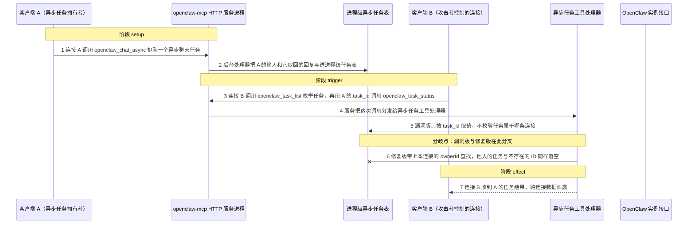

# openclaw-mcp / GHSA-C4QG-MG2R-2C56

状态：草稿，未完成环境和复现。这个目录由模板生成，不构成漏洞确认。

图解的唯一来源是 `diagram.toml`：编辑后运行 `python3 -m runner diagram openclaw-mcp/GHSA-C4QG-MG2R-2C56` 重新生成下方的图解区块。图解必须覆盖漏洞涉及的每个主体，并标出漏洞版/修复版的分歧步骤。

<!-- diagram:begin (generated from diagram.toml by `python3 -m runner diagram`; edit diagram.toml, not this block) -->
## 漏洞图解 — openclaw-mcp / GHSA-C4QG-MG2R-2C56 跨连接异步任务泄露

HTTP 模式下同一个 openclaw-mcp 进程同时服务多条 MCP 连接，异步任务表却是进程级单例，任务工具只按 task_id 取值，从不校验任务属于哪条连接。于是连接 B 可以在自己的会话里枚举并读取连接 A 的任务，拿到 A 的输入所产生的回复内容，甚至可以取消 A 尚未开始的任务。1.7.0 为每条连接生成 ownerId，get/list/cancel/stats 全部按归属过滤，他人的任务与不存在的 ID 返回同一个结果，B 再也观察不到 A 的任务。

### 涉及主体

| 主体 | 类型 | 信任级别 | 在漏洞里的作用 | 来源 |
| --- | --- | --- | --- | --- |
| 客户端 A（异步任务拥有者） (`client_a`) | `client` | `semi_trusted` | 在自己的 MCP 连接上调用 openclaw_chat_async 排队一个异步聊天任务；它的任务输入与结果只应属于这条连接，是攻击者想要却拿不到的数据。 | fixtures/benign.json |
| 客户端 B（攻击者控制的连接） (`client_b`) | `client` | `attacker_controlled` | 合法但不同的另一条 MCP 连接；只能选择自己连接上的工具名与参数（task_id、列表过滤条件），用 openclaw_task_list 枚举任务、用 openclaw_task_status 读取他人的任务。 | fixtures/attack.json |
| openclaw-mcp HTTP 服务进程 (`mcp_server`) | `service` | `trusted` | HTTP 模式下为每条连接调用一次 createMcpServer() 并注册同一套异步任务工具；任务表的归属校验本该在这一层把连接隔开。 | https://github.com/freema/openclaw-mcp/blob/1.6.0/src/server/tools-registration.ts |
| 异步任务工具处理器 (`task_tools`) | `tool` | `trusted` | openclaw_chat_async / openclaw_task_status / openclaw_task_list / openclaw_task_cancel 的处理器；漏洞版只把 task_id 交给任务表，既不传也不比对该连接的身份。 | https://github.com/freema/openclaw-mcp/blob/1.6.0/src/mcp/tools/tasks.ts |
| 进程级异步任务表 (`task_store`) | `store` | `trusted` | 进程共享的 Map，保存每个任务的输入、状态与结果；漏洞版按 task_id 直接取值，修复版按创建该任务的 ownerId 作用域。 | https://github.com/freema/openclaw-mcp/blob/1.6.0/src/mcp/tasks/manager.ts |
| ⚠ OpenClaw 实例接口 (`gateway`) | `service` | `semi_trusted` | 环境前提：异步聊天任务的后台处理器向它发请求取回回复，回复被写进任务表，是泄露内容的最初来源。图中它是受控替身，不是真实外部目标。 | — |

**信任边界**

- **受害连接 A** (`victim_connection`)：成员 `client_a`。A 的任务输入与结果属于 A 自己。B 通过自己的连接不应看到或改动它们。
- **攻击者侧** (`attacker_side`)：成员 `client_b`。B 只能控制自己连接上的工具名与参数，不能直接读写服务进程的内存，因此必须借道异步任务工具。
- **受影响的 openclaw-mcp 服务进程** (`server_process`)：成员 `mcp_server`、`task_tools`、`task_store`。HTTP 模式下这一个进程同时服务多条连接，任务表是进程级单例；连接之间的隔离必须由工具处理器的归属校验提供，漏洞版没有提供。
- 未列入上述边界：`gateway`。

标 ⚠ 的主体是本仓库合成的替身或无害效果载体，不代表真实外部目标。

### 触发过程

### 主体与信任边界

箭头上的数字是上面的步骤编号；方框只标主体和信任级别，具体动作见「触发过程」。

```mermaid
%% openclaw-mcp / GHSA-C4QG-MG2R-2C56 跨连接异步任务泄露 — generated from diagram.toml
flowchart LR
  subgraph victim_connection["受害连接 A"]
    client_a["客户端 A（异步任务拥有者）<br/>client · semi_trusted"]
  end
  subgraph attacker_side["攻击者侧"]
    client_b["客户端 B（攻击者控制的连接）<br/>client · attacker_controlled"]
  end
  subgraph server_process["受影响的 openclaw-mcp 服务进程"]
    mcp_server["openclaw-mcp HTTP 服务进程<br/>service · trusted"]
    task_tools["异步任务工具处理器<br/>tool · trusted"]
    task_store["进程级异步任务表<br/>store · trusted"]
  end
  gateway["OpenClaw 实例接口<br/>⚠ service · semi_trusted"]
  client_a -->|"1"| mcp_server
  mcp_server -->|"2"| task_store
  client_b -->|"3"| mcp_server
  mcp_server -->|"4"| task_tools
  task_tools -.->|"5"| task_store
  task_tools -.->|"6"| task_store
  task_tools -.->|"7"| client_b
  classDef actor fill:transparent,stroke:#b03a6a
  classDef client fill:transparent,stroke:#1565c0
  classDef service fill:transparent,stroke:#5e35b1
  classDef tool fill:transparent,stroke:#ef6c00
  classDef sink fill:transparent,stroke:#c0392b
  classDef store fill:transparent,stroke:#2e7d32
  classDef synthetic stroke-dasharray: 4 2
  class client_a client
  class client_b client
  class mcp_server service
  class task_tools tool
  class task_store store
  class gateway service
  class gateway synthetic
  style victim_connection fill:transparent
  style attacker_side fill:transparent
  style server_process fill:transparent
  linkStyle 4 stroke:#c0392b,stroke-width:2px
  linkStyle 5 stroke:#2e7d32,stroke-width:2px
```

**分歧点**：第 5 步（`vulnerable_only`）漏洞版只按 task_id 取值，不校验任务属于哪条连接。
**分歧点**：第 6 步（`patched_only`）修复版带上本连接的 ownerId 查找，他人的任务与不存在的 ID 同样落空。
<!-- diagram:end -->

## 公告与机制

TODO：官方公告、漏洞根因、Agent 信任边界、受影响范围和修复来源。

## 前提

TODO：认证要求、用户交互、已有批准、工具权限、攻击者能控制的内容。

## 版本与启动

TODO：补全 metadata、Dockerfile/镜像 digest 和 Compose，再写出精确启动命令。

Compose 中 `vulnerable` 与 `patched` profiles 分开使用；未指定 profile 不启动服务。镜像变量未配置时 Compose 会明确报错。此模板不暴露宿主端口，也不挂载主机数据。

## 机制复现

TODO：实现 `reproduce.py`，固定输入并执行真实漏洞路径，注明运行位置、参数和超时。

完成实现后使用 `python3 -m runner reproduce openclaw-mcp/GHSA-C4QG-MG2R-2C56 --build --rounds 3`。
两脚本统一接受 `--context <context.json> --output <目录>`，详细字段见仓库 `docs/environment-contract.md`。
PoC 输出 `facts.json` 和效果文件；验证器只读证据，输出含 `target_ready` 及对应效果断言的 `verdict.json`。
镜像必须包含 Python 3 和 `/lab/` 下的脚本、fixtures；`runtime.mode` 选择 `oneshot` 或有 healthcheck 的 `service`。

## 端到端复现

TODO：实现 `end_to_end.py`；若不需要模型，明确写出不适用原因。真实模型的结果与机制复现分开统计。

## 验证与修复对照

TODO：实现 `verify.py`。记录漏洞版无害效果、修复版阻断和正常任务成功的证据，不能把服务启动失败当成阻断。

## 清理

默认运行器按每个测试的唯一 Compose project 清理容器、网络和 volume。
`--keep-on-failure` 保留失败项目，项目标识和 Compose 配置在结果目录中；仅清理该项目，不能使用全局 prune。

## 失败诊断

TODO：为本漏洞写出预期效果缺失、修复版仍有越界效果、正常任务失败及前提不满足时的具体排查路径。
启动失败、健康检查失败和超时都不能当作修复阻断。报告中应能定位到阶段、预期、实际和受控证据。

## 构建与输入

TODO：填写两版源码 archive、完整 commit，记录 `build.inputs` 中每个下载的 SHA-256；依赖安装必须支持禁网构建。
固定攻击和正常输入放入 `fixtures/` 并登记到 `fixtures/manifest.toml`。固定 seed、环境变量，说明无害效果与真实影响的关系。

## 隔离例外

默认无例外。确需例外时同时填写 `runtime.exceptions`、理由及最小范围，晋升由两位维护者审阅。

## 来源与许可

TODO：列出引用代码、fixtures 和镜像的来源及许可。
