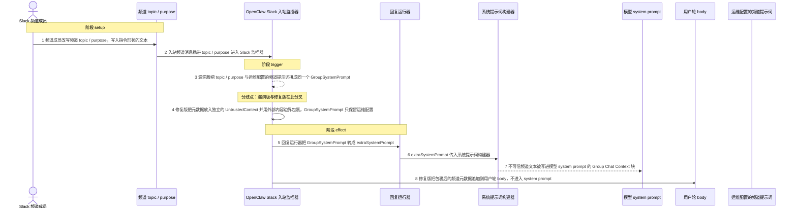
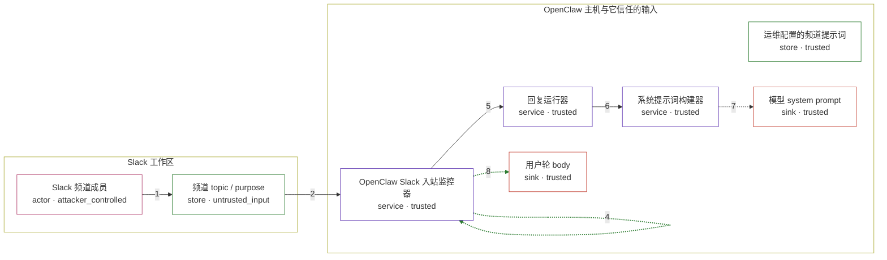

# openclaw / CVE-2026-24764

状态：草稿，未完成环境和复现。这个目录由模板生成，不构成漏洞确认。

图解的唯一来源是 `diagram.toml`：编辑后运行 `python3 -m runner diagram openclaw/CVE-2026-24764` 重新生成下方的图解区块。图解必须覆盖漏洞涉及的每个主体，并标出漏洞版/修复版的分歧步骤。

<!-- diagram:begin (generated from diagram.toml by `python3 -m runner diagram`; edit diagram.toml, not this block) -->
## 漏洞图解 — openclaw / CVE-2026-24764 漏洞图解

Slack 频道的 topic/purpose 是任何频道成员都能改写的不可信文本。OpenClaw 2026.2.2 及以下把它与运维配置的频道提示词拼成同一个 GroupSystemPrompt，回复运行器再将其作为 extraSystemPrompt 交给系统提示词构建器，于是不可信频道元数据被写进模型 system prompt 的 Group Chat Context 块。2026.2.3 的修复把元数据改道到 UntrustedContext：经外部内容包裹后追加到用户轮 body，system prompt 只保留运维配置。

### 涉及主体

| 主体 | 类型 | 信任级别 | 在漏洞里的作用 | 来源 |
| --- | --- | --- | --- | --- |
| Slack 频道成员 (`channel_member`) | `actor` | `attacker_controlled` | 能编辑频道 topic / purpose 的普通成员；它只能控制这两个文本字段，碰不到 OpenClaw 主机或运维配置。 | — |
| 频道 topic / purpose (`channel_metadata`) | `store` | `untrusted_input` | 攻击面：频道元数据由频道成员写入、由 Slack 监控器读入，属于未经校验的外部文本。 | — |
| 运维配置的频道提示词 (`operator_channel_prompt`) | `store` | `trusted` | 部署方在频道配置里写的 systemPrompt，本应是与频道元数据分开的高信任输入。 | — |
| OpenClaw Slack 入站监控器 (`slack_monitor`) | `service` | `trusted` | 组装入站上下文：漏洞版把频道元数据拼进 GroupSystemPrompt，修复版改为写入独立的 UntrustedContext。 | — |
| 回复运行器 (`reply_runner`) | `service` | `trusted` | 把 GroupSystemPrompt 原样转成 extraSystemPrompt，两种信任级别的输入在这里被并入同一条通道。 | — |
| 系统提示词构建器 (`system_prompt_builder`) | `service` | `trusted` | 把 extraSystemPrompt 写进 system prompt 的 Group Chat Context 块；它按调用方给定的信任级别处理文本。 | — |
| 模型 system prompt (`system_prompt`) | `sink` | `trusted` | 漏洞效果落点：被赋予系统级信任的提示词正文，不可信频道文本在此成为 system 指令。 | — |
| 用户轮 body (`user_turn_body`) | `sink` | `trusted` | 修复后的落点：包裹为外部内容的频道元数据追加到这里，与 system prompt 的信任级别不同。 | — |

**信任边界**

- **Slack 工作区** (`slack_workspace`)：成员 `channel_member`、`channel_metadata`。攻击者只能改写频道 topic / purpose；它无法读取或修改 OpenClaw 主机上的配置，因此这里没有可信数据可拿。
- **OpenClaw 主机与它信任的输入** (`openclaw_host`)：成员 `operator_channel_prompt`、`slack_monitor`、`reply_runner`、`system_prompt_builder`、`system_prompt`、`user_turn_body`。这道边界本应只让运维配置进入 system 级上下文；漏洞版本让频道元数据越过它，修复版本把元数据挡回用户轮 body。

### 触发过程

### 主体与信任边界

箭头上的数字是上面的步骤编号；方框只标主体和信任级别，具体动作见「触发过程」。

**分歧点**：第 3 步（`vulnerable_only`）漏洞版把 topic / purpose 与运维配置的频道提示词拼成同一个 GroupSystemPrompt。
**分歧点**：第 4 步（`patched_only`）修复版把元数据放入独立的 UntrustedContext 并用外部内容边界包裹，GroupSystemPrompt 只保留运维配置。
<!-- diagram:end -->

## 公告与机制

- 公告：NVD `CVE-2026-24764`（alias `GHSA-782p-5fr5-7fj8`），severity `LOW`，CVSS 3.1 `AV:N/AC:H/PR:L/UI:R/S:U/C:L/I:L/A:N` = 3.7；GHSA 明确写明这是纵深防御加固，**无已知在野利用**。
- 受影响版本：npm `openclaw` `< 2026.2.3`（v2026.2.2 = `95cd2210f93d6ab2acc5e29dbad6065294365863`）；修复版本 npm `openclaw` `>= 2026.2.3`（tag v2026.2.3 = `54ddbc466085b42526983f6c90d152fdd7bf365f`）。
- 修复提交：`35eb40a7000b59085e9c638a80fd03917c7a095e`（`fix(security): separate untrusted channel metadata from system prompt`），已用 compare API 证实是 v2026.2.3 的祖先。
- 根因 / 信任边界：Slack 频道 topic / purpose 是任何频道成员都能改写的不可信文本。v2026.2.2 的 `src/slack/monitor/message-handler/prepare.ts:443-453` 把它与运维配置的 `channelConfig.systemPrompt` 拼成同一个 `GroupSystemPrompt`（`:509`）；`src/auto-reply/reply/get-reply-run.ts:182-183` 把它当 `extraSystemPrompt`；`src/agents/system-prompt.ts:518-522` 写进 system prompt 的 `## Group Chat Context` 块。修复提交新增 `src/security/channel-metadata.ts`（`buildUntrustedChannelMetadata`，经既有 `wrapExternalContent()` 包裹）与 `src/auto-reply/reply/untrusted-context.ts`（`appendUntrustedContext`），把元数据改道到 `UntrustedContext` 并追加到用户轮 body，`GroupSystemPrompt` 只保留运维配置。
- 同一模式还出现在 `src/slack/monitor/slash.ts:386`、`src/discord/monitor/message-handler.process.ts:148-153`、`src/discord/monitor/native-command.ts:759-765`；本环境固定 Slack 普通消息路径。
- 性质说明：这是 prompt injection 面扩大，不是 RCE 或越权读取。复现只证明「不可信频道元数据落在了 system prompt 通道」这一代码级事实，不代表模型会被说服。

## 前提

- 部署前提：Slack 集成已启用，助手在 room-ish 频道内，且频道 topic/purpose 由普通成员可写。
- 信任前提：运维为该频道配置了 `systemPrompt`（`Config prompt`），它在两版都必须继续进入 system prompt。
- 攻击者只能控制频道 topic / purpose 两个文本字段，无法接触 OpenClaw 主机、运维配置或模型。
- 构建前提：镜像必须包含固定的 GitHub 源码树（npm 包只含 `dist/`，没有 `src/`），并提供 Node.js >= 22 的 TypeScript 类型剥离能力，`reproduce.py` 才能直接驱动 `src/slack/monitor/message-handler/prepare.ts`、`src/agents/system-prompt.ts` 与修复版新增的 `src/security/channel-metadata.ts`。

## 机制复现

`reproduce.py` 在镜像内定位固定的上游 TypeScript 源码树，用 `fixtures/mechanism/` 的 Node loader 直接加载并执行真实上游模块，不重写漏洞函数：

- `prepareSlackMessage`（`src/slack/monitor/message-handler/prepare.ts`）产出真实入站上下文；
- `buildAgentSystemPrompt`（`src/agents/system-prompt.ts`）产出真实 system prompt；
- 仅当源码树存在 `src/auto-reply/reply/untrusted-context.ts`（即修复版）时才调用 `appendUntrustedContext` 处理用户轮 body。

效果文件为 `context.json`（`GroupSystemPrompt` / `UntrustedContext`）、`system_prompt.txt`、`user_body.txt`；观察同时记录 `target_ready` 与 `execution_status`。loader 只做模块解析适配与第三方包替身（Slack SDK、zod 等），不改动任何上游语句。`get-reply-run.ts` 里的两行 `GroupSystemPrompt` → `extraSystemPrompt` 映射内联在该模块中，因其导出入口需要完整 agent run，故在 driver 中按固定源码逐字复刻并注明。

## 版本与启动

TODO：补全 metadata、Dockerfile/镜像 digest 和 Compose，再写出精确启动命令。

Compose 中 `vulnerable` 与 `patched` profiles 分开使用；未指定 profile 不启动服务。镜像变量未配置时 Compose 会明确报错。此模板不暴露宿主端口，也不挂载主机数据。

## 机制复现

已实现（generate 阶段）：`reproduce.py` 输出 `facts.json`、`observation.json` 与效果文件；`verify.py` 由 validate 阶段写出首版、solve 阶段加固。两脚本统一接受 `--context <context.json> --output <目录>`，详细字段见仓库 `docs/environment-contract.md`。

完成镜像后使用 `python3 -m runner reproduce openclaw/CVE-2026-24764 --build --rounds 3`。
两脚本统一接受 `--context <context.json> --output <目录>`，详细字段见仓库 `docs/environment-contract.md`。
PoC 输出 `facts.json` 和效果文件；验证器只读证据，输出含 `target_ready` 及对应效果断言的 `verdict.json`。
镜像必须包含 Python 3 和 `/lab/` 下的脚本、fixtures；`runtime.mode` 选择 `oneshot` 或有 healthcheck 的 `service`。

## 端到端复现

TODO：实现 `end_to_end.py`；若不需要模型，明确写出不适用原因。真实模型的结果与机制复现分开统计。

## 验证与修复对照

TODO：实现 `verify.py`。记录漏洞版无害效果、修复版阻断和正常任务成功的证据，不能把服务启动失败当成阻断。

## 清理

默认运行器按每个测试的唯一 Compose project 清理容器、网络和 volume。
`--keep-on-failure` 保留失败项目，项目标识和 Compose 配置在结果目录中；仅清理该项目，不能使用全局 prune。

## 失败诊断

TODO：为本漏洞写出预期效果缺失、修复版仍有越界效果、正常任务失败及前提不满足时的具体排查路径。
启动失败、健康检查失败和超时都不能当作修复阻断。报告中应能定位到阶段、预期、实际和受控证据。

## 构建与输入

TODO：填写两版源码 archive、完整 commit，记录 `build.inputs` 中每个下载的 SHA-256；依赖安装必须支持禁网构建。
固定攻击和正常输入放入 `fixtures/` 并登记到 `fixtures/manifest.toml`。固定 seed、环境变量，说明无害效果与真实影响的关系。

## 隔离例外

默认无例外。确需例外时同时填写 `runtime.exceptions`、理由及最小范围，晋升由两位维护者审阅。

## 来源与许可

TODO：列出引用代码、fixtures 和镜像的来源及许可。
