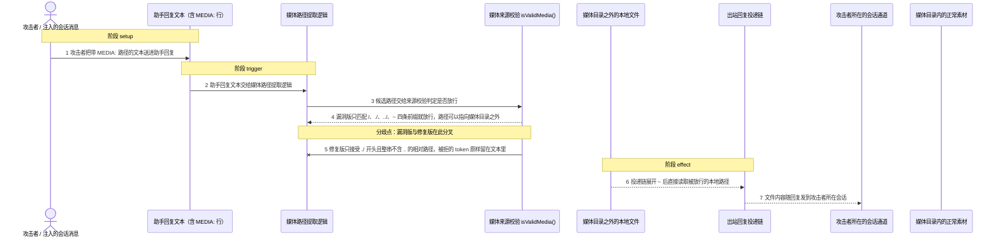
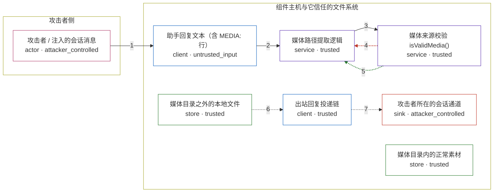

# openclaw / CVE-2026-25475

状态：草稿，未完成环境和复现。这个目录由模板生成，不构成漏洞确认。

图解的唯一来源是 `diagram.toml`：编辑后运行 `python3 -m runner diagram openclaw/CVE-2026-25475` 重新生成下方的图解区块。图解必须覆盖漏洞涉及的每个主体，并标出漏洞版/修复版的分歧步骤。

<!-- diagram:begin (generated from diagram.toml by `python3 -m runner diagram`; edit diagram.toml, not this block) -->
## 漏洞图解 — openclaw / CVE-2026-25475 漏洞图解

助手把回复文本里的 MEDIA:<路径> 当作可信的本地文件来源：v2026.1.29 的 isValidMedia() 只用四条前缀放行本地路径（/、./、../、~），既不要求路径落在媒体目录内，也不要求它真是媒体文件。 这道信任边界只挡住了「远程 URL 才需要下载」这一层，却让 /etc/passwd、~/.openclaw/openclaw.json 这类边界内文件被当作本地媒体来源取出；出站回复投递链随后直接读取该路径，文件内容经会话通道 交回攻击者。v2026.1.30 收窄为只接受 ./ 开头且整串不含 .. 的相对路径，同样的文本不再产生文件读取。

### 涉及主体

| 主体 | 类型 | 信任级别 | 在漏洞里的作用 | 来源 |
| --- | --- | --- | --- | --- |
| 攻击者 / 注入的会话消息 (`attacker`) | `actor` | `attacker_controlled` | 构造一条会让助手把 MEDIA: 路径写进回复的会话消息，并等待回复把文件内容带回来。 | — |
| 助手回复文本（含 MEDIA: 行） (`agent_output`) | `client` | `untrusted_input` | 不可信的模型/工具输出文本，是 MEDIA: token 的唯一来源；组件把它当普通文本处理，没有可信性标注。 | fixtures/cases.json |
| 媒体路径提取逻辑 (`media_parser`) | `service` | `trusted` | 逐行匹配 MEDIA_TOKEN_RE 取出候选路径，剥掉 file:// 前缀与成对引号，再把候选交给来源校验。 | — |
| 媒体来源校验 isValidMedia() (`media_source_check`) | `service` | `trusted` | 唯一决定候选能否成为本地媒体来源的检查点；v2026.1.29 只做前缀允许列表，因此没有把路径限制在媒体目录内。 | — |
| 出站回复投递链 (`reply_deliverer`) | `client` | `trusted` | 按解析结果处理媒体来源：~ 开头先展开为家目录绝对路径，随后直接读取该路径，全程没有包含性校验。 | — |
| 攻击者所在的会话通道 (`conversation_peer`) | `sink` | `attacker_controlled` | 回复的最终接收方；被读取的文件内容随回复回到这里，攻击者由此拿到边界内的数据。 | — |
| 媒体目录之外的本地文件 (`out_of_scope_files`) | `store` | `trusted` | 边界内本不该被当作媒体来源的文件，例如系统账号库、用户配置与凭据文件；它们是环境前提，不是攻击者的动作。 | — |
| 媒体目录内的正常素材 (`safe_media`) | `store` | `trusted` | 媒体目录内的合法素材，用于正常的媒体发送路径；漏洞版与修复版都必须继续接受它。 | fixtures/media/safe-note.png |

**信任边界**

- **攻击者侧** (`attacker_side`)：成员 `attacker`。攻击者只能控制会话消息文本和它自己的接收通道，够不着组件主机上的任何文件，因此需要借组件之手去读。
- **组件主机与它信任的文件系统** (`product_host`)：成员 `agent_output`、`media_parser`、`media_source_check`、`reply_deliverer`、`conversation_peer`、`out_of_scope_files`、`safe_media`。这道边界把媒体目录与其余本地文件隔开：内部文件只应被组件自身的可信逻辑读取，却被 MEDIA: 文本点名读出。

### 触发过程

### 主体与信任边界

箭头上的数字是上面的步骤编号；方框只标主体和信任级别，具体动作见「触发过程」。

**分歧点**：第 4 步（`vulnerable_only`）漏洞版只匹配 /、./、../、~ 四条前缀就放行，路径可以指向媒体目录之外。
**分歧点**：第 5 步（`patched_only`）修复版只接受 ./ 开头且整串不含 .. 的相对路径，被拒的 token 原样留在文本里。
<!-- diagram:end -->

## 公告与机制

TODO：官方公告、漏洞根因、Agent 信任边界、受影响范围和修复来源。

## 前提

TODO：认证要求、用户交互、已有批准、工具权限、攻击者能控制的内容。

## 版本与启动

TODO：补全 metadata、Dockerfile/镜像 digest 和 Compose，再写出精确启动命令。

Compose 中 `vulnerable` 与 `patched` profiles 分开使用；未指定 profile 不启动服务。镜像变量未配置时 Compose 会明确报错。此模板不暴露宿主端口，也不挂载主机数据。

## 机制复现

TODO：实现 `reproduce.py`，固定输入并执行真实漏洞路径，注明运行位置、参数和超时。

完成实现后使用 `python3 -m runner reproduce openclaw/CVE-2026-25475 --build --rounds 3`。
两脚本统一接受 `--context <context.json> --output <目录>`，详细字段见仓库 `docs/environment-contract.md`。
PoC 输出 `facts.json` 和效果文件；验证器只读证据，输出含 `target_ready` 及对应效果断言的 `verdict.json`。
镜像必须包含 Python 3 和 `/lab/` 下的脚本、fixtures；`runtime.mode` 选择 `oneshot` 或有 healthcheck 的 `service`。

## 端到端复现

TODO：实现 `end_to_end.py`；若不需要模型，明确写出不适用原因。真实模型的结果与机制复现分开统计。

## 验证与修复对照

TODO：实现 `verify.py`。记录漏洞版无害效果、修复版阻断和正常任务成功的证据，不能把服务启动失败当成阻断。

## 清理

默认运行器按每个测试的唯一 Compose project 清理容器、网络和 volume。
`--keep-on-failure` 保留失败项目，项目标识和 Compose 配置在结果目录中；仅清理该项目，不能使用全局 prune。

## 失败诊断

TODO：为本漏洞写出预期效果缺失、修复版仍有越界效果、正常任务失败及前提不满足时的具体排查路径。
启动失败、健康检查失败和超时都不能当作修复阻断。报告中应能定位到阶段、预期、实际和受控证据。

## 构建与输入

TODO：填写两版源码 archive、完整 commit，记录 `build.inputs` 中每个下载的 SHA-256；依赖安装必须支持禁网构建。
固定攻击和正常输入放入 `fixtures/` 并登记到 `fixtures/manifest.toml`。固定 seed、环境变量，说明无害效果与真实影响的关系。

## 隔离例外

默认无例外。确需例外时同时填写 `runtime.exceptions`、理由及最小范围，晋升由两位维护者审阅。

## 来源与许可

TODO：列出引用代码、fixtures 和镜像的来源及许可。
